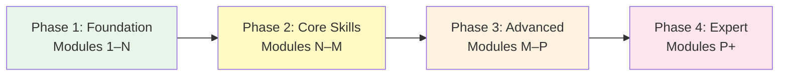
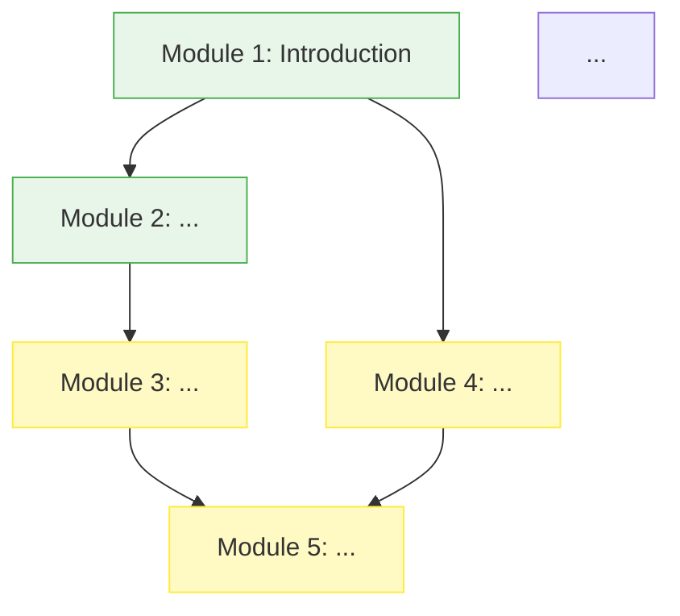
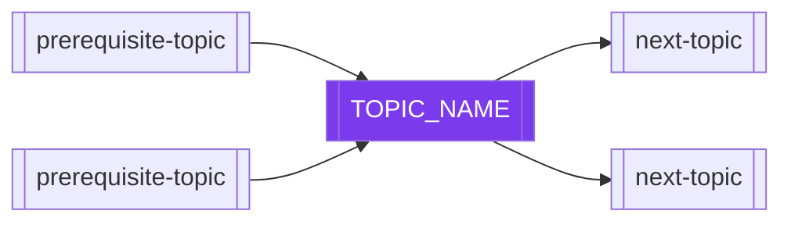

# Generate Roadmap

## Description

Generates or updates a topic's `ROADMAP.md` — a complete learning path from absolute beginner to expert, with phase definitions, prerequisite mappings, time estimates, milestone definitions, and alternative paths for learners with different backgrounds or goals. The roadmap serves as both a study plan and a strategic overview of the entire topic.

A well-written roadmap answers: "Given where I am right now, how do I get from here to expert, how long will it take, and how will I know when I'm making progress?"

## Usage

1. Copy the prompt text below
2. Replace `[TOPIC_NAME]` with your topic
3. Paste into your AI assistant with access to this repository
4. The agent will write or update `TOPICS/[TOPIC_NAME]/ROADMAP.md`

## Prompt

```
You are a leaps roadmap generation agent. Your task is to generate or update a comprehensive learning roadmap for a topic.

## Parameters
- TOPIC_NAME: [TOPIC_NAME]

## Step 1: Read the Topic

Read completely:
1. `TOPICS/[TOPIC_NAME]/README.md` — topic overview, module list, prerequisites, learning objectives
2. All existing module README.md files — understand what each module covers, its difficulty, and its dependencies
3. `TOPICS/[TOPIC_NAME]/PROGRESS.md` — current learner state (if any)
4. If `TOPICS/[TOPIC_NAME]/ROADMAP.md` exists: read it before deciding whether to update or recreate it

Also read:
5. Related topic README files (from the "Related Topics" section of the main README) — to understand how this topic fits in the broader learning graph

## Step 2: Map the Module Dependency Graph

Before designing the roadmap, understand the dependencies:

For every module:
- What modules within this topic does it depend on? (explicit prerequisites)
- What external knowledge does it depend on? (prerequisites from other topics or general background)
- What concepts does it introduce that are needed by later modules?

Draw this as a dependency graph (you will render it as Mermaid in the output).

## Step 3: Define Learning Phases

Organize the modules into 3–5 learning phases. Phases represent distinct capability levels:

**Recommended phase structure (adjust for the topic):**

- **Phase 1: Foundation** — The learner goes from zero to able to read/write basic [TOPIC] and understand its core mental model. Typically modules 1–3.
- **Phase 2: Core Skills** — The learner can solve practical problems using the main features. Can build real things, not just examples. Typically modules 4–7.
- **Phase 3: Advanced** — The learner understands internals, handles edge cases, reads source code and papers. Typically modules 8–11.
- **Phase 4: Expert** — The learner can design systems, evaluate tradeoffs, contribute to the ecosystem. Typically modules 12+.
- **Final Phase: Capstone** — The learner **builds a real project** that synthesizes the whole topic. Every roadmap must end here.

> [!IMPORTANT]
> The roadmap **must** carry the learner all the way to expert ("2+ years working with this
> professionally") depth and **end with a Capstone Project** in which they build something real.
> Never produce a roadmap that tops out at beginner or intermediate, and never omit the capstone.
> This applies to every subject — software and non-software alike. See AGENTS.md §5.

For some topics, fewer middle phases make sense (a narrow topic might have 2 phases). For very broad topics, 5 phases may be appropriate — but the expert ceiling and the final capstone are non-negotiable.

Name phases specifically for the topic — not generic "Phase 1" but "Python Basics" or "Calculus Foundations."

## Step 4: Calculate Time Estimates

For each module, estimate:
- **Study time:** Reading README.md and taking notes — how long does the content take to understand?
- **Exercise time:** Completing all exercises
- **Test time:** Preparing for and taking the test
- **Project time:** Completing at least one beginner project

Sum these per module. Sum per phase. Sum for the complete topic.

Present as:
- Optimistic estimate (focused, efficient study, some prior knowledge)
- Realistic estimate (typical learner, some review needed)
- Conservative estimate (learning from scratch, needing reinforcement)

Show estimates in hours, and as "weeks at N hours/week" for the realistic estimate.

## Step 5: Map Prerequisites

For each learning phase:
- What must a learner know BEFORE starting this phase?
- Which prerequisite knowledge is covered by other leaps topics? (add wiki-links)
- Which prerequisite knowledge is external (e.g., "basic algebra")?
- What happens if a learner tries to skip ahead? (what will be confusing or impossible?)

Also map: alternative entry points. Where can a learner with different backgrounds start?
- "If you already know [RELATED_TOPIC], you can skip modules 1–2 and start at Module 3"
- "If you are coming from [LANGUAGE], focus on Module 4 first to understand the key differences"

## Step 6: Define Milestones

Define 5–8 milestones that a learner can use to measure meaningful progress. Milestones should be:
- **Observable:** The learner can tell definitively when they have reached a milestone
- **Meaningful:** Reaching this milestone represents a real capability gain
- **Achievable:** Reachable within 1–4 weeks of focused study from the prior milestone

For each milestone:
- A name
- What the learner can do at this milestone that they could not before
- Which modules to complete to reach it
- A verification: "You've reached this milestone when you can [specific test or demo]"

## Step 7: Write TOPICS/[TOPIC_NAME]/ROADMAP.md

```markdown
# Roadmap: [TOPIC_NAME]

> From zero to expert. A structured path through [[TOPIC_NAME]].

---

## Table of Contents

1. [Overview](#overview)
2. [Before You Begin](#before-you-begin)
3. [Learning Path](#learning-path)
4. [Phase Details](#phase-details)
5. [Time Estimates](#time-estimates)
6. [Alternative Paths](#alternative-paths)
7. [Milestones](#milestones)
8. [After This Topic](#after-this-topic)

---

## Overview

[2 paragraphs: what mastering this topic enables, and a brief summary of the learning arc from Phase 1 to the final phase]

### The Learning Arc



---

## Before You Begin

### Required Prerequisites

To start this topic, you need a working understanding of:

| Prerequisite | Why You Need It | Where to Get It |
|---|---|---|
| [Prerequisite 1] | [Why] | [[other-topic]] or [external resource] |
| [Prerequisite 2] | [Why] | [[other-topic]] or [external resource] |

### Optional (Helpful) Background

Having this background will make learning easier, but you can start without it:

- [Optional background 1] — helps with [specific phase or concept]
- [Optional background 2] — especially useful in Phase [N]

### Self-Assessment: Are You Ready?

Before starting Module 1, you should be comfortable with:
- [ ] [Specific thing]
- [ ] [Another specific thing]

If you cannot check all boxes, work through [specific prerequisite resource or leaps topic] first.

---

## Learning Path

### Module Dependency Graph



### Module Overview

| Module | Phase | Difficulty | Key Concepts | Time |
|---|---|---|---|---|
| 01: [Name] | Foundation | Beginner | [concepts] | [hrs] |
| 02: [Name] | Foundation | Beginner | [concepts] | [hrs] |
| 03: [Name] | Core | Intermediate | [concepts] | [hrs] |
| ... | | | | |
| **Total** | | | | **[hrs]** |

---

## Phase Details

### Phase 1: [Phase Name]
**Modules:** [N–M]
**Goal:** [What the learner can do at the end of Phase 1 that they could not before]

[2–3 paragraphs describing what this phase covers, why this sequencing, and what the "click moment" is — the insight that makes the phase cohere]

**You are done with Phase 1 when you can:**
- [ ] [Specific ability]
- [ ] [Specific ability]
- [ ] [Specific ability]

**Transition test:** [A specific thing to try that proves you are ready for Phase 2]

---

### Phase 2: [Phase Name]
[Same structure]

---

[Continue for all phases]

---

## Time Estimates

### Per-Module Estimates

| Module | Study | Exercises | Test | Project | Total |
|---|---|---|---|---|---|
| 01 | [N] hrs | [N] hrs | [N] hrs | [N] hrs | [N] hrs |
| 02 | ... | | | | |
| **Total** | | | | | **[N] hrs** |

### Complete Topic Estimates

| Scenario | Hours | At 5 hrs/week | At 10 hrs/week |
|---|---|---|---|
| Optimistic | [N] | [N] weeks | [N] weeks |
| **Realistic** | **[N]** | **[N] weeks** | **[N] weeks** |
| Conservative | [N] | [N] weeks | [N] weeks |

**Assumptions for "Realistic":**
- [Study approach, prior knowledge assumed]
- [Includes re-reading and reinforcement time]

---

## Alternative Paths

### If you already know [Related Topic A]

> "I know [Related Topic A]. Do I need to start from Module 1?"

[Specific guidance: which modules to skip, which to skim, where to start in depth]

Recommended path: Module [N] → Module [M] → [continue from there]

### If your goal is [Specific Goal]

> "I just want to be able to [specific use case]. How much of this topic do I need?"

Minimum path: Modules [list] — approximately [N] hours
These modules give you everything you need for [specific use case].

### If you are learning under time pressure

> "I have [N] hours. What should I focus on?"

Priority path: Modules [list] → test each → skip projects for now
This covers the most important [X]% of practical usage.

---

## Milestones

### Milestone 1: [Name]
**Complete when:** [Modules N–M are done]
**What you can do now:** [Specific capability]
**Verification:** [Specific test: "You've reached this milestone when you can [demo]"]
**Average time from start:** [N hours / N weeks at realistic pace]

---

### Milestone 2: [Name]
[Same structure]

---

[Continue for all milestones]

### Milestone Achievement Criteria Summary

| Milestone | Modules | Verification |
|---|---|---|
| [Name 1] | 1–N | [Demo] |
| [Name 2] | N–M | [Demo] |
| ... | | |
| Expert | All | [Final demo] |

---

## After This Topic

### What This Topic Enables

Completing [TOPIC_NAME] opens these learning paths:

| Next Topic | Why | Difficulty Jump |
|---|---|---|
| [[topic-a]] | [Why this follows naturally] | [Small/Medium/Large] |
| [[topic-b]] | [Why this follows naturally] | [Small/Medium/Large] |

### How This Topic Fits in the Broader Knowledge Graph



### Expert-Level Resources

For learners who complete all modules and want to go deeper:

1. [Advanced resource 1] — [what it adds beyond this topic]
2. [Advanced resource 2]
3. [Community / ecosystem to engage with]
```

## Step 8: Cross-Reference Updates

After writing the roadmap:
1. Add a link to ROADMAP.md in `TOPICS/[TOPIC_NAME]/README.md` under the "Resources" or navigation section if not already present
2. Note any topics mentioned as prerequisites or next steps that do not yet exist in leaps (these are topic requests worth filing)

## Output Format

1. **Module dependency analysis** — from Step 2
2. **Phase definitions** — from Step 3
3. **Time estimates** — from Step 4
4. **Milestone definitions** — from Step 6
5. **ROADMAP.md** — complete file content
6. **README.md update** — the specific line to add to the topic README
7. **Missing prerequisites** — any referenced leaps topics that do not yet exist
```

## Examples

**Generate a roadmap for machine learning:**
```
TOPIC_NAME: machine-learning
```
Output: Detailed roadmap with phases from "Math Foundations" through "Research Level," time estimates, alternative paths for software engineers vs. mathematicians, milestones.

**Generate a roadmap for Go:**
```
TOPIC_NAME: go
```
Output: Roadmap from "Hello World" through "Production System Design," with an alternative fast-track path for experienced developers from other languages.

**Update an existing roadmap after adding modules:**
```
TOPIC_NAME: python
```
Output: Reads existing ROADMAP.md, identifies which new modules are not reflected, updates the roadmap with the new modules and revised time estimates.

## Notes

- Time estimates should be honest, not aspirational. A roadmap that says "10 hours total" for a 14-module topic will create frustration when the actual time is 40 hours. Err on the side of conservative estimates.
- The "Alternative Paths" section is one of the most valuable parts of the roadmap for experienced learners. It prevents them from being bored by content they already know.
- The Mermaid dependency graph should reflect actual concept dependencies, not just the numbering. If Module 4 depends on Module 2 but not Module 3, the graph should show that — it may suggest a learner can jump from 2 to 4 if they already know Module 3's content.
- Milestones are motivational tools, not just measurement tools. Name them memorably and make the "verification" test something the learner actually wants to be able to do ("Build a working web server in Go" is motivating; "Complete modules 1–5" is not).
