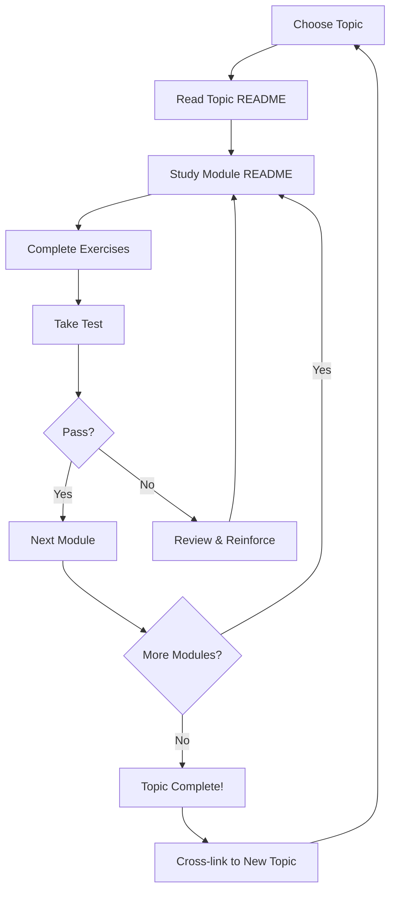

# leaps

> **Learning Environment for Any Progressive Subject**

[](https://curiousfurbytes.github.io/leaps/)
[](#topics)
[](#how-it-works)
[](AGENTS.md)
[](#obsidian-compatibility)
[](#license)

---

**leaps** is an AI-native, structured learning operating system for any topic imaginable. It is designed for AI agents (Claude, Codex, Copilot, Cursor, Gemini, and others) to autonomously expand, and for humans to learn from, contribute to, and build upon.

Every module is a first-class artifact: deeply structured, cross-linked, graded, and versioned. Every question you ask is preserved. Every test result is recorded. Every concept is connected to every other related concept via a growing knowledge graph.

> [!IMPORTANT]
> **For AI Agents:** Read [`AGENTS.md`](AGENTS.md) before taking any action in this repository. It is the operational contract that governs all content generation, testing, grading, and cross-linking.

---

## Table of Contents

1. [Philosophy](#philosophy)
2. [Repository Structure](#repository-structure)
3. [How It Works](#how-it-works)
4. [Example Topic Structure](#example-topic-structure)
5. [Getting Started](#getting-started)
6. [AI Agent Integration](#ai-agent-integration)
7. [Progress Tracking](#progress-tracking)
8. [Testing & Grading](#testing--grading)
9. [Cross-Linking / Knowledge Graph](#cross-linking--knowledge-graph)
10. [Published Book (GitHub Pages)](#published-book-github-pages)
11. [Interactive Learning](#interactive-learning)
12. [Obsidian Compatibility](#obsidian-compatibility)
13. [Learning Workflow](#learning-workflow)
14. [Contributing](#contributing)
15. [License](#license)

---

## Philosophy

### Learn in Public

**leaps** is built on the conviction that learning compounds fastest when it is:

- **Visible** — every note, question, test result, and insight is recorded and reviewable
- **Structured** — progression from beginner to expert is explicit, not accidental
- **Interconnected** — no concept lives in isolation; everything links to everything else
- **AI-augmented** — agents handle content generation, grading, and expansion so humans can focus on understanding
- **Permanent** — nothing is deleted; history is an asset, not a liability

The "Learn in Public" philosophy originates from the idea that making your learning process visible to others — and to yourself — accelerates comprehension, surfaces gaps, and creates accountability. leaps operationalizes this at the repository level: your entire learning journey is committed to version control, questions are never deleted, test scores are never hidden, and progress is never lost.

### Why This Repo Exists

Most learning is ephemeral. Notes vanish. Questions go unanswered. Progress is invisible. Connections between topics are never made explicit. The brilliant insight you had in module 3 is forgotten by the time it becomes relevant in module 9.

leaps exists to fix that. It is a living knowledge base that grows as you learn, is graded as you progress, and is cross-linked as your understanding deepens. It is opinionated about structure so that agents and humans can collaborate on the same materials without friction. It treats your learning history with the same seriousness that a software project treats its commit history: every change is meaningful, every record is permanent, and the full picture is always reconstructible.

### Who It's For

| Audience | How They Use leaps |
|---|---|
| **Self-directed learners** | Ask an AI agent to build a topic, study the modules, take the tests |
| **AI agents** | Read `AGENTS.md`, create and expand topics, grade tests, answer questions |
| **Educators** | Use the structured module format to design and distribute curricula |
| **Teams** | Build a shared knowledge base that any team member (human or AI) can extend |
| **Researchers** | Document learning paths through complex subjects with full cross-linking |
| **Obsidian users** | Import the vault directly; all wiki-links work natively |

> [!NOTE]
> leaps is language-agnostic, domain-agnostic, and tool-agnostic. Topics can cover programming languages, mathematics, history, biology, music theory, philosophy, economics, or any other field. The structure works universally.

---

## Repository Structure

```
leaps/
├── README.md                  # This file — start here
├── CONTRIBUTING.md            # How to contribute as a human or agent
├── AGENTS.md                  # Operational manual for AI agents (read first)
├── zensical.toml              # Config for the published book (docs_dir = TOPICS/)
│
├── PROMPTS/                   # Reusable prompt templates for AI agents
│   ├── topic-creation.md      # Prompt for creating a new topic from scratch
│   ├── module-generation.md   # Prompt for generating a new module
│   ├── test-generation.md     # Prompt for generating a test
│   ├── grading.md             # Prompt for grading a completed test
│   ├── question-answer.md     # Prompt for answering questions in QUESTIONS.md
│   └── cross-linking.md       # Prompt for finding and adding cross-links
│
├── SCRIPTS/                   # Automation scripts
│   ├── new-topic.sh           # Scaffold a new topic directory
│   ├── new-module.sh          # Scaffold a new module inside a topic
│   ├── grade.sh               # Run grading on a completed test
│   ├── stats.sh               # Compute global progress statistics
│   └── lint.sh                # Validate structure and cross-links
│
├── TEMPLATES/                 # File templates for topics and modules
│   ├── topic-readme.md        # Template: TOPICS/[topic]/README.md
│   ├── module-readme.md       # Template: module README.md
│   ├── notes.md               # Template: NOTES.md
│   ├── questions.md           # Template: QUESTIONS.md
│   ├── exercises.md           # Template: EXERCISES.md
│   ├── test.md                # Template: TEST.md
│   ├── answers.md             # Template: ANSWERS.md
│   ├── resources.md           # Template: RESOURCES.md
│   └── projects.md            # Template: PROJECTS.md
│
├── SHARED/                    # Cross-topic shared knowledge
│   ├── glossary.md            # Global glossary of terms
│   ├── concepts.md            # Foundational cross-topic concepts
│   ├── notation.md            # Mathematical and technical notation guide
│   └── references.md          # Shared bibliography and reference list
│
├── TOPICS/                    # All learning topics live here
│   ├── python/                # Example: Python programming topic
│   ├── rust/                  # Example: Rust programming topic
│   ├── calculus/              # Example: Calculus topic
│   └── .../                   # Any topic, any domain
│
├── .github/                   # GitHub configuration
│   ├── workflows/             # docs.yml — builds the book & deploys to Pages
│   └── ISSUE_TEMPLATE/        # Templates for topic requests, bug reports
│
├── assets/                    # Images, diagrams, and static files
│   ├── diagrams/              # Mermaid source files and exported SVGs
│   └── images/                # Illustrations and screenshots
│
├── tools/                     # Developer tooling
│   ├── validator/             # Structure validator
│   ├── linker/                # Cross-link checker
│   └── stats/                 # Progress statistics generator
│
├── docs/                      # Extended documentation
│   ├── architecture.md        # Detailed architecture decisions
│   ├── agent-guide.md         # Extended guide for AI agent authors
│   └── faq.md                 # Frequently asked questions
│
└── environments/              # Reproducible learning environments
    ├── python/                # Python environment (requirements.txt, Dockerfile)
    ├── rust/                  # Rust environment (Cargo.toml, Dockerfile)
    └── [topic]/               # Per-topic reproducible environments
```

> [!TIP]
> The only directory you need to care about as a learner is `TOPICS/`. Everything else supports it.

---

## How It Works

### Topic / Module Hierarchy

Each **topic** is a self-contained learning path for a single subject. Topics live in `TOPICS/[topic-name]/`.

Each topic is divided into **modules** — numbered, progressive learning units that take you from beginner to expert. A typical topic has 5–20 modules.

```
TOPICS/[topic]/
├── README.md          # Topic overview, prerequisites, module list, progress tracker
├── PROGRESS.md        # Running point total and milestone log
│
└── modules/
    ├── 01_introduction/
    ├── 02_core_concepts/
    ├── 03_[next_topic]/
    └── ...
```

Each **module** contains a fixed set of files, each with a specific role:

| File | Purpose |
|---|---|
| `README.md` | Module overview, objectives, theory, and explanations |
| `NOTES.md` | Detailed notes — append your own; AI appends summaries |
| `QUESTIONS.md` | Ask questions here; AI agents answer and append (never delete) |
| `EXERCISES.md` | Practical exercises with increasing difficulty |
| `TEST.md` | Formal assessment with multiple question types |
| `ANSWERS.md` | Answer key (revealed after test is graded) |
| `RESOURCES.md` | Curated books, papers, videos, and links |
| `PROJECTS.md` | Capstone project ideas using module concepts |

### Module Progression

Modules are strictly ordered and designed to build on each other. Each module begins with a **Prerequisites** section that names exactly which prior modules (or external knowledge) are required.

Difficulty levels follow a consistent arc:

```
Module 01–02:   Beginner      — vocabulary, mental models, first programs
Module 03–05:   Intermediate  — patterns, idioms, practical usage
Module 06–10:   Advanced      — internals, edge cases, performance
Module 11+:     Expert        — research-level, cross-domain synthesis
```

> [!NOTE]
> These ranges are guidelines, not rules. A topic with only 5 modules will still span the full beginner-to-advanced arc within those 5 modules. The AI agent calibrates difficulty to the topic's natural learning curve.

---

## Example Topic Structure

Here is the full directory tree for `TOPICS/python/`:

```
TOPICS/python/
├── README.md
├── PROGRESS.md
│
└── modules/
    ├── 01_introduction/
    │   ├── README.md         # What is Python? History, design philosophy, use cases
    │   ├── NOTES.md          # Setup, REPL, first programs
    │   ├── QUESTIONS.md      # Student questions + AI answers
    │   ├── EXERCISES.md      # Hello world through basic I/O
    │   ├── TEST.md           # 20-question formal assessment
    │   ├── ANSWERS.md        # Answer key + grading records
    │   ├── RESOURCES.md      # Recommended books, docs, videos
    │   └── PROJECTS.md       # Mini-projects: CLI calculator, unit converter
    │
    ├── 02_data_types_and_variables/
    │   └── ... (same 8-file structure)
    │
    ├── 03_control_flow/
    │   └── ...
    │
    ├── 04_functions_and_scope/
    │   └── ...
    │
    ├── 05_data_structures/
    │   └── ...
    │
    ├── 06_object_oriented_programming/
    │   └── ...
    │
    ├── 07_modules_and_packages/
    │   └── ...
    │
    ├── 08_file_io_and_exceptions/
    │   └── ...
    │
    ├── 09_iterators_and_generators/
    │   └── ...
    │
    ├── 10_decorators_and_metaprogramming/
    │   └── ...
    │
    ├── 11_concurrency_and_parallelism/
    │   └── ...
    │
    ├── 12_testing_and_debugging/
    │   └── ...
    │
    ├── 13_performance_and_profiling/
    │   └── ...
    │
    └── 14_advanced_patterns/
        └── ...
```

> [!NOTE]
> The `TOPICS/python/README.md` links to each module, shows the current progress checklist, and provides the topic-level point total. It is the single entry point for the Python learning path.

---

## Getting Started

### As a Learner (with an AI agent)

```bash
# Clone the repository
git clone https://github.com/your-org/leaps.git
cd leaps

# Open in your AI-connected editor (VS Code + Copilot, Cursor, or Claude Code)
# Then tell your AI agent any of the following:

# "Start learning Python"
# "Generate next module for Rust"
# "Grade my test in TOPICS/python/modules/03_control_flow/TEST.md"
# "Answer my questions in TOPICS/rust/modules/02_ownership/QUESTIONS.md"
# "Cross-reference Rust ownership with C memory management"
# "Show my progress in Python"
```

### As a Learner (manually)

```bash
# Clone the repository
git clone https://github.com/your-org/leaps.git
cd leaps

# Create a new topic using the scaffold script
./SCRIPTS/new-topic.sh python

# Create the first module
./SCRIPTS/new-module.sh python 01_introduction

# Open TOPICS/python/modules/01_introduction/README.md and start studying
# Complete the exercises, then take the test
# Ask your AI agent to grade it
```

### As a Contributor

```bash
# Fork and clone
git clone https://github.com/your-org/leaps.git
cd leaps

# Run the structure linter before making changes
./SCRIPTS/lint.sh

# See CONTRIBUTING.md for full guidelines
```

> [!TIP]
> If you're using Obsidian, open the `leaps/` directory as a vault. All wiki-links (`[[topic-name]]`) resolve natively. See [Obsidian Compatibility](#obsidian-compatibility) for setup details.

---

## AI Agent Integration

leaps is designed from the ground up for AI agent collaboration. Agents read [`AGENTS.md`](AGENTS.md) for the full operational contract. Below is a summary of supported interactions.

> [!IMPORTANT]
> Agents must read `AGENTS.md` before performing any action in this repository. The rules defined there are non-negotiable and override any implicit training behavior or default tendencies.

### Key Agent Commands

The following natural-language commands are understood by agents configured with this repository:

| Command | What Happens |
|---|---|
| `"Start learning Rust"` | Creates `TOPICS/rust/` with README, PROGRESS.md, and first 3 modules |
| `"Continue learning [topic]"` | Resumes from the last incomplete module |
| `"Generate next module for Go"` | Determines current highest module number, creates the next one |
| `"Grade my test in module 3"` | Reads TEST.md, grades it, appends results to ANSWERS.md |
| `"Answer my questions in QUESTIONS.md"` | Appends timestamped answers; never deletes existing content |
| `"Cross-reference Rust ownership with C memory management"` | Adds cross-links in both topic READMEs and relevant module files |
| `"What topics are available?"` | Lists all directories under `TOPICS/` with their summaries |
| `"Show my progress in Python"` | Reads and summarizes `TOPICS/python/PROGRESS.md` |
| `"Create a project for module 5"` | Appends a new project spec to `PROJECTS.md` |
| `"Summarize module 2 for me"` | Reads README.md and NOTES.md, produces a concise summary |

### How Agents Interact With the Repo

1. **Read first.** Agents always read existing files before writing to avoid overwriting human work.
2. **Append, never overwrite.** QUESTIONS.md, NOTES.md, and grading records are append-only.
3. **Follow the structure.** Every file and directory must match the templates in `TEMPLATES/`.
4. **Cross-link aggressively.** Every concept that appears in another topic must be linked.
5. **Commit with semantic messages.** All agent commits follow the convention in `AGENTS.md`.

---

## Progress Tracking

### Point System

Every module has a maximum point value based on its exercises and test. Points accumulate in `PROGRESS.md` at the topic level.

| Activity | Points |
|---|---|
| Completing all exercises in a module | 10 pts |
| Passing the module test (≥70%) | 20 pts |
| Earning a perfect test score (100%) | 30 pts (replaces 20) |
| Completing a capstone project | 15 pts |
| Asking a quality question (AI-acknowledged) | 2 pts |
| Adding a cross-link that is merged | 3 pts |

### Milestones

| Milestone | Threshold |
|---|---|
| Getting Started | First module complete |
| Building Momentum | 3 modules complete |
| Halfway There | 50% of topic modules complete |
| Deep Diver | All modules complete |
| Topic Master | 90%+ average test score across all modules |
| Polymath | Topic Master in 3 or more topics |

### Progress File Format

`TOPICS/[topic]/PROGRESS.md` is maintained by AI agents and updated after each graded activity:

```markdown
# Progress: Python

## Stats
- Total Points: 87 / 340
- Modules Complete: 3 / 14
- Average Test Score: 82%
- Last Active: 2026-05-22

## Module Checklist
- [x] 01 Introduction (32/30 pts — bonus earned)
- [x] 02 Data Types and Variables (28/30 pts)
- [x] 03 Control Flow (27/30 pts)
- [ ] 04 Functions and Scope
- [ ] 05 Data Structures
- [ ] ...

## Milestone Log
- 2026-05-20: Getting Started
- 2026-05-21: Building Momentum
```

> [!NOTE]
> Progress files are append-only. No agent may delete a milestone or reduce a point total. If a test is retaken, the new score is appended alongside the old one; both are preserved.

---

## Testing & Grading

### Test Structure

Every module test (`TEST.md`) follows a fixed structure with four difficulty tiers:

- **Easy** — Recall and definition questions (1 pt each)
- **Medium** — Conceptual and pattern-recognition questions (2 pts each)
- **Hard** — Practical, debugging, and scenario questions (3 pts each)
- **Expert** — Architecture and essay questions (5 pts each)

Tests also include **Bonus** questions (variable points) that can raise your score above 100%.

### Question Types

| Type | Description | Tier |
|---|---|---|
| Recall | Define a term or state a fact | Easy |
| Conceptual | Explain why something works the way it does | Medium |
| Practical | Write code or solve a concrete problem | Hard |
| Scenario | Given a situation, choose and justify an approach | Hard |
| Debugging | Find and fix the error in a code sample | Hard |
| Architecture | Design a system or explain a design decision | Expert |
| Essay | Synthesize multiple concepts into a coherent argument | Expert |

### Grading Protocol

When you ask an AI agent to grade your test, it:

1. Reads your answers from `TEST.md`
2. Compares against the answer key in `ANSWERS.md`
3. Appends a grading record to `ANSWERS.md` (never overwrites existing content)
4. Updates `TOPICS/[topic]/PROGRESS.md` with the new score

Grading records use a YAML frontmatter style block:

```yaml
---
graded_at: 2026-05-22T14:30:00Z
graded_by: claude-sonnet-4-6
score: 23/30
percentage: 76.7%
pass: true
breakdown:
  easy: 5/5
  medium: 8/10
  hard: 7/9
  expert: 3/6
notes: "Strong on syntax recall. Review ownership/borrowing rules — Hard Q3 and Q4."
---
```

> [!WARNING]
> Grading records are append-only. No agent may delete or modify a previous grading record. This ensures a reliable and tamper-proof audit trail of your learning history.

---

## Cross-Linking / Knowledge Graph

leaps builds a knowledge graph incrementally as topics and modules are created. Cross-links use Obsidian-compatible wiki-link syntax:

```markdown
[[rust]]                          → links to TOPICS/rust/README.md
[[rust#ownership]]                → links to the Ownership section in Rust
[[memory-management]]             → links to TOPICS/memory-management/README.md
[[python#decorators]]             → links to the Decorators section in Python
[[shared/glossary#closure]]       → links to the closure entry in the global glossary
[[python/05_data_structures]]     → links to a specific module
```

### When Cross-Links Are Added

Agents add cross-links whenever:

- A concept in one module was previously covered in another topic
- A module's prerequisites are explicitly covered in a different topic
- A shared glossary term is introduced or used
- A pattern, algorithm, or technique has a related entry elsewhere in the repo
- A module's exercises reference external project types covered in another topic

### Knowledge Graph Growth

As the repo grows, the web of cross-links becomes a navigable knowledge graph. You can explore it:

- **Visually** — in Obsidian's Graph View
- **Programmatically** — via `tools/linker/`
- **As a list** — via `./SCRIPTS/lint.sh --list-links`

> [!NOTE]
> Cross-links are validated by `./SCRIPTS/lint.sh`. Broken links (pointing to non-existent files or sections) are reported as errors and must be resolved before a PR can be merged.

---

## Published Book (GitHub Pages)

The learning material is published as a browsable book at
**<https://curiousfurbytes.github.io/leaps/>**, built with
[Zensical](https://zensical.org) — the modern static-site generator from the
Material for MkDocs team.

### What the book contains

The book deliberately exposes **only** the learning material:

- the **index of courses** (the landing page, generated from `TOPICS/README.md`), and
- the **courses themselves** — every topic and all of its modules.

Repository tooling (`AGENTS.md`, `PROMPTS/`, `SCRIPTS/`, `TEMPLATES/`, `docs/`,
`environments/`, …) is intentionally **not** included. This is enforced by
pointing Zensical's content directory at `TOPICS/`:

```toml
# zensical.toml
[project]
site_name = "leaps"
docs_dir  = "TOPICS"
```

### How navigation works

Navigation is **implicit** — it is derived automatically from the `TOPICS/`
directory tree. Each directory's `README.md` becomes that section's index page.
This means **adding a new topic or module automatically adds it to the book** with
no configuration changes.

### Build & deploy

Deployment is fully automated. On every push to `main` (i.e. when a PR is
merged), the [`.github/workflows/docs.yml`](.github/workflows/docs.yml) workflow
builds the book and publishes it to GitHub Pages:

```bash
pip install zensical
zensical build --clean   # outputs the static site to ./site/
```

> [!NOTE]
> One-time repository setup: under **Settings → Pages → Build and deployment**,
> set the **Source** to **GitHub Actions**.

### Preview locally

```bash
pip install zensical
zensical serve           # live-reloading preview at http://localhost:8000
```

> [!TIP]
> Because the book is generated directly from the Markdown in `TOPICS/`, there is
> no separate authoring step — write a module the normal way and it appears in the
> book on the next deploy.

---

## Interactive Learning

### Interactive Labs

`environments/[topic]/` contains reproducible environments for hands-on practice:

- `Dockerfile` — containerized environment with all dependencies
- `requirements.txt` / `Cargo.toml` / equivalent — dependency manifest
- `lab/` — lab exercises with step-by-step instructions
- `solutions/` — reference solutions (not linked from module files; for instructor/agent use)

### Simulations and Visualizations

For topics that benefit from visual intuition (sorting algorithms, calculus, networking, physics, machine learning), agents generate:

- Mermaid diagrams embedded directly in module README files (rendered natively in the book)
- Static figures and images committed alongside the module and embedded in Markdown
- ASCII art diagrams for concepts best shown in plain text

---

## Obsidian Compatibility

leaps is designed as a first-class Obsidian vault. Open the `leaps/` directory directly as your vault — no configuration or plugin is required for the core experience.

### Setup

1. Open Obsidian
2. Click **Open folder as vault**
3. Select the `leaps/` directory
4. (Optional) Install the **Dataview** plugin for progress dashboards
5. (Optional) Enable **Graph view** to visualize the knowledge graph

### What Works Natively

- All `[[wiki-links]]` resolve correctly to their target files and sections
- All `> [!NOTE]`, `> [!TIP]`, `> [!WARNING]`, `> [!IMPORTANT]` callouts render natively
- All Mermaid diagrams render natively (no plugin required in recent Obsidian versions)
- YAML frontmatter in grading records is parsed by Dataview
- The folder structure maps cleanly to Obsidian's file explorer hierarchy

### Recommended Obsidian Plugins

| Plugin | Purpose |
|---|---|
| **Dataview** | Query progress stats as live tables |
| **Templater** | Automate file creation from TEMPLATES/ |
| **Graph Analysis** | Advanced knowledge graph traversal |
| **Tasks** | Track exercise/project completion checklists |

> [!TIP]
> Use Obsidian's **Tags** view to filter content by difficulty level. Tag your notes with `#beginner`, `#intermediate`, `#advanced`, or `#expert` and the tag pane becomes a difficulty-sorted index.

---

## Learning Workflow



> [!TIP]
> Do not skip modules even if you feel confident in the subject matter. The exercises and tests in early modules build the vocabulary and mental models that later modules depend on implicitly.

---

## Contributing

See [`CONTRIBUTING.md`](CONTRIBUTING.md) for full guidelines.

The short version:

- **Humans:** Open an issue to request a topic, fix a broken link, or improve explanations. PRs are welcome and reviewed promptly.
- **AI Agents:** Read [`AGENTS.md`](AGENTS.md). Follow every rule there without exception. Use semantic commit messages. Never overwrite human-authored content.
- **New topics:** Anyone can request a new topic by opening an issue with the label `topic-request`. Agents can create it immediately once the issue exists.
- **Quality bar:** All content must include practical examples, exercises, and cross-links. Shallow summaries without examples are rejected at review.

---

## License

MIT License — see `LICENSE` for details.

Content in `TOPICS/` is licensed under [CC BY 4.0](https://creativecommons.org/licenses/by/4.0/) unless otherwise noted in a topic-level `LICENSE` file.

---

*leaps is a living repository. It grows every time someone learns something new and commits it here.*
