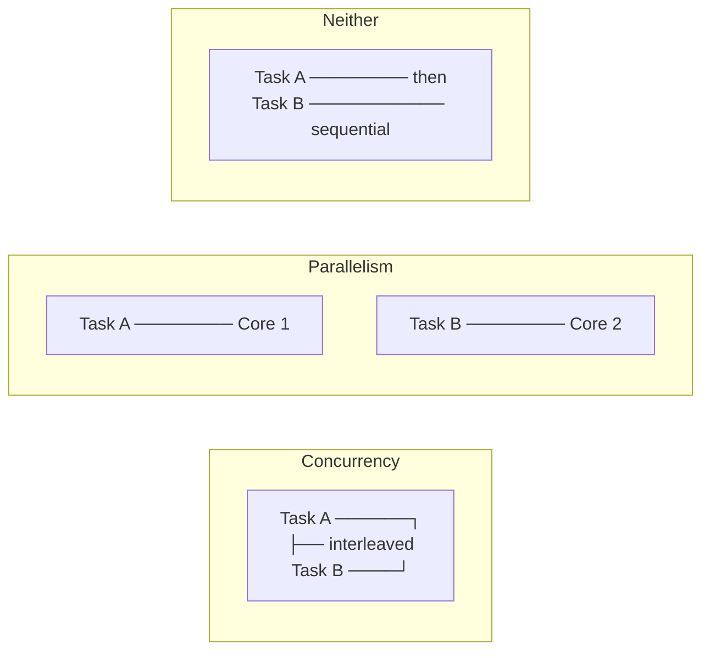
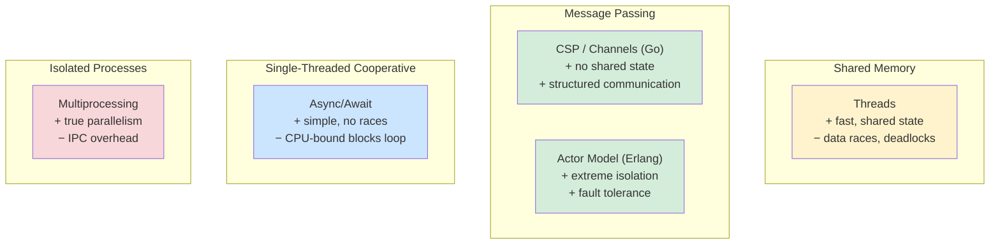

# Concurrency

> **Cross-topic concept.** This file explains concurrency as a general concept and compares how different languages implement it. For language-specific details, follow the cross-links at the bottom.

---

## Overview

**Concurrency** is the ability of a system to deal with multiple tasks at the same time. **Parallelism** is when those tasks literally execute simultaneously on multiple CPU cores.

The distinction matters:

- A single-core CPU can be concurrent (interleaving tasks via context switching) but not parallel.
- Multi-core CPUs can be both concurrent and parallel.
- A program can be concurrent without being parallel (e.g., Node.js event loop on one core).



The goal of concurrency is to improve **throughput** (do more work per unit time) and **responsiveness** (keep the program interactive while waiting for slow operations like I/O).

---

## Concurrency Models

### Threads

A thread is an independently scheduled sequence of execution within a process. Threads share the process's memory space — they can read and write the same variables, which is powerful but dangerous.

**Model:** Multiple threads, shared memory, synchronization via locks/mutexes/semaphores.

```python
# Python threading example
import threading

counter = 0
lock = threading.Lock()

def increment(n):
    global counter
    for _ in range(n):
        with lock:        # acquire lock before modifying shared state
            counter += 1

threads = [threading.Thread(target=increment, args=(100_000,)) for _ in range(4)]
for t in threads: t.start()
for t in threads: t.join()
print(counter)  # 400000 (correct, thanks to lock)
```

Without the lock, `counter` would be incorrect due to a race condition.

---

### Processes

A process is a fully isolated execution environment with its own memory space. Processes communicate via inter-process communication (IPC): pipes, sockets, shared memory segments, message queues.

**Model:** Multiple processes, isolated memory, communication via IPC.

```python
# Python multiprocessing example
from multiprocessing import Process, Queue

def worker(queue, value):
    queue.put(value * 2)

q = Queue()
processes = [Process(target=worker, args=(q, i)) for i in range(4)]
for p in processes: p.start()
for p in processes: p.join()

results = [q.get() for _ in range(4)]
print(sorted(results))  # [0, 2, 4, 6]
```

Processes avoid shared-state bugs but have higher overhead (memory, context switch cost) than threads.

---

### Async / Await (Cooperative Multitasking)

Async/await enables concurrency within a single thread by yielding control voluntarily at I/O boundaries. The event loop switches between tasks only when a task explicitly `await`s something.

**Model:** Single thread, cooperative task switching at `await` points, no shared-state race conditions (within one thread).

```python
# Python asyncio example
import asyncio

async def fetch(url: str) -> str:
    await asyncio.sleep(0.1)   # simulate I/O (network request)
    return f"result from {url}"

async def main():
    # Run both fetches concurrently (not sequentially)
    results = await asyncio.gather(
        fetch("https://api.example.com/a"),
        fetch("https://api.example.com/b"),
    )
    print(results)

asyncio.run(main())
```

Because only one coroutine runs at a time (between `await` points), there are no data races — but CPU-bound work blocks the entire event loop.

**Best for:** I/O-bound work (network requests, file I/O, database queries).

**Not suited for:** CPU-bound work (use `ProcessPoolExecutor` for that).

---

### Communicating Sequential Processes (CSP) — Channels

In the CSP model, independent processes (or goroutines) communicate by passing messages through channels rather than sharing memory. The mantra: *"Do not communicate by sharing memory; share memory by communicating."*

**Model:** Independent workers, message-passing via channels, no shared state.

```go
// Go goroutines and channels
package main

import "fmt"

func producer(ch chan<- int) {
    for i := 0; i < 5; i++ {
        ch <- i        // send value to channel
    }
    close(ch)
}

func main() {
    ch := make(chan int, 5)    // buffered channel

    go producer(ch)            // run producer concurrently

    for val := range ch {      // receive until channel closed
        fmt.Println(val)
    }
}
```

Channels enforce ownership transfer: once a value is sent, the sender should not use it again. This eliminates data races by design.

---

### Actor Model

Actors are independent units that hold private state and communicate exclusively by sending messages to each other's mailboxes. No shared memory whatsoever.

**Languages/frameworks:** Erlang (built-in), Elixir (built-in), Akka (JVM), Orleans (.NET).

```
Actor A                    Actor B
  │  ─── "hello" message ─── │
  │                           │  (processes message from mailbox)
  │  ─── "reply" message ───  │
  │  (processes reply)        │
```

Actors are highly resilient: a crashed actor can be restarted by a supervisor without affecting others. This is the foundation of Erlang's "let it crash" philosophy.

---

## Concurrency Models Comparison



---

## Common Problems

### Race Condition

A race condition occurs when the outcome of a program depends on the relative timing of events (e.g., which thread runs first). They are non-deterministic and notoriously hard to reproduce.

```python
# Race condition without a lock
import threading

counter = 0

def increment():
    global counter
    # Read-modify-write is NOT atomic in Python without the GIL protecting it
    # (the GIL does protect simple operations, but this illustrates the concept)
    val = counter
    val += 1
    counter = val

threads = [threading.Thread(target=increment) for _ in range(1000)]
for t in threads: t.start()
for t in threads: t.join()
# counter may not be 1000 in a language without CPython's GIL
```

**Solutions:** Mutexes/locks, atomic operations, channels (CSP), or avoiding shared mutable state entirely.

---

### Deadlock

A deadlock occurs when two or more threads each hold a resource the other needs, and none can proceed.

```
Thread 1: holds Lock A, waiting for Lock B
Thread 2: holds Lock B, waiting for Lock A
→ Neither can proceed — deadlock
```

```python
import threading

lock_a = threading.Lock()
lock_b = threading.Lock()

def thread1():
    with lock_a:
        with lock_b:   # waits for lock_b
            print("thread1 done")

def thread2():
    with lock_b:
        with lock_a:   # waits for lock_a — deadlock!
            print("thread2 done")
```

**Solutions:** Lock ordering (always acquire locks in the same order), lock timeouts, lock-free algorithms, or using higher-level abstractions (channels, queues) that avoid explicit locking.

---

### Starvation

A thread is perpetually denied access to a resource because other threads are always given priority. The thread makes no progress even though there is no deadlock.

**Solutions:** Fair scheduling policies, bounded waiting, priority inheritance.

---

### Livelock

Like deadlock, but threads are actively running — they keep changing state in response to each other but make no actual progress.

```
Thread 1: detects conflict, backs off
Thread 2: detects conflict, backs off simultaneously
Thread 1: retries, detects conflict again...
(Both keep stepping aside for each other indefinitely)
```

---

## How Different Languages Handle Concurrency

### Python — GIL, Threading, asyncio, Multiprocessing

Python's **Global Interpreter Lock (GIL)** allows only one thread to execute Python bytecode at a time, even on multi-core machines. This makes threading safe for shared-state I/O work but useless for CPU parallelism.

| Use Case | Solution |
|---|---|
| I/O-bound concurrency | `asyncio` (preferred) or `threading` |
| CPU-bound parallelism | `multiprocessing` or `concurrent.futures.ProcessPoolExecutor` |
| Mixed | `asyncio` + `loop.run_in_executor` |

Python 3.13 introduces an experimental "no-GIL" build that may change this picture.

---

### Go — Goroutines and Channels

Go's concurrency model is built into the language. Goroutines are multiplexed onto OS threads by the Go runtime scheduler — you can have millions of goroutines with minimal overhead (each starts with ~2 KB stack, growing as needed).

```go
// Goroutines are cheap — spawn thousands
for i := 0; i < 10_000; i++ {
    go func(id int) {
        // do work
    }(i)
}
```

Go provides both channels (preferred for communication) and `sync.Mutex` (for protecting shared state when channels are impractical). The race detector (`go test -race`) catches data races at test time.

---

### Rust — Fearless Concurrency

Rust's ownership system extends to concurrency: the type system prevents data races at compile time. The `Send` and `Sync` marker traits control which types can be transferred across thread boundaries or shared between threads.

```rust
use std::thread;
use std::sync::{Arc, Mutex};

let counter = Arc::new(Mutex::new(0));

let handles: Vec<_> = (0..10).map(|_| {
    let counter = Arc::clone(&counter);
    thread::spawn(move || {
        let mut num = counter.lock().unwrap();
        *num += 1;
    })
}).collect();

for h in handles { h.join().unwrap(); }
println!("{}", *counter.lock().unwrap());  // 10
```

The compiler rejects programs that share non-`Sync` types across threads without synchronization — you literally cannot write a data race in safe Rust.

For async Rust, the `tokio` and `async-std` runtimes implement async/await on top of an efficient thread pool.

---

### JavaScript — Single-Threaded Event Loop

JavaScript (in browsers and Node.js) runs on a single thread. Concurrency is achieved through the **event loop**: I/O operations are offloaded to the runtime, and callbacks/promises/async-await are scheduled when those operations complete.

```javascript
// Concurrent I/O in JavaScript (non-blocking)
async function fetchAll(urls) {
  const results = await Promise.all(urls.map(url => fetch(url)));
  return results.map(r => r.json());
}
```

There are no data races because only one JavaScript task runs at a time. The trade-off: CPU-bound work blocks the event loop for everyone.

**Web Workers** provide true parallelism in the browser but with message-passing only — no shared memory (except `SharedArrayBuffer`, which requires careful synchronization).

---

## Choosing a Concurrency Approach

| Scenario | Recommended Approach |
|---|---|
| Many simultaneous I/O operations (web server, API client) | Async/await |
| CPU-bound computation on multi-core machine | Threads or processes (language dependent) |
| Pipeline of independent processing stages | Channels (CSP) |
| Highly fault-tolerant, distributed system | Actor model |
| Need shared mutable state with fine-grained locking | Threads + Mutex |
| Need to avoid all shared state | Message passing (channels or actors) |

---

## Cross-Topic Links

- Python — threading, asyncio, multiprocessing, the GIL, concurrent.futures
- [[go]] — goroutines, channels, sync package, the race detector
- [[rust]] — ownership and concurrency, Send/Sync, Mutex, Arc, tokio
- [[javascript]] — event loop, Promises, async/await, Web Workers, SharedArrayBuffer
- [[operating-systems]] — threads vs. processes, context switching, scheduling algorithms, kernel vs. user threads
- [[distributed-systems]] — concurrency across machines, consensus, CAP theorem
- [[data-structures]] — lock-free data structures, concurrent queues, skip lists
