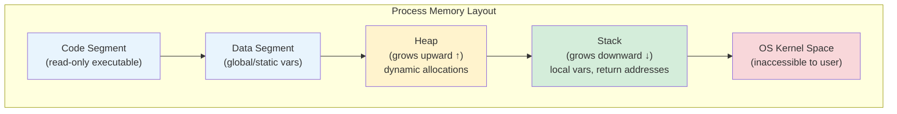

# Memory Management

> **Cross-topic concept.** This file explains memory management as it appears across multiple programming languages and systems topics. For language-specific deep dives, follow the cross-links at the bottom.

---

## Overview

Memory management is the process by which a program acquires memory from the operating system, uses it to store data, and eventually releases it back. Every program that runs has two fundamental memory regions it works with:

- **Stack** — fixed-size, automatically managed, fast. Local variables and function call frames live here. When a function returns, its stack frame is popped automatically.
- **Heap** — dynamic, explicitly or automatically managed, slower to allocate. Data whose size or lifetime is unknown at compile time lives here.

The central challenge: the heap does not manage itself. Someone or something must ensure that memory is allocated before use and freed after use — no sooner, no later.



The stack and heap grow toward each other. A stack overflow occurs when the stack grows into the heap region (typically from unbounded recursion). A heap overflow or heap exhaustion occurs when all heap memory is consumed.

---

## How Different Languages Handle It

### C / C++ — Manual Management

C gives the programmer direct control over the heap via `malloc`/`free` (C) and `new`/`delete` (C++).

```c
// C — manual allocation
int *arr = malloc(10 * sizeof(int));  // allocate on heap
if (arr == NULL) { /* handle OOM */ }

arr[0] = 42;

free(arr);        // programmer is responsible for this
arr = NULL;       // defensive: prevent use-after-free
```

**Advantages:** Zero overhead, full control, no runtime required.

**Disadvantages:** Programmer errors cause memory bugs (see Common Bugs below). Large programs become extremely hard to reason about manually.

Modern C++ uses RAII (Resource Acquisition Is Initialization) and smart pointers to bring automatic lifetimes to manual memory:

```cpp
// C++14 — smart pointers (prefer over raw new/delete)
#include <memory>

auto ptr = std::make_unique<int[]>(10);  // freed automatically when ptr goes out of scope
ptr[0] = 42;
// no delete needed — destructor called at end of scope
```

---

### Rust — Ownership and Borrowing

Rust eliminates an entire class of memory bugs at compile time through the **ownership system**. Memory is never managed manually, and there is no garbage collector.

Rules enforced by the compiler:
1. Every value has exactly one **owner**.
2. When the owner goes out of scope, the value is **dropped** (memory freed).
3. You can have either one mutable reference **or** any number of immutable references — never both simultaneously.

```rust
fn main() {
    let s1 = String::from("hello");  // s1 owns the heap allocation
    let s2 = s1;                     // ownership MOVED to s2; s1 is invalid
    // println!("{}", s1);           // compile error: s1 moved

    let s3 = String::from("world");
    let len = calculate_length(&s3); // borrow: s3 keeps ownership
    println!("{} has length {}", s3, len); // s3 still valid
} // s2 and s3 dropped here — memory freed automatically

fn calculate_length(s: &String) -> usize {
    s.len()
    // s is a reference; it does not own the data, so nothing is freed here
}
```

**Advantages:** Memory safety without GC overhead. Data races impossible at compile time. Zero-cost abstractions.

**Disadvantages:** Steep learning curve. The borrow checker rejects some valid programs; workarounds (e.g., `Rc<RefCell<T>>`) can feel awkward.

---

### Python — Reference Counting + Cyclic GC

Python manages memory automatically using two mechanisms:

1. **Reference counting:** Every object tracks how many references point to it. When the count reaches zero, the object is immediately freed.
2. **Cyclic garbage collector:** Handles reference cycles that reference counting cannot break (e.g., object A references B and B references A — both have a non-zero count even when nothing else references them).

```python
import sys
import gc

x = [1, 2, 3]          # ref count = 1
y = x                  # ref count = 2
print(sys.getrefcount(x))  # 3 (getrefcount itself adds a temporary ref)

del y                  # ref count back to 1
del x                  # ref count → 0 → memory freed immediately

# Cycle example
a = {}
b = {"ref": a}
a["ref"] = b           # cycle: a ↔ b
del a, b               # ref counts → 1 (not 0) — cyclic GC needed
gc.collect()           # explicit collection; normally runs automatically
```

**The GIL:** CPython's Global Interpreter Lock means only one thread executes Python bytecode at a time, which simplifies reference counting (no atomic operations needed) but limits CPU parallelism.

**Advantages:** No manual memory management. Most objects freed immediately when no longer needed (predictable for non-cyclic objects).

**Disadvantages:** GC pauses (usually short). Memory overhead per object. The GIL limits multi-threaded CPU parallelism. Large object graphs can be expensive for the cyclic collector.

---

### Go — Garbage Collection (Tricolor Mark-and-Sweep)

Go uses a concurrent, low-latency garbage collector. Programmers allocate freely; the runtime reclaims unreachable memory.

```go
package main

import "fmt"

func newNode(val int) *Node {
    return &Node{Val: val}  // escapes to heap; GC manages it
}

type Node struct {
    Val  int
    Next *Node
}

func main() {
    head := newNode(1)
    head.Next = newNode(2)
    head.Next.Next = newNode(3)
    fmt.Println(head.Val)
    // When main returns, all nodes become unreachable → GC collects them
}
```

Go's escape analysis determines at compile time whether a variable can live on the stack or must escape to the heap. Stack allocation is preferred (cheaper, no GC pressure).

**Advantages:** Simple to use, concurrent GC minimizes stop-the-world pauses, escape analysis reduces heap pressure.

**Disadvantages:** GC pauses (typically <1ms in modern Go but non-zero). Less predictable latency than Rust for hard real-time systems.

---

### JavaScript — Garbage Collection (Generational, Mark-and-Sweep)

JavaScript engines (V8, SpiderMonkey) use generational garbage collection: most objects die young, so they are collected cheaply in the "young generation" (minor GC). Long-lived objects are promoted to the "old generation" (major GC, less frequent).

```javascript
// JavaScript — allocation is implicit
function createUser(name) {
  return { name, createdAt: new Date() };  // allocated on heap
}

let user = createUser("Alice");
// ... use user ...
user = null;  // original object eligible for GC (no remaining references)
```

JavaScript developers rarely think about memory explicitly, but memory leaks are common:

```javascript
// Common JS memory leak: event listeners not removed
const button = document.getElementById("btn");
const heavyObj = new Array(1_000_000).fill(0);

button.addEventListener("click", () => {
  console.log(heavyObj.length);  // closure holds reference to heavyObj
});
// If button is removed from DOM but listener is not removed, heavyObj leaks
```

---

## Key Concepts

### Garbage Collection Algorithms

**Mark-and-Sweep (basic)**
1. **Mark:** Starting from roots (global variables, stack), traverse the object graph and mark all reachable objects.
2. **Sweep:** Scan all heap memory; free any object not marked.

Simple but causes stop-the-world pauses proportional to heap size.

**Tri-Color Mark-and-Sweep (concurrent, used by Go)**
Objects are colored white (not yet visited), gray (discovered but children not scanned), or black (fully scanned). The GC runs concurrently with the program, only briefly stopping the world to finalize.

**Generational GC (used by Python cyclic collector, JVM, V8)**
Exploits the observation that most objects die young ("infant mortality"). Heap is divided into generations. Young objects are collected frequently and cheaply; survivors are promoted to older generations collected less often.

**Reference Counting (Python primary, Swift, Objective-C)**
Each object maintains a count of references to it. Freed immediately when count reaches zero. Cannot handle cycles without a supplementary algorithm.

### Heap vs. Stack

| Property | Stack | Heap |
|---|---|---|
| Allocation speed | Very fast (pointer bump) | Slower (allocator must find free block) |
| Size | Limited (typically 1–8 MB per thread) | Limited only by system memory |
| Lifetime | Tied to function scope | Controlled by programmer / GC |
| Fragmentation | None | Can fragment over time |
| Access speed | Fast (cache-friendly) | Slower (pointer indirection) |
| Thread safety | Each thread has its own stack | Shared; requires synchronization |

---

## Common Bugs

### Memory Leak

Memory that is allocated but never freed, causing the program's memory usage to grow unboundedly over time.

```c
void leak() {
    int *p = malloc(1024);
    // forgot to free(p)
    return;  // 1024 bytes leaked every call
}
```

**In GC languages:** Leaks occur when live references are held longer than necessary (e.g., a global cache that never evicts entries, event listeners that are never removed).

### Dangling Pointer

A pointer that references memory that has already been freed. Accessing it is undefined behavior — it may read garbage values, crash, or (dangerously) appear to work.

```c
int *p = malloc(sizeof(int));
*p = 42;
free(p);
printf("%d\n", *p);  // undefined behavior: use-after-free
```

Rust prevents this at compile time via the borrow checker.

### Use-After-Free

A specific form of dangling pointer where freed memory is used. A serious security vulnerability — attackers can sometimes control what data occupies the freed memory region.

### Double-Free

Calling `free()` on the same pointer twice. Can corrupt the allocator's internal state, leading to crashes or exploitable conditions.

```c
int *p = malloc(sizeof(int));
free(p);
free(p);  // undefined behavior
```

### Stack Overflow

Occurs when the call stack grows beyond its allocated size, typically from deep or unbounded recursion.

```python
def infinite():
    return infinite()

infinite()  # RecursionError: maximum recursion depth exceeded
```

### Buffer Overflow

Writing beyond the bounds of an allocated buffer. In C, this can overwrite adjacent memory (stack frames, return addresses), leading to crashes or code execution vulnerabilities.

```c
char buf[8];
strcpy(buf, "this string is too long");  // writes past buf — undefined behavior
```

---

## Summary Comparison

| Language | Strategy | GC? | Overhead | Safety |
|---|---|---|---|---|
| C | Manual malloc/free | No | Minimal | None (programmer's responsibility) |
| C++ | RAII + smart pointers | No | Minimal | High (if using modern C++) |
| Rust | Ownership + borrow checker | No | Minimal | Guaranteed at compile time |
| Python | Reference counting + cyclic GC | Yes (cyclic only) | Moderate | High (GC prevents most bugs) |
| Go | Concurrent mark-and-sweep GC | Yes | Low-moderate | High |
| JavaScript | Generational GC | Yes | Moderate | High (leaks still possible) |

---

## Cross-Topic Links

- [[c]] — Manual memory management with malloc/free, RAII in C++
- [[rust]] — Ownership, borrowing, lifetimes, the borrow checker
- [[python]] — CPython memory model, the GIL, gc module
- [[go]] — Go's escape analysis, GC tuning with GOGC
- [[operating-systems]] — Virtual memory, paging, memory-mapped files, the kernel allocator
- [[data-structures]] — How specific data structures (linked lists, trees, hash maps) interact with the allocator
- [[security]] — Buffer overflows, use-after-free exploits, ASLR, stack canaries
