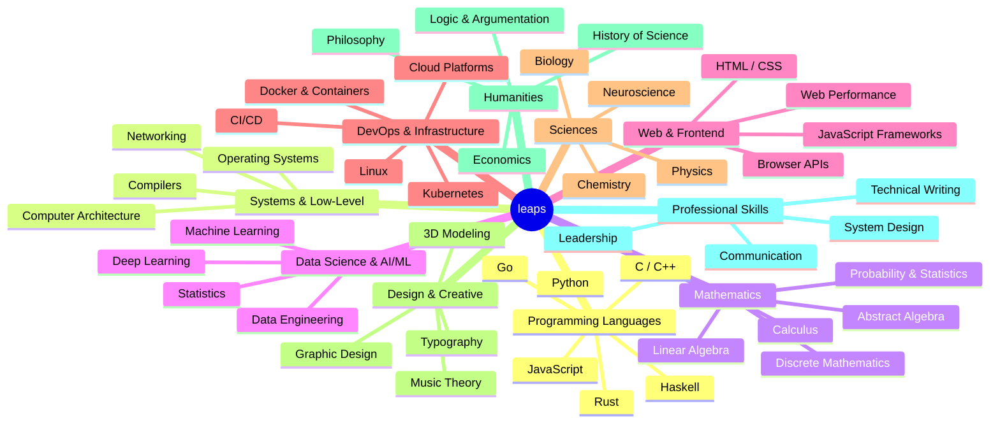
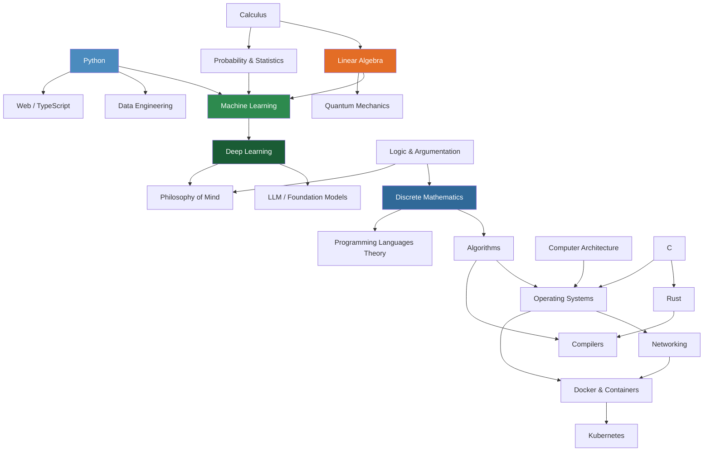

# Topics

This directory is the heart of leaps. Every subject worth learning lives here as its own
topic directory — a self-contained knowledge base with structured modules, exercises, test
questions, and resources.

Topics are organized into broad categories. Within each topic, modules are numbered and
sequenced so that a learner (human or AI) can progress logically from fundamentals to
advanced material. See [CONTRIBUTING.md](https://github.com/CuriousFurBytes/leaps/blob/main/CONTRIBUTING.md)
for instructions on adding a new topic or module.

> [!NOTE]
> This page is also the landing page of the **published leaps book**. The book is built
> with [Zensical](https://zensical.org) from this `TOPICS/` directory and deployed to
> GitHub Pages on every push to `main`. It exposes exactly this index of courses and the
> courses themselves — nothing else.

---

## Available Courses

These courses are live today. Each links to its topic overview, which in turn links every
module.

| Course | Description | Difficulty | Modules |
|---|---|---|---|
| [Go](go/) | Compiled, garbage-collected, built for concurrency | Beginner → Expert | 20 |

The catalog below maps the full landscape of planned topics.

---

## Adding a New Topic

Open an issue using the [New Topic Request](https://github.com/CuriousFurBytes/leaps/issues/new?template=new-topic-request.yml)
template, or follow [CONTRIBUTING.md](https://github.com/CuriousFurBytes/leaps/blob/main/CONTRIBUTING.md) to build it directly.

---

## Topic Map



---

## Topic Categories

### Programming Languages

Languages as primary objects of study — syntax, semantics, idioms, and the mental models
each language instills.

| Topic | Description | Difficulty | Modules | Status |
|---|---|---|---|---|
| [Go](go/) | Compiled, garbage-collected, built for concurrency | Beginner → Expert | 20 | Active |
| Python | General-purpose, expressive, batteries-included | Beginner | — | Planned |
| Rust | Systems language with ownership-based memory safety | Advanced | — | Planned |
| JavaScript | The language of the web; event-driven and prototype-based | Beginner | — | Planned |
| Haskell | Purely functional language; mathematical and rigorous | Expert | — | Planned |
| C | Foundation of systems programming; manual memory management | Intermediate | — | Planned |

---

### Systems & Low-Level

How computers actually work beneath the abstractions.

| Topic | Description | Difficulty | Modules | Status |
|---|---|---|---|---|
| Operating Systems | Processes, memory, filesystems, scheduling | Advanced | — | Planned |
| Computer Architecture | CPU pipelines, caches, instruction sets, RISC-V | Advanced | — | Planned |
| Compilers | Lexing, parsing, IR, optimization, code generation | Expert | — | Planned |
| Networking | TCP/IP stack, protocols, DNS, TLS | Intermediate | — | Planned |

---

### Mathematics

Rigorous mathematical foundations with an emphasis on intuition and application.

| Topic | Description | Difficulty | Modules | Status |
|---|---|---|---|---|
| Calculus | Limits, derivatives, integrals, series | Intermediate | — | Planned |
| Linear Algebra | Vectors, matrices, transformations, eigenvalues | Intermediate | — | Planned |
| Discrete Mathematics | Combinatorics, graph theory, logic, proofs | Intermediate | — | Planned |
| Probability & Statistics | Bayesian and frequentist reasoning, distributions | Intermediate | — | Planned |
| Abstract Algebra | Groups, rings, fields, morphisms | Advanced | — | Planned |
| Real Analysis | Formal foundations of calculus; epsilon-delta proofs | Expert | — | Planned |

---

### Data Science & AI/ML

The theory and practice of learning from data.

| Topic | Description | Difficulty | Modules | Status |
|---|---|---|---|---|
| Machine Learning | Supervised, unsupervised, and reinforcement learning | Intermediate | — | Planned |
| Deep Learning | Neural networks, backpropagation, modern architectures | Advanced | — | Planned |
| Data Engineering | Pipelines, warehouses, streaming, data quality | Intermediate | — | Planned |
| Statistics for DS | Inference, hypothesis testing, experimental design | Intermediate | — | Planned |

---

### Web & Frontend

Building things for the browser — from fundamentals to modern toolchains.

| Topic | Description | Difficulty | Modules | Status |
|---|---|---|---|---|
| HTML & CSS | Document structure, layout models, responsive design | Beginner | — | Planned |
| TypeScript | JavaScript with a type system; modern web development | Intermediate | — | Planned |
| Web Performance | Core Web Vitals, rendering pipeline, optimization | Advanced | — | Planned |
| Browser APIs | DOM, fetch, workers, WebAssembly, storage | Intermediate | — | Planned |

---

### DevOps & Infrastructure

The systems that build, ship, and run software reliably at scale.

| Topic | Description | Difficulty | Modules | Status |
|---|---|---|---|---|
| Linux | Shell, processes, filesystems, administration | Intermediate | — | Planned |
| Docker & Containers | Images, layers, networking, compose | Intermediate | — | Planned |
| Kubernetes | Orchestration, pods, controllers, operators | Advanced | — | Planned |
| CI/CD | Pipeline design, testing strategies, deployment patterns | Intermediate | — | Planned |

---

### Sciences

Formal sciences — grounded in real textbooks and primary sources.

| Topic | Description | Difficulty | Modules | Status |
|---|---|---|---|---|
| Classical Mechanics | Newtonian mechanics, energy, momentum | Intermediate | — | Planned |
| Electromagnetism | Maxwell's equations, waves, fields | Advanced | — | Planned |
| Quantum Mechanics | Wave functions, operators, measurement | Expert | — | Planned |
| Neuroscience | Neurons, circuits, cognition, plasticity | Advanced | — | Planned |

---

### Design & Creative

Visual thinking, aesthetics, and creative craft as learnable disciplines.

| Topic | Description | Difficulty | Modules | Status |
|---|---|---|---|---|
| Graphic Design | Composition, color, typography, visual hierarchy | Beginner | — | Planned |
| Music Theory | Notation, harmony, counterpoint, form | Intermediate | — | Planned |
| Typography | Type anatomy, readability, type selection, layout | Beginner | — | Planned |

---

### Humanities

Ideas, arguments, and the human record.

| Topic | Description | Difficulty | Modules | Status |
|---|---|---|---|---|
| Philosophy of Mind | Consciousness, qualia, intentionality, AI | Advanced | — | Planned |
| Logic & Argumentation | Formal and informal logic, fallacies, proofs | Intermediate | — | Planned |
| History of Science | How science actually progressed; paradigm shifts | Intermediate | — | Planned |
| Economics | Micro and macro foundations, behavioral economics | Intermediate | — | Planned |

---

### Professional Skills

Skills that amplify everything else — communication, design thinking, and technical leadership.

| Topic | Description | Difficulty | Modules | Status |
|---|---|---|---|---|
| Technical Writing | Docs, READMEs, proposals, reports | Beginner | — | Planned |
| System Design | Distributed systems, trade-offs, architecture patterns | Advanced | — | Planned |
| Code Review | Reading code, giving feedback, reviewing for correctness | Intermediate | — | Planned |

---

## Getting Started Recommendations

Not sure where to begin? These curated paths are based on common starting points.

### If you are a programmer wanting to go deeper into systems

```text
Go (modules 0-9) → Computer Architecture → Operating Systems → C → Rust
```

Rationale: Establish a comfortable, statically-typed baseline in Go, understand what the
hardware actually does, then learn how the OS mediates access to it, then write code without
a safety net, then write code with safety guarantees.

### If you are starting from scratch with no programming background

```text
Go (modules 0-9) → Discrete Mathematics → Algorithms & Data Structures → Linear Algebra
```

Rationale: Go's small, readable syntax minimizes the barrier to entry while teaching you
real static typing and concurrency. Discrete math builds the logical reasoning that makes
advanced CS tractable. Algorithms teaches structured problem-solving. Linear algebra unlocks
everything in data science.

### If you want to explore mathematics as a programmer

```text
Discrete Mathematics → Probability & Statistics → Linear Algebra → Calculus → Abstract Algebra
```

Rationale: Discrete math is where programming meets mathematics most naturally.
Statistics builds intuition for uncertainty. Linear algebra connects to nearly every
applied field. Calculus deepens the continuous-math intuition. Abstract algebra is
the payoff — structure everywhere.

### If you want to get into AI/ML seriously

```text
A general-purpose language → Linear Algebra → Probability & Statistics → Machine Learning → Deep Learning
```

Rationale: You cannot understand gradient descent without linear algebra, you cannot
reason about model uncertainty without statistics, and you cannot debug neural networks
without understanding both.

---

## Cross-topic Learning Paths

The diagram below shows how topics in leaps depend on and reinforce each other. Arrows
indicate "is a useful prerequisite for". This is not exhaustive — use it as a map, not
a mandate.


