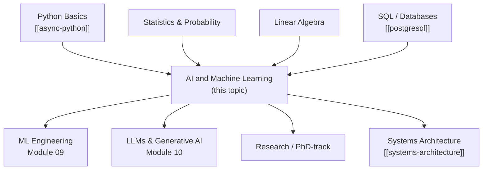

# Roadmap: Artificial Intelligence and Machine Learning

> This roadmap explains how the AI/ML topic fits into broader learning paths, what to study before and after, and suggested timelines for different goals.

---

## Table of Contents

- [Where This Topic Fits](#where-this-topic-fits)
- [Suggested Learning Paths](#suggested-learning-paths)
- [Before You Start](#before-you-start)
- [After You Finish](#after-you-finish)
- [Parallel Topics](#parallel-topics)
- [Timeline Estimates](#timeline-estimates)

---

## Where This Topic Fits

AI/ML sits at the intersection of mathematics, software engineering, and domain expertise. It builds on Python programming, statistics, and linear algebra — and opens doors to research, data science, ML engineering, and generative AI development.

_The AI/ML topic requires Python proficiency and benefits from SQL knowledge. It leads into production ML engineering and cutting-edge LLM development._

---

## Suggested Learning Paths

### Path 1: ML Engineer (6–9 months)

Focus on getting production-ready quickly.

1. Module 01 — Introduction (orientation)
2. Module 02 — Math for ML (skim if comfortable with linear algebra)
3. Module 03 — Supervised Learning (core algorithms)
4. Module 05 — Model Evaluation (critical for production)
5. Module 07 — Deep Learning with PyTorch
6. Module 09 — ML Engineering (primary focus)
7. Module 12 — Capstone Project

### Path 2: Data Scientist (4–6 months)

Focus on analysis, classical ML, and communication of results.

1. Modules 01–05 (all) — Foundations through evaluation
2. Module 06 — Neural Networks (conceptual understanding)
3. Module 11 — Responsible AI (bias, fairness, explainability)
4. Module 12 — Capstone Project

### Path 3: Deep Learning Researcher (9–12 months)

Focus on depth across all modules.

1. All modules in order
2. Supplement with "Deep Learning" by Goodfellow/Bengio/Courville
3. Read original papers for each module's key algorithms

### Path 4: LLM / Generative AI Developer (5–7 months)

Focus on Transformers, LLMs, and prompt engineering.

1. Modules 01–03 (foundations)
2. Module 05 (evaluation — essential for LLM eval)
3. Module 07 (deep learning basics)
4. Module 08 (NLP and Transformers — primary focus)
5. Module 10 (LLMs and Generative AI — primary focus)
6. Module 11 (Responsible AI)
7. Module 12 (Capstone)

---

## Before You Start

Ensure you are comfortable with:

- **Python** — functions, classes, list comprehensions, numpy array operations, file I/O. See [[async-python]].
- **Basic statistics** — mean, variance, standard deviation, probability. Module 02 covers these formally but pre-exposure helps.
- **Basic linear algebra** — vectors, matrices, dot products. Again, Module 02 covers this — but familiarity speeds up comprehension.
- **Command-line basics** — creating virtual environments, installing packages with pip, running Python scripts.

---

## After You Finish

Once you complete this topic, natural next steps include:

- [[systems-architecture]] — Understand distributed training, parameter servers, and inference at scale
- [[devops-platform-engineering]] — Container-based deployment, Kubernetes for ML workloads, GitOps
- [[postgresql]] — Advanced SQL for data pipelines, feature stores, and experiment tracking
- Original research papers — follow arXiv (cs.LG, cs.CL, stat.ML) for the latest advances
- Kaggle competitions — apply your skills on real datasets with community feedback
- Open-source contribution — PyTorch, HuggingFace, scikit-learn, and MLflow all welcome contributors

---

## Parallel Topics

These topics can be studied alongside AI/ML:

- **Statistics** — probability theory, Bayesian inference, hypothesis testing
- **Algorithms and Data Structures** — efficient implementations of nearest-neighbor search, graph algorithms used in GNNs
- **Cloud Computing** — AWS SageMaker, GCP Vertex AI, Azure ML for managed training and deployment

---

## Timeline Estimates

| Goal | Estimated Time | Key Modules |
|------|---------------|-------------|
| "I can build and evaluate a basic ML model" | 4–6 weeks | 01, 03, 05 |
| "I can train a neural network with PyTorch" | 8–12 weeks | 01–07 |
| "I can deploy a model as an API" | 12–16 weeks | 01–09 |
| "I can work with LLMs and build RAG systems" | 16–20 weeks | 01–10 |
| "I understand responsible AI and governance" | 20–24 weeks | 01–11 |
| "I have completed the full curriculum" | 24–36 weeks | All 12 modules |
