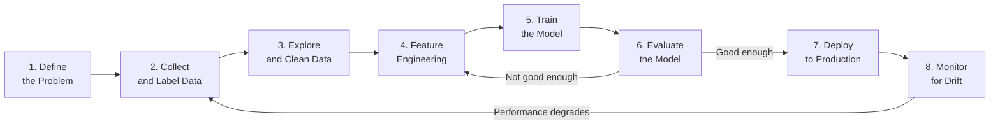

# Module 01: Introduction to AI and Machine Learning

[← Topic Home](../../README.md) | [Next → Module 02: Mathematics for ML](../02_math-for-ml/)

---


> What AI and ML actually are, why the field exists, how ML differs from traditional programming, and how to set up a working Python environment to start experimenting.

---

## Table of Contents

1. [Overview](#overview)
2. [Prerequisites](#prerequisites)
3. [Objectives](#objectives)
4. [Theory](#theory)
   - [AI vs. ML vs. Deep Learning](#ai-vs-ml-vs-deep-learning)
   - [Types of Machine Learning](#types-of-machine-learning)
   - [The ML Workflow](#the-ml-workflow)
   - [The Bias-Variance Tradeoff](#the-bias-variance-tradeoff)
   - [Setting Up Your ML Environment](#setting-up-your-ml-environment)
5. [Key Concepts](#key-concepts)
6. [Examples](#examples)
7. [Common Pitfalls](#common-pitfalls)
8. [Cross-Links](#cross-links)
9. [Summary](#summary)

---

## Overview

Machine learning is fundamentally a different way of programming. In traditional software development, you write explicit rules: `if age > 65 and income < threshold, then flag for review`. In ML, you show the system thousands of examples of inputs and outputs, and it discovers the rules itself. This shift — from rule specification to example provision — is what makes ML powerful and what makes it require a different mental model.

This module establishes the conceptual foundations you need before writing any ML code. We will define exactly what AI, ML, and deep learning are (and how they relate), survey the three major types of ML, walk through the full ML workflow from raw data to a deployed model, and introduce the single most important conceptual tradeoff in ML: the bias-variance tradeoff.

By the end of this module you will have a working Python ML environment and will have trained your first model — a decision tree classifier on the Iris dataset. The model will be simple, but you will have followed every step of the real workflow that practitioners use on production systems.

A note on hype: AI is one of the most hyped areas in technology. Journalists routinely conflate narrow pattern-matching systems with general intelligence. Your job as a practitioner is to be precise: know what specific type of learning a system uses, what data it was trained on, what its failure modes are, and what problem it actually solves. This module will give you the vocabulary to be precise.

---

## Prerequisites

### Required Modules

- This is the first module — no prior modules required.

### Required Concepts

- **Python functions and control flow** — you need to be able to write a function, use a loop, and import a library. See [[async-python]] if you need to build this foundation.
- **numpy basics** — basic array creation and operations (`np.array`, `np.mean`, `np.dot`). These will be used in examples.
- **High school mathematics** — variables, functions, graphs. No calculus or linear algebra required yet.

> [!TIP]
> If any of these prerequisites feel shaky, spend 15–30 minutes reviewing them before continuing.
> A weak Python foundation will make the code examples frustrating rather than illuminating.

---

## Objectives

By the end of this module, you will be able to:

1. Explain the difference between AI, ML, and deep learning with concrete examples of each
2. Classify a given problem as supervised, unsupervised, or reinforcement learning and justify the classification
3. Describe the full ML workflow (data → preprocessing → training → evaluation → deployment) and explain why each step exists
4. Explain the bias-variance tradeoff and identify whether a model is underfitting or overfitting from a learning curve
5. Set up a Python ML environment with numpy, pandas, matplotlib, and scikit-learn
6. Train a scikit-learn classifier on a real dataset, evaluate it properly, and interpret the results

---

## Theory

### AI vs. ML vs. Deep Learning

These three terms form a hierarchy where each is a subset of the one above:

```
Artificial Intelligence (AI)
└── Machine Learning (ML)
    └── Deep Learning (DL)
```

**Artificial Intelligence** is the broadest term: any technique that enables machines to exhibit intelligent behavior. This includes rule-based expert systems (which contain no learning), search algorithms (which use no statistical learning), and ML. Early AI (1950s–1990s) was dominated by symbolic approaches: hand-crafted rules, logic, and search. These systems worked well for narrow, well-defined problems (chess, theorem proving) but failed to scale to the messy, ambiguous real world.

**Machine Learning** is a subfield of AI where systems learn from data rather than following explicitly programmed rules. The defining characteristic is that the system's behavior improves with experience (data). ML algorithms include linear regression, decision trees, support vector machines, and neural networks.

**Deep Learning** is a subfield of ML specifically using neural networks with many layers (hence "deep"). The "deep" refers to depth of representation: each layer learns increasingly abstract features. A CNN processing an image might have layers that detect edges, then textures, then parts, then objects. Deep learning is responsible for most of the dramatic progress since 2012 — in image recognition, speech recognition, translation, and text generation.

The practical implication: you do not need deep learning for every problem. A random forest or gradient boosted tree often outperforms a neural network on tabular data with fewer than 100,000 examples. Choosing the right tool for the problem is a fundamental ML skill.

```python
# A conceptual demonstration — not a real comparison, but shows the taxonomy
# Rule-based AI: explicit programmer-written rules
def rule_based_spam_filter(email_text):
    """Traditional AI: the programmer specifies the rules."""
    spam_words = ["buy now", "click here", "free money", "winner"]
    email_lower = email_text.lower()
    return any(word in email_lower for word in spam_words)

# ML: the system learns rules from data
from sklearn.naive_bayes import MultinomialNB
from sklearn.feature_extraction.text import CountVectorizer

# The programmer provides examples, not rules
emails = ["buy now cheap pills", "hey how are you", "free money click here"]
labels = [1, 0, 1]  # 1 = spam, 0 = not spam

vectorizer = CountVectorizer()
X = vectorizer.fit_transform(emails)

clf = MultinomialNB()
clf.fit(X, labels)  # The model discovers the rules from the data

# Predict on a new email
new_email = ["win free money now"]
X_new = vectorizer.transform(new_email)
prediction = clf.predict(X_new)
print(f"Prediction: {'spam' if prediction[0] == 1 else 'not spam'}")
```

### Types of Machine Learning

The three major paradigms of ML differ in the type of feedback signal available during training:

| Paradigm | Training Data | Feedback Signal | Example Problems |
|----------|--------------|----------------|-----------------|
| Supervised | Labeled input-output pairs | Direct: the correct output is known | Classification, regression |
| Unsupervised | Unlabeled inputs only | None: find structure in data | Clustering, dimensionality reduction |
| Reinforcement | State-action-reward sequences | Delayed: reward signal after actions | Game playing, robotics, recommendation |

**Supervised learning** is the most common in industry. The training set consists of $(x_i, y_i)$ pairs where $x_i$ is an input (features) and $y_i$ is the correct output (label). The model learns a function $f$ such that $f(x) \approx y$ for new, unseen inputs. Supervised problems are further divided into:
- **Classification**: the output is a discrete category (spam/not-spam, digit 0–9, dog breed)
- **Regression**: the output is a continuous value (house price, tomorrow's temperature, stock return)

**Unsupervised learning** has no labels — the system must find structure in the data on its own. Common tasks include clustering (group similar examples), dimensionality reduction (compress high-dimensional data into fewer meaningful dimensions), and density estimation (learn the underlying distribution of the data). Applications include customer segmentation, anomaly detection, and data visualization.

**Reinforcement learning (RL)** is architecturally different: an agent takes actions in an environment, observes the resulting state, and receives a reward signal. The goal is to learn a policy (a mapping from states to actions) that maximizes cumulative reward. RL is responsible for AlphaGo, game-playing agents, and the RLHF (reinforcement learning from human feedback) technique used to train ChatGPT and Claude.

```python
# Supervised learning — the canonical sklearn workflow
from sklearn.datasets import load_iris
from sklearn.model_selection import train_test_split
from sklearn.tree import DecisionTreeClassifier
from sklearn.metrics import accuracy_score

# Load a well-known classification dataset
# Iris: predict flower species from 4 measurements
iris = load_iris()
X = iris.data    # Shape: (150, 4) — 150 flowers, 4 features each
y = iris.target  # Shape: (150,)  — 0, 1, or 2 (species)

print(f"Feature names: {iris.feature_names}")
print(f"Classes: {iris.target_names}")
print(f"Dataset shape: X={X.shape}, y={y.shape}")

# Split into training and test sets — ALWAYS do this before any fitting
X_train, X_test, y_train, y_test = train_test_split(
    X, y,
    test_size=0.2,    # 20% held out for testing
    random_state=42,  # Reproducibility
    stratify=y        # Preserve class proportions in both splits
)

print(f"Training set size: {len(X_train)}")
print(f"Test set size: {len(X_test)}")

# Train a decision tree classifier
clf = DecisionTreeClassifier(max_depth=3, random_state=42)
clf.fit(X_train, y_train)  # The model learns from training data

# Evaluate on the held-out test set
y_pred = clf.predict(X_test)
accuracy = accuracy_score(y_test, y_pred)
print(f"Test accuracy: {accuracy:.2%}")
```

### The ML Workflow

Every production ML project follows approximately this sequence of steps. Understanding the full workflow — not just model training — is what separates practitioners from beginners.



_The ML workflow is iterative, not linear. Evaluation often reveals that features need engineering, data needs cleaning, or more data needs to be collected._

**Step 1: Define the problem.** The most important and most underrated step. What exactly are you predicting? What is the label? How will the model's output be used? What is "good enough" performance? A poorly defined problem leads to wasted work.

**Step 2: Collect and label data.** ML is data-hungry. Data quality matters far more than model complexity. A clean, representative dataset with a simple model often beats a sophisticated model on dirty, biased data. Labeling is expensive and error-prone — understanding label noise is important.

**Step 3: Explore and clean data.** Exploratory data analysis (EDA): distributions, correlations, class imbalance, missing values, outliers. Most real-world datasets have all of these. Data cleaning — handling missing values, correcting erroneous entries — often takes more time than model training.

**Step 4: Feature engineering.** Transforming raw data into features that make patterns easier for the model to discover. For tabular data: scaling, encoding categorical variables, creating interaction terms. For text: tokenization, TF-IDF. For images: normalization, augmentation. Good features can make a simple model excellent.

**Step 5: Train the model.** Fitting a model on the training data. This is the step beginners focus on disproportionately. In practice, it is often the fastest step.

**Step 6: Evaluate the model.** Measuring performance on the held-out test set using appropriate metrics. This is where many critical mistakes occur — using the wrong metrics, or inadvertently leaking test data into training.

**Step 7: Deploy to production.** Packaging the model as a service (REST API, batch job, embedded system) so that real users and applications can call it.

**Step 8: Monitor for drift.** Production data changes over time (data drift), and the relationship between inputs and outputs changes (concept drift). A model that was accurate at deployment may become stale. Monitoring detects this and triggers retraining.

```python
# Demonstrating the EDA step of the workflow
import numpy as np
import pandas as pd
from sklearn.datasets import load_iris

iris = load_iris()
df = pd.DataFrame(iris.data, columns=iris.feature_names)
df["species"] = [iris.target_names[t] for t in iris.target]

# Basic exploration
print("Shape:", df.shape)
print("\nMissing values:\n", df.isnull().sum())
print("\nClass distribution:\n", df["species"].value_counts())
print("\nDescriptive statistics:\n", df.describe().round(2))

# Feature correlation (a quick scan for relationships)
numeric_df = df.select_dtypes(include=[np.number])
correlation_matrix = numeric_df.corr()
print("\nCorrelation matrix:\n", correlation_matrix.round(2))
```

### The Bias-Variance Tradeoff

This is the most important conceptual framework in all of machine learning. Understanding it explains why models fail, how to diagnose them, and how to fix them.

Every model makes errors on unseen data. These errors come from two sources:

**Bias** is the error from incorrect assumptions in the learning algorithm. A high-bias model is too simple — it cannot capture the true patterns in the data. It will perform poorly on both training data and test data. This is called **underfitting**.

**Variance** is the error from sensitivity to small fluctuations in the training set. A high-variance model is too complex — it memorizes the training data, including its noise, and fails to generalize. It performs well on training data but poorly on test data. This is called **overfitting**.

The tradeoff: as you increase model complexity, bias decreases (the model can capture more patterns) but variance increases (the model becomes more sensitive to the specific training examples). The sweet spot is a model complex enough to capture the true signal but not so complex that it fits the noise.

```python
import numpy as np
from sklearn.linear_model import LinearRegression
from sklearn.preprocessing import PolynomialFeatures
from sklearn.pipeline import Pipeline
from sklearn.model_selection import train_test_split
from sklearn.metrics import mean_squared_error

# Generate synthetic data with a known quadratic relationship + noise
np.random.seed(42)
X = np.linspace(-3, 3, 100).reshape(-1, 1)  # 100 x values from -3 to 3
y_true = 0.5 * X.ravel()**2 - X.ravel() + 2  # True relationship: quadratic
y = y_true + np.random.normal(0, 0.5, size=100)  # Add Gaussian noise

X_train, X_test, y_train, y_test = train_test_split(X, y, test_size=0.3, random_state=42)

results = {}
for degree in [1, 2, 10]:
    # degree=1: linear (underfit), degree=2: correct, degree=10: overfit
    model = Pipeline([
        ("poly", PolynomialFeatures(degree=degree)),
        ("reg", LinearRegression()),
    ])
    model.fit(X_train, y_train)

    train_mse = mean_squared_error(y_train, model.predict(X_train))
    test_mse = mean_squared_error(y_test, model.predict(X_test))
    results[degree] = (train_mse, test_mse)
    print(f"Degree {degree:2d}: train MSE={train_mse:.3f}, test MSE={test_mse:.3f}")

# Expected output shows the pattern:
# Degree  1: train MSE large (underfits), test MSE large (high bias)
# Degree  2: train MSE small, test MSE small (sweet spot — matches true function)
# Degree 10: train MSE very small (overfits noise), test MSE large (high variance)
```

**Diagnosing from learning curves:**
- High training AND test error → **underfitting** (high bias) → use more complex model, add features
- Low training error but high test error → **overfitting** (high variance) → use regularization, get more data, simplify model

> [!IMPORTANT]
> The bias-variance tradeoff is not just a theoretical concept — it is the primary diagnostic tool you will use when a model is not performing as expected. Every debugging session in ML eventually comes back to: is my model underfitting or overfitting?

### Setting Up Your ML Environment

A reproducible ML environment requires a Python virtual environment and the core data science stack. Here is a complete setup:

```bash
# Create a virtual environment
python3 -m venv ml-env
source ml-env/bin/activate        # On Windows: ml-env\Scripts\activate

# Install the core stack
pip install numpy pandas matplotlib seaborn scikit-learn
pip install torch torchvision     # PyTorch (used in Modules 06-08)
pip install transformers datasets  # HuggingFace (used in Module 08)
pip install mlflow fastapi uvicorn # MLOps tools (Module 09)

# Verify the installation
python -c "
import numpy as np
import pandas as pd
import sklearn
import torch
print(f'numpy: {np.__version__}')
print(f'pandas: {pd.__version__}')
print(f'scikit-learn: {sklearn.__version__}')
print(f'pytorch: {torch.__version__}')
print('Environment ready.')
"
```

Once the environment is ready, run the first complete ML example to verify everything works:

```python
# First complete ML example: classify Iris flowers
# This is the "Hello, World" of machine learning
import numpy as np
import pandas as pd
import matplotlib
matplotlib.use("Agg")  # Non-interactive backend for scripts
import matplotlib.pyplot as plt

from sklearn.datasets import load_iris
from sklearn.model_selection import train_test_split, cross_val_score
from sklearn.preprocessing import StandardScaler
from sklearn.tree import DecisionTreeClassifier
from sklearn.metrics import classification_report, confusion_matrix

# --- 1. Load Data ---
iris = load_iris()
X, y = iris.data, iris.target
feature_names = iris.feature_names
class_names = iris.target_names

print(f"Dataset: {X.shape[0]} samples, {X.shape[1]} features")
print(f"Features: {feature_names}")
print(f"Classes: {class_names}")

# --- 2. Split Data (always before any preprocessing) ---
X_train, X_test, y_train, y_test = train_test_split(
    X, y, test_size=0.2, random_state=42, stratify=y
)

# --- 3. Preprocess: Standardize features ---
# Fit ONLY on train data to prevent data leakage
scaler = StandardScaler()
X_train_scaled = scaler.fit_transform(X_train)
X_test_scaled = scaler.transform(X_test)  # Use training stats, do not re-fit

# --- 4. Train Model ---
clf = DecisionTreeClassifier(max_depth=3, random_state=42)
clf.fit(X_train_scaled, y_train)

# --- 5. Cross-Validation (more reliable than a single split) ---
cv_scores = cross_val_score(clf, X_train_scaled, y_train, cv=5, scoring="accuracy")
print(f"\nCross-validation accuracy: {cv_scores.mean():.3f} ± {cv_scores.std():.3f}")

# --- 6. Final Evaluation on the test set ---
y_pred = clf.predict(X_test_scaled)

print("\nClassification Report:")
print(classification_report(y_test, y_pred, target_names=class_names))

print("Confusion Matrix:")
print(confusion_matrix(y_test, y_pred))
# Rows = true labels, columns = predicted labels
# Perfect classifier: diagonal matrix
```

---

## Key Concepts

**Machine Learning** — A subfield of AI in which systems learn patterns from data rather than following explicitly programmed rules. The core idea: given enough examples of inputs and their corresponding outputs, a learning algorithm can discover the mapping function. See [[shared/glossary#machine-learning]].

**Supervised Learning** — The ML paradigm where training data consists of labeled input-output pairs $(x, y)$, and the model learns to predict $y$ from $x$. The model is supervised by the labels. Divided into classification (discrete $y$) and regression (continuous $y$).

**Unsupervised Learning** — The ML paradigm where training data has no labels. The model discovers structure: clusters, latent dimensions, or the underlying density. Applications include customer segmentation, anomaly detection, and data visualization.

**Overfitting** — A model that performs much better on training data than on unseen test data, because it has memorized training examples rather than learning generalizable patterns. The primary risk with complex models. See [[ai-ml/modules/05_model-evaluation]].

**Bias-Variance Tradeoff** — The fundamental tension between a model being too simple (high bias, underfitting) and too complex (high variance, overfitting). Every modeling decision implicitly navigates this tradeoff. See [[ai-ml/modules/05_model-evaluation]].

**Feature** — An individual measurable property used as an input to the model. Feature quality is the biggest determinant of model quality. "Garbage in, garbage out."

**Label** — The target output variable the model is trained to predict. In supervised learning, every training example has a label. The quality and representativeness of labels directly determines what the model can learn.

**Train/Test Split** — The practice of holding out a portion of the data (test set) before any model development begins. The test set is touched only once — for final evaluation. This prevents optimistic over-reporting of performance.

---

## Examples

### Example 1: Your First Classification Model

**Scenario:** You have measurements of 150 flowers from 3 species of iris. You want to build a model that can identify the species from 4 physical measurements.

**Goal:** Train a decision tree, evaluate it properly, and interpret the confusion matrix.

```python
from sklearn.datasets import load_iris
from sklearn.model_selection import train_test_split
from sklearn.tree import DecisionTreeClassifier
from sklearn.metrics import accuracy_score, confusion_matrix, classification_report
import numpy as np

# Load and split the data
iris = load_iris()
X_train, X_test, y_train, y_test = train_test_split(
    iris.data, iris.target, test_size=0.2, random_state=42, stratify=iris.target
)

# Train
clf = DecisionTreeClassifier(max_depth=3, random_state=42)
clf.fit(X_train, y_train)

# Predict and evaluate
y_pred = clf.predict(X_test)
print(f"Accuracy: {accuracy_score(y_test, y_pred):.2%}")
print()
print(classification_report(y_test, y_pred, target_names=iris.target_names))

# Confusion matrix: rows=true, columns=predicted
cm = confusion_matrix(y_test, y_pred)
print("Confusion matrix:")
print(cm)
# Perfect classification would show only diagonal values (no off-diagonal errors)
```

**Approach:** Decision trees split the feature space recursively. `max_depth=3` limits the tree to 3 levels, preventing overfitting. The confusion matrix shows which classes are confused with which others — particularly useful for multi-class problems.

### Example 2: Diagnosing Underfitting vs. Overfitting

**Scenario:** You want to understand empirically how model complexity affects training vs. test performance.

**Goal:** Plot training and test accuracy as a function of tree depth — a "validation curve."

```python
from sklearn.datasets import load_iris
from sklearn.model_selection import train_test_split, validation_curve
from sklearn.tree import DecisionTreeClassifier
import numpy as np

iris = load_iris()
X_train, X_test, y_train, y_test = train_test_split(
    iris.data, iris.target, test_size=0.2, random_state=42, stratify=iris.target
)

# Compute training and validation scores for different tree depths
depths = range(1, 15)
train_scores, val_scores = validation_curve(
    DecisionTreeClassifier(random_state=42),
    X_train, y_train,
    param_name="max_depth",
    param_range=depths,
    cv=5,
    scoring="accuracy"
)

# Mean across CV folds
train_mean = train_scores.mean(axis=1)
val_mean = val_scores.mean(axis=1)

# Print the values (in practice, plot these)
print(f"{'Depth':>5} | {'Train Acc':>10} | {'Val Acc':>10}")
print("-" * 32)
for d, tr, vl in zip(depths, train_mean, val_mean):
    print(f"{d:>5} | {tr:>10.3f} | {vl:>10.3f}")

# Pattern you should observe:
# depth=1: train acc low AND val acc low → underfitting (high bias)
# depth=3-5: train acc high AND val acc high → good fit (sweet spot)
# depth=10+: train acc ~1.0 AND val acc drops → overfitting (high variance)
```

**What to notice:** The point where validation accuracy peaks is the optimal depth. Beyond that, the model memorizes the training data and performance on unseen examples degrades.

---

## Common Pitfalls

### Pitfall 1: Data Leakage — Fitting the Preprocessor on All Data

**The mistake:** Fitting the scaler (or any other preprocessor) on the full dataset before splitting into train and test.

```python
# WRONG — data leakage
from sklearn.preprocessing import StandardScaler
from sklearn.model_selection import train_test_split

scaler = StandardScaler()
X_scaled = scaler.fit_transform(X)  # Uses mean/std from test data too!
X_train, X_test, y_train, y_test = train_test_split(X_scaled, y, test_size=0.2)
```

```python
# CORRECT — fit only on training data
from sklearn.preprocessing import StandardScaler
from sklearn.model_selection import train_test_split

X_train, X_test, y_train, y_test = train_test_split(X, y, test_size=0.2)
scaler = StandardScaler()
X_train_scaled = scaler.fit_transform(X_train)  # Fit on train only
X_test_scaled = scaler.transform(X_test)         # Apply train stats to test
```

**Why it matters:** When you compute the mean and standard deviation of the full dataset (including the test set) to normalize, you are letting information about the test set "leak" into your preprocessing. The test performance appears better than it really is. In production, you will not have access to future data — the model must use statistics computed only from data available at training time.

### Pitfall 2: Using Accuracy as the Only Metric on Imbalanced Classes

**The mistake:** Reporting only accuracy when classes are imbalanced.

```python
# WRONG interpretation — on a 99%/1% imbalanced dataset
from sklearn.dummy import DummyClassifier
from sklearn.metrics import accuracy_score

# A classifier that predicts "not fraud" for every input
dummy = DummyClassifier(strategy="most_frequent")
dummy.fit(X_train, y_train)
y_pred = dummy.predict(X_test)

accuracy = accuracy_score(y_test, y_pred)
print(f"Accuracy: {accuracy:.2%}")  # Will print ~99% — looks great, is useless
```

```python
# CORRECT — use precision, recall, F1, and AUC-ROC for imbalanced problems
from sklearn.metrics import classification_report, roc_auc_score

print(classification_report(y_test, y_pred))
# This will show precision=0 and recall=0 for the minority class — revealing the problem
```

**Why it matters:** Accuracy is misleading when class distributions are unequal. A fraud detection model that labels every transaction as "not fraud" is 99.9% accurate but completely useless. Always look at per-class precision and recall, and choose metrics that match the business objective.

### Pitfall 3: Treating the Test Set as a Development Tool

**The mistake:** Tweaking the model based on test set performance, then reporting that test performance as a fair estimate of generalization.

**The wrong workflow:**
1. Split data into train/test
2. Train model, check test accuracy
3. Adjust hyperparameters, check test accuracy again
4. Repeat 5 more times
5. Report the best test accuracy

**The correct workflow:**
1. Split data into train/validation/test (or use cross-validation on train)
2. Tune hyperparameters using the validation set (or cross-validation)
3. Touch the test set exactly ONCE, after all development is complete
4. Report that final test performance

**Why it matters:** Every time you look at the test set and adjust your model accordingly, you are fitting to the test set. The reported performance becomes optimistically biased. Use a validation set (or cross-validation) for all development decisions.

### Pitfall 4: Not Shuffling Data Before Splitting

**The mistake:** Splitting a dataset that is sorted by class without shuffling first.

```python
# WRONG — if data is sorted by class, test set contains only one class
X_train, X_test = X[:120], X[120:]  # If last 30 examples are all class 2, test is useless

# CORRECT — shuffle first, then split
from sklearn.model_selection import train_test_split
X_train, X_test, y_train, y_test = train_test_split(
    X, y, test_size=0.2, random_state=42, stratify=y
)
# stratify=y ensures class proportions are preserved in both splits
```

---

## Cross-Links

- [[async-python]] — Python foundations required for this module; functions, list comprehensions, and library imports
- [[systems-architecture]] — Deployment patterns for ML models covered in Module 09 build on distributed systems concepts
- [[ai-ml/modules/05_model-evaluation]] — Evaluation, cross-validation, and metrics are the direct continuation of the bias-variance concepts introduced here
- [[ai-ml/modules/06_neural-networks]] — Deep learning builds on the same workflow introduced in this module
- [[shared/glossary#feature]] — Definition and context for the term "feature" in the ML sense

---

## Summary

- **AI is the broad field; ML is a subfield; deep learning is a subfield of ML.** Not every AI problem requires ML, and not every ML problem requires deep learning. Match the tool to the problem.

- **The three ML paradigms are supervised (labeled data), unsupervised (no labels, find structure), and reinforcement (learn from reward signals).** Most industry applications are supervised classification or regression.

- **The ML workflow is iterative:** define the problem → collect data → explore and clean → feature engineering → train → evaluate → deploy → monitor. Evaluation often reveals problems that require returning to earlier steps.

- **The bias-variance tradeoff is the central diagnostic framework.** High bias (underfitting): model is too simple, performs poorly on both train and test. High variance (overfitting): model is too complex, performs well on train but poorly on test. Validation curves reveal where the sweet spot is.

- **Data leakage is the most insidious bug in ML.** Any preprocessing that uses information from the test set (or future data) will make your model appear better than it really is. Always split before fitting any preprocessor.

- **Accuracy is not enough.** For imbalanced classes, adversarial settings, and most real-world problems, you need precision, recall, F1, and AUC-ROC. Choose metrics that match your business objective.

- **The test set is sacred.** Use it exactly once, after all model development is complete. Use cross-validation or a held-out validation set for all iterative development decisions.
