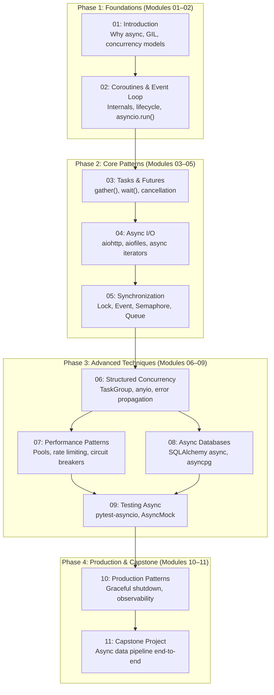
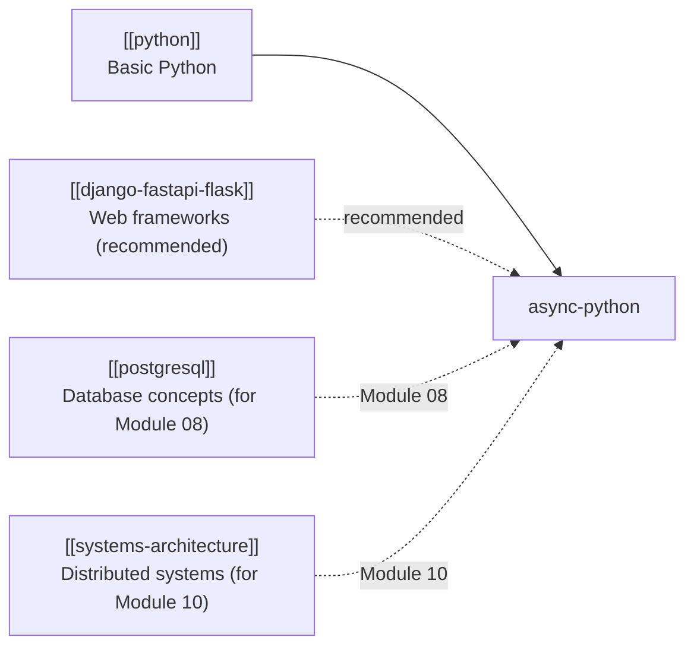

# Roadmap: Async Python

> This roadmap shows how the 11 modules are organized into learning phases and how this
> topic connects to the broader leaps knowledge graph.

---

## Learning Phases

_Four phases take you from first coroutine to a production-grade async data pipeline._

---

## Phase Descriptions

### Phase 1: Foundations

Build the mental model. Understand *why* async exists, how it differs from threading and
multiprocessing, and how the event loop and coroutines work at the language level. You will
write your first coroutines and run them, and understand the difference between a coroutine
object and a running task.

**Outcome:** You can explain the GIL, write a basic coroutine, and run it with `asyncio.run()`.

### Phase 2: Core Patterns

Learn the bread-and-butter patterns of daily async Python work: creating and managing multiple
tasks, doing real I/O with async HTTP and file clients, and preventing race conditions with
synchronization primitives.

**Outcome:** You can write async programs that fetch multiple URLs concurrently, read files
asynchronously, and safely share state between tasks.

### Phase 3: Advanced Techniques

Go deeper: structured concurrency for disciplined task lifecycle management, performance
patterns for production workloads, async database access, and comprehensive testing strategies
for async code.

**Outcome:** You can write production-quality async code with proper error handling,
cancellation support, database integration, and test coverage.

### Phase 4: Production and Capstone

Apply everything to real production concerns: graceful shutdown, health checks, worker pools,
distributed tracing. Then synthesize all of it into a complete capstone project — a
high-performance async data pipeline that fetches from multiple APIs, processes data
concurrently, and stores results to a database.

**Outcome:** You can design, build, test, and operate an async Python service in production.

---

## Prerequisites Map

_Solid arrow = required; dashed arrow = recommended or relevant for specific modules._
