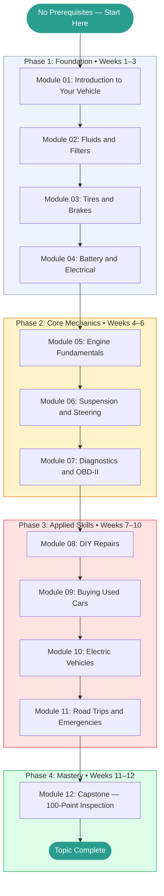

# Cars, Maintenance and Automotive Knowledge — Learning Roadmap

> This roadmap is your study plan. Work through the phases in order.
> Each phase builds directly on the previous one.
> Mark your current position with **← You Are Here** and update it as you progress.

---

## Prerequisites Map

No prior automotive knowledge is required. This topic starts from zero.

```
No prerequisites → Cars, Maintenance and Automotive Knowledge (start here)
```

If you want broader DIY skills context, [[home-renovation-brazil]] covers tool safety and project planning in a complementary domain.

---

## Learning Path Visualization



---

## Phase Breakdown

### Phase 1: Foundation

**Goal:** Understand the major systems of a car, build safety habits, and get comfortable performing the most common maintenance checks and tasks. Leave Phase 1 able to confidently open a hood, check fluids, inspect tires, and change a battery.

| Module | Name | Est. Hours | Key Skill Gained |
|--------|------|-----------|-----------------|
| 01 | Introduction to Your Vehicle | 4 | System overview; safety; fluid and light checks |
| 02 | Fluids and Filters | 4 | Oil change; fluid selection; coolant flush |
| 03 | Tires and Brakes | 4 | Tire inspection; rotation; brake pad check |
| 04 | Battery and Electrical | 3 | Battery maintenance; jump-starting; fuse diagnosis |

**Phase 1 Exit Criteria:**

- [ ] Can explain the purpose of all major vehicle systems to a non-mechanic
- [ ] Has checked oil level, coolant, tire pressure, and battery terminals on a real car
- [ ] Scored ≥ 70% on all Phase 1 module tests
- [ ] Completed at least one Beginner project from PROJECTS.md
- [ ] GLOSSARY.md has at least 10 entries filled in

**Milestone unlocked:** Foundation Built

---

### Phase 2: Core Mechanics

**Goal:** Develop genuine understanding of how the engine and drivetrain work, what can go wrong, and how to diagnose problems systematically using diagnostic tools.

| Module | Name | Est. Hours | Key Skill Gained |
|--------|------|-----------|-----------------|
| 05 | Engine Fundamentals | 5 | Timing systems; cooling; common failures |
| 06 | Suspension and Steering | 4 | Shocks vs. struts; alignment; worn component diagnosis |
| 07 | Diagnostics and OBD-II | 5 | Scan tool use; DTC interpretation; live data |

**Phase 2 Exit Criteria:**

- [ ] Can explain what a DTC code means and how to look it up
- [ ] Has connected an OBD-II scanner to a vehicle (or simulator) and read live data
- [ ] Scored ≥ 75% on all Phase 2 module tests
- [ ] Completed at least one Intermediate project from PROJECTS.md
- [ ] CHEATSHEET.md has entries for common OBD-II codes and maintenance intervals

**Milestone unlocked:** Core Mastery

---

### Phase 3: Applied Skills

**Goal:** Apply knowledge to realistic, complex scenarios: hands-on repairs, used car buying, EV systems, and emergency response. Leave Phase 3 capable of handling most common ownership situations independently.

| Module | Name | Est. Hours | Key Skill Gained |
|--------|------|-----------|-----------------|
| 08 | DIY Repairs | 6 | Brake pad replacement; spark plugs; filters |
| 09 | Buying Used Cars | 4 | Pre-purchase inspection; negotiation; FIPE |
| 10 | Electric Vehicles | 5 | BEV/PHEV/HEV; charging levels; battery care |
| 11 | Road Trips and Emergencies | 3 | Pre-trip checks; flat tire; breakdown procedure |

**Phase 3 Exit Criteria:**

- [ ] Has performed at least one DIY repair with confidence
- [ ] Can conduct a structured pre-purchase inspection on a used vehicle
- [ ] Understands the differences between BEV, PHEV, and HEV ownership
- [ ] Scored ≥ 80% on all Phase 3 module tests
- [ ] QUESTIONS.md open questions are mostly resolved (status: 🟢)

**Milestone unlocked:** Applied Practitioner

---

### Phase 4: Mastery

**Goal:** Synthesize everything into one comprehensive, documented vehicle inspection. Leave Phase 4 able to serve as a knowledgeable advisor to anyone buying, maintaining, or troubleshooting a car.

| Activity | Est. Hours | Description |
|----------|-----------|-------------|
| Capstone Project | 8 | 100-point vehicle inspection with cost estimates and maintenance calendar |
| Topic Review | 3 | Revisit modules where test scores were below 80% |
| Teaching Exercise | 2 | Write a maintenance guide for your specific vehicle or explain the inspection to someone |
| Final Self-Assessment | 1 | Retake weakest module tests; verify overall score ≥ 80% |

**Phase 4 Exit Criteria:**

- [ ] Capstone inspection documented in PROJECTS.md with photos or notes
- [ ] Overall topic score ≥ 80%
- [ ] CHEATSHEET.md is complete and genuinely useful as a quick reference
- [ ] GLOSSARY.md has definitions for every term encountered throughout the topic
- [ ] At least one teaching artifact exists (maintenance guide, write-up, or recorded walkthrough)

**Milestone unlocked:** Topic Mastery

---

## Time Estimates Summary

| Phase | Weeks | Est. Hours | Cumulative |
|-------|-------|-----------|------------|
| Phase 1: Foundation | 1–3 | 15 hrs | 15 hrs |
| Phase 2: Core Mechanics | 4–6 | 14 hrs | 29 hrs |
| Phase 3: Applied Skills | 7–10 | 18 hrs | 47 hrs |
| Phase 4: Mastery | 11–12 | 14 hrs | 61 hrs |
| **Total** | **12** | **~61 hrs** | |

> [!NOTE]
> These estimates assume roughly **5 focused hours per week**.
> If you're studying part-time, the calendar weeks will stretch accordingly.
> Consistency matters more than pace — even 2 hours per week gets you to mastery in 6 months.

---

## Milestone Definitions

| Milestone | Earned When | Point Threshold |
|-----------|------------|----------------|
| First Step | Module 01 complete | Any score |
| Foundation Built | Phase 1 complete, all tests ≥ 70% | 80 pts |
| Core Mastery | Phase 2 complete, all tests ≥ 75% | 160 pts |
| Applied Practitioner | Phase 3 complete, all tests ≥ 80% | 280 pts |
| Topic Mastery | Phase 4 complete, capstone done, overall ≥ 80% | 360 pts |
| DIY Mechanic | 3 real maintenance tasks documented | — |
| Diagnostician | Real fault diagnosed and resolved via OBD-II | — |

---

## Alternative Paths

### Fast Track (If You Have Some Experience)

If you already own a car and have done basic maintenance:

```
Skim Module 01 → Start at Module 03 → Continue normally
```

Take the Module 01 test first. If you score ≥ 85%, skip to Module 03.

### Deep Dive Path (Maximum Understanding)

For maximum depth, add these supplementary activities between phases:

- **After Phase 1:** Work through the manufacturer's service manual for your specific vehicle
- **After Phase 2:** Shadow a mechanic for a few hours at a trusted shop; ask questions
- **After Phase 3:** Attempt a more complex DIY repair (timing belt, suspension component)

### Project-First Path (Learn by Doing)

If you learn best by doing rather than reading:

```
Module 01 → Document your car's current condition → Module 02 → Perform an oil change → ...
```

Alternate one module of theory with one hands-on task at each step.

---

## You Are Here

> **Current Phase:** _Not started_
>
> **Current Module:** _None — begin at [Module 01](./modules/01_introduction/README.md)_
>
> **Last Completed Module:** _None_
>
> **Next Action:** Open Module 01 and read the Overview section.
>
> _Update this section each time you advance to a new module or phase._
