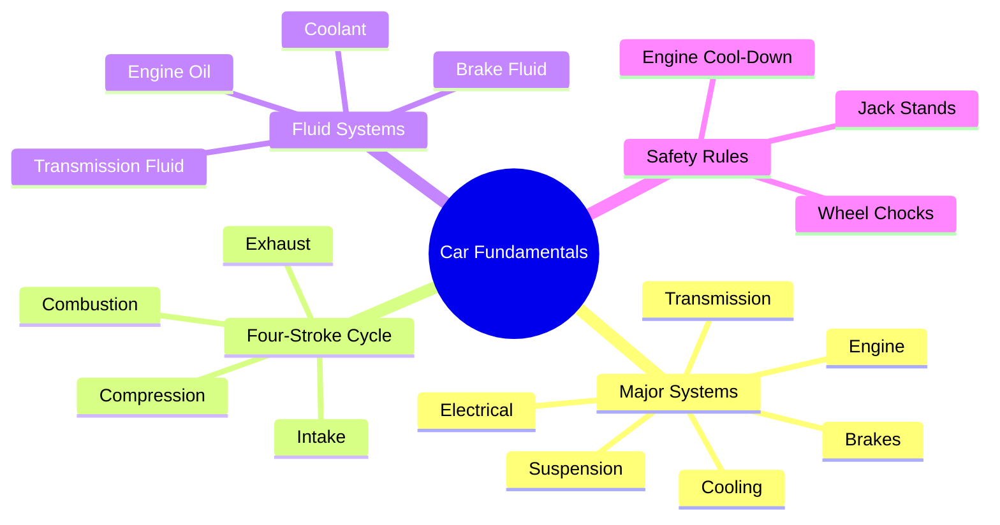

# Notes — Module 01: Introduction to Your Vehicle

> These are your personal study notes. Write freely and honestly.
> Incomplete notes are fine — they show where your understanding still needs work.
> Return to this file to add insights as they develop over time.

**Module:** [[cars-maintenance/modules/01_introduction]]
**Topic:** [[cars-maintenance]]
**Date started:** _Fill in when you start_
**Status:** In progress

---

## Concept Map

_Sketch how the concepts in this module relate to each other. Fill in the Mermaid diagram._

_Alternative: draw this on paper, photo it, and link the image here._

---

## Key Insights

_The "aha moments" — the things that, once understood, made the rest clear._
_Be specific: "I finally understood X because Y" is more useful than "X makes sense"._

1. **The power stroke insight:** _Only one of the four strokes actually produces power. The other three are setup. This explains why multi-cylinder engines are smoother — more cylinders means more power strokes per revolution._
2. **The safety hierarchy:** _Jack → lift. Jack stands → support. Never mix these roles._
3. _Add insights as you discover them_

---

## My Understanding

_Explain the core concepts in your own words, as if teaching them to someone else._
_If you can't explain it simply, you don't understand it well enough yet._

### The Four-Stroke Cycle

{{YOUR_EXPLANATION_OF_THE_FOUR_STROKE_CYCLE}}

_What I'm still unsure about:_ {{STILL_UNSURE}}

### Why Red Warning Lights Are Different from Yellow

{{YOUR_EXPLANATION_OF_WARNING_LIGHT_URGENCY}}

_What I'm still unsure about:_ {{STILL_UNSURE}}

### Fluid Systems Overview

{{YOUR_EXPLANATION_OF_FLUID_SYSTEMS}}

---

## Connections to Other Topics

_How does this module connect to things you already know?_

| This module's concept | Connects to | How |
|----------------------|-------------|-----|
| Four-stroke cycle | [[cars-maintenance/modules/05_engine-fundamentals]] | Module 05 goes deeper into timing, cooling, and failure modes of the engine |
| Fluid systems overview | [[cars-maintenance/modules/02_fluids-and-filters]] | Module 02 teaches the full procedures for each fluid |
| Warning lights / OBD-II | [[cars-maintenance/modules/07_diagnostics-and-obd2]] | Module 07 teaches you to read the stored fault codes |

---

## Questions That Arose

_Log questions as they appear. Don't stop to answer them now — just capture them._
_Then move the serious ones to [QUESTIONS.md](./QUESTIONS.md)._

- [ ] _Add your first question here_ → add to QUESTIONS.md if it's a significant one
- [ ] _What happens if you mix engine oil types (conventional + synthetic)?_
- [ ] _How do hybrid engines handle the four-stroke cycle when the electric motor kicks in?_

---

## What Tripped Me Up

_Mistakes I made, misconceptions I had, things that confused me more than they should have._

- **Coolant vs. Radiator check point** — I initially thought to check coolant at the radiator cap, but for modern cars you check the translucent overflow reservoir instead.
- **Oil level timing** — I didn't realize the engine needs to be off (and ideally cold) for an accurate dipstick reading. Hot engines have oil circulating through the system, giving a falsely low reading on the dipstick.

---

## Summary in My Own Words

_Write a 3–5 sentence summary of this entire module without looking at any notes._
_If you can't do this, you need more study time._

{{SUMMARY_PARAGRAPH}}

---

_Last updated: {{YYYY-MM-DD}}_
