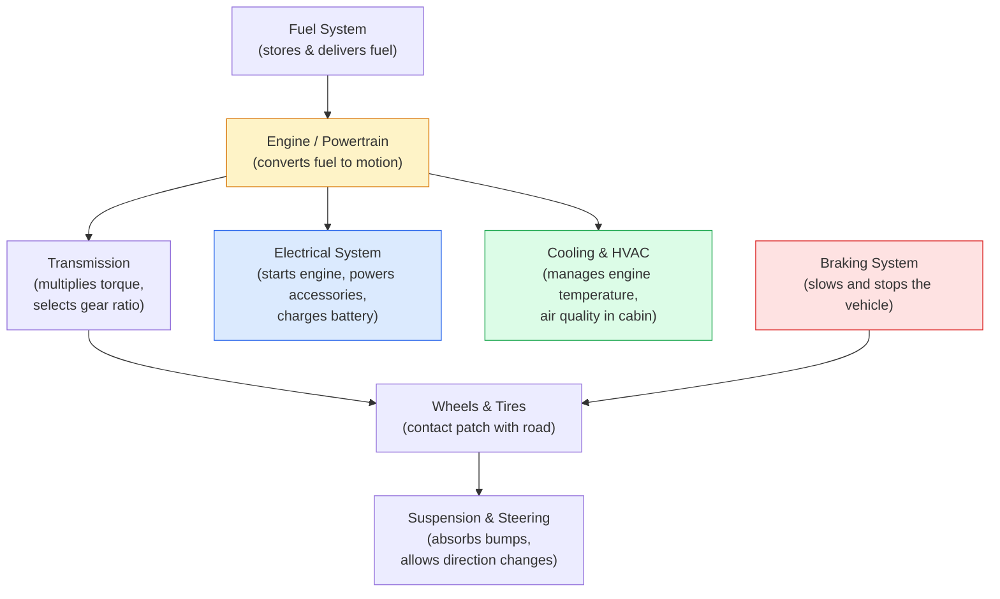
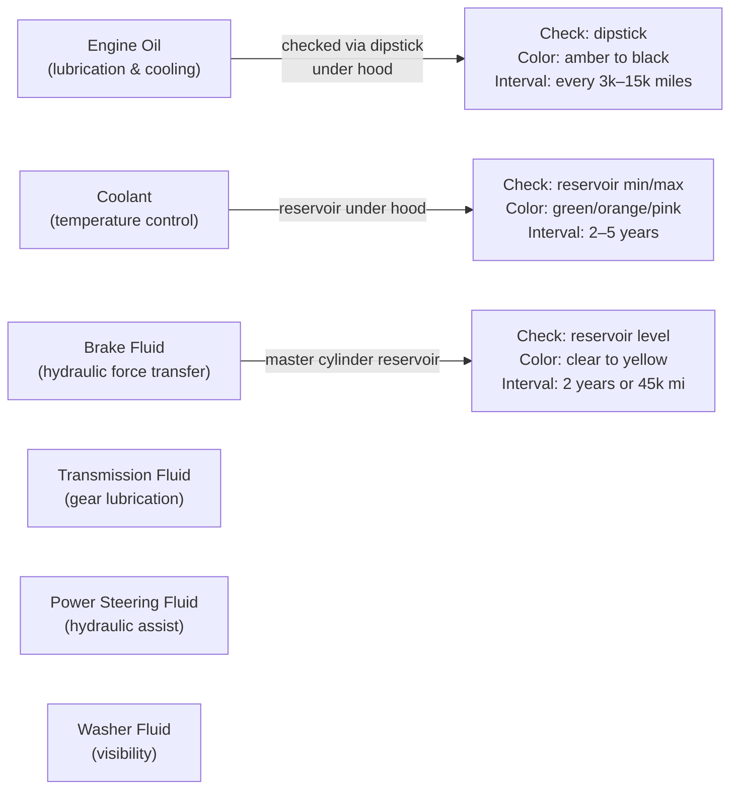

# Module 01: Introduction to Your Vehicle

[← Topic Home](../../README.md) | [Next → Module 02: Fluids and Filters](../02_fluids-and-filters/)

---


> An orientation to the modern automobile: its major systems, how they work together, what fluids it needs, and how to perform the most essential safety checks.

---

## Table of Contents

1. [Overview](#overview)
2. [Prerequisites](#prerequisites)
3. [Objectives](#objectives)
4. [Theory](#theory)
   - [Car Anatomy Overview](#car-anatomy-overview)
   - [How the Internal Combustion Engine Works](#how-the-internal-combustion-engine-works)
   - [Essential Safety Before Any Work](#essential-safety-before-any-work)
   - [Your Car's Fluid Systems](#your-cars-fluid-systems)
   - [Reading Warning Lights](#reading-warning-lights)
5. [Key Concepts](#key-concepts)
6. [Examples](#examples)
7. [Common Pitfalls](#common-pitfalls)
8. [Cross-Links](#cross-links)
9. [Summary](#summary)

---

## Overview

Every driver is the steward of a machine worth thousands of dollars, carrying passengers at highway speeds, powered by a contained chemical reaction. Yet most drivers couldn't identify their engine's oil dipstick, explain why a temperature warning light means "stop immediately," or describe what the four-stroke cycle is. This module changes that.

This module is your orientation to the automobile as a system. Rather than diving into repair procedures, we first build the mental model you need to make sense of everything that comes later. You will learn what the major systems are, what each one does, and how they interact. You will learn the basics of how a gasoline internal combustion engine works — including the famous four-stroke cycle that underlies most cars on the road today. You will also learn the safety practices that protect you before you ever open a hood or get under a car.

By the end of this module, you should be able to open your hood and know what you're looking at: not just "there's the engine," but "there's the cooling system reservoir, the oil dipstick, the serpentine belt, the battery, and the brake fluid reservoir." You should know what each fluid does, when to be concerned, and what the dashboard is trying to tell you.

**Difficulty:** Beginner &nbsp;|&nbsp; **Estimated time:** 4 hours

---

## Prerequisites

No prior automotive knowledge required. This is the starting point.

**Helpful but not required:**
- Familiarity with basic hand tools (you'll learn what you need as we go)
- Comfort following step-by-step written instructions

---

## Objectives

By the end of this module, you will be able to:

1. Identify the six major vehicle systems and describe each one's function in one sentence
2. Explain the four-stroke engine cycle (intake, compression, combustion, exhaust) in plain language
3. Identify and locate the six main fluid check points on a typical car (oil, coolant, brake fluid, transmission fluid, power steering fluid, washer fluid)
4. Check the engine oil level correctly — cold start procedure, reading the dipstick, knowing what good vs. bad oil looks like
5. Check coolant level and identify signs of coolant contamination
6. Check tire pressure and adjust it to the door-jamb specification
7. Interpret the eight most common dashboard warning lights and know which require immediate action vs. service soon
8. Describe three safety rules that must be followed before working under any vehicle

---

## Theory

### Car Anatomy Overview

A modern passenger vehicle is best understood as six interlocking systems, each with a distinct job. When you understand the job of each system, you can start to connect symptoms to likely causes: a rough idle is an engine or fuel system problem; a spongy brake pedal is a braking system problem; a squealing sound from the front wheels when turning is a power steering or suspension problem.



*The six major vehicle systems and their relationships. The engine is central — it drives the powertrain, supplies mechanical energy to the alternator, and relies on the cooling system to remain at operating temperature.*

**The Engine (Powertrain):** The engine converts chemical energy (fuel combustion) into mechanical energy (rotating crankshaft). The crankshaft's rotation is the source of all motion in the vehicle. Everything else either supports the engine's operation or uses the energy it produces.

**The Transmission:** Sits between the engine and the drive wheels. Its job is to multiply or reduce the engine's torque to match the driving situation. A car at highway speed in high gear uses a different torque ratio than the same car pulling away from a stop in first gear. Manual transmissions require the driver to select gears; automatic transmissions do this electronically.

**The Braking System:** Converts kinetic energy (the moving car) back into heat through friction. Modern cars use disc brakes on all four wheels (or drums on rear wheels in older/economy models). Hydraulic pressure, generated when you press the pedal, forces brake pads against spinning rotors.

**The Suspension and Steering:** Connects the wheels to the car body while allowing the wheels to move up and down over bumps and pivot for steering. The suspension's job is to keep the tires in contact with the road while isolating the passengers from road imperfections. Poor suspension means tires lose contact with the road on bumpy surfaces — reducing steering and braking effectiveness.

**The Electrical System:** The 12-volt battery starts the engine. The alternator (driven by the serpentine belt) generates electricity while the engine runs, charging the battery and powering everything electrical: lights, fans, windows, sensors, and the car's computers. Modern cars have dozens of electronic control modules communicating over internal networks.

**The Cooling System and HVAC:** Engines produce enormous heat — more than 60% of the fuel's energy becomes heat rather than motion. The cooling system (coolant, water pump, thermostat, radiator, cooling fans) manages this heat, keeping the engine in its optimal temperature range. The HVAC (Heating, Ventilation, Air Conditioning) system manages cabin air temperature using both engine waste heat and a refrigerant-based air conditioning system.

---

### How the Internal Combustion Engine Works

The four-stroke cycle is the mechanical heartbeat of almost every car on the road. Understanding it is not optional — it explains why oil changes matter, why the timing belt is critical, why your car revs higher before the engine warms up, and dozens of other behaviors you'll encounter.

Each cylinder in the engine contains a piston that moves up and down. The piston is connected by a connecting rod to the crankshaft, which converts the piston's linear up-and-down motion into the rotational motion that drives the wheels. A 4-cylinder engine has four pistons firing in sequence, creating a nearly continuous rotational force.

Here are the four strokes, in order, as they happen inside each cylinder:

**Stroke 1 — Intake**
The piston moves *downward*, creating a vacuum inside the cylinder. The intake valve opens. Air and fuel (either mixed in the intake manifold, or injected directly into the cylinder) are drawn in to fill the space. At the bottom of the stroke, the intake valve closes. The cylinder is now sealed with a measured charge of air-fuel mixture.

**Stroke 2 — Compression**
Both valves remain closed. The piston moves *upward*, compressing the air-fuel mixture into a much smaller space (the compression ratio — typically 9:1 to 12:1 in modern gasoline engines). As the gas is compressed, its temperature rises significantly. At the top of the stroke, just before the piston reaches its highest point (called Top Dead Center or TDC), the spark plug fires.

**Stroke 3 — Combustion (Power)**
The spark ignites the compressed air-fuel mixture. The mixture burns rapidly (it does not explode in a detonation — it burns in a controlled front, though fast). The expanding hot gases push the piston *downward* with tremendous force. This is the only stroke that produces power. The force is transmitted through the connecting rod to the crankshaft, creating rotation.

**Stroke 4 — Exhaust**
The exhaust valve opens. The piston moves *upward* again, pushing the burned gases out of the cylinder and through the exhaust valves into the exhaust manifold, down through the catalytic converter, and out the tailpipe. At the top of the stroke, the exhaust valve closes, the intake valve opens, and the cycle begins again.

```mermaid
sequenceDiagram
    participant P as Piston
    participant V as Valves
    participant S as Spark Plug

    Note over P,S: STROKE 1 — INTAKE
    P->>P: Moves DOWN
    V->>V: Intake valve OPENS
    Note over V: Air+fuel enters cylinder

    Note over P,S: STROKE 2 — COMPRESSION
    V->>V: Both valves CLOSED
    P->>P: Moves UP (compression)
    S->>S: Fires at TDC

    Note over P,S: STROKE 3 — COMBUSTION (POWER)
    P->>P: Mixture burns; piston pushed DOWN
    Note over P: Only power-producing stroke

    Note over P,S: STROKE 4 — EXHAUST
    V->>V: Exhaust valve OPENS
    P->>P: Moves UP, pushing exhaust gases out
    Note over V: Cycle repeats
```

*The four-stroke cycle, shown for one cylinder. In a 4-cylinder engine, the four cylinders fire in sequence (firing order), ensuring that at any given moment at least one is on its power stroke.*

**The Camshaft and Timing:** The intake and exhaust valves are opened and closed by a camshaft — a shaft with precisely shaped lobes that push against the valves. The camshaft must rotate in exact synchronization with the crankshaft: the intake valve must open at exactly the right moment for the intake stroke, and the exhaust valve at exactly the right moment for the exhaust stroke. This synchronization is maintained by either a timing belt or a timing chain — a critical component covered in depth in [[cars-maintenance/modules/05_engine-fundamentals]].

**Why Engine Warm-Up Matters:** When the engine is cold, the oil is thick and doesn't flow as freely. Metal components have not yet expanded to their optimal operating clearances. The fuel injectors must run richer (more fuel) because cold engines burn fuel less efficiently. This is why most manufacturers recommend avoiding hard acceleration for the first few minutes after a cold start, and why the engine idles higher when cold (visible on the tachometer).

---

### Essential Safety Before Any Work

Before performing any physical work on a vehicle, these safety rules are non-negotiable. Each one exists because someone was killed or seriously injured ignoring it.

**Rule 1: Never Work Under a Car Supported Only by a Scissor Jack**
The small scissor jacks supplied with cars for roadside tire changes are designed for one purpose: changing a tire in an emergency. They have a small contact area, limited stability, and can shift or fail under sustained load. If a car falls on you, it will kill or permanently injure you.

Always use a floor jack to lift the vehicle, and always place rated jack stands at the vehicle's designated jack points before getting under it. The jack is used to lift — the jack stands are used to support. Lower the vehicle onto the stands, confirm it is stable and cannot rock, and then work underneath.

**Rule 2: Chock the Wheels Before Jacking**
Before lifting a vehicle, place wheel chocks (or large blocks of wood) behind and in front of at least one wheel that will remain on the ground. This prevents the car from rolling off the jack while you're under it. On any incline, this is especially critical.

**Rule 3: Disconnect the Battery Before Electrical Work**
When working on any electrical component, disconnect the negative battery terminal first. This prevents accidental short circuits that can spark, damage electronics, or cause injury. When reconnecting, connect the positive terminal first, then the negative.

**Rule 4: Let the Engine Cool Before Opening the Cooling System**
Coolant in a hot engine is under pressure and superheated — it may be above 100°C (212°F) and under 15+ PSI of pressure. Opening the radiator cap or coolant hoses on a hot engine can spray scalding liquid across your face and arms. Always wait at least 30 minutes after the engine has been running before opening any cooling system components.

**Rule 5: Know When NOT to DIY**
Some repairs require specialized tools, training, or conditions that are genuinely dangerous without them. These include:
- Airbag and SRS (supplemental restraint system) work — airbags can deploy accidentally and cause fatal injury
- Air conditioning system work — refrigerant handling requires certification and special equipment
- High-voltage EV/hybrid work — battery packs operate at 300–800+ volts, which is lethal
- Complex fuel system work (fuel tank removal, high-pressure fuel injection system)
- Any job that feels unsafe or where you don't understand what you're doing

It costs nothing to stop, research further, and either proceed with confidence or decide to take it to a professional.

**Recommended Safety Equipment:**
- Safety glasses (always when working under or around a vehicle)
- Chemical-resistant nitrile gloves (when handling fluids)
- Mechanic's gloves (when working with sharp metal edges)
- Fire extinguisher in the workspace (ABC type)
- Wheel chocks

---

### Your Car's Fluid Systems

Six fluid systems maintain, cool, lubricate, and control your vehicle. Keeping them all at the correct level and in good condition is the foundation of preventive maintenance.



*Three of the six fluid systems and their check locations.*

**Engine Oil** is the most critical fluid. It lubricates every moving metal surface inside the engine, reducing friction and preventing metal-to-metal contact. It also helps cool internal engine components, carries debris to the oil filter, and contains detergents that suspend sludge. Oil degrades over time from heat, combustion byproducts, and moisture — this is why regular oil changes are necessary even if the level hasn't dropped.

*How to check:* Park on level ground. For most accurate reading, check when the engine is cold or after it has been off for at least 5 minutes (to let oil drain back to the pan). Pull the dipstick (usually a brightly colored loop or handle near the engine), wipe it clean with a rag, reinsert fully, then pull again and read the level. The oil should be between the MIN and MAX marks. Normal oil is amber to dark brown. Black, gritty oil is overdue for a change. Milky, frothy oil indicates coolant contamination — a serious problem requiring immediate attention.

**Engine Coolant** (antifreeze) circulates through passages in the engine block and cylinder head to absorb heat, then flows to the radiator where air passing through fins carries the heat away. The coolant system is closed and pressurized — this allows the coolant to operate above 100°C without boiling. Most modern vehicles have a coolant reservoir (a translucent plastic tank near the radiator) with MIN and MAX lines — check this reservoir, not the radiator cap directly.

*How to check:* Engine cold. Locate the translucent plastic reservoir. The level should be between MIN and MAX. Coolant should be brightly colored (green, orange, pink, or blue depending on type) and free of floating particles or oily residue. A rusty or oily appearance in the coolant reservoir indicates contamination.

**Brake Fluid** transmits the force of your foot on the brake pedal hydraulically through the brake lines to the calipers at each wheel. It is hygroscopic — it absorbs moisture from the atmosphere over time. As it absorbs water, its boiling point drops, which can cause "brake fade" during extended hard braking (the fluid boils, creating gas bubbles that compress instead of transmitting force, causing a spongy or completely absent pedal).

*How to check:* Locate the brake master cylinder reservoir (typically on the firewall on the driver's side, under the hood). Check the level — it should be between MIN and MAX. Note: as brake pads wear, the level in the master cylinder naturally drops (the caliper pistons extend further to compensate). A low brake fluid level with worn pads is expected; low fluid in a car with new pads suggests a leak.

**Transmission Fluid** lubricates the gears, clutch packs (in automatics), and torque converter. Automatic transmission fluid (ATF) is typically checked via a dipstick (if the transmission has one — many modern automatics are "sealed" and require a shop to check). Manual transmissions use gear oil checked via a fill plug on the transmission case.

**Power Steering Fluid** (in hydraulic power steering systems) provides the hydraulic pressure that makes steering light. Many modern vehicles have electric power steering (EPAS) and have no power steering fluid at all.

**Windshield Washer Fluid** is the least critical but affects safety (visibility). Use proper washer fluid — not water, which freezes in cold climates and doesn't clean as effectively.

---

### Reading Warning Lights

Your dashboard is a real-time health monitor. Understanding what each light means — and crucially, which ones require you to pull over immediately vs. which ones mean "service before next week" — is safety-critical knowledge.

| Warning Light | Shape/Color | Urgency | What It Means | What To Do |
|---------------|-------------|---------|---------------|------------|
| Engine (MIL) | Engine outline, yellow/orange | Medium | ECM has stored a fault code; emissions or performance issue | Note any symptoms; read code with OBD-II scanner; drive normally if no other symptoms; service within a week |
| Oil Pressure | Oil can with drop, RED | **CRITICAL** | Engine oil pressure critically low | **Stop engine immediately.** Check oil level. Do not restart until resolved. |
| Temperature | Thermometer in liquid, RED | **CRITICAL** | Engine overheating | Pull over safely. Turn off engine. Do not open radiator. Wait 30+ minutes. Check coolant level (cold only). |
| Battery | Battery symbol, RED | High | Charging system failure (alternator or battery) | Reduce electrical load (AC, radio off). Drive to destination or nearby safe stop. Avoid shutting off — may not restart. |
| Brake | "BRAKE" or "!" in circle, RED | High | Parking brake engaged, OR brake fluid critically low | Check: is parking brake released? If yes, check brake fluid level immediately. Low fluid may indicate a leak. |
| TPMS | Tire cross-section with "!", yellow | Medium | One or more tires significantly underinflated | Check all four tire pressures with a gauge. Adjust to door-jamb specification. |
| ABS | "ABS" in circle, yellow | Medium | ABS system malfunction | Regular braking still works; ABS will not activate in emergency braking. Service soon. |
| Airbag/SRS | Seated figure with circle, yellow | Medium | Supplemental restraint system fault | Airbags may not deploy in a crash. Service soon. |
| Traction Control | Car with wavy lines, yellow blinking | Informational | System intervening to prevent wheel spin | Normal during slippery conditions. Steady light = system off or fault. |
| Fuel | Fuel pump outline, yellow | Low | Low fuel level | Refuel. Reserve range varies by vehicle (typically 30–80 km). |

> [!IMPORTANT]
> Red oil pressure and red temperature lights demand an immediate, safe stop. Every minute of driving after these lights illuminate can cause irreversible engine damage costing thousands of dollars — or total engine destruction. Pull over. Turn off the engine. Then investigate.

---

## Key Concepts

**Four-Stroke Cycle** — The fundamental operating principle of almost all gasoline and diesel passenger vehicle engines. The four strokes are Intake (air-fuel mixture enters cylinder), Compression (mixture is compressed), Combustion (spark ignites mixture; power produced), and Exhaust (burned gases expelled). Each piston completes two full crankshaft rotations per cycle.

**Internal Combustion Engine (ICE)** — An engine that produces mechanical power by burning fuel inside the engine's cylinders. Contrasts with an electric motor (which converts electrical energy to motion) or an external combustion engine like a steam engine. Most cars on the road today use ICE or a combination of ICE and electric (hybrid).

**Oil Viscosity** — The "thickness" or flow resistance of engine oil, specified in the SAE multi-grade system (e.g., 5W-30). Using the correct viscosity for your engine and climate is essential — too thin and the oil film can't support bearing loads; too thick and oil won't reach critical components quickly enough after a cold start. See [[cars-maintenance/modules/02_fluids-and-filters]] for full detail.

**Top Dead Center (TDC)** — The position of a piston at the very top of its stroke, when the piston is closest to the cylinder head. TDC is the reference point for ignition timing — the spark should fire slightly before TDC during the compression stroke so the combustion pressure peak arrives as the piston starts its downward power stroke.

**Compression Ratio** — The ratio of the cylinder's maximum volume (piston at bottom) to its minimum volume (piston at TDC). A compression ratio of 10:1 means the mixture is compressed to 1/10 of its original volume. Higher compression ratios extract more energy from each combustion cycle but require higher-octane fuel to prevent premature detonation (knock).

**Coolant Temperature Range** — Most gasoline engines operate optimally at 82–95°C (180–205°F). Below this, fuel efficiency drops and wear increases (combustion byproducts condense on cold cylinder walls). Above this, oil viscosity decreases and pre-ignition becomes a risk. The thermostat maintains this range by regulating coolant flow to the radiator.

---

## Examples

### Example 1: Checking Engine Oil Level (Step-by-Step)

**Scenario:** You're preparing for a weekend road trip and want to verify your oil level is correct.

**Goal:** Accurately read the oil level on the dipstick and determine if topping up is needed.

**Procedure:**

1. Park the car on level ground. This matters — even a slight slope will show you an inaccurate reading.
2. If the engine was just running, wait 5 minutes for oil to drain back to the pan. For the most accurate read, check a cold engine.
3. Open the hood and locate the oil dipstick. It is typically a brightly colored handle (yellow, orange, or red) near the engine. Pull it out completely.
4. Wipe the dipstick with a clean rag or paper towel from tip to handle — removing all oil from the first check.
5. Reinsert the dipstick fully. Make sure it seats completely.
6. Pull it out again without tilting it. Hold it horizontally and look at the tip.
7. The oil level should be between the two marks (MIN and MAX, or two holes, or a crosshatch pattern). The ideal level is near or at MAX.
8. Observe the oil color and consistency:
   - Amber to medium brown = normal
   - Dark brown to black = due for a change but not an emergency
   - Black and gritty = severely overdue
   - Milky or frothy = coolant contamination — **stop driving, get diagnosis immediately**
   - Gray = water contamination — same, stop driving

**Result:** If below MIN, add the correct oil type (check the oil cap or owner's manual for the specification, e.g., "5W-30 Full Synthetic") in small increments — typically a quarter quart — and recheck. Never overfill above MAX.

---

### Example 2: Reading a Dashboard Warning Light Correctly

**Scenario:** You're driving and a yellow warning light appears — a small car with wavy lines underneath it.

**Goal:** Identify the light, assess urgency, and take appropriate action.

**Procedure:**

1. Remain calm. A yellow light is not an emergency requiring you to pull over immediately.
2. Identify the symbol. This "car with wavy lines" is the traction control or stability control indicator.
3. Determine if it's blinking or steady:
   - Blinking = the system is actively engaging (wheels slipping; system correcting). This is normal on slippery surfaces.
   - Steady = the system is off (button pressed) or there is a fault in the system.
4. If steady, note whether you recently pressed a "traction off" or "ESC off" button (common on sporty cars). Press it again to re-enable.
5. If the light remains steady with no obvious cause, this is a "service soon" situation. The regular brakes still work fully — the stability system simply won't intervene in emergencies.

**What to notice:** Not all yellow lights are equal in urgency. The shape and color together determine the response. Always check your owner's manual if you see a symbol you don't recognize — every car's manual has a full dashboard light reference.

---

### Example 3: Checking and Adjusting Tire Pressure

**Scenario:** Your TPMS warning light illuminated this morning after temperatures dropped overnight.

**Goal:** Check all tire pressures and adjust them to the correct specification.

**Procedure:**

1. Find your vehicle's specified tire pressure on the sticker on the driver's door jamb (not on the tire sidewall — that number is the tire's maximum, not your car's recommended pressure). The sticker shows front and rear pressures separately, typically 30–36 PSI for most passenger cars.
2. Use a tire pressure gauge (digital or dial). Remove the valve stem cap from the first tire.
3. Press the gauge firmly onto the valve stem. For a dial gauge: one quick, firm press. For a digital gauge: hold until the reading stabilizes.
4. Read the pressure. Write it down.
5. Repeat for all four tires plus the spare.
6. At an air source (gas station or home compressor): add air to any tire below specification. Add in 2–3 PSI increments and recheck — it's easy to overinflate.
7. If a tire is over-inflated: press the small pin in the center of the valve stem briefly to release air, then recheck.

**What to notice:** Temperature change of 10°F (~5.5°C) changes tire pressure by approximately 1 PSI. A cold morning after a warm day commonly triggers TPMS. This is not a tire problem — it's physics. Adjust pressure and the light should go off within a few minutes of driving (some vehicles require a TPMS reset procedure after adjustment).

---

## Common Pitfalls

**Pitfall 1: Ignoring a Yellow Engine Light**

The check-engine light (MIL) is commonly dismissed as "it's probably nothing." In most cases, this works out — but not always.

Wrong approach:
```
Dashboard → check-engine light on → "It's probably fine. I'll deal with it later."
[Six months pass]
Mechanic: "Your catalytic converter failed completely. That'll be $1,200."
```

Right approach:
```
Dashboard → check-engine light on → read code with $20 OBD-II scanner within a week
OBD-II shows P0420 → research: catalytic converter efficiency low
Action: monitor; if code returns → schedule service
```

Why this matters: Many codes are early warnings. A P0171 (running lean) might be a $5 vacuum hose, or it might be a $500 MAF sensor. Finding out early often means fixing the cheap part before it damages the expensive one.

**Pitfall 2: Using the Wrong Oil Viscosity**

Wrong approach:
```
"My neighbor has the same year car and uses 10W-40. I'll use that."
```

Right approach:
```
Open hood → read oil cap label (often shows spec, e.g., "0W-20")
OR open owner's manual → engine section → confirm spec
Purchase exact specification
```

Why this matters: Modern engines are engineered to tight tolerances. An engine specifying 0W-20 uses oil viscosity as part of its VVT (variable valve timing) hydraulic control system. Using 10W-40 can cause sluggish VVT response, fault codes, and premature wear in the hydraulic actuators.

**Pitfall 3: Over-Tightening the Oil Drain Plug and Filter**

This is one of the most common DIY mistakes made by beginners doing their first oil change.

Wrong approach:
```
"Tighter is better — I don't want it to leak."
[Over-tightens drain plug]
[Strips threads in the aluminum oil pan]
[Oil pan now needs replacement: $300–800]
```

Right approach:
```
Drain plug: hand-tight plus 1/8 to 1/4 turn with a wrench — approximately 20–30 ft-lb
Filter: hand-tight plus 3/4 turn after rubber gasket contacts sealing surface
Check torque spec in service manual or owner's manual for your specific car
```

Why this matters: The drain plug and filter mate into softer metal (usually aluminum oil pan, plastic filter housing). Overtightening strips these threads or cracks the housing, turning a $30 oil change into a $300+ repair.

**Pitfall 4: Adding Coolant Directly to the Radiator on a Hot Engine**

This is a safety issue, not just a car care issue.

Wrong approach:
```
"Temperature light is on. I'll pull over and add coolant."
[Grabs radiator cap while engine is hot]
[Cap bursts; superheated pressurized coolant sprays over face and arms]
```

Right approach:
```
Temperature light on → pull over safely → turn off engine
Wait minimum 30 minutes (ideally engine is completely cold)
Only then open radiator cap or coolant reservoir
Add coolant slowly; do not overfill
```

---

## Cross-Links

- [[cars-maintenance]] — Topic overview, module map, and CHEATSHEET with maintenance intervals and warning light reference
- [[cars-maintenance/modules/02_fluids-and-filters]] — Deep dive into oil types, viscosity selection, and the full oil change procedure builds directly on this module's fluid overview
- [[cars-maintenance/modules/03_tires-and-brakes]] — Brake system mechanics and tire inspection procedures expand on the system overview introduced here
- [[cars-maintenance/modules/07_diagnostics-and-obd2]] — OBD-II scanning and DTC code interpretation is the next step after recognizing the check-engine light (covered here)
- [[home-renovation-brazil]] — DIY mindset, tool safety, and "when to call a professional" judgment are parallel themes across automotive and home repair work
- [[cars-maintenance/modules/05_engine-fundamentals]] — The four-stroke cycle introduced here is examined in full mechanical depth, including timing belt and cooling system components

---

## Summary

- A modern vehicle has six major systems: engine/powertrain, transmission, braking, suspension/steering, electrical, and cooling/HVAC. Each system has a distinct job, and understanding those jobs makes it possible to connect symptoms to likely causes.
- The internal combustion engine operates on the four-stroke cycle: Intake (air-fuel enters), Compression (mixture compressed), Combustion (spark ignites; power produced), Exhaust (burned gases expelled). This cycle repeats thousands of times per minute.
- Safety before any vehicle work: never work under a car supported only by a scissor jack, always use jack stands, chock wheels, disconnect battery for electrical work, and let the engine cool 30+ minutes before opening cooling system components.
- Six fluids maintain the vehicle: engine oil (lubrication), coolant (temperature control), brake fluid (hydraulic force), transmission fluid (gear lubrication), power steering fluid (steering assist), and washer fluid (visibility). Each has a specific check location, correct specification, and warning sign of contamination.
- Dashboard warning lights divide into critical (red: oil pressure, temperature — stop immediately), high urgency (red: battery, brake — address before more driving), and medium/low (yellow: check engine, TPMS, ABS — service within days to a week).
- The most dangerous and costly common mistake is ignoring a red oil pressure light — driving even a few minutes with no oil pressure can destroy an engine worth thousands of dollars.
