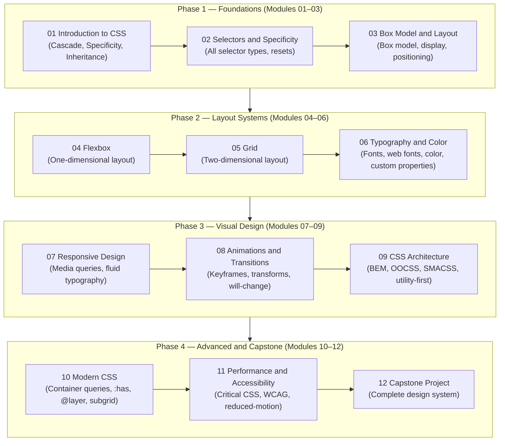

# Roadmap: CSS — Cascading Style Sheets

> This roadmap shows how the 12 modules are grouped into four phases, from foundational concepts to expert-level capstone work.

---

## Phase Overview

_Each phase builds directly on the previous. Do not skip phases — advanced CSS features become much harder to understand without the foundations._

---

## Phase Details

### Phase 1 — Foundations (Modules 01–03)

**Goal:** Understand how the browser reads and applies CSS, and master the mental models that all future work relies on.

| Module | Core Skills |
|--------|------------|
| 01 Introduction | Writing CSS rules, the cascade algorithm, specificity scoring, inheritance |
| 02 Selectors and Specificity | Type, class, ID, attribute, pseudo-class, pseudo-element, combinators, resets |
| 03 Box Model and Layout | Content/padding/border/margin, `box-sizing`, `display`, positioning contexts |

**Exit criteria:** You can style any HTML page from scratch — correct layout, no mystery spacing, predictable specificity.

---

### Phase 2 — Layout Systems (Modules 04–06)

**Goal:** Master the two modern layout algorithms (Flexbox and Grid) and the typography/colour toolkit.

| Module | Core Skills |
|--------|------------|
| 04 Flexbox | Flex container, flex items, axes, alignment, `flex-grow`/`shrink`/`basis`, wrapping |
| 05 Grid | Grid tracks, named areas, auto-placement, implicit vs. explicit grid, alignment |
| 06 Typography and Color | Font properties, `@font-face`, web fonts, `color`, `hsl()`, gradients, CSS custom properties |

**Exit criteria:** You can build any common layout (nav + sidebar + content, card grid, hero + footer) without floats.

---

### Phase 3 — Visual Design (Modules 07–09)

**Goal:** Make sites responsive, animated, and maintainable at scale.

| Module | Core Skills |
|--------|------------|
| 07 Responsive Design | Mobile-first, media queries, viewport units, `clamp()`, fluid images |
| 08 Animations and Transitions | `transition`, `@keyframes`, `transform`, `animation`, `will-change`, `prefers-reduced-motion` |
| 09 CSS Architecture | BEM, OOCSS, SMACSS, CSS Modules, utility-first (Tailwind concepts), naming conventions |

**Exit criteria:** You can build a production-quality responsive site with tasteful animation and an organised stylesheet.

---

### Phase 4 — Advanced and Capstone (Modules 10–12)

**Goal:** Work at expert level: use cutting-edge CSS features, optimise performance, and ship an accessible design system.

| Module | Core Skills |
|--------|------------|
| 10 Modern CSS | `@layer`, container queries, `:has()`, logical properties, subgrid, `@scope` |
| 11 Performance and Accessibility | Critical CSS, rendering pipeline, layout/paint/composite, WCAG colour contrast, `prefers-*` |
| 12 Capstone Project | Full responsive design system with dark mode, custom properties, and a11y compliance |

**Exit criteria:** You can architect, build, document, and audit a complete front-end design system independently.

---

## Learning Path Alternatives

| If you are... | Start at |
|---------------|----------|
| Complete beginner to CSS | Module 01 |
| Know basic CSS but struggle with layout | Module 03 or 04 |
| Comfortable with layout but want modern tools | Module 07 or 10 |
| Building a design system for a team | Module 09, with back-references |
| Auditing for performance or accessibility | Module 11 |
