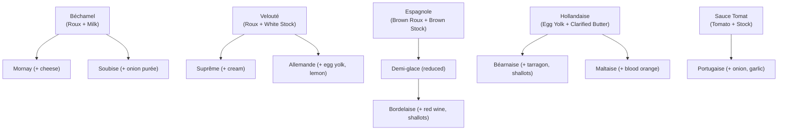

# Cheatsheet: Culinary Arts and Patisserie

> Quick-reference card for the most important cuts, sauces, ratios, and temperatures.
> Use this as a kitchen companion once you have studied the relevant modules in depth.

---

## Table of Contents

- [Knife Cuts Reference](#knife-cuts-reference)
- [The Five Mother Sauces](#the-five-mother-sauces)
- [Common Culinary Ratios](#common-culinary-ratios)
- [Safe Food Temperatures](#safe-food-temperatures)
- [Baker's Percentage Guide](#bakers-percentage-guide)
- [Chocolate Tempering Temperatures](#chocolate-tempering-temperatures)

---

## Knife Cuts Reference

| Cut | Dimensions | Description | Common Uses |
|-----|-----------|-------------|-------------|
| **Chiffonade** | Thin ribbons | Roll and slice leafy greens | Basil garnish, salad |
| **Mince** | < 1 mm | Very fine irregular chop | Garlic, shallots for sauces |
| **Brunoise** | 1–2 mm cube | Fine dice | Consommé garnish, fine mirepoix |
| **Small dice** | 6 mm cube | Standard fine dice | Soups, stuffings, salsa |
| **Medium dice** | 12 mm cube | Standard dice | Stews, braises |
| **Large dice** | 18–20 mm cube | Chunky dice | Roasted vegetables |
| **Julienne** | 3 × 3 × 60 mm | Matchstick strips | Stir-fries, garnish, slaw |
| **Batonnet** | 6 × 6 × 60 mm | Thick sticks | Crudités, fries |
| **Tourné** | 7-sided barrel | Football shape, 5–6 cm | Classical garnish, roast vegetables |

---

## The Five Mother Sauces

*The five mother sauces and representative derivatives*

---

## Common Culinary Ratios

### Sauce and Emulsion Ratios

| Preparation | Ratio | Notes |
|-------------|-------|-------|
| Vinaigrette (classic) | 3 parts oil : 1 part acid | Emulsify with mustard for stability |
| Roux (white) | 1 part butter : 1 part flour (by weight) | Cook 1–2 min, do not brown |
| Béchamel | 1 L milk : 60 g butter : 60 g flour | Season with nutmeg |
| Hollandaise | 3 egg yolks : 200 g clarified butter | ~67 g butter per yolk |
| Ganache (soft) | 1 : 1 cream to chocolate (by weight) | For sauces and glazes |
| Ganache (truffle) | 1 : 2 cream to chocolate (by weight) | For centres, hand-rolling |
| Ganache (firm) | 1 : 3 cream to chocolate (by weight) | For slicing, moulding |

### Stock Ratios (per litre of finished stock)

| Stock | Bones/Veg | Water | Aromatics |
|-------|-----------|-------|-----------|
| White chicken stock | 500 g bones | 2 L | Mirepoix, bouquet garni |
| Brown veal stock | 500 g bones (roasted) | 2 L | Mirepoix, tomato paste, bouquet garni |
| Fish stock (fumet) | 500 g fish bones | 1.5 L | White mirepoix, white wine |
| Vegetable stock | 500 g mixed veg | 2 L | Aromatics, no starch veg |

### Pastry Ratios

| Pastry | Flour | Fat | Liquid | Sugar |
|--------|-------|-----|--------|-------|
| Pâte brisée | 100% | 50% butter | 20–25% water | None |
| Pâte sucrée | 100% | 50% butter | 1–2 eggs per 500 g flour | 35% icing sugar |
| Pâte feuilletée | 100% | 100% butter (détrempe + beurrage) | 50% water | None |
| Choux pastry | 100% | 100% butter | 200% water | None |

---

## Safe Food Temperatures

| Protein | Safe Internal Temperature | Notes |
|---------|--------------------------|-------|
| Poultry (whole) | 74 °C (165 °F) | All parts, including stuffing |
| Poultry (ground) | 74 °C (165 °F) | |
| Beef, lamb, veal (whole cuts) | 63 °C (145 °F) + 3 min rest | Medium-rare; safe for intact cuts |
| Ground beef/pork | 71 °C (160 °F) | |
| Pork (whole cuts) | 63 °C (145 °F) + 3 min rest | |
| Fish | 63 °C (145 °F) | Or opaque and flakes easily |
| Custards and crème anglaise | 82–84 °C | Nappe stage; stop before scrambling |
| Hollandaise | 63–65 °C | Hold above 60 °C for service |

### Temperature Danger Zone

> [!WARNING]
> The **danger zone** for bacterial growth is **5 °C – 60 °C**.
> Do not leave perishable food in this range for more than 2 hours total.
> Use an instant-read thermometer — guessing temperatures is never safe.

---

## Baker's Percentage Guide

In baker's percentages, **flour is always 100%**. Every other ingredient is expressed as a
percentage of the total flour weight.

**Example — Basic White Bread:**

| Ingredient | Weight | Baker's % |
|-----------|--------|-----------|
| Flour | 500 g | 100% |
| Water | 350 g | 70% |
| Salt | 10 g | 2% |
| Instant yeast | 4 g | 0.8% |

To scale up: multiply all weights by the same factor.

**Common Hydration Levels:**

| Dough Type | Hydration (%) | Texture |
|-----------|--------------|---------|
| Bagels | 55–60% | Stiff, dense crumb |
| Sandwich bread | 60–65% | Soft, close crumb |
| Baguette | 65–70% | Open crumb, crisp crust |
| Ciabatta | 75–80% | Very open, irregular crumb |
| Sourdough (medium) | 70–75% | Open crumb, chewy |

---

## Chocolate Tempering Temperatures

| Chocolate Type | Melt To | Cool To | Reheat To |
|---------------|---------|---------|-----------|
| Dark (64–72% cacao) | 50–55 °C | 27–28 °C | 31–32 °C |
| Milk | 45–50 °C | 26–27 °C | 29–30 °C |
| White | 40–45 °C | 25–26 °C | 27–28 °C |

> [!TIP]
> These are target ranges, not exact points. An accurate digital thermometer and
> clean marble slab are essential for the tabling method. See Module 08 for the
> full tempering procedure.
