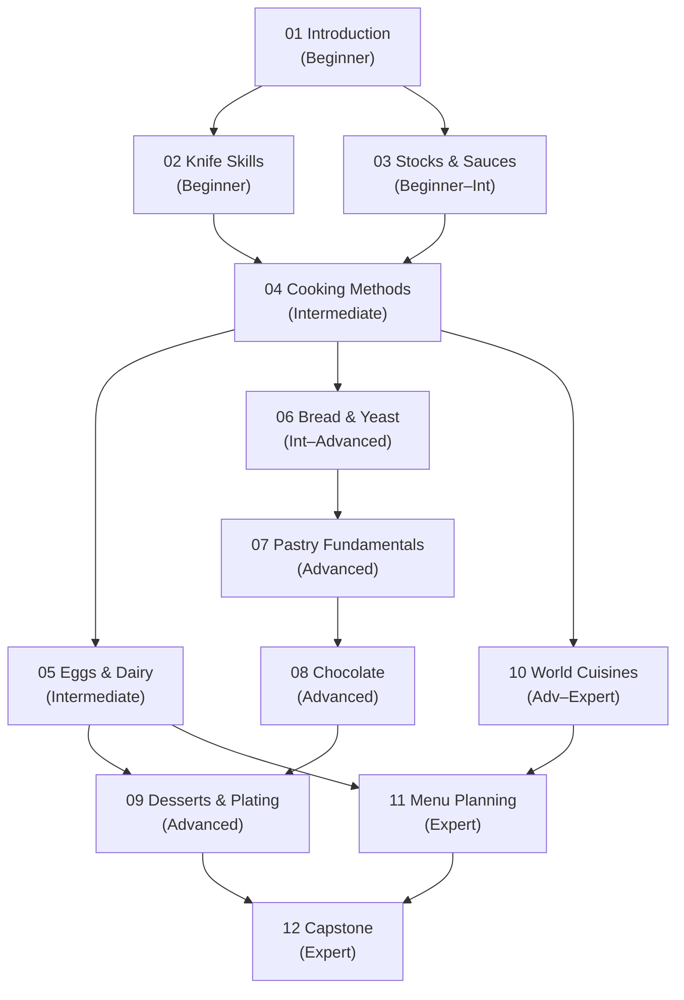

# Roadmap: Culinary Arts and Patisserie

> This document describes how the culinary-patisserie topic fits into broader learning paths
> and suggests routes through the material based on your goals.

---

## Table of Contents

- [Learning Paths](#learning-paths)
- [Module Dependencies](#module-dependencies)
- [Suggested Schedules](#suggested-schedules)
- [What Comes Next](#what-comes-next)

---

## Learning Paths

### Path A: The Complete Professional Foundation (all 12 modules)

Follow every module in order. Designed for learners who want a thorough professional-level
grounding in both cuisine and patisserie, culminating in the 4-course tasting menu capstone.

**Timeline:** 12–16 weeks at 6–8 hours/week

### Path B: Savory Focus (Modules 01–05, 10, 11, 12)

Skip the patisserie-heavy modules (06–09) and focus on classical cooking technique, stocks,
sauces, cooking methods, eggs, world cuisines, and menu planning. Still ends with the capstone.

**Timeline:** 8–10 weeks

### Path C: Pastry and Confectionery Specialist (Modules 01–03, 06–09, 12)

Focus on bread, pastry, chocolate, and desserts. Modules 01–03 provide essential foundation;
Modules 06–09 are the core patisserie track.

**Timeline:** 8–10 weeks

### Path D: Quick Foundations (Modules 01–04)

A condensed path covering kitchen setup, knife skills, stocks/sauces, and cooking methods.
Gives a solid practical foundation for everyday cooking without the full professional arc.

**Timeline:** 4–5 weeks

---

## Module Dependencies

*Module dependency graph — arrows indicate "must complete before"*

---

## Suggested Schedules

### 12-Week Schedule (Full Path)

| Week | Modules | Focus |
|------|---------|-------|
| 1 | 01 | Kitchen orientation, mise en place, tools, heat |
| 2 | 02 | Knife skills — all 7 cuts, daily practice |
| 3 | 03 | Stocks — make a white stock and a brown stock |
| 4 | 03 | Mother sauces — béchamel, velouté, espagnole |
| 5 | 04 | Dry heat cooking methods + roast a chicken |
| 6 | 04–05 | Moist heat methods + egg techniques |
| 7 | 06 | Bread science + bake a simple loaf |
| 8 | 07 | Short pastry and sweet pastry |
| 9 | 07–08 | Laminated dough + begin chocolate tempering |
| 10 | 09–10 | Desserts, plating, and world cuisine survey |
| 11 | 11 | Menu planning, food costing, recipe cards |
| 12 | 12 | Capstone project: design and execute tasting menu |

---

## What Comes Next

After completing this topic, consider exploring:

- **Nutrition and Dietetics** — applying culinary knowledge to clinical or wellness contexts
- **Food Business and Entrepreneurship** — opening a restaurant, catering business, or food brand
- **Advanced Fermentation** — sourdough culture, cheese-making, charcuterie
- **Modernist Techniques** — sous vide, spherification, hydrocolloids (Modules 06–08 prepare you well)
- **Wine and Beverage Pairing** — the natural complement to a tasting menu
