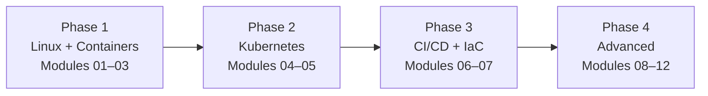

# Roadmap: DevOps and Platform Engineering

> This document outlines the four learning phases in this topic, how this topic fits into broader learning paths, and what you can do after completing it.

---

## Table of Contents

- [Learning Phases](#learning-phases)
- [Phase 1: Linux and Containers](#phase-1-linux-and-containers)
- [Phase 2: Kubernetes](#phase-2-kubernetes)
- [Phase 3: CI/CD and Infrastructure as Code](#phase-3-cicd-and-infrastructure-as-code)
- [Phase 4: Advanced — Observability, GitOps, Platform Engineering, Security](#phase-4-advanced)
- [Where This Topic Leads](#where-this-topic-leads)

---

## Learning Phases

This topic is organized into four progressive phases. Each phase builds on the previous and unlocks the next level of practice.

*Four phases from foundational culture and Linux skills to full Platform Engineering capability.*

---

## Phase 1: Linux and Containers

**Modules:** 01 (Introduction), 02 (Linux and Shell), 03 (Containers)

**Goal:** Establish the cultural foundation and core operational building blocks. By the end of Phase 1 you can write bash scripts, manage Linux systems, build Docker images, and run multi-container applications locally.

**Key skills unlocked:**
- Understanding DevOps culture and organizational dynamics
- Linux filesystem, process, and user management
- Bash scripting for automation
- Docker image building, running, and registries
- Docker Compose for local multi-service development

**Checkpoint:** Can you write a Dockerfile for a web application, build and push it to a registry, and run it locally with docker compose?

---

## Phase 2: Kubernetes

**Modules:** 04 (Kubernetes Fundamentals), 05 (Kubernetes Advanced)

**Goal:** Move from running containers locally to operating them at scale in a cluster. By the end of Phase 2 you can deploy, scale, expose, and operate applications on Kubernetes with proper RBAC, networking policies, and custom operators.

**Key skills unlocked:**
- Deploying and managing Pods, Deployments, and StatefulSets
- Exposing services with Services and Ingress
- Managing configuration with ConfigMaps and Secrets
- Namespace-based multi-tenancy and RBAC
- Horizontal and Vertical Pod Autoscaling
- Custom Resource Definitions and Operator pattern

**Checkpoint:** Can you deploy a production-grade application on Kubernetes with proper RBAC, resource limits, health checks, and network policies?

---

## Phase 3: CI/CD and Infrastructure as Code

**Modules:** 06 (CI/CD Pipelines), 07 (Infrastructure as Code)

**Goal:** Automate the path from code commit to production deployment, and describe all infrastructure in version-controlled code. By the end of Phase 3 you can build end-to-end CI/CD pipelines and provision cloud infrastructure using Terraform.

**Key skills unlocked:**
- GitHub Actions and GitLab CI/CD pipeline design
- Secrets management in pipelines
- Environment-based deployments with approvals
- Terraform provider, resource, state, and module management
- Drift detection and infrastructure testing
- IaC best practices (DRY, module boundaries, state isolation)

**Checkpoint:** Can you write a complete CI/CD pipeline that builds, tests, scans, and deploys an application, with infrastructure provisioned via Terraform?

---

## Phase 4: Advanced

**Modules:** 08 (Observability), 09 (GitOps and Delivery), 10 (Platform APIs and IDP), 11 (Security and Compliance), 12 (Capstone Project)

**Goal:** Master the advanced disciplines that separate good practitioners from elite ones — deep observability, GitOps-based delivery, Internal Developer Platforms, and supply chain security. Culminates in the Capstone Project where you build a real IDP.

**Key skills unlocked:**
- Prometheus metrics and Grafana dashboards
- OpenTelemetry distributed tracing
- SLO/SLI definition and alerting
- ArgoCD and Flux GitOps workflows
- Progressive delivery (canary, blue-green, Argo Rollouts)
- Backstage service catalog and scaffolding
- SBOM generation, Cosign image signing, Trivy scanning
- OPA/Gatekeeper policy enforcement
- HashiCorp Vault secrets management

**Checkpoint:** The Capstone Project — design and implement a complete IDP.

---

## Where This Topic Leads

After completing this topic, you are ready for:

- **[[networks]]** — deep networking knowledge is required for advanced Kubernetes networking, service mesh configuration, and eBPF-based observability
- **[[qa-testing]]** — advanced testing in the pipeline: contract testing, chaos engineering integration, load testing in CI
- **[[feature-flags-monitoring]]** — production-level feature management: experimentation platforms, gradual rollouts, and A/B testing infrastructure

**Career paths this topic enables:**
- DevOps Engineer / DevOps Lead
- Platform Engineer / Staff Platform Engineer
- Site Reliability Engineer (SRE) / Senior SRE
- Cloud Infrastructure Engineer
- Software Architect (cloud-native focus)
