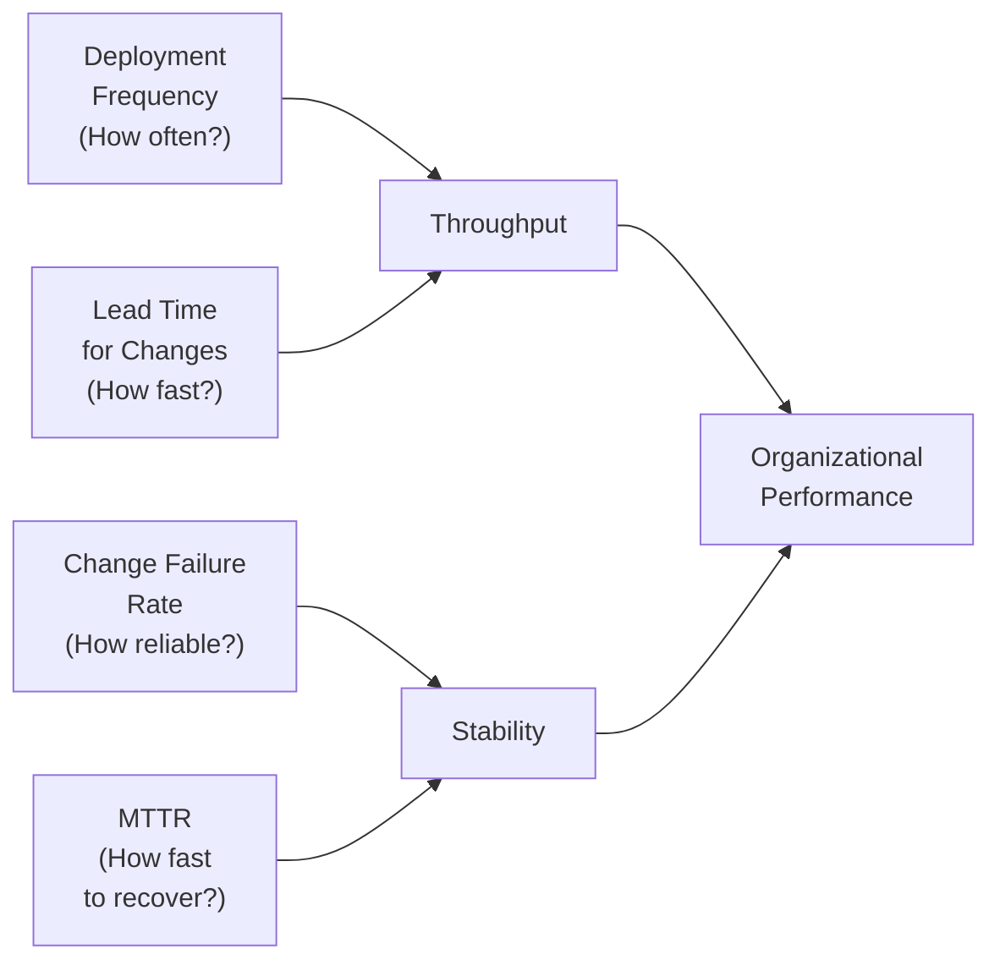
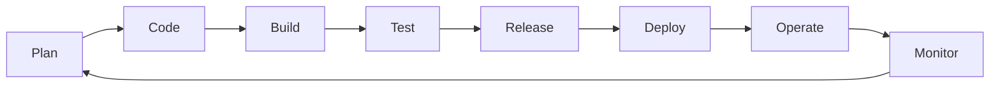

# Module 01: Introduction to DevOps and Platform Engineering

[← Topic Home](../../README.md) | [Next → Module 02: Linux and Shell](../02_linux-and-shell/)

---


> DevOps is a cultural and organizational movement, not a job title or a toolset. This module explains where it came from, why it exists, how to measure it, and where Platform Engineering is taking it next.

---

## Table of Contents

1. [Overview](#overview)
2. [Prerequisites](#prerequisites)
3. [Objectives](#objectives)
4. [Theory](#theory)
5. [Key Concepts](#key-concepts)
6. [Examples](#examples)
7. [Common Pitfalls](#common-pitfalls)
8. [Cross-Links](#cross-links)
9. [Summary](#summary)

---

## Overview

This module is intentionally light on tools and heavy on understanding. Every topic in DevOps and Platform Engineering — containers, Kubernetes, CI/CD, IaC — is a tool that serves a purpose. Before picking up those tools, you need to understand what problem they are solving and why that problem matters.

The central problem DevOps addresses is the organizational and technical dysfunction that emerges when the people who write software are systematically separated from the people who run it. This separation produces slow delivery, fragile systems, adversarial team dynamics, and high failure rates when deploying changes. DevOps is a systematic response to this dysfunction: a body of culture, practices, and measurement frameworks that make software delivery fast, reliable, and continuously improving.

By the end of this module, you will have a clear mental model of DevOps culture, a working understanding of the DORA metrics used to measure it, and an appreciation for how Platform Engineering has evolved the original DevOps insight into something that scales across large organizations. None of this requires a laptop, a cloud account, or any installed software. Read carefully — these foundations will make everything that follows in the topic make much more sense.

---

## Prerequisites

No technical prerequisites for this module. If you have worked in software development or IT operations, this will connect to things you have already experienced. If you are new to both, the module is designed to be self-contained.

- No prior modules required
- No software installation required
- General familiarity with how software is built and deployed is helpful but not required

---

## Objectives

By the end of this module, you will be able to:

1. Explain the "wall of confusion" between development and operations teams and why it produces slow, unreliable software delivery
2. Describe the Three Ways of DevOps (Flow, Feedback, Continuous Improvement) and give a concrete example of each
3. Name and define the four DORA key metrics and explain why elite performers outperform low performers by orders of magnitude
4. Sketch the DevOps toolchain from planning to monitoring and name a representative tool for each stage
5. Distinguish between DevOps (cultural movement), SRE (Google's implementation), and Platform Engineering (the 2020s evolution)
6. Identify the key failure modes of organizations that "do DevOps" without genuinely adopting its cultural foundations
7. Write a minimal bash script demonstrating basic automation — the first step toward eliminating manual toil

---

## Theory

### The DevOps Movement: Origins and Philosophy

The word "DevOps" was coined in 2009, but the problem it names is as old as organized software development. For most of computing history, organizations divided software work into two fundamentally separate functions: **Development** (writing new features and fixing bugs) and **Operations** (running the production systems that deliver those features to users). These teams had different goals, different incentives, different schedules, and different cultures.

Development teams were measured on velocity — how many features shipped, how quickly new code landed. Operations teams were measured on stability — uptime, mean time between failures, change management compliance. The incentives were structurally opposed. A developer's job was to change things; an operator's job was to keep things from changing. The result was the "**wall of confusion**": developers threw code over the fence to operations, operations deployed it reluctantly and slowly, and when things broke (as they inevitably did) each side blamed the other.

The wall was not a personal failure — it was a **system failure**. The organizational structure itself created the adversarial dynamic, and no amount of goodwill between individuals could overcome the incentive misalignment built into the system.

The 2009 Velocity Conference talk by John Allspaw and Paul Hammond, titled "10+ Deploys Per Day: Dev and Ops Cooperation at Flickr," was a watershed moment. Allspaw and Hammond demonstrated that Flickr was deploying code to production over ten times per day — and that high deployment frequency and high operational stability were not opposites. They were complementary. The key was shared ownership: developers and operators shared responsibility for production, tools for shared visibility, and a culture that treated production issues as learning opportunities rather than blame events.

Patrick Debois, a Belgian developer who had attended the talk, organized the first **DevOpsDays** conference in Ghent, Belgium in October 2009. The portmanteau "DevOps" appeared in the conference hashtag and stuck. The movement had its name.

The theoretical foundation was formalized in Gene Kim's work. His 2013 business novel **The Phoenix Project** dramatized a manufacturing executive's insight — borrowed from Eliyahu Goldratt's Theory of Constraints — applied to software delivery. The factory floor analogy made the dysfunction visible: work piling up in queues, handoffs between departments causing delays, no visibility into where work was stuck, and firefighting masking the underlying problems.

### Key Principles: The Three Ways

Gene Kim distilled DevOps into three foundational principles, called the **Three Ways**, in The Phoenix Project and The DevOps Handbook (2016):

**The First Way: Flow**

Optimize the flow of work from left to right — from business idea to running production code. Work flows through four stages: business (plan), development (code, build, test), operations (release, deploy, operate), and the customer (monitor). Every practice that accelerates this flow — automated testing, continuous integration, deployment pipelines, feature flags — embodies the First Way.

The practical insight: large batches of work are the enemy of flow. If you deploy once per quarter, you accumulate months of changes in each deployment, making debugging impossibly complex and rollbacks terrifying. If you deploy fifty times per day in small batches, each deployment is trivially small, failures are easy to diagnose, and rollbacks are fast.

**The Second Way: Feedback**

Create fast, constant feedback loops flowing right to left — from production back to development. Without feedback, problems discovered late (in production, by customers) are far more expensive to fix than problems discovered early (by tests, by monitoring, by code review). The Second Way is why we instrument applications, write automated tests, do code review, run chaos experiments, and hold blameless postmortems.

The practical insight: every handoff is a potential feedback delay. When a developer pushes code that breaks a test, they find out within minutes if CI runs immediately, or within days if tests only run before quarterly releases. The faster the feedback, the cheaper the fix.

**The Third Way: Continuous Improvement**

Create a culture of experimentation, learning, and continual improvement. Organizations that survive and thrive are the ones that learn faster than their problems accumulate. This means treating failures as learning opportunities (blameless postmortems, not blame), allocating time for improvement (not just feature work), and making the work and its problems visible to everyone.

The practical insight: without the Third Way, technical debt accumulates silently until it produces catastrophic failure. Teams that never have time to improve their processes are condemned to repeat the same failures indefinitely.

### DORA Metrics: Measuring DevOps Performance

Culture is hard to measure. But software delivery outcomes are measurable. Dr. Nicole Forsgren, Jez Humble, and Gene Kim spent years conducting rigorous empirical research through the DORA (DevOps Research and Assessment) program. Their findings, published in the 2018 book **Accelerate**, are the most credible quantitative evidence available for which engineering practices actually drive organizational performance.

DORA identified four key metrics that distinguish high-performing from low-performing software delivery organizations:

**1. Deployment Frequency** — How often does your organization successfully release to production?

Elite performers deploy multiple times per day. Low performers deploy less than once per month. This is not merely a cultural preference — frequent deployment is a consequence of small batch sizes, automated pipelines, and high confidence in the release process.

**2. Lead Time for Changes** — How long does it take to go from code committed to code successfully running in production?

Elite performers achieve this in less than one hour. Low performers take more than six months. Lead time encompasses the entire path: code review time, build time, test time, deployment time, and approval processes.

**3. Change Failure Rate** — What percentage of production deployments cause a degradation or outage requiring remediation?

Elite performers have a failure rate of 0–15%. The DORA research found that elite performers do not achieve low failure rates by deploying less — they achieve it by deploying more (small batches, with automated testing and rollback capability).

**4. Time to Restore Service (MTTR)** — How long does it take to recover from a production failure?

Elite performers restore service in less than one hour. Low performers take more than six months. Fast recovery requires good monitoring (fast detection), clear runbooks (fast diagnosis), and reliable rollback mechanisms (fast remediation).

The DORA research consistently finds that elite performers — those who excel on all four metrics — also outperform on commercial outcomes: profitability, market share, productivity, and employee satisfaction. DevOps is not just an engineering preference; it is a competitive advantage.



*DORA's model: throughput and stability are not in tension — high performers achieve both simultaneously.*

### The DevOps Toolchain Overview

DevOps is often visualized as a continuous loop — sometimes called the "infinity loop" — with development on the left and operations on the right. Every stage in this loop has a representative set of tools:



*The DevOps lifecycle: a continuous loop from planning through monitoring and back to planning.*

| Stage | Purpose | Example Tools |
|-------|---------|---------------|
| **Plan** | Track work, prioritize features, manage backlogs | Jira, Linear, GitHub Issues |
| **Code** | Write and review code | Git, GitHub, GitLab |
| **Build** | Compile, package, containerize | Maven, Gradle, Docker |
| **Test** | Automated testing at multiple levels | JUnit, pytest, Playwright, k6 |
| **Release** | Version, tag, sign artifacts | Semantic Versioning, Cosign |
| **Deploy** | Push to environments | kubectl, Helm, ArgoCD, Flux |
| **Operate** | Run, scale, recover from failures | Kubernetes, systemd, PagerDuty |
| **Monitor** | Observe, alert, understand behavior | Prometheus, Grafana, OTel, Datadog |

A key principle: **automation connects the stages**. CI/CD pipelines (covered in Module 06) are the automated assembly lines that move work from Code through to Deploy without manual intervention. Without automation, each handoff introduces delay and opportunity for human error.

### Shell Automation: Your First Step Toward Toil Elimination

The SRE model introduces the concept of **toil** — work that is manual, repetitive, automatable, and produces no lasting value. Writing a deployment script once produces lasting value. Running that same manual deployment procedure every week is toil. DevOps culture demands that toil be identified and eliminated through automation.

Bash scripting is the first tool in this war on toil. Here is a minimal but practical example:

```bash
#!/usr/bin/env bash
# check-services.sh — Report the status of critical services
# Usage: ./check-services.sh [service1 service2 ...]
# Example: ./check-services.sh nginx postgresql redis

set -euo pipefail  # fail on errors, unset vars; catch pipeline failures

# Default services to check if none specified
DEFAULT_SERVICES=(nginx postgresql redis)
SERVICES=("${@:-${DEFAULT_SERVICES[@]}}")

# ANSI color codes for readable output
RED='\033[0;31m'
GREEN='\033[0;32m'
NC='\033[0m'  # No Color

echo "=== Service Health Check: $(date -u +%Y-%m-%dT%H:%M:%SZ) ==="
echo ""

FAILED=0

for service in "${SERVICES[@]}"; do
    # systemctl is-active returns 0 if active, non-zero otherwise
    if systemctl is-active --quiet "$service" 2>/dev/null; then
        echo -e "  ${GREEN}✓${NC} $service — active"
    else
        echo -e "  ${RED}✗${NC} $service — NOT active"
        FAILED=$((FAILED + 1))
    fi
done

echo ""
echo "=== Result: $((${#SERVICES[@]} - FAILED))/${#SERVICES[@]} services healthy ==="

# Exit with non-zero status if any service is down
# This allows the script to be used in CI/CD pipelines
exit $FAILED
```

Notice the structure:
- `set -euo pipefail` — the safety net that makes bash scripts predictable (covered deeply in Module 02)
- Parameterized inputs with sane defaults — good scripts are reusable
- Color-coded output for human readability
- Meaningful exit codes — the script can be used in pipelines that fail automatically on unhealthy services

This is the beginning of toil elimination. As you work through this topic, the scripts get more sophisticated — deploying applications, provisioning infrastructure, and orchestrating entire environments.

### Platform Engineering: The Next Evolution

By the mid-2010s, organizations that had adopted DevOps at scale were encountering a new problem. The "you build it, you run it" model — where every team owns its own deployment, monitoring, and infrastructure — produced enormous autonomy but also enormous cognitive load. Every team had to become expert in Kubernetes, Terraform, Prometheus, CI/CD configuration, security scanning, and a dozen other tools. Teams spent enormous energy solving the same infrastructure problems repeatedly rather than focusing on their product.

**Platform Engineering** emerged as the answer: build a team whose product is the internal developer experience. The Platform Engineering team (or "Platform team") creates and maintains an **Internal Developer Platform (IDP)** — a self-service set of tools, workflows, APIs, and documentation that gives application teams "golden paths" to production.

A golden path is a pre-built, opinionated, well-supported route to accomplishing something. Instead of every team figuring out how to build and deploy a microservice, the Platform team builds a service template (scaffolding) that creates a new repository with CI/CD, observability, and Kubernetes manifests pre-configured. The application team fills in their business logic; the infrastructure concerns are handled by the platform.

```bash
# Example: platform-provided CLI tool that creates a new service
# (this is the kind of self-service tool a Platform team would build)
platform new-service \
    --name payment-processor \
    --language go \
    --team billing \
    --tier critical

# The platform tool:
# 1. Creates a GitHub repository from a template
# 2. Sets up CI/CD pipelines with security scanning
# 3. Creates Kubernetes namespaces and RBAC
# 4. Configures monitoring dashboards and alerts
# 5. Registers the service in the service catalog (Backstage)
# 6. Creates a runbook template

echo "Service payment-processor created. Repository: https://github.com/org/payment-processor"
echo "Dashboard: https://grafana.internal/d/payment-processor"
echo "Catalog: https://backstage.internal/catalog/payment-processor"
```

The key insight behind Platform Engineering is **cognitive load reduction**. Research by Matthew Skelton and Manuel Pais in **Team Topologies** (2019) identifies cognitive load as the primary constraint on team productivity. When teams carry too much cognitive load — understanding too many complex systems — they become slow and make more mistakes. Platforms reduce cognitive load by encapsulating complexity behind simple, self-service interfaces.

The evolution from traditional ops to DevOps to SRE to Platform Engineering represents a progressive shift in how organizations think about the relationship between development and operations:

| Era | Model | Key Question |
|-----|-------|-------------|
| Pre-DevOps | Separate Dev and Ops | "Who is responsible when things break?" |
| DevOps | Shared ownership | "How do we ship and operate together?" |
| SRE | Engineering operations | "How do we apply software engineering to ops?" |
| Platform Engineering | Internal product | "How do we build platforms that make all teams faster?" |

---

## Key Concepts

**Wall of Confusion**
The organizational dysfunction produced by separating development (incentivized to change things) from operations (incentivized to keep things stable). Results in slow delivery, high failure rates, and adversarial team dynamics. DevOps dismantles this wall through shared ownership, shared tools, and shared incentives.

**Three Ways**
Gene Kim's framework for DevOps culture. First Way: optimize flow from development to production (left to right). Second Way: create fast feedback loops from production to development (right to left). Third Way: build a culture of continuous experimentation and learning. See [[shared/glossary#three-ways]] for the extended definition.

**DORA Metrics**
Four empirically validated metrics — Deployment Frequency, Lead Time for Changes, Change Failure Rate, and MTTR — that predict organizational software delivery performance. From the DORA research program, published in *Accelerate* (2018). See [[devops-platform-engineering/GLOSSARY#dora-metrics]].

**Error Budget**
The quantified amount of unreliability an SRE team is allowed to consume before an SLO is violated. If your SLO is 99.9% availability, your error budget is 0.1% of the measurement period — about 43 minutes per month. Spending the error budget on risky deployments is acceptable when it's full; when it's exhausted, stability work takes priority over feature work.

**Toil**
Work that is manual, repetitive, automatable, tactical, and produces no lasting improvement. Defined by Google SRE. Toil is the enemy of engineering quality. SRE teams track their toil percentage and set a target (Google's is < 50% of SRE time spent on toil) to ensure engineering work is not crowded out.

**Golden Path (or Paved Road)**
A pre-built, opinionated, well-supported route to accomplishing a common task in a Platform Engineering context. A golden path for "deploy a new microservice" might be a scaffolding template that creates a repository, CI/CD pipeline, Kubernetes manifests, and monitoring setup with one command. Teams can deviate from the golden path, but it requires deliberate effort — the path of least resistance leads to good outcomes by default.

**Cognitive Load**
In Team Topologies, the total mental effort required for a team to do its work. Platform Engineering reduces cognitive load by hiding infrastructure complexity behind self-service interfaces. A team that must understand Kubernetes, Terraform, Prometheus, Vault, and Cosign just to deploy a web service has excessive cognitive load; a platform that abstracts these into simple workflows reduces it.

**Conway's Law**
"Organizations which design systems are constrained to produce designs which are copies of the communication structures of these organizations." — Melvin Conway, 1968. Relevant to Platform Engineering: the architecture of your systems will mirror your team structure. Platform teams building shared infrastructure create centralized, shared systems; autonomous feature teams create autonomous, decentralized systems.

---

## Examples

### Example 1: The Cost of Infrequent Deployments

**Scenario:** A team deploys to production once per quarter. Each quarterly deployment accumulates 3 months of changes from 10 developers.

**Problem:**

```bash
# Imagine each commit represents one change:
# Quarterly deployment contains ~500 changes
git log --oneline origin/production..main | wc -l
# Output: 487

# When something breaks after this deployment, you must:
# 1. Identify which of 487 changes caused the issue
# 2. Determine if you can roll back (3 months of unreleasable work)
# 3. Cherry-pick a fix without breaking the other 486 changes
# MTTR: days to weeks
```

**Comparison — daily small-batch deployment:**

```bash
# Each deployment contains 1-3 changes
git log --oneline origin/production..main | wc -l
# Output: 2

# When something breaks:
# 1. You know it was one of 2 changes
# 2. You can roll back trivially (only 2 changes to revert)
# git revert HEAD~1
# MTTR: minutes
```

**What to notice:** The relationship between batch size and MTTR is not linear — small batches make the entire problem tractable. This is why Deployment Frequency is both an input metric (a practice to adopt) and an output metric (a consequence of good practices).

---

### Example 2: A Blameless Postmortem Structure

**Scenario:** A production outage occurred for 47 minutes when a configuration change caused all API servers to restart simultaneously.

**Blame culture response (what NOT to do):**

```
Incident report:
Root cause: Engineer Alice deployed a config change without testing.
Action item: Alice to complete deployment training.
```

**Blameless culture response (the DevOps model):**

```markdown
## Incident Review: API Outage 2026-05-15

**Duration:** 14:32–15:19 UTC (47 minutes)
**Impact:** 100% of API requests failed; 12,000 users affected

### Timeline
- 14:30: Config change deployed via standard process
- 14:32: Monitoring alerts fire — all API pods restarting
- 14:38: On-call engineer paged and acknowledges
- 14:45: Root cause identified (rolling restart config missing)
- 15:19: Fix deployed; service restored

### Root Cause
The deployment process did not enforce a maxUnavailable limit in the
Deployment spec. All 20 replicas restarted simultaneously.

### Contributing Factors (NOT individual blame)
1. The Deployment spec template did not include rolling update configuration
2. The staging environment runs only 2 replicas, masking the issue
3. No automated check validated the rolling update config before deploy

### Action Items
1. Add rollingUpdate strategy to all Deployment templates [Platform team, P1]
2. Scale staging to match production replica count [Infra team, P2]
3. Add OPA policy to reject Deployments missing rolling update config [Platform, P2]
```

**What to notice:** Blameless postmortems look for systemic failures in process, tooling, and configuration — not individual failures. The same error is made by different people in the same broken system. Fix the system, not the person.

---

### Example 3: Measuring Your DORA Metrics

**Scenario:** You want to calculate your team's DORA metrics from git and deployment history.

```bash
#!/usr/bin/env bash
# dora-metrics.sh — Calculate approximate DORA metrics from git history
# This is illustrative; production implementations use proper telemetry

# Deployment frequency: count production deploys in last 30 days
echo "=== Deployment Frequency (last 30 days) ==="
git log --oneline --after="30 days ago" --grep="deploy to production" | wc -l
# Divide by 30 to get deploys/day

# Lead time: time from first commit to deploy tag (simplified)
echo ""
echo "=== Lead Time Estimate ==="
# Get the last deploy tag
LAST_DEPLOY=$(git describe --tags --match="deploy-*" --abbrev=0 2>/dev/null)
if [[ -n "$LAST_DEPLOY" ]]; then
    DEPLOY_TIME=$(git log -1 --format="%ct" "$LAST_DEPLOY")
    # Get the earliest commit in this deploy (since previous deploy)
    PREV_DEPLOY=$(git describe --tags --match="deploy-*" --abbrev=0 "${LAST_DEPLOY}^" 2>/dev/null)
    if [[ -n "$PREV_DEPLOY" ]]; then
        FIRST_COMMIT_TIME=$(git log --format="%ct" "${PREV_DEPLOY}..${LAST_DEPLOY}" | tail -1)
        LEAD_TIME_HOURS=$(( (DEPLOY_TIME - FIRST_COMMIT_TIME) / 3600 ))
        echo "  Lead time for last deploy: ${LEAD_TIME_HOURS} hours"
    fi
fi

echo ""
echo "=== Note ==="
echo "  Change Failure Rate and MTTR require incident tracking data."
echo "  Integrate with your incident management tool (PagerDuty, OpsGenie)"
echo "  for accurate measurements."
```

**What to notice:** Real DORA metric tracking requires integrating data from multiple systems — version control, deployment systems, incident management. Tools like DORA Metrics by Google Cloud, Sleuth, or LinearB automate this collection.

---

## Common Pitfalls

### Pitfall 1: Treating DevOps as a Job Title or Team Name

**The mistake:** Creating a "DevOps team" responsible for CI/CD, Kubernetes, and deployments — while development teams continue to throw code over the fence to the DevOps team instead of operations.

```bash
# Wrong organizational model:
# Team: DevOps
# Responsibilities: "All the DevOps stuff"
# What actually happens: DevOps becomes the new operations silo
# Developers still don't own production; they just have a new wall

# Correct model: "DevOps" describes how teams work, not what team name is
# Development teams own their production services
# Platform team provides tools and golden paths
# SRE team provides reliability engineering expertise
```

**Why this happens:** "DevOps" is visible and tooling-shaped. It is much easier to hire a "DevOps engineer" to manage Kubernetes than to transform organizational culture. But cultural transformation is the actual work.

**How to avoid it:** DevOps is an organizational design and cultural pattern. Start by measuring DORA metrics for your team — if deployment frequency is low and lead time is high, identify the bottlenecks in your current delivery process before introducing new tools.

---

### Pitfall 2: DevOps Theater — Adopting the Ceremonies Without the Culture

**The mistake:** Running daily standups, using Jira for "sprints," deploying to "staging environments," and having "on-call rotations" — but not addressing the actual constraints in the delivery system.

**Wrong:**
```yaml
# Dockerfile that takes 45 minutes to build because it doesn't use layer caching
# Nobody addressed this because "we have CI/CD" ✓
FROM ubuntu:22.04
RUN apt-get update
RUN apt-get install -y python3 python3-pip
COPY . /app
RUN pip install -r /app/requirements.txt   # always re-installs all deps
RUN python -m pytest                        # tests run inside Docker layer
```

**Right:**
```dockerfile
FROM python:3.12-slim
WORKDIR /app
# Copy dependency file first — this layer is cached unless requirements.txt changes
COPY requirements.txt .
RUN pip install --no-cache-dir -r requirements.txt
# Copy source code last — this layer only invalidates on source changes
COPY . .
# Tests run in CI pipeline, not in the Docker build
```

**Why this happens:** Visible activities (standups, Jira boards, CI/CD pipelines) are easy to implement and signal progress without requiring hard organizational changes. Real DevOps transformation requires changing incentive structures, ownership models, and funding allocation — all of which are political and slow.

---

### Pitfall 3: Confusing "Automation" with "DevOps"

**The mistake:** Automating a broken process makes the broken process run faster, not better. Teams automate their existing dysfunctional workflow (slow tests, manual approvals, separate deployment teams) without questioning the workflow itself.

**Wrong approach:** Automate the 47-step manual deployment procedure.

```bash
# 47-step automated deployment script — automation of dysfunction
#!/bin/bash
# Step 1: Email the release management team
send_email "release-management@company.com" "Requesting deploy slot"
# Step 2: Wait for approval email (polling loop for 48 hours max)
wait_for_email_approval "release-approved"
# Step 3: Create change ticket in ServiceNow
create_change_ticket
# ... 44 more steps ...
```

**Right approach:** Question whether the 47 steps are necessary. Which add value? Which exist as organizational scar tissue? A CI/CD pipeline should be 5–10 steps, not 47.

**How to avoid it:** Apply Value Stream Mapping. Walk through your entire delivery process from idea to production and mark each step as value-adding (customer cares about it) or waste (internal process overhead). Eliminate or automate the waste before automating the whole process.

---

### Pitfall 4: Skipping Observability

**The mistake:** Building a complete CI/CD pipeline and deploying to production without implementing observability (metrics, logs, traces). Teams discover problems from customer complaints or when the application crashes, not from monitoring alerts.

**Wrong:**
```bash
# Deploy and hope
kubectl apply -f deployment.yaml
echo "Deployed! Let's see if anything breaks."
```

**Right:**
```bash
# Deploy with confidence: monitoring is configured before the deploy
kubectl apply -f deployment.yaml

# Verify deployment health via metrics, not guessing
kubectl rollout status deployment/myapp

# Check the dashboard for anomalies in the post-deploy window
echo "Deployment complete. Monitor: https://grafana.internal/d/myapp"
echo "Error rate and latency should be stable within 5 minutes."
echo "Rollback command if needed: kubectl rollout undo deployment/myapp"
```

**Why this matters:** Without observability, you are flying blind. You cannot make data-driven decisions about reliability, you cannot calculate your DORA MTTR metric accurately, and you cannot practice chaos engineering safely.

---

## Cross-Links

- [[networks]] — Kubernetes networking, ingress, service meshes, and DNS all build on TCP/IP and HTTP fundamentals covered in the networks topic
- [[qa-testing]] — The Second Way (Feedback) relies heavily on automated testing; CI pipelines integrate unit, integration, and end-to-end testing directly
- [[feature-flags-monitoring]] — Feature flags are a critical technique for progressive delivery and safe production experimentation; they complement the GitOps and CD pipelines covered in Module 09

---

## Summary

- **DevOps is a cultural movement** born from the "wall of confusion" between development and operations teams with misaligned incentives. It is not a job title, a team, or a toolset.

- **The Three Ways** — Flow (optimize left-to-right delivery), Feedback (create fast right-to-left feedback loops), and Continuous Improvement (build a learning culture) — are the foundational framework for all DevOps practices.

- **DORA metrics** — Deployment Frequency, Lead Time for Changes, Change Failure Rate, and MTTR — are the four empirically validated measures of software delivery performance. Elite performers outperform low performers by orders of magnitude on all four simultaneously.

- **The DevOps toolchain** spans eight stages — Plan, Code, Build, Test, Release, Deploy, Operate, Monitor — with automation (CI/CD pipelines) connecting the stages.

- **SRE** is Google's concrete implementation of DevOps: engineering operations the same way software is engineered, using SLOs, error budgets, and toil elimination.

- **Platform Engineering** is the 2020s evolution: build an Internal Developer Platform with golden paths that reduce cognitive load on application teams, encoding best practices into self-service tooling rather than tribal knowledge.

- **The primary failure modes** of DevOps adoption are: treating it as a job title (new ops silo), DevOps theater (adopting ceremonies without culture change), automating broken processes rather than fixing them, and skipping observability.

- **Shell automation** is the starting point for eliminating toil — every manual repetitive process is a candidate for a script, and every script is a step toward a fully automated delivery pipeline.
