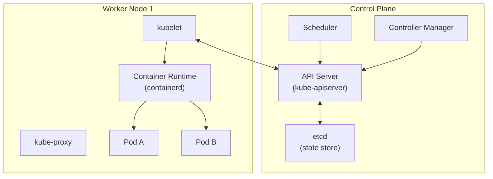

# Module 04: Kubernetes Fundamentals

[← Module 03: Containers](../03_containers/) | [Topic Home](../../README.md) | [Next → Module 05: Kubernetes Advanced](../05_kubernetes-advanced/)

---


> Kubernetes is the operating system of the cloud — a distributed system for automating deployment, scaling, and management of containerized applications. This module covers the core objects: Pods, Deployments, Services, ConfigMaps, Secrets, Ingress, namespaces, and the kubectl CLI.

---

## Table of Contents

1. [Overview](#overview)
2. [Prerequisites](#prerequisites)
3. [Objectives](#objectives)
4. [Theory](#theory)
5. [Key Concepts](#key-concepts)
6. [Examples](#examples)
7. [Common Pitfalls](#common-pitfalls)
8. [Cross-Links](#cross-links)
9. [Summary](#summary)

---

## Overview

> [!NOTE]
> **This module is a stub.** Full content will be added in a future update.

Kubernetes (K8s) was born from Google's internal Borg system — a cluster management platform that ran Google's production workloads for over a decade before being open-sourced in 2014. The core insight of Kubernetes is **declarative configuration**: you describe the desired state of your system (I want 3 replicas of this container, accepting traffic on port 80), and Kubernetes continuously works to make the actual state match the desired state.

---

## Prerequisites

- Module 03: Containers — specifically: how containers work, Docker images, and the container lifecycle
- [[networks]] — specifically: TCP/IP, DNS, and HTTP basics (Kubernetes Services and Ingress depend on this)

---

## Objectives

By the end of this module, you will be able to:

1. Explain the Kubernetes architecture: control plane (API server, etcd, scheduler, controller manager) and worker nodes (kubelet, kube-proxy, container runtime)
2. Create, inspect, and debug Pods and understand the Pod lifecycle
3. Deploy and update applications using Deployments with rolling updates and rollbacks
4. Expose applications internally with Services (ClusterIP, NodePort, LoadBalancer) and externally with Ingress
5. Manage application configuration and secrets with ConfigMaps and Secrets
6. Organize resources with namespaces and understand namespace isolation
7. Use `kubectl` confidently for day-to-day cluster operations

---

## Theory

> [!NOTE]
> Full theory content coming soon.

### Kubernetes Architecture



*Kubernetes control plane manages desired state; worker nodes run the actual workloads.*

### Core Objects

**Pod** — the smallest deployable unit; one or more containers sharing a network namespace and storage volumes. Pods are ephemeral — when they die, a new Pod with a new IP is created.

**Deployment** — manages a ReplicaSet which manages Pods; handles rolling updates and rollbacks.

```yaml
# Minimal Deployment example
apiVersion: apps/v1
kind: Deployment
metadata:
  name: webserver
  namespace: production
spec:
  replicas: 3
  selector:
    matchLabels:
      app: webserver
  strategy:
    type: RollingUpdate
    rollingUpdate:
      maxUnavailable: 1
      maxSurge: 1
  template:
    metadata:
      labels:
        app: webserver
    spec:
      containers:
      - name: nginx
        image: nginx:1.25-alpine
        ports:
        - containerPort: 80
        resources:
          requests:
            cpu: "100m"
            memory: "64Mi"
          limits:
            cpu: "500m"
            memory: "256Mi"
        readinessProbe:
          httpGet:
            path: /
            port: 80
          initialDelaySeconds: 5
          periodSeconds: 10
```

**Service** — a stable DNS name and IP address for a set of Pods selected by label.

```yaml
apiVersion: v1
kind: Service
metadata:
  name: webserver
  namespace: production
spec:
  selector:
    app: webserver      # targets Pods with this label
  ports:
  - port: 80
    targetPort: 80
  type: ClusterIP       # internal only; use LoadBalancer for external
```

**ConfigMap and Secret** — store configuration and sensitive data outside the container image.

```yaml
# ConfigMap for non-sensitive config
apiVersion: v1
kind: ConfigMap
metadata:
  name: app-config
data:
  LOG_LEVEL: "info"
  APP_PORT: "8080"
---
# Secret for sensitive data (base64-encoded values)
apiVersion: v1
kind: Secret
metadata:
  name: db-credentials
type: Opaque
data:
  DB_PASSWORD: cGFzc3dvcmQ=   # base64 of "password" — use External Secrets in production
```

**Ingress** — routes external HTTP/HTTPS traffic to Services based on hostname and path.

```yaml
apiVersion: networking.k8s.io/v1
kind: Ingress
metadata:
  name: webserver-ingress
  annotations:
    cert-manager.io/cluster-issuer: "letsencrypt-prod"
spec:
  tls:
  - hosts:
    - myapp.example.com
    secretName: myapp-tls
  rules:
  - host: myapp.example.com
    http:
      paths:
      - path: /
        pathType: Prefix
        backend:
          service:
            name: webserver
            port:
              number: 80
```

---

## Key Concepts

**Declarative vs. Imperative** — Kubernetes is declarative: you define *what* you want, not *how* to get there. The control loop continuously compares desired state (in etcd) to actual state (running Pods) and takes action to reconcile them. This is fundamentally different from imperative scripting.

**Label Selectors** — the mechanism by which Kubernetes objects reference each other. A Service's `selector` matches Pods with specific labels. Deployments use label selectors to manage their Pods. Labels are arbitrary key-value pairs attached to any resource.

**etcd** — Kubernetes' distributed key-value store. All cluster state lives in etcd. If etcd is lost and not backed up, the cluster state is gone. Always back up etcd in production.

**Kubelet** — the agent that runs on every worker node. It watches the API server for Pods scheduled to its node and ensures those containers are running and healthy.

---

## Examples

> Full examples coming soon. Will include: deploying a multi-tier web application, debugging a CrashLoopBackOff, performing a zero-downtime rolling update, and configuring TLS with cert-manager.

---

## Common Pitfalls

> Full pitfalls section coming soon. Key pitfalls include: Pods without resource limits (eviction and noisy neighbor problems), not setting readiness probes (premature traffic routing), using `latest` image tag (non-deterministic deployments), storing secrets as base64 in Git (not actually secret), and forgetting `imagePullPolicy: Always` for mutable tags.

---

## Cross-Links

- [[devops-platform-engineering/modules/03_containers]] — container images built in Module 03 are deployed here
- [[devops-platform-engineering/modules/05_kubernetes-advanced]] — builds directly on this module with RBAC, autoscaling, and Operators
- [[networks]] — Kubernetes networking (Services, Ingress, DNS) requires TCP/IP and HTTP understanding

---

## Summary

- Kubernetes is a declarative system: you describe desired state, and the control loop continuously reconciles actual state toward it
- The control plane (API server, etcd, scheduler, controller manager) manages cluster state; worker nodes (kubelet, container runtime) run workloads
- Pods are the atomic unit; Deployments manage Pods for resilience and rolling updates
- Services provide stable DNS/IP for Pod groups; Ingress routes external HTTP traffic
- ConfigMaps store non-sensitive config; Secrets store sensitive data (use External Secrets Operator for production)
- Resource requests and limits are required to prevent noisy-neighbor resource contention
- Readiness and liveness probes are essential for safe rolling updates and automatic recovery
