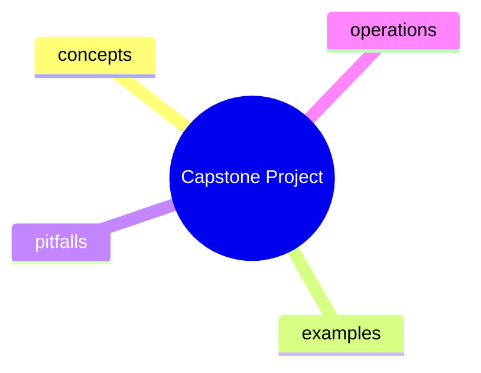

# Notes: Module 12 — Capstone Project

> These are personal study notes. Append insights, examples, and questions as understanding develops.

## Concept Map

_This diagram is unverified in Mermaid Live Editor._

## Key Insights
- _Add insights here._

## My Understanding
- _Explain the module in your own words._

## Questions That Arose
- _Move substantial questions to [QUESTIONS.md](./QUESTIONS.md)._ 

## Summary in My Own Words
_Add a 3–5 sentence summary after completing the module._

_Last updated: 2026-06-09_
