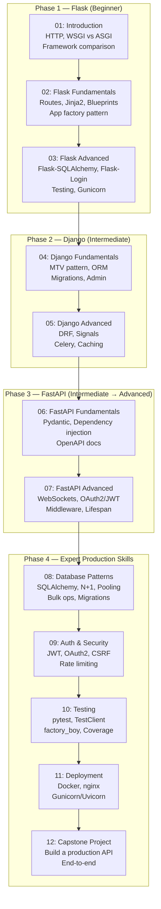
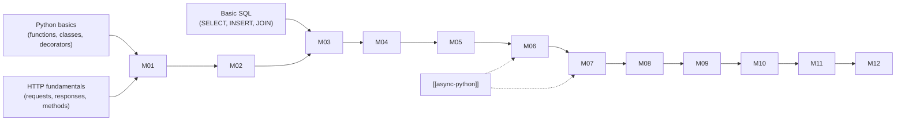

# Roadmap: Django, FastAPI and Flask — Python Web Frameworks

> This roadmap shows the learning phases and how they build on each other. Follow the phases in order unless you already have solid experience in an earlier phase.

---

## Learning Phases

_The four phases build linearly. Complete Phase 1 (Flask) before Phase 2 (Django) — Flask's explicit simplicity makes Django's conventions easier to understand._

---

## Phase Descriptions

### Phase 1 — Flask: Learning by Doing

Flask's philosophy is "start small and add what you need." This phase uses that philosophy intentionally: you build a real application piece by piece, adding each component manually. This gives you a hands-on understanding of what web frameworks actually do before you encounter the magic of Django or the type machinery of FastAPI.

**You should be able to after Phase 1:** Build and deploy a Flask web app with database access, user authentication, and templates.

### Phase 2 — Django: Convention Over Configuration

Django's "batteries included" philosophy means there is a right way to do almost everything. This phase teaches you Django's conventions deeply — how the ORM maps Python classes to database tables, how migrations track schema changes, how the admin interface works, and how Django REST Framework turns Django models into a JSON API.

**You should be able to after Phase 2:** Build and deploy a Django application with a REST API, admin interface, and robust data model.

### Phase 3 — FastAPI: Modern Async APIs

FastAPI represents the current state of the art for Python API development. This phase teaches you to use Python's type annotation system as your API contract, understand dependency injection as a design pattern, handle async I/O correctly, and build WebSocket endpoints.

**You should be able to after Phase 3:** Build a fully async FastAPI service with automatic OpenAPI documentation, JWT authentication, and WebSocket support.

### Phase 4 — Expert: Production Cross-Cutting Concerns

The final phase covers the concerns that every production web application shares regardless of framework: database access patterns, security, testing, and deployment. These modules deliberately reference all three frameworks to reinforce that these patterns are universal.

**You should be able to after Phase 4:** Deploy any of the three frameworks to production with Docker, configure nginx as a reverse proxy, write a comprehensive test suite, and make informed security decisions.

---

## Skill Map

The following skills are developed across this topic. Each row shows which modules contribute to it.

| Skill | Modules |
|-------|---------|
| HTTP fundamentals | 01 |
| Flask routing and templates | 02, 03 |
| Database access with SQLAlchemy | 03, 08 |
| Django ORM and migrations | 04, 08 |
| REST API design | 05, 06 |
| Type-driven API design | 06, 07 |
| Authentication (session/JWT/OAuth2) | 03, 05, 07, 09 |
| Testing web applications | 10 |
| Docker and containerization | 11 |
| Production deployment | 11, 12 |
| End-to-end project delivery | 12 |

---

## Prerequisites Map

_Dashed arrows indicate recommended background; solid arrows are required prerequisites._
