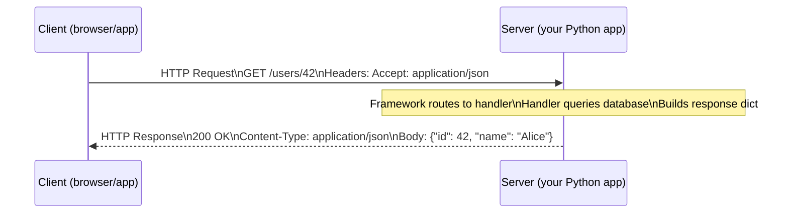

# Module 01: Introduction — HTTP, WSGI, ASGI, and the Framework Landscape

[← Topic Home](../../README.md) | [Next → Module 02: Flask Fundamentals](../02_flask-fundamentals/README.md)

---


---

## Table of Contents

1. [Overview](#overview)
2. [Prerequisites](#prerequisites)
3. [Objectives](#objectives)
4. [Theory](#theory)
   - [The HTTP Request-Response Cycle](#the-http-request-response-cycle)
   - [What Web Frameworks Actually Do](#what-web-frameworks-actually-do)
   - [WSGI: The Python Web Standard](#wsgi-the-python-web-standard)
   - [ASGI: The Async Evolution](#asgi-the-async-evolution)
   - [Framework Comparison: Django vs Flask vs FastAPI](#framework-comparison-django-vs-flask-vs-fastapi)
   - [Your First Flask Application](#your-first-flask-application)
   - [Your First FastAPI Endpoint](#your-first-fastapi-endpoint)
5. [Key Concepts](#key-concepts)
6. [Examples](#examples)
7. [Common Pitfalls](#common-pitfalls)
8. [Cross-Links](#cross-links)
9. [Summary](#summary)

---

## Overview

Before writing a single line of Flask, Django, or FastAPI code, it helps to understand the problem that web frameworks exist to solve. The web runs on HTTP — a request-response protocol that predates every Python framework by decades. A web framework's core job is to receive HTTP requests, route them to the right piece of your code, and serialize your code's output back into an HTTP response. Everything else — databases, authentication, templates — is built on top of that foundation.

This module covers the foundational layer: how HTTP works, what WSGI and ASGI are and why they matter, and how Flask, Django, and FastAPI each fit into this picture. You will write your first working endpoints in both Flask and FastAPI by the end of the module, giving you a concrete baseline to compare as you go deeper into each framework.

Understanding this foundation is what separates developers who "know Flask" from developers who understand web development in Python. When something breaks in production — an nginx misconfiguration, a gunicorn worker timeout, a mysterious 500 error — the knowledge in this module is what lets you reason about what went wrong.

---

## Prerequisites

### Required Concepts

- **Python functions** — you must be comfortable defining functions, using `*args` and `**kwargs`, and using decorators (the `@` syntax)
- **Basic terminal usage** — running Python files, installing packages with pip, creating virtual environments
- **HTTP fundamentals** — know what a URL is; know that HTTP has methods like GET and POST and status codes like 200, 404, and 500

> [!TIP]
> If decorators feel shaky, spend 20 minutes reviewing them before this module. The entire routing system of Flask and FastAPI is built on Python decorators, and not understanding them will cause confusion throughout the topic.

---

## Objectives

By the end of this module, you will be able to:

1. Describe the HTTP request-response cycle, including methods, headers, and status codes
2. Explain what WSGI is, what the `application(environ, start_response)` callable does, and why WSGI exists
3. Explain what ASGI is and how it differs from WSGI in terms of the async model and supported protocols
4. Compare Flask, Django, and FastAPI across the dimensions of philosophy, performance, use case, and learning curve
5. Write and run a complete "hello world" Flask application
6. Write and run a complete "hello world" FastAPI application with a typed response
7. Recognize the historical progression from CGI through WSGI to ASGI

---

## Theory

### The HTTP Request-Response Cycle

Every web interaction starts with an HTTP request and ends with an HTTP response. Understanding this cycle deeply — not just at the surface — is essential for every web developer.

**The Request** is a structured text message sent by a client (browser, mobile app, curl, another service). It has:

- A **method** — the type of action being requested: `GET` (retrieve data), `POST` (submit data to create), `PUT` (replace a resource), `PATCH` (partial update), `DELETE` (remove a resource)
- A **URL** — the address of the resource, e.g., `https://api.example.com/users/42`
- **Headers** — metadata key-value pairs: `Content-Type: application/json`, `Authorization: Bearer <token>`, `Accept: application/json`
- An optional **body** — data sent with the request (POST and PUT requests typically have a body; GET requests do not)

**The Response** is the server's reply. It has:

- A **status code** — a three-digit number indicating success or failure: `200 OK`, `201 Created`, `400 Bad Request`, `401 Unauthorized`, `404 Not Found`, `500 Internal Server Error`
- **Headers** — metadata about the response: `Content-Type: application/json`, `Set-Cookie: session=abc123`
- An optional **body** — the response data (HTML, JSON, an image, etc.)

HTTP is **stateless**: each request is independent. The server does not automatically remember who you are from one request to the next. Session management, cookies, and tokens exist specifically to work around this statelessness.

Here is the cycle visualized:



_The HTTP request-response cycle: the client sends a structured request; the server processes it and returns a structured response._

The framework's job is to handle everything that happens inside the "Server" box: parsing the incoming HTTP request into a Python object, matching the URL to the right function, calling that function, and serializing its return value into an HTTP response.

---

### What Web Frameworks Actually Do

Without a framework, you would implement this loop yourself. Here is a raw Python HTTP server to illustrate:

```python
# A bare-bones HTTP server using only Python's standard library.
# This is NOT how you would build a real application — it shows what
# frameworks abstract away for you.
from http.server import HTTPServer, BaseHTTPRequestHandler
import json

class Handler(BaseHTTPRequestHandler):
    def do_GET(self):
        if self.path == "/hello":
            # Build the response manually
            body = json.dumps({"message": "Hello, World!"}).encode()
            self.send_response(200)
            self.send_header("Content-Type", "application/json")
            self.send_header("Content-Length", len(body))
            self.end_headers()
            self.wfile.write(body)
        else:
            # Handle 404 manually
            self.send_response(404)
            self.end_headers()

server = HTTPServer(("localhost", 8000), Handler)
server.serve_forever()
```

This works, but notice how much boilerplate is required even for a trivial response. As your application grows, you would write this pattern hundreds of times, build a URL routing table, handle content negotiation, implement error handling, and so on. A framework replaces all of this with a clean, high-level API.

What a framework provides, at minimum:

1. **Routing** — mapping URL patterns to Python functions
2. **Request parsing** — turning raw HTTP bytes into a convenient Python object (headers, body, query parameters)
3. **Response serialization** — turning your return value into a valid HTTP response
4. **Error handling** — converting Python exceptions into appropriate HTTP status codes

More fully-featured frameworks (Django) also provide: ORM, migrations, forms, authentication, templating, an admin interface, and more.

---

### WSGI: The Python Web Standard

Before WSGI, Python web frameworks were coupled to specific web servers. A Django application could only run behind Apache mod_python; a Zope application could only run on the Zope application server. If you wanted to switch servers, you had to rewrite your application.

**PEP 333** (2003, updated to PEP 3333 for Python 3) solved this with WSGI: a standard interface between Python web applications and web servers. The key insight is simple: a WSGI application is just a callable that accepts two arguments and returns an iterable of byte strings.

```python
# This IS a complete WSGI application.
# Any WSGI server (gunicorn, uWSGI, Waitress) can run this without
# any modification.
def application(environ, start_response):
    """
    environ: a dict containing everything about the HTTP request.
             Keys include REQUEST_METHOD, PATH_INFO, QUERY_STRING,
             HTTP_CONTENT_TYPE, wsgi.input (the request body), etc.

    start_response: a callable provided by the server. You call it
                    with (status_string, headers_list) to begin the
                    response headers.
    """
    # Read the request method and path from environ
    method = environ["REQUEST_METHOD"]   # e.g., "GET"
    path = environ["PATH_INFO"]          # e.g., "/hello"

    if method == "GET" and path == "/hello":
        body = b'{"message": "Hello, World!"}'
        # Signal to the server that we are starting a 200 response
        start_response("200 OK", [
            ("Content-Type", "application/json"),
            ("Content-Length", str(len(body))),
        ])
        return [body]    # Return an iterable of byte strings
    else:
        body = b"Not Found"
        start_response("404 Not Found", [("Content-Type", "text/plain")])
        return [body]
```

This is exactly what Flask and Django compile down to. When you write a Flask route, Flask is generating the WSGI `application` function for you, with all the routing, request parsing, and response serialization handled internally.

The WSGI interface has one important limitation: it is **synchronous**. Each call to `application()` blocks until it returns. This means a WSGI server handles one request per thread (or per process). To handle 100 concurrent requests, you need 100 workers. This is fine for most applications but becomes a bottleneck when many requests are waiting on slow I/O (database queries, external API calls) rather than doing CPU work.

---

### ASGI: The Async Evolution

As Python's `asyncio` library matured and `async`/`await` syntax became standard in Python 3.5+, it became clear that WSGI's synchronous model was holding Python web development back. ASGI (Asynchronous Server Gateway Interface) was developed to solve this.

An ASGI application is also a callable, but it receives three arguments and is a coroutine (or returns a coroutine):

```python
# A complete ASGI application.
# ASGI servers: uvicorn, hypercorn, daphne.
import json

async def application(scope, receive, send):
    """
    scope: a dict describing the connection type and request metadata.
           For HTTP: scope["type"] == "http", scope["method"], scope["path"]
           For WebSocket: scope["type"] == "websocket"

    receive: an async callable to receive messages from the client.
             For HTTP: await receive() returns the request body.

    send: an async callable to send messages to the client.
          For HTTP: call it with http.response.start then http.response.body.
    """
    if scope["type"] == "http":
        # For HTTP: receive body if needed
        # await receive()  -- read request body if needed

        body = json.dumps({"message": "Hello from ASGI"}).encode()

        # Send response headers
        await send({
            "type": "http.response.start",
            "status": 200,
            "headers": [
                [b"content-type", b"application/json"],
                [b"content-length", str(len(body)).encode()],
            ],
        })

        # Send response body
        await send({
            "type": "http.response.body",
            "body": body,
        })
    elif scope["type"] == "websocket":
        # ASGI natively supports WebSockets — WSGI cannot do this
        event = await receive()
        if event["type"] == "websocket.connect":
            await send({"type": "websocket.accept"})
```

The critical advantage of ASGI is that a single worker can handle many concurrent requests. When an `await` is encountered (waiting for a database query, an HTTP call to an external service, a filesystem read), the event loop switches to another request rather than blocking. This means ASGI applications can handle thousands of concurrent connections with a fraction of the memory that an equivalent WSGI application would require.

FastAPI is an ASGI application. Django has supported ASGI since version 3.1, though its ORM is still synchronous by default (async ORM queries require `sync_to_async` wrappers or are done via Django's newer async ORM API). Flask remains WSGI-only as of version 3.x.

> [!NOTE]
> ASGI does not automatically make your application faster. If your route handler does CPU-bound work (heavy computation) synchronously without yielding to the event loop, ASGI provides no benefit. The advantage is specifically for I/O-bound work: many requests waiting on database or network responses concurrently.

---

### Framework Comparison: Django vs Flask vs FastAPI

| Dimension | Flask | Django | FastAPI |
|-----------|-------|--------|---------|
| **First released** | 2010 | 2005 | 2019 |
| **Interface** | WSGI | WSGI (ASGI since 3.1) | ASGI |
| **Philosophy** | Micro-framework; explicit, minimal | Batteries included; opinionated | Modern, type-driven; async-first |
| **ORM** | None (use SQLAlchemy, Peewee, etc.) | Built-in (Django ORM) | None (use SQLAlchemy, Tortoise, etc.) |
| **Migrations** | None (use Flask-Migrate/Alembic) | Built-in (`manage.py migrate`) | None (use Alembic) |
| **Admin interface** | None (Flask-Admin is third-party) | Built-in, auto-generated | None |
| **Forms / validation** | Flask-WTF (third-party) | Built-in forms + DRF serializers | Pydantic (first-class) |
| **Auto API docs** | None (use Flask-RESTX or similar) | None (DRF has swagger via drf-spectacular) | Built-in at `/docs` and `/redoc` |
| **Performance** | Good (synchronous) | Good (sync; async in newer versions) | Excellent (async I/O) |
| **Learning curve** | Low | Moderate to steep | Moderate |
| **Best for** | Small apps, APIs, learning, microservices | Content sites, admin-heavy apps, full-featured apps | High-throughput APIs, ML serving, modern REST APIs |
| **Community size** | Very large | Very large | Growing rapidly |

Neither framework is universally "better." The right choice depends on:

- **Project requirements** — need an admin interface? Use Django. Need WebSockets? Use FastAPI. Building something tiny? Flask.
- **Team experience** — Django's conventions reduce decision fatigue on large teams. Flask's flexibility is an asset on small, experienced teams.
- **Performance requirements** — FastAPI's async model is a meaningful advantage for high-concurrency, I/O-bound APIs.

---

### Your First Flask Application

Let's write a complete Flask application. Install Flask first:

```bash
pip install flask
```

```python
# app.py
# A complete Flask application. Flask uses Python decorators to
# map URL patterns to Python functions (called "view functions").
from flask import Flask, jsonify, request

# Create the Flask application instance.
# __name__ tells Flask where to look for templates and static files.
app = Flask(__name__)

# The @app.route decorator registers a URL pattern.
# Flask will call this function whenever a GET request arrives at "/"
@app.route("/")
def index():
    # Flask automatically converts a returned dict to a JSON response
    # in Flask 2.2+. For older versions, use jsonify().
    return {"message": "Hello, World!"}

# Route with a URL parameter. <int:user_id> extracts an integer
# from the URL and passes it to the function as a keyword argument.
@app.route("/users/<int:user_id>")
def get_user(user_id: int):
    # In a real app, you would query a database here.
    return {"id": user_id, "name": f"User {user_id}"}

# POST route. The methods= argument specifies which HTTP methods
# this route accepts. Default is GET only.
@app.route("/echo", methods=["POST"])
def echo():
    # request.get_json() parses the request body as JSON.
    # Returns None if the Content-Type header is not application/json
    # or if the body is not valid JSON.
    data = request.get_json()
    if data is None:
        return {"error": "Expected JSON body"}, 400
    return {"echo": data}

# Run the development server when the file is executed directly.
# debug=True enables auto-reload on code changes and detailed error pages.
# NEVER use debug=True in production.
if __name__ == "__main__":
    app.run(debug=True)
```

Run this with:

```bash
python app.py
# OR (preferred):
flask --app app run --debug
```

Then test it:

```bash
curl http://localhost:5000/
# {"message":"Hello, World!"}

curl http://localhost:5000/users/42
# {"id":42,"name":"User 42"}

curl -X POST http://localhost:5000/echo \
  -H "Content-Type: application/json" \
  -d '{"hello": "world"}'
# {"echo":{"hello":"world"}}
```

Notice the three things Flask does automatically: it parsed the URL parameter as an integer, it serialized the dict to JSON, and it set the `Content-Type: application/json` header. Without Flask, you would write all of that yourself.

---

### Your First FastAPI Endpoint

Now the same application in FastAPI:

```bash
pip install fastapi uvicorn[standard]
```

```python
# main.py
# The same three routes in FastAPI. Notice the differences:
# 1. Return types are declared with type annotations
# 2. Request body uses a Pydantic model, not request.get_json()
# 3. Validation happens automatically — bad input returns 422, not a Python exception
from fastapi import FastAPI, HTTPException
from pydantic import BaseModel

# Create the FastAPI application instance.
app = FastAPI(
    title="My First FastAPI App",
    description="A demonstration of basic FastAPI routing",
    version="1.0.0",
)

@app.get("/")
def index():
    # FastAPI serializes dicts and Pydantic models to JSON automatically.
    return {"message": "Hello, World!"}

# FastAPI uses {user_id} in the URL pattern (not Flask's <int:user_id>).
# The type annotation int on user_id is both documentation and validation.
@app.get("/users/{user_id}")
def get_user(user_id: int):
    # If user_id is not a valid integer, FastAPI returns 422 automatically.
    return {"id": user_id, "name": f"User {user_id}"}

# Request body is defined as a Pydantic model. FastAPI uses this to:
# - Parse and validate the incoming JSON
# - Generate the OpenAPI schema for this endpoint
# - Provide autocompletion in editors
class EchoRequest(BaseModel):
    content: str           # Required string field
    repeat: int = 1        # Optional field with a default value

@app.post("/echo")
def echo(body: EchoRequest):
    # body is already validated; body.content is guaranteed to be a str
    return {"echo": body.content * body.repeat}
```

Run this with:

```bash
uvicorn main:app --reload
```

The key difference from Flask to notice: when you visit `http://localhost:8000/docs`, you get an interactive API explorer — automatically generated from your code. No extra libraries, no configuration. FastAPI reads your type annotations and Pydantic models and generates OpenAPI documentation from them. This is one of FastAPI's most distinctive features.

---

## Key Concepts

**HTTP Method** — The verb in an HTTP request that indicates the intended operation. `GET` retrieves data without side effects. `POST` creates a new resource or submits data. `PUT` replaces a resource entirely. `PATCH` partially updates a resource. `DELETE` removes a resource. Mapping HTTP methods to operations is the foundation of REST API design. See: [[graphql-rest]].

**HTTP Status Code** — A three-digit integer in the response indicating the outcome. 2xx codes indicate success (200 OK, 201 Created, 204 No Content). 4xx codes indicate client errors (400 Bad Request, 401 Unauthorized, 403 Forbidden, 404 Not Found, 422 Unprocessable Entity). 5xx codes indicate server errors (500 Internal Server Error, 503 Service Unavailable).

**WSGI** — Web Server Gateway Interface. The standard Python interface between WSGI-compatible web servers (Gunicorn, uWSGI) and WSGI-compatible Python applications (Flask, Django). Defined in PEP 3333. A WSGI application is a callable with signature `(environ, start_response)`. Synchronous only. See: [[shared/glossary#wsgi]].

**ASGI** — Asynchronous Server Gateway Interface. The async successor to WSGI, supporting HTTP, HTTP/2, and WebSockets in a single interface. An ASGI application is an async callable with signature `(scope, receive, send)`. Used by FastAPI (via Starlette) and supported by Django since version 3.1. See: [[shared/glossary#asgi]].

**Application Factory** — A pattern where the Flask (or FastAPI) application object is created inside a function rather than at module level. Essential for testing (create a new app per test) and for supporting different configurations in different environments. Introduced properly in Module 02, but the concept is relevant immediately. See: [[shared/glossary#app-factory]].

**Routing** — The mechanism by which a framework maps an incoming URL (and HTTP method) to a specific Python function. In Flask and FastAPI, routing is declared with decorators (`@app.route`, `@app.get`). In Django, routing is declared in `urls.py` as a list of `path()` or `re_path()` entries.

**Middleware** — A layer of code that wraps the application and processes every request before it reaches a view and every response before it leaves. Used for authentication checks, logging, CORS headers, and rate limiting. See: [[shared/glossary#middleware]].

---

## Examples

### Example 1: A Minimal WSGI Application Running Under Gunicorn

**Scenario:** You want to understand what gunicorn actually runs when it starts your Flask or Django app.

**Goal:** Write a raw WSGI application and run it under gunicorn.

```python
# wsgi_app.py
# A minimal WSGI application that demonstrates the interface
# that gunicorn, uWSGI, and Waitress consume.

def application(environ, start_response):
    """
    This function IS the web application from gunicorn's perspective.
    Flask.__call__ and Django's WSGIHandler.__call__ implement this same
    interface — they are just much more sophisticated versions of it.
    """
    path = environ.get("PATH_INFO", "/")
    method = environ.get("REQUEST_METHOD", "GET")

    if path == "/health" and method == "GET":
        body = b'{"status": "ok"}'
        status = "200 OK"
        headers = [
            ("Content-Type", "application/json"),
            ("Content-Length", str(len(body))),
        ]
    else:
        body = b'{"error": "not found"}'
        status = "404 Not Found"
        headers = [
            ("Content-Type", "application/json"),
            ("Content-Length", str(len(body))),
        ]

    start_response(status, headers)
    return [body]
```

```bash
pip install gunicorn
gunicorn wsgi_app:application --bind 0.0.0.0:8000 --workers 2
```

```bash
curl http://localhost:8000/health
# {"status": "ok"}
```

**What to notice:** The `application` function in this file is exactly what gunicorn calls for every HTTP request. Flask's `Flask` class is a Python object whose `__call__` method implements this same interface. When gunicorn runs a Flask application, it calls `flask_app(environ, start_response)` — the Flask app is callable because it implements `__call__`.

---

### Example 2: Flask vs FastAPI — Validation Behavior

**Scenario:** Both frameworks receive an invalid request. How do they handle it?

**Goal:** Observe the difference in input validation behavior between Flask and FastAPI.

```python
# Flask: no automatic validation — you get whatever the client sends
from flask import Flask, request

app = Flask(__name__)

@app.route("/divide", methods=["POST"])
def divide():
    data = request.get_json()
    # No validation: if "a" or "b" are missing, you get a KeyError.
    # If they are strings instead of numbers, you get a TypeError.
    # You must write all validation yourself.
    try:
        result = data["a"] / data["b"]
        return {"result": result}
    except (KeyError, TypeError, ZeroDivisionError) as e:
        return {"error": str(e)}, 400
```

```python
# FastAPI: Pydantic validates automatically before your function runs
from fastapi import FastAPI
from pydantic import BaseModel, field_validator

app = FastAPI()

class DivideRequest(BaseModel):
    a: float      # FastAPI will return 422 if "a" is missing or not a number
    b: float

    @field_validator("b")
    @classmethod
    def b_not_zero(cls, v):
        if v == 0:
            raise ValueError("b cannot be zero")
        return v

@app.post("/divide")
def divide(body: DivideRequest):
    # If we reach here, body.a and body.b are guaranteed valid floats
    # and body.b is guaranteed non-zero. No try/except needed.
    return {"result": body.a / body.b}
```

```bash
# Bad request to FastAPI — missing field
curl -X POST http://localhost:8000/divide \
  -H "Content-Type: application/json" \
  -d '{"a": 10}'
# {"detail":[{"loc":["body","b"],"msg":"field required","type":"value_error.missing"}]}
# Status: 422 Unprocessable Entity
```

**What to notice:** FastAPI's Pydantic validation generates a structured error response with the field path and error message, without any code in your handler. Flask delegates all validation to you. Neither approach is wrong — Flask gives you full control; FastAPI enforces structure.

---

### Example 3: CGI vs Framework — Historical Perspective

**Scenario:** Understanding where web frameworks came from by looking at the CGI approach they replaced.

**Goal:** See the CGI programming model and understand what WSGI improved.

```python
#!/usr/bin/env python3
# In the CGI era, this script would be placed in /cgi-bin/ on an Apache server.
# Apache would execute this as a new process for every HTTP request.
# The server communicated via environment variables (REQUEST_METHOD, QUERY_STRING)
# and stdout (the response).
#
# THIS IS NOT HOW YOU WRITE WEB APPS TODAY.
# It is here for historical context only.

import cgi
import json
import os
import sys

# CGI: print the HTTP response headers to stdout, followed by a blank line
print("Content-Type: application/json")
print("Status: 200 OK")
print()  # blank line separates headers from body

method = os.environ.get("REQUEST_METHOD", "GET")
path = os.environ.get("PATH_INFO", "/")

# CGI: print the body to stdout
output = {"method": method, "path": path, "era": "1990s CGI"}
print(json.dumps(output))
```

**What to notice:** CGI required a new Python process for every request — expensive. The response was built by printing to stdout — fragile and error-prone. WSGI replaced this with a persistent in-process interface, and ASGI took it further with async support. The evolution was driven by performance and developer ergonomics, not fundamental changes to HTTP itself.

---

## Common Pitfalls

### Pitfall 1: Using `debug=True` in Production

**The mistake:** Leaving Flask's debug mode or FastAPI's debug mode enabled in a production deployment.

```python
# WRONG: debug=True in production
app.run(host="0.0.0.0", port=8000, debug=True)
```

```python
# RIGHT: debug mode controlled by environment variable, defaults to False
import os
debug = os.environ.get("FLASK_DEBUG", "0") == "1"
app.run(host="0.0.0.0", port=8000, debug=debug)
```

**Why this is made:** Debug mode is convenient during development — it shows detailed tracebacks in the browser. Developers forget to change the flag when deploying.

**Why it matters:** Flask's debug mode enables an interactive debugger in the browser that can execute arbitrary Python code. Leaving it on is a critical security vulnerability. It also enables the auto-reloader, which should not run in production.

---

### Pitfall 2: Not Using a Virtual Environment

**The mistake:** Installing packages globally, mixing project dependencies across projects.

```bash
# WRONG: installing globally
pip install flask

# RIGHT: always work in a virtual environment
python -m venv venv
source venv/bin/activate  # Linux/macOS
# venv\Scripts\activate  # Windows
pip install flask
```

**Why this is made:** Beginners skip virtual environments because they seem like extra steps. The problem surfaces when two projects require different versions of the same library.

**Why it matters:** Dependency conflicts become extremely difficult to debug when all projects share the same Python environment. A virtual environment per project is the baseline of professional Python development.

---

### Pitfall 3: Confusing WSGI and ASGI Servers

**The mistake:** Running an ASGI application (FastAPI) with a WSGI server (gunicorn without uvicorn workers), or vice versa.

```bash
# WRONG: running FastAPI with a WSGI-only gunicorn config
gunicorn main:app  # FastAPI is ASGI; this will either error or degrade silently

# RIGHT: gunicorn with uvicorn workers for FastAPI
gunicorn main:app -k uvicorn.workers.UvicornWorker --workers 4

# OR: use uvicorn directly
uvicorn main:app --host 0.0.0.0 --port 8000 --workers 4
```

```bash
# WRONG: running Flask with uvicorn
uvicorn app:app  # Flask is WSGI; uvicorn expects ASGI

# RIGHT: Flask with gunicorn
gunicorn "app:create_app()" --workers 4
```

**Why this is made:** Gunicorn is the familiar Python production server, and people reach for it by habit regardless of their framework's interface.

**Why it matters:** Mismatched server and app interface types will either fail to start or will silently degrade — losing async capabilities, breaking WebSocket support, or producing incorrect behavior under load.

---

### Pitfall 4: Treating the Development Server as Production-Ready

**The mistake:** Shipping an application that starts with `flask run` or `uvicorn main:app --reload` in production.

```bash
# WRONG: Dockerfile CMD using development server
CMD ["flask", "run", "--host", "0.0.0.0"]

# RIGHT: Dockerfile CMD using production server
CMD ["gunicorn", "myapp:create_app()", "--workers", "4", "--bind", "0.0.0.0:8000"]
```

**Why this is made:** The development server "just works" and it is tempting to use it everywhere.

**Why it matters:** Flask's built-in server and uvicorn's `--reload` mode are single-threaded development tools. They cannot handle concurrent requests reliably, have no worker process management, and provide no process recovery if a worker crashes.

---

## Cross-Links

- [[async-python]] — covers `asyncio`, `async`/`await`, and the event loop; essential background for understanding why ASGI was designed the way it was and how FastAPI achieves its concurrency model
- [[graphql-rest]] — covers REST API design principles, HTTP methods, status codes, and GraphQL; directly complements the HTTP and routing concepts in this module
- [[shared/glossary#wsgi]] — the glossary entry for WSGI with a concise reference definition
- [[shared/glossary#asgi]] — the glossary entry for ASGI
- [[shared/glossary#middleware]] — the glossary entry for middleware
- [[django-fastapi-flask/modules/02_flask-fundamentals]] — the next module, where you apply the Flask foundation from this module to build a real application

---

## Summary

- **HTTP is a request-response protocol.** A request has a method, URL, headers, and optional body. A response has a status code, headers, and optional body. HTTP is stateless — each request is independent.
- **Web frameworks exist to handle the plumbing.** Without a framework, you write routing tables, request parsers, and response serializers by hand. Frameworks abstract all of this into a clean decorator-based API.
- **WSGI is the synchronous Python web standard.** Defined in PEP 3333, WSGI decoupled Python applications from web servers. A WSGI app is a callable `application(environ, start_response)`. Gunicorn and uWSGI are WSGI servers. Flask and Django are WSGI applications.
- **ASGI is the async successor to WSGI.** ASGI supports async/await, HTTP, HTTP/2, and WebSockets in a single interface. An ASGI app is `async application(scope, receive, send)`. Uvicorn and Hypercorn are ASGI servers. FastAPI is an ASGI application.
- **Flask is a micro-framework.** It provides routing and request handling and nothing else. You choose and assemble the rest of the stack. Low learning curve; maximum flexibility.
- **Django is batteries included.** It provides an ORM, migrations, admin, authentication, forms, and templating out of the box. Higher learning curve; maximum structure and convention.
- **FastAPI is modern and async.** It uses Python type annotations and Pydantic for automatic validation and documentation generation. Built for high-throughput async API work.
- **Match the server to the interface.** WSGI apps run on Gunicorn. ASGI apps run on Uvicorn (or Gunicorn with uvicorn workers). Never mix them.
- **Never run the development server in production.** Use Gunicorn for WSGI apps and Uvicorn (or Gunicorn+uvicorn workers) for ASGI apps.
