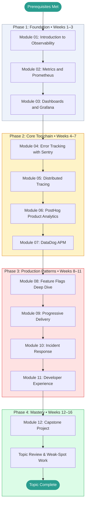

# Feature Flags, System Monitoring, and Developer Experience — Learning Roadmap

> This roadmap is your study plan. Work through the phases in order.
> Each phase builds directly on the previous one.
> Mark your current position with **← You Are Here** and update it as you progress.

---

## Prerequisites Map

Confirm you have working knowledge of these before entering Phase 1:

```
[[django-fastapi-flask]]       ──┐
                                  ├──► Feature Flags & Monitoring  (start here)
[[devops-platform-engineering]] ──┤
                                  │
[[systems-architecture]]        ──┘
```

If any prerequisite is missing, complete it first and return here.

---

## Learning Path Visualization



---

## Phase Breakdown

### Phase 1: Foundation

**Goal:** Understand what observability means, why it exists, and get comfortable with Prometheus metrics and Grafana dashboards. Leave Phase 1 able to instrument a simple application and visualize its health.

| Module | Name | Est. Hours | Key Skill Gained |
|--------|------|-----------|-----------------|
| 01 | Introduction to Observability | 4 | Mental model: metrics vs logs vs traces vs flags |
| 02 | Metrics and Prometheus | 6 | Instrument code; query with PromQL |
| 03 | Dashboards and Grafana | 5 | Build dashboards; set alert rules |

**Phase 1 Exit Criteria:**

- [ ] Can explain the three pillars of observability without notes
- [ ] Have instrumented a Python application with at least 3 Prometheus metrics
- [ ] Have built a Grafana dashboard with 3+ panels and one alert rule
- [ ] Scored ≥ 70% on Modules 01, 02, and 03 tests
- [ ] GLOSSARY.md has at least 10 entries

**Milestone unlocked:** Foundation Built

---

### Phase 2: Core Toolchain

**Goal:** Develop hands-on fluency with the major observability tools. Leave Phase 2 able to set up error tracking, distributed tracing, product analytics, and APM in a real application.

| Module | Name | Est. Hours | Key Skill Gained |
|--------|------|-----------|-----------------|
| 04 | Error Tracking with Sentry | 6 | Capture and triage errors; set up releases |
| 05 | Distributed Tracing | 7 | Instrument with OpenTelemetry; read traces |
| 06 | PostHog Product Analytics | 5 | Track events; build funnels; run A/B tests |
| 07 | DataDog APM | 7 | Full APM setup; log-trace correlation; SLOs |

**Phase 2 Exit Criteria:**

- [ ] Have set up Sentry in a Python or JS app and triaged a real error
- [ ] Have propagated a trace across two services with OpenTelemetry
- [ ] Have created a PostHog funnel and interpreted drop-off data
- [ ] Scored ≥ 75% on all Phase 2 module tests

**Milestone unlocked:** Core Toolchain Mastery

---

### Phase 3: Production Patterns

**Goal:** Apply knowledge to production engineering challenges. Feature flags, progressive delivery, incident response, and DX measurement require synthesizing concepts from all earlier phases.

| Module | Name | Est. Hours | Key Skill Gained |
|--------|------|-----------|-----------------|
| 08 | Feature Flags Deep Dive | 7 | Design flag taxonomy; implement targeting rules |
| 09 | Progressive Delivery | 7 | Canary releases; statistical A/B testing |
| 10 | Incident Response | 6 | Run incidents; write runbooks; conduct post-mortems |
| 11 | Developer Experience | 6 | Measure DX with DORA and SPACE; design IDPs |

**Phase 3 Exit Criteria:**

- [ ] Have implemented a gradual rollout using feature flags (5% → 25% → 100%)
- [ ] Have written a runbook for a realistic failure scenario
- [ ] Have calculated DORA metrics for a team or project
- [ ] Scored ≥ 80% on all Phase 3 module tests

**Milestone unlocked:** Production Patterns Mastery

---

### Phase 4: Mastery

**Goal:** Synthesize everything. Build a fully-instrumented multi-service application with a complete observability stack, runbooks, SLO dashboard, and feature flag system.

| Activity | Est. Hours | Description |
|----------|-----------|-------------|
| Capstone Project | 15 | Instrument a multi-service application end-to-end |
| Topic Review | 4 | Revisit modules where test scores were below 80% |
| Teaching Exercise | 3 | Write a blog post, explain to someone else, or make a demo |
| Final Self-Assessment | 2 | Retake weakest module tests; verify overall score ≥ 80% |

**Phase 4 Exit Criteria:**

- [ ] Capstone project complete and documented in PROJECTS.md
- [ ] Overall topic score ≥ 80%
- [ ] CHEATSHEET.md is complete and genuinely useful as a reference
- [ ] GLOSSARY.md has definitions for every term encountered throughout the topic

**Milestone unlocked:** Topic Mastery

---

## Time Estimates Summary

| Phase | Weeks | Est. Hours | Cumulative |
|-------|-------|-----------|------------|
| Phase 1: Foundation | 1–3 | 15 hrs | 15 hrs |
| Phase 2: Core Toolchain | 4–7 | 25 hrs | 40 hrs |
| Phase 3: Production Patterns | 8–11 | 26 hrs | 66 hrs |
| Phase 4: Mastery | 12–16 | 24 hrs | 90 hrs |
| **Total** | **16** | **~70 hrs** | |

> [!NOTE]
> These estimates assume roughly **5–8 focused hours per week**.
> If you're studying part-time, the calendar weeks will stretch accordingly.
> Adjust the schedule to fit your life — consistency matters more than pace.

---

## Milestone Definitions

| Milestone | Earned When | Point Threshold |
|-----------|------------|----------------|
| First Step | Module 01 complete | Any score |
| Foundation Built | Phase 1 complete, all tests ≥ 70% | 90 pts |
| Core Toolchain Mastery | Phase 2 complete, all tests ≥ 75% | 200 pts |
| Production Patterns Mastery | Phase 3 complete, all tests ≥ 80% | 320 pts |
| Topic Mastery | Phase 4 complete, capstone done, overall ≥ 80% | 380 pts |
| Instrument Everything | Personally instrumented a real project | — |
| Flag Master | Deployed a flag, run A/B test, performed gradual rollout | — |

---

## Alternative Paths

### Fast Track (If You Have Prior Experience)

If you already have solid experience with Prometheus and Grafana:

```
Skim Modules 01–03 → Start at Module 04 → Continue normally
```

Take the Module 01 test first. If you score ≥ 85%, skip to Module 04.

### Deep Dive Path (Maximum Understanding)

For maximum depth, add these supplementary activities between phases:

- **After Phase 1:** Read the Google SRE Book, Chapters 1–6 (error budgets, SLOs) — [sre.google/sre-book](https://sre.google/sre-book/table-of-contents/)
- **After Phase 2:** Work through the OpenTelemetry demo application — [opentelemetry.io/docs/demo](https://opentelemetry.io/docs/demo/)
- **After Phase 3:** Read the DORA State of DevOps Report for the current year

### Project-First Path (Learn by Building)

If you learn best by doing rather than reading:

```
Module 01 → Beginner Project → Module 02 → Beginner Project → Module 03 → ...
```

Alternate one module of theory with one hands-on project at each step.

---

## You Are Here

> **Current Phase:** _Not started_
>
> **Current Module:** _None — begin at [Module 01](./modules/01_introduction/README.md)_
>
> **Last Completed Module:** _None_
>
> **Next Action:** Open Module 01 and read the Overview section.
>
> _Update this section each time you advance to a new module or phase._
