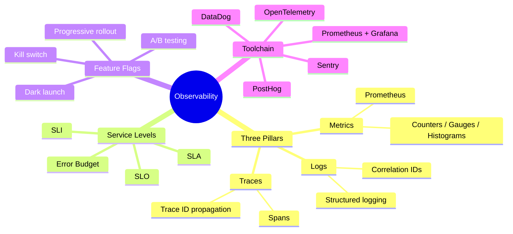

# Notes — Module 01: Introduction to Observability

> These are your personal study notes. Write freely and honestly.
> Incomplete notes are fine — they show where your understanding still needs work.
> Return to this file to add insights as they develop over time.

**Module:** [[modules/01_introduction]]
**Topic:** [[feature-flags-monitoring]]
**Date started:** _To be filled in_
**Status:** Not started

---

## Concept Map

_Sketch how the concepts in this module relate to each other. Fill in the Mermaid diagram._



_Alternative: draw this on paper, photo it, and link the image here._

---

## Key Insights

_The "aha moments" — the things that, once understood, made the rest clear._
_Be specific: "I finally understood X because Y" is more useful than "X makes sense"._

1. **[Insight title]:** _To be filled in_
2. **[Insight title]:** _To be filled in_
3. _Add insights as you discover them_

---

## My Understanding

_Explain the core concepts in your own words, as if teaching them to someone else._

### Monitoring vs. Observability

_Your explanation here_

_What I'm still unsure about:_ _To be filled in_

### The Three Pillars

_Your explanation here_

_What I'm still unsure about:_ _To be filled in_

### SLI/SLO/SLA and Error Budget

_Your explanation here_

_What I'm still unsure about:_ _To be filled in_

### Feature Flags

_Your explanation here_

---

## Connections to Other Topics

_How does this module connect to things you already know?_

| This module's concept | Connects to | How |
|----------------------|-------------|-----|
| Error budgets | [[devops-platform-engineering]] | Deployment frequency decisions depend on error budget health |
| Distributed traces | [[systems-architecture]] | Microservice architectures create the need for trace propagation |
| Feature flags | [[django-fastapi-flask]] | Flask/FastAPI apps are where flags are implemented |

---

## Questions That Arose

_Log questions as they appear. Don't stop to answer them now — just capture them._

- [ ] _Question 1_ → add to QUESTIONS.md
- [ ] _Question 2_ → needs more study
- [ ] _Question 3_ → might be answered in Module 02

---

## Code Snippets Worth Remembering

### Basic Prometheus Counter

```python
from prometheus_client import Counter
REQUESTS = Counter('http_requests_total', 'Total HTTP requests', ['method', 'status'])
REQUESTS.labels(method='GET', status='200').inc()
```

_Why I'm saving this:_ The pattern of defining metric name, help text, and labels in the constructor, then calling `.labels().inc()` is the fundamental Prometheus SDK pattern.

---

### Error Budget Formula

```python
error_budget_minutes = (1 - slo_target) * 30 * 24 * 60
# For 99.9% SLO: (1 - 0.999) * 43200 = 43.2 minutes/month
```

_Why I'm saving this:_ Easy to forget the formula; this is used constantly in SLO conversations.

---

## What Tripped Me Up

_Mistakes I made, misconceptions I had, things that confused me more than they should have._

- **[Stumbling block]:** _To be filled in_

---

## Summary in My Own Words

_Write a 3–5 sentence summary of this entire module without looking at any notes._
_If you can't do this, you need more study time._

_To be filled in after completing the module._

---

_Last updated: 2026-06-09_
