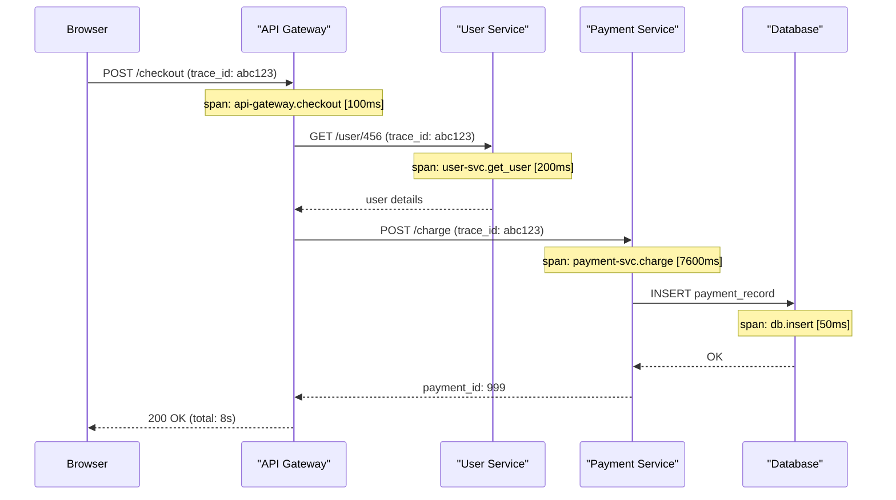

# Module 01: Introduction to Observability

[← Topic Home](../../README.md) | [Next → Module 02: Metrics and Prometheus](../02_metrics-and-prometheus/)

---


---

## Table of Contents

1. [Overview](#overview)
2. [Prerequisites](#prerequisites)
3. [Objectives](#objectives)
4. [Theory](#theory)
   - [Monitoring vs. Observability](#monitoring-vs-observability)
   - [The Three Pillars](#the-three-pillars)
   - [SLI, SLO, and SLA](#sli-slo-and-sla)
   - [The Observability Toolchain Landscape](#the-observability-toolchain-landscape)
   - [Feature Flags: Why They Exist](#feature-flags-why-they-exist)
5. [Key Concepts](#key-concepts)
6. [Examples](#examples)
7. [Common Pitfalls](#common-pitfalls)
8. [Cross-Links](#cross-links)
9. [Summary](#summary)

---

## Overview

This module introduces the conceptual foundation for everything that follows in this topic. Before you write a single line of instrumentation code, you need to understand _why_ observability exists, what problem it solves, and how the tools in the ecosystem fit together. Without this framing, the individual tools (Prometheus, Sentry, OpenTelemetry) feel like a disconnected pile of software. With it, each tool occupies a clear role in a coherent system.

Modern software runs in environments that are fundamentally impossible to reason about from the outside without deliberate instrumentation. A production service processes thousands of requests per second, runs across dozens of containers in a distributed cluster, and interacts with databases, caches, third-party APIs, and message queues — all of which can fail, degrade, or behave unexpectedly at any time. Monitoring alone — checking whether something is "up" — is insufficient to understand what is actually happening.

Observability is the engineering discipline of making systems comprehensible from the outside. It draws on three primary signal types (metrics, logs, traces), supported by feature flags that control what users experience at runtime. This module introduces all four concepts and grounds them in the concrete tooling you will use throughout this topic.

**Difficulty:** Beginner &nbsp;|&nbsp; **Estimated time:** 4 hours

---

## Prerequisites

- Basic web application knowledge (you understand what an HTTP request and response are)
- Some familiarity with running a web server or application in any language
- No prior monitoring or observability experience required

> [!TIP]
> If terms like "HTTP status code", "server log", or "web request" feel unfamiliar, spend 30 minutes reviewing [[django-fastapi-flask]] before continuing. This module assumes you know what a web application does — not how to monitor it.

---

## Objectives

By the end of this module, you will be able to:

1. Explain the distinction between monitoring and observability, and articulate why observability is required for modern distributed systems
2. Name and describe the three pillars of observability (metrics, logs, traces) and give a concrete example of what question each one answers
3. Define SLI, SLO, and SLA in your own words, calculate a monthly error budget from a given SLO target, and explain why error budgets are useful
4. Map each major tool in the ecosystem (Prometheus, Grafana, Sentry, DataDog, PostHog, OpenTelemetry) to its primary role
5. Explain what a feature flag is, describe why separating deployment from release is valuable, and give three scenarios where a feature flag is the right tool

---

## Theory

### Monitoring vs. Observability

Monitoring is the practice of collecting predefined metrics and alerting when they cross thresholds. A monitoring system asks: "Is the thing up? Is it responding in time? Is the queue growing?" These are valid questions, but they are fundamentally limited — you can only monitor for problems you anticipated in advance.

Observability is a property of a system, not a tool. A system is observable if you can understand its internal state from its external outputs alone, without modifying or re-deploying it. The term comes from control theory, where it describes whether the internal states of a dynamical system can be inferred from its outputs over time. Applied to software, it means: when something unexpected happens in production, can you figure out _what_ and _why_ without adding more code, restarting the service, or guessing?

The practical difference matters enormously. Imagine a production service suddenly showing high p99 latency (99th percentile latency — the slowest 1% of requests) for logged-in users only, but not anonymous users, and only for requests originating from certain geographic regions, only during peak hours on weekdays. A monitoring system set up with the threshold "alert if p99 > 500ms" will fire, but it tells you nothing about _why_. An observable system, with metrics segmented by user type, regional labels on traces, and structured logs including authentication state, lets an engineer reconstruct the exact failure scenario from the signals already being emitted.

This distinction has practical consequences for how you build systems. Monitoring requires knowing in advance what will fail. Observability allows you to debug failures you never anticipated. As distributed systems grow in complexity — more services, more interactions, more failure modes — monitoring alone becomes increasingly insufficient. You cannot enumerate every possible failure mode in a system of 200 microservices. You need systems that let you ask arbitrary questions about runtime behavior.

> [!NOTE]
> The term "observability" gained traction in software engineering around 2016–2018, largely through the work of Charity Majors (Honeycomb), who articulated its importance for debugging distributed systems. The concept predates the tooling — the insight is that you need to instrument for _exploration_, not just for _alerting_.

### The Three Pillars

The industry has converged on three signal types that together provide comprehensive observability. Each answers a different question, and all three are needed for a complete picture.

#### Metrics

Metrics are numeric measurements aggregated over time. A metric has a name, a value, a timestamp, and optionally a set of labels (dimensions) that allow it to be sliced and filtered. Examples: `http_requests_total = 15043` (a counter that has incremented 15,043 times since the process started), `memory_usage_bytes = 524288000` (a gauge measuring current memory usage), `http_request_duration_seconds` (a histogram tracking the distribution of request durations).

Metrics are cheap to collect, cheap to store, and cheap to query. A single Prometheus instance can scrape and store hundreds of thousands of time series from dozens of services. Metrics are the foundation of alerting — they are what you monitor against SLOs. Their limitation is that they are _aggregated_: they tell you something is wrong (error rate is 5%, up from baseline of 0.1%) but not _which requests_ are failing or _why_.

```python
# Example: Adding basic metrics to a Flask app
# pip install prometheus_client flask

from flask import Flask, request
from prometheus_client import Counter, Histogram, generate_latest, CONTENT_TYPE_LATEST
import time

app = Flask(__name__)

# Counter: monotonically increasing; use for events that happen over time
REQUEST_COUNT = Counter(
    'http_requests_total',          # metric name
    'Total HTTP requests',          # help text
    ['method', 'endpoint', 'status']  # labels allow filtering/grouping
)

# Histogram: records the distribution of values; use for latency, payload sizes
REQUEST_LATENCY = Histogram(
    'http_request_duration_seconds',
    'HTTP request duration in seconds',
    ['endpoint'],
    # Bucket boundaries in seconds (Prometheus uses these for percentile calculation)
    buckets=[0.001, 0.005, 0.01, 0.025, 0.05, 0.1, 0.25, 0.5, 1.0, 2.5]
)

@app.before_request
def before_request():
    # Store the start time on the request object for use in after_request
    request.start_time = time.time()

@app.after_request
def after_request(response):
    # Calculate latency and record it in the histogram
    latency = time.time() - request.start_time
    REQUEST_LATENCY.labels(endpoint=request.path).observe(latency)

    # Increment the counter with the actual status code
    REQUEST_COUNT.labels(
        method=request.method,
        endpoint=request.path,
        status=str(response.status_code)
    ).inc()
    return response

# Prometheus scrapes this endpoint to collect metrics
@app.route('/metrics')
def metrics():
    return generate_latest(), 200, {'Content-Type': CONTENT_TYPE_LATEST}
```

#### Logs

Logs are timestamped records of discrete events. Unlike metrics, logs are not aggregated — each log entry describes a specific thing that happened at a specific time. Examples: `2026-06-09T14:05:23Z ERROR payment failed: stripe timeout after 30s for order_id=7890`, `2026-06-09T14:05:22Z INFO user 456 authenticated with method=oauth`.

Logs complement metrics by providing context and detail. When a metric alert fires ("error rate is 5%"), logs let you answer _what_ is failing: filter logs by `ERROR` level in the time window of the incident and you see `payment failed: stripe timeout` repeated hundreds of times. This is actionable in a way that a metric alone is not.

Structured logging — emitting logs as machine-parseable JSON rather than free-form strings — dramatically improves the value of logs. With structured logs, you can filter by field values, aggregate, and correlate across services. The example below shows the difference:

```python
# Unstructured logging — hard to filter, parse, and aggregate
import logging
logging.basicConfig(level=logging.INFO)

logger = logging.getLogger(__name__)

# Unstructured: free-form string, hard to search
logger.error(f"Payment failed for order {order_id}: {error_message}")
# Output: 2026-06-09 14:05:23,456 ERROR Payment failed for order 7890: stripe timeout

# Structured logging — machine-parseable JSON with consistent fields
import structlog

log = structlog.get_logger()

# Structured: every field is explicitly named and queryable
log.error(
    "payment_failed",
    order_id=order_id,
    error_type="stripe_timeout",
    amount_usd=49.99,
    duration_ms=30040,
    user_id=user_id,
)
# Output: {"event": "payment_failed", "order_id": 7890, "error_type": "stripe_timeout",
#          "amount_usd": 49.99, "duration_ms": 30040, "user_id": 456, "level": "error",
#          "timestamp": "2026-06-09T14:05:23.456Z"}
```

#### Traces

Traces record the journey of a single request through a distributed system. A trace consists of spans — individual operations in individual services — linked by a shared trace ID. Traces answer the question: "For this specific request, what happened in each service, how long did each step take, and where did it fail?"

Without traces, debugging latency in distributed systems is extremely difficult. Imagine a user's checkout request taking 8 seconds. Your metrics show the API gateway is slow, but is the slowness in the API gateway itself, or in the user service it calls, or in the payment service the user service calls, or in the database the payment service calls? Traces show you the complete waterfall: API gateway (100ms) → user service (200ms) → payment service (7.6s) → database (50ms). The payment service is the culprit.

The following Mermaid diagram shows how a single user request produces a trace with spans across three services:



_A single checkout request generates 4 spans linked by `trace_id: abc123`. The trace makes it immediately clear that the payment service is responsible for 7.6 of the 8 seconds total latency._

### How the Pillars Complement Each Other

The three pillars work together, not independently. A practical debugging workflow typically flows through all three:

1. **Metrics alert you** — "Error rate for the checkout endpoint has exceeded 1% for 10 minutes"
2. **Logs tell you what** — "Payment failed: stripe timeout" appearing hundreds of times
3. **Traces show you where** — The payment service's `charge` span is timing out after 30 seconds

Each pillar has weaknesses that the others compensate for. Metrics are aggregated and lose individual request context. Logs can be voluminous and expensive to search at scale. Traces add latency overhead and require sampling at high throughput. Used together, they provide complete visibility.

### SLI, SLO, and SLA

Service Level Indicators, Objectives, and Agreements are the vocabulary for making reliability goals concrete and measurable.

**Service Level Indicator (SLI)** is a quantitative measurement of a specific aspect of service quality. An SLI must directly reflect user experience. Poor SLIs measure infrastructure health (CPU load, memory usage). Good SLIs measure user-facing behavior (request success rate, latency, availability).

The most common SLIs for web services are:
- **Availability**: percentage of requests that succeed (return non-5xx responses)
- **Latency**: percentage of requests that complete within a threshold (e.g., p99 < 500ms)
- **Error rate**: percentage of requests that return errors

**Service Level Objective (SLO)** is an internal reliability target — a threshold for an SLI over a defined time window. For example: "99.9% of HTTP requests succeed over any rolling 30-day window." SLOs are team commitments, not contractual guarantees. They define the line between "acceptable" and "requires immediate attention."

**Service Level Agreement (SLA)** is a contractual commitment to customers, with defined consequences (service credits, penalties) if the SLA is violated. SLAs are almost always less strict than the corresponding internal SLO. If your SLO is 99.9%, you might offer a 99.5% SLA, keeping the difference as buffer against unexpected variance.

#### Error Budget

The error budget is the most powerful concept that flows from SLOs. If a service has a 99.9% availability SLO over 30 days:

```
Error Budget = (1 - SLO Target) × Window Duration
             = (1 - 0.999) × 30 days × 24 hours × 60 minutes
             = 0.001 × 43,200 minutes
             = 43.2 minutes
```

This means the service can be unavailable for up to 43.2 minutes in a 30-day period while still meeting its SLO. The error budget is the team's "allowance" for risk-taking. When the error budget is healthy (mostly unspent), the team can accelerate deployments and experiments. When the error budget is nearly exhausted, the team must focus on reliability rather than new features.

```python
# Simple error budget calculator
def calculate_error_budget(slo_target: float, window_days: int = 30) -> dict:
    """
    Calculate error budget from an SLO target.

    Args:
        slo_target: SLO as a decimal (e.g., 0.999 for 99.9%)
        window_days: Rolling window in days (default: 30)

    Returns:
        Dictionary with error budget in various units
    """
    window_minutes = window_days * 24 * 60
    error_budget_fraction = 1 - slo_target
    error_budget_minutes = error_budget_fraction * window_minutes
    error_budget_hours = error_budget_minutes / 60

    return {
        "slo_target_percent": slo_target * 100,
        "window_days": window_days,
        "error_budget_fraction": error_budget_fraction,
        "error_budget_minutes": round(error_budget_minutes, 1),
        "error_budget_hours": round(error_budget_hours, 2),
    }

# Examples
for slo in [0.999, 0.9999, 0.995, 0.99]:
    budget = calculate_error_budget(slo)
    print(f"SLO {budget['slo_target_percent']}%: "
          f"{budget['error_budget_minutes']} minutes/month "
          f"({budget['error_budget_hours']} hours)")

# Output:
# SLO 99.9%: 43.2 minutes/month (0.72 hours)
# SLO 99.99%: 4.3 minutes/month (0.07 hours)
# SLO 99.5%: 216.0 minutes/month (3.6 hours)
# SLO 99.0%: 432.0 minutes/month (7.2 hours)
```

### The Observability Toolchain Landscape

The observability ecosystem is large and can feel overwhelming. This table maps each major tool to its primary role:

| Tool | Category | Primary Role | Open Source? |
|------|----------|--------------|-------------|
| **Prometheus** | Metrics | Time-series metric collection and storage; pull-based scraping | Yes |
| **Grafana** | Visualization | Dashboards and alerting over Prometheus (and other) data sources | Yes (core) |
| **Sentry** | Error Tracking | Capture, group, and triage application errors across languages | Yes (self-hosted) / SaaS |
| **OpenTelemetry** | Instrumentation SDK | Vendor-neutral SDK for emitting traces, metrics, and logs | Yes (CNCF) |
| **Jaeger** | Tracing Backend | Store and visualize distributed traces (OTel exporter target) | Yes |
| **DataDog** | APM + Unified Platform | Full-stack APM: metrics, logs, traces, SLOs in one managed platform | SaaS only |
| **PostHog** | Product Analytics + Flags | User event tracking, funnels, A/B testing, feature flags | Yes (self-hosted) / SaaS |
| **LaunchDarkly** | Feature Management | Enterprise feature flag platform with advanced targeting | SaaS only |

The choice between these tools often comes down to scale and organizational preference:
- **Self-hosted, cost-conscious teams** often choose Prometheus + Grafana + Jaeger + Sentry (self-hosted)
- **Teams wanting a managed all-in-one solution** often choose DataDog
- **Product teams wanting analytics + flags together** often choose PostHog

> [!NOTE]
> OpenTelemetry is increasingly the recommended starting point for _instrumentation_ regardless of which backend you choose. Because OTel is vendor-neutral, you can instrument your code once and export to Prometheus, DataDog, Jaeger, or any other OTel-compatible backend — avoiding vendor lock-in at the instrumentation layer.

### Feature Flags: Why They Exist

A traditional deployment model couples deployment and release: when you deploy new code to production, all users immediately experience it. This creates an undesirable constraint — teams cannot deploy frequently without accepting the risk of exposing unfinished or untested features to all users.

Feature flags break this coupling. A feature flag is a conditional in your application code that controls whether a feature is active. The flag state can be changed at runtime — in a database, via an API call to a flag service, or by environment variable — without any redeployment. This enables several important patterns:

**Dark launch**: Deploy new code to production but keep the flag off. The code exists in production but no users see it. You can verify the deployment succeeded without exposing the feature.

**Progressive rollout**: Enable the flag for 1% of users, observe metrics and errors, then gradually increase to 5%, 25%, 100%. If anything goes wrong, instantly revert to 0% — no rollback required.

**Kill switch**: If a newly released feature has a critical bug, flip the flag to off instantly. All users immediately fall back to the old behaviour. No emergency deployment, no 3am rollback.

**A/B testing**: Route 50% of users to flag-on code and 50% to flag-off code. Collect metrics and product analytics for each group. Choose the better version based on data.

The simplest possible feature flag implementation requires only a conditional:

```python
# The most basic feature flag: an environment variable
import os

NEW_CHECKOUT_ENABLED = os.getenv('FEATURE_NEW_CHECKOUT', 'false').lower() == 'true'

def handle_checkout(user, cart):
    """Handle checkout — behaviour depends on the feature flag."""
    if NEW_CHECKOUT_ENABLED:
        # New checkout flow: single-page, faster, experimental
        return new_checkout_handler(user, cart)
    else:
        # Original checkout flow: multi-step, proven, stable
        return original_checkout_handler(user, cart)
```

This works for simple on/off scenarios but lacks user targeting, gradual rollouts, and audit trails. That is why dedicated flag services (PostHog, LaunchDarkly) exist — they add targeting rules ("enable for users in the beta group"), percentage-based rollouts, and a history of who changed what flag and when.

```python
# The same flag with PostHog — adds targeting and gradual rollout
import posthog

posthog.api_key = 'your-api-key'

def handle_checkout(user, cart):
    """Handle checkout — flag state comes from PostHog for per-user targeting."""
    # PostHog evaluates the flag server-side; returns True/False per user
    if posthog.feature_enabled('new-checkout-flow', user.id):
        # PostHog flag is on for this user (could be 5%, 25%, or specific users)
        return new_checkout_handler(user, cart)
    else:
        return original_checkout_handler(user, cart)
```

---

## Key Concepts

**Observability** — The property of a system that enables engineers to understand its internal state from its external outputs. Observable systems support exploration and debugging of unexpected failures, not just detection of anticipated ones. Contrast with _monitoring_, which detects known failure modes. See [[shared/glossary#observability]] (to be added).

**The three pillars** — Metrics, logs, and traces are the three signal types that together provide comprehensive observability. Metrics detect that something is wrong. Logs explain what happened. Traces show where in a distributed system the problem originated. All three are needed; none alone is sufficient.

**SLI (Service Level Indicator)** — A quantitative measurement of a specific user-facing service quality dimension. Good SLIs are directly tied to user experience (request success rate, latency) rather than infrastructure proxies (CPU usage, memory). See [[feature-flags-monitoring/GLOSSARY#sli-service-level-indicator]].

**SLO (Service Level Objective)** — An internal reliability target for an SLI over a defined time window. SLOs define the error budget and guide prioritisation between feature work and reliability investment. See [[feature-flags-monitoring/GLOSSARY#slo-service-level-objective]].

**Error budget** — The amount of downtime or errors a service is allowed within its SLO window. Error budget = `(1 - SLO%) × window duration`. When the error budget is spent, the team must prioritize reliability over new feature development. See [[feature-flags-monitoring/GLOSSARY#error-budget]].

**Feature flag** — A runtime conditional that controls whether a feature is active. Feature flags decouple deployment from release, enabling dark launches, progressive rollouts, kill switches, and A/B tests without redeployment. See [[feature-flags-monitoring/GLOSSARY#feature-flag]].

**Cardinality** — In the context of Prometheus metrics, the number of unique label-value combinations for a metric. High cardinality (e.g., using `user_id` as a label) causes Prometheus to create millions of time series and can exhaust memory. See [[feature-flags-monitoring/GLOSSARY#cardinality]].

**Correlation ID** — A unique identifier propagated through all services for a single request, enabling reconstruction of a request's path from logs even without a full tracing solution. See [[feature-flags-monitoring/GLOSSARY#correlation-id]].

---

## Examples

### Example 1: The Three Pillars in a Debugging Scenario _(Basic)_

**Scenario:** An e-commerce API receives an alert: checkout error rate has exceeded 2% for the past 15 minutes. You are on call.

**Using the three pillars:**

```python
# Step 1: Metrics told you something was wrong.
# PromQL query showing the spike:
# sum(rate(http_requests_total{endpoint="/checkout", status=~"5.."}[5m]))
#   /
# sum(rate(http_requests_total{endpoint="/checkout"}[5m]))
# → returns 0.023 (2.3% error rate, above your 1% SLO threshold)

# Step 2: Logs tell you WHAT is failing.
# Filtering logs for the last 20 minutes, endpoint=/checkout, level=ERROR:
# {"event": "checkout_failed", "error": "payment_timeout", "user_id": "...", "order_id": "..."}
# Hundreds of these entries, all with error="payment_timeout"

# Step 3: Trace tells you WHERE in the system it's slow.
# Fetching a trace for a failed checkout request (trace_id from the log entry):
# Span: api-gateway.checkout — 30.2s (total)
#   Span: cart-service.get_cart — 45ms
#   Span: payment-service.charge — 30.1s ← THIS IS THE BOTTLENECK
#     Span: stripe-api.create_charge — 30.0s (external API timeout)
```

**What to notice:** Each pillar contributes something the others cannot. The metric raised the alert but gave no context. The logs identified the error pattern ("payment_timeout") but not which part of the stack was slow. The trace pinpointed the exact span (stripe API call) causing the 30-second timeout.

---

### Example 2: SLO Calculation and Error Budget _(Intermediate)_

**Scenario:** Your team is setting SLOs for a new payment processing service. Choose an appropriate SLO and calculate the error budget.

```python
# Error budget calculator for SLO planning

def slo_planning_report(service_name: str, slo_candidates: list[float]) -> None:
    """Print an SLO planning report for a service."""
    window_minutes = 30 * 24 * 60  # 30 days in minutes

    print(f"\nSLO Planning Report: {service_name}")
    print("=" * 60)
    print(f"{'SLO Target':<15} {'Error Budget':<25} {'Incidents Possible':<20}")
    print("-" * 60)

    for slo in slo_candidates:
        error_budget_min = (1 - slo) * window_minutes
        # Rough estimate: assume each incident = 5 minutes downtime on average
        incidents_possible = int(error_budget_min / 5)
        print(f"{slo*100:.3f}%{'':<8} {error_budget_min:.1f} min ({error_budget_min/60:.1f} hrs)"
              f"{'':>5} ~{incidents_possible} incidents/month")

    print("\nRecommendation:")
    print("  - Start with 99.5% if this is a new service (generous budget while learning)")
    print("  - Use 99.9% for core user-facing services (43 minutes/month)")
    print("  - Use 99.95% only for critical paths with proven reliability")
    print("  - Avoid 99.99%+ unless you have dedicated SRE investment")

slo_planning_report("payment-service", [0.99, 0.995, 0.999, 0.9999])

# Output:
# SLO Planning Report: payment-service
# ============================================================
# SLO Target      Error Budget             Incidents Possible
# ------------------------------------------------------------
# 99.000%         432.0 min (7.2 hrs)       ~86 incidents/month
# 99.500%         216.0 min (3.6 hrs)       ~43 incidents/month
# 99.900%         43.2 min (0.7 hrs)        ~8 incidents/month
# 99.990%         4.3 min (0.1 hrs)         ~0 incidents/month
```

**What to notice:** 99.99% ("four nines") sounds impressive but allows only 4.3 minutes of downtime per month — approximately one serious incident before the error budget is exhausted. Most services do not justify that constraint and the engineering investment it requires.

---

### Example 3: A Minimal Feature Flag System _(Applied)_

**Scenario:** You want to roll out a new recommendation algorithm to 10% of users, measure its performance, then gradually expand.

```python
# Minimal feature flag with percentage-based rollout (no external service)
import hashlib

def is_in_rollout(user_id: str, flag_name: str, rollout_percent: float) -> bool:
    """
    Deterministically assign users to a rollout bucket.

    This uses a hash so that:
    1. The same user gets the same bucket every time (consistent experience)
    2. Different flags are independent (user in 10% for flag A is not necessarily
       in 10% for flag B)
    3. No external service or database required

    Args:
        user_id: A unique, stable identifier for the user
        flag_name: The name of the feature flag
        rollout_percent: Percentage of users to include (0.0 to 100.0)

    Returns:
        True if this user is in the rollout, False otherwise
    """
    # Combine user_id and flag_name to make each flag's distribution independent
    hash_input = f"{flag_name}:{user_id}".encode('utf-8')
    hash_value = int(hashlib.md5(hash_input).hexdigest(), 16)  # noqa: S324

    # Convert hash to a 0–100 bucket (uniform distribution)
    bucket = hash_value % 100

    # User is in the rollout if their bucket is below the rollout_percent
    return bucket < rollout_percent

def get_recommendations(user_id: str, items: list) -> list:
    """Return product recommendations using the appropriate algorithm."""
    # Check if this user should receive the new algorithm
    if is_in_rollout(user_id, 'new-recommendation-algo', rollout_percent=10.0):
        # 10% of users get the new algorithm
        recommendations = new_ml_algorithm(items, user_id)
        # Track which algorithm was used (for A/B analysis)
        log_event('recommendation_generated', user_id=user_id, algorithm='new_ml')
        return recommendations
    else:
        # 90% of users get the original algorithm
        recommendations = original_algorithm(items)
        log_event('recommendation_generated', user_id=user_id, algorithm='original')
        return recommendations

# To increase rollout: change rollout_percent=10.0 to rollout_percent=25.0
# To kill switch: change rollout_percent=10.0 to rollout_percent=0.0
# No redeployment needed if rollout_percent is read from config at runtime
```

**What to notice:** The hash-based approach ensures users get a consistent experience (they don't switch between algorithm A and B on each request), and each flag has an independent distribution (being in the 10% for one flag doesn't correlate with being in the 10% for another). This pattern is the conceptual foundation behind all feature flag services.

---

## Common Pitfalls

### Pitfall 1: Treating Metrics as Observability

**The mistake:** Teams add dashboards showing CPU usage, memory usage, and disk I/O, then declare they have "observability." These metrics are infrastructure health checks, not user-facing SLIs. They cannot answer "why are users experiencing checkout failures?"

```python
# Wrong approach: Infrastructure-focused metrics only
MEMORY_USAGE = Gauge('process_memory_usage_bytes', 'Process memory')
CPU_USAGE = Gauge('process_cpu_usage_percent', 'CPU usage')

# Right approach: User-facing SLIs that directly reflect user experience
REQUEST_COUNT = Counter('http_requests_total', 'Total requests',
                        ['method', 'endpoint', 'status'])
REQUEST_LATENCY = Histogram('http_request_duration_seconds',
                            'Request latency', ['endpoint'])
# Infrastructure metrics still have value — but they're not sufficient alone
```

**Why this matters:** When an incident occurs, "CPU is 60%" tells you almost nothing about whether users are affected or what to investigate. "Error rate is 3%, up from 0.1%, specifically on /checkout endpoint" is immediately actionable.

---

### Pitfall 2: Alert Fatigue from Too Many Alerts

**The mistake:** Setting alert thresholds for every metric, resulting in dozens of alerts firing constantly — most of which don't require action. Engineers learn to ignore alerts, and critical ones are missed.

```yaml
# Wrong: Alert on everything, including non-actionable metrics
# This creates noise and trains engineers to ignore alerts
- alert: MemoryUsageHigh
  expr: process_memory_usage_bytes > 100000000  # Fires constantly
  severity: warning

- alert: CpuSpike
  expr: rate(process_cpu_seconds_total[1m]) > 0.5  # Fires during normal traffic spikes
  severity: warning

# Right: Alert only on user-visible SLO breaches
# Every alert should have a runbook and require human action
- alert: CheckoutErrorRateSLOBreach
  expr: |
    (
      sum(rate(http_requests_total{endpoint="/checkout",status=~"5.."}[5m]))
      /
      sum(rate(http_requests_total{endpoint="/checkout"}[5m]))
    ) > 0.01  # Fires only when error rate exceeds 1% SLO threshold
  for: 10m  # Must persist for 10 minutes before alerting (reduces flapping)
  severity: critical
  annotations:
    summary: "Checkout error rate exceeds 1% SLO"
    runbook_url: "https://runbooks.example.com/checkout-error-rate"
```

**Why this matters:** If engineers are interrupted by 10 alerts per day, most of which turn out to be irrelevant, they will start silencing alerts. The next critical alert — the real one — will be missed.

---

### Pitfall 3: High-Cardinality Labels in Prometheus

**The mistake:** Using high-cardinality values (user IDs, request IDs, session tokens) as Prometheus label values, causing the number of time series to explode.

```python
# Wrong: user_id is high cardinality — creates one time series per user
# With 1 million users, this creates 1 million time series
REQUEST_COUNT = Counter('http_requests_total', 'Requests', ['user_id', 'endpoint'])
REQUEST_COUNT.labels(user_id='user-12345', endpoint='/api/orders').inc()
# → Creates: http_requests_total{user_id="user-12345", endpoint="/api/orders"}
# → Creates: http_requests_total{user_id="user-67890", endpoint="/api/orders"}
# → ...millions more

# Right: Use low-cardinality labels only
# Good labels: endpoint, method, status, region, version
# Bad labels: user_id, request_id, session_id, order_id (anything per-request)
REQUEST_COUNT = Counter('http_requests_total', 'Requests',
                        ['method', 'endpoint', 'status'])
REQUEST_COUNT.labels(method='GET', endpoint='/api/orders', status='200').inc()
# → Creates: http_requests_total{method="GET", endpoint="/api/orders", status="200"}
# → Creates: http_requests_total{method="GET", endpoint="/api/orders", status="500"}
# → A manageable number of series
```

**Why this matters:** Each label-value combination creates a separate time series in Prometheus. At 1 million unique user IDs, Prometheus must store and query 1 million time series per metric — which can cause out-of-memory crashes and slow queries. User-level data belongs in logs or product analytics (PostHog), not Prometheus.

---

### Pitfall 4: Ignoring Error Budgets Until They're Exhausted

**The mistake:** Calculating SLOs but never actually using the error budget to make decisions. Teams that define SLOs but don't act on error budget depletion get no benefit from the framework.

The error budget is a forcing function: when the budget runs low, the team must shift focus. Without this enforcement mechanism, SLOs become a box-ticking exercise.

**Why this matters:** The entire value of the SLO framework is that it creates a quantitative, data-driven way to balance feature velocity against reliability. Teams that treat SLOs as aspirational but non-binding goals miss this benefit entirely.

---

### Pitfall 5: Feature Flags That Are Never Cleaned Up

**The mistake:** Creating feature flags for every deployment and never removing them once the feature is fully rolled out. After a year, the codebase has 50+ flags, half of which are always `true` in production.

```python
# This code exists in production with a flag that's been "fully rolled out" for 2 years
# Nobody dares remove it because nobody knows what it does anymore
if get_flags().get('experimental_billing_v2', False):  # Always True in prod
    return billing_v2_handler(order)
else:
    return billing_v1_handler(order)  # Dead code, never reached, but still tested
```

**Why this matters:** Each stale flag represents a branch in code that must be tested, maintained, and understood. At scale, flag debt accumulates into a combinatorial explosion of code paths that nobody can fully reason about. Best practice: set a target removal date for every flag at creation time.

---

## Cross-Links

- [[devops-platform-engineering]] — CI/CD pipelines and Kubernetes are the deployment substrate; understanding how services are deployed and scaled is context for why observability matters
- [[systems-architecture]] — Distributed systems design (microservices, service mesh) creates the tracing and correlation challenges that observability addresses
- [[django-fastapi-flask]] — The Python web frameworks where the instrumentation code examples in this module (and throughout this topic) are applied
- [[feature-flags-monitoring/GLOSSARY]] — All key terms from this module (SLI, SLO, SLA, error budget, cardinality, feature flag, trace, span) are defined there

---

## Summary

- **Observability vs. monitoring:** Monitoring detects anticipated failures; observability enables debugging of unexpected ones. As distributed systems grow more complex, monitoring alone is insufficient.
- **The three pillars:** Metrics (aggregate numeric measurements) detect that something is wrong. Logs (timestamped event records) explain what happened. Traces (linked spans across services) show where in a distributed system the problem originated. All three are needed.
- **SLIs and SLOs:** Service Level Indicators are quantitative measurements of user-facing quality. Service Level Objectives are internal reliability targets for those indicators. SLAs are contractual commitments to customers, always less strict than internal SLOs.
- **Error budgets:** Every SLO implies an error budget — the allowed amount of downtime or errors in the SLO window. Error budgets provide a principled, data-driven mechanism for balancing feature velocity against reliability investment.
- **The toolchain:** Prometheus handles metric collection; Grafana provides dashboards and alerts; Sentry handles error tracking; OpenTelemetry provides a vendor-neutral instrumentation SDK; Sentry, DataDog, and Jaeger handle trace backends; PostHog provides product analytics and feature flags; LaunchDarkly handles enterprise feature management.
- **Feature flags:** Separate deployment from release, enabling dark launches, progressive rollouts, kill switches, and A/B experiments — all without redeployment. The key insight is that code can be in production without being exposed to users.
- **Common pitfalls:** Alert fatigue, high-cardinality Prometheus labels, treating infrastructure metrics as observability, ignoring error budgets, and stale feature flags that are never cleaned up.
