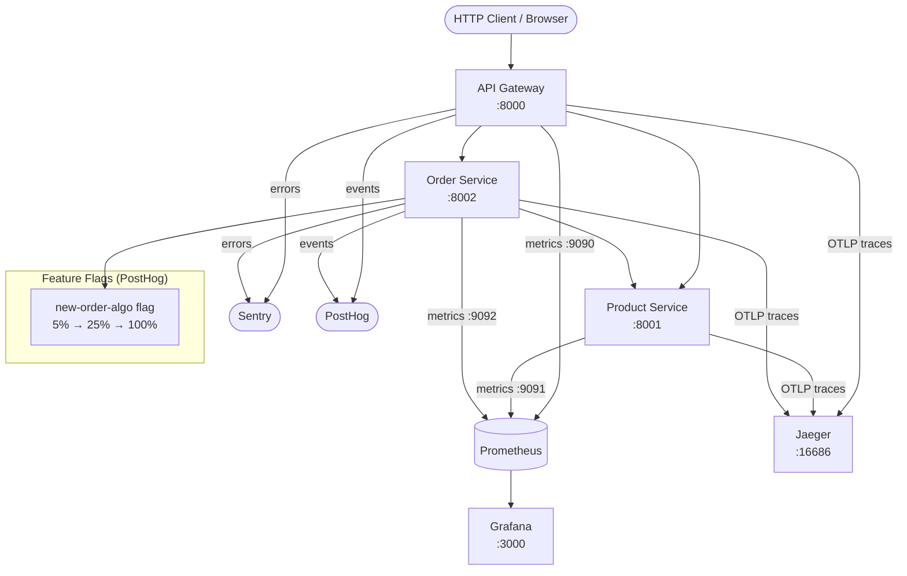

# Module 12: Capstone Project — Fully Instrumented Multi-Service Application

[← Module 11: Developer Experience](../11_developer-experience/) | [Topic Home](../../README.md)

---


---

## Table of Contents

1. [Overview](#overview)
2. [Prerequisites](#prerequisites)
3. [Project Brief](#project-brief)
4. [Architecture](#architecture)
5. [Milestones](#milestones)
6. [Acceptance Criteria](#acceptance-criteria)
7. [Help / Getting Unstuck](#help--getting-unstuck)
8. [Submission](#submission)
9. [Cross-Links](#cross-links)

---

## Overview

This capstone project is the culmination of the entire Feature Flags, Monitoring, and Developer Experience topic. You will build and fully instrument a multi-service application from scratch, applying every major concept from Modules 01–11: Prometheus metrics with Grafana SLO dashboards, Sentry error tracking, OpenTelemetry distributed tracing, PostHog product analytics, and feature flags controlling a production-style gradual rollout.

> [!IMPORTANT]
> **This module is build-oriented, not lecture-oriented.** There is no new theory here. Your job is to produce a working, instrumented system. The milestones and help sections are scaffolding to keep you moving forward — not a walkthrough to follow passively. Do the work. The struggle is where the learning happens.

**Difficulty:** Expert &nbsp;|&nbsp; **Estimated time:** 20–30 hours

---

## Prerequisites

- All prior modules in this topic (01–11) completed or substantially reviewed
- A working Python development environment
- Docker and Docker Compose installed
- A free account on: Sentry (sentry.io), PostHog (app.posthog.com) — or self-hosted versions

---

## Project Brief

**What you are building:** A simple e-commerce system consisting of three services:

1. **API Gateway** (`api-gateway/`) — Receives all external HTTP requests. Routes to backend services. Handles authentication.
2. **Product Service** (`product-service/`) — Manages product catalog. Returns product data.
3. **Order Service** (`order-service/`) — Handles order creation and status. Calls the Product Service.

**What you are instrumenting:**
- Prometheus metrics on all three services (counter, histogram, gauge) with a Grafana SLO dashboard
- Sentry error tracking on all three services with environment and release tagging
- OpenTelemetry distributed traces spanning all three services, exportable to Jaeger
- PostHog product analytics tracking key user events (product viewed, order created, order failed)
- Feature flag controlling a "new order processing algorithm" — initially rolled out to 5% of orders, then 25%, then 100%

**What you are delivering:**
- Working Docker Compose environment that runs all services + Prometheus + Grafana + Jaeger
- A Grafana SLO dashboard showing error rate and latency p99 per service
- A runbook for two failure scenarios: high order error rate and high order latency
- A written retrospective (500+ words) on what you built, design decisions, and what you'd do differently

---

## Architecture



_The three-service architecture. Every external request enters via the API Gateway. Prometheus scrapes each service's `/metrics` endpoint. All traces are exported to Jaeger via OTLP. Errors go to Sentry. User events and feature flag evaluations go to PostHog._

---

## Milestones

Work through the milestones in order. Each builds on the previous. Check each box as you complete it.

### Milestone 1: Services Running (3–4 hours)

- [ ] Create three Python FastAPI (or Flask) applications: `api-gateway`, `product-service`, `order-service`
- [ ] `api-gateway` has endpoints: `GET /products`, `POST /orders`, `GET /orders/{id}`
- [ ] `product-service` has: `GET /internal/products`, `GET /internal/products/{id}`
- [ ] `order-service` has: `POST /internal/orders`, `GET /internal/orders/{id}`
- [ ] Docker Compose file runs all three services
- [ ] Manual `curl` requests confirm all endpoints respond correctly

**Checkpoint:** All three services respond to requests. No instrumentation yet.

---

### Milestone 2: Prometheus Metrics (4–5 hours)

- [ ] Each service exposes `/metrics` endpoint using `prometheus_client`
- [ ] Each service has a Counter for `http_requests_total` with `method`, `endpoint`, `status` labels
- [ ] Each service has a Histogram for `http_request_duration_seconds` with `endpoint` label
- [ ] `order-service` has a Gauge for `pending_orders` (incrementing on create, decrementing on complete)
- [ ] Prometheus container added to Docker Compose, scraping all three services
- [ ] Grafana container added; Prometheus configured as a data source
- [ ] Grafana dashboard with 6 panels: error rate per service, p99 latency per service, request rate per service

**Checkpoint:** Load testing with `curl` in a loop produces visible metrics in Grafana.

---

### Milestone 3: Sentry Error Tracking (2–3 hours)

- [ ] `sentry-sdk` initialized in `api-gateway` and `order-service` (product-service is optional)
- [ ] Each app uses `environment` tag (`"development"` or `"production"`) and `release` tag (e.g., `"v0.1.0"`)
- [ ] Deliberately trigger an unhandled exception in `order-service` (raise an exception for a specific order ID)
- [ ] Confirm the exception appears in Sentry with correct environment, release, and stack trace
- [ ] Add at least one `sentry_sdk.set_extra()` call with relevant debugging context (e.g., order ID)

**Checkpoint:** A deliberate error produces a Sentry issue with enough context to triage without looking at code.

---

### Milestone 4: Distributed Tracing with OpenTelemetry (5–6 hours)

- [ ] `opentelemetry-sdk` initialized in all three services
- [ ] Jaeger container added to Docker Compose; services configured to export traces via OTLP
- [ ] W3C Trace Context headers (`traceparent`) propagated through all inter-service HTTP calls
- [ ] A single `POST /orders` request produces a trace with spans from all three services
- [ ] Each service adds at least one custom span attribute (e.g., `order.id`, `product.sku`)
- [ ] Trace visible in Jaeger UI with correct parent-child span relationships

**Checkpoint:** Open Jaeger UI, find a trace for a `POST /orders` request, see spans from all three services.

---

### Milestone 5: PostHog Analytics (2–3 hours)

- [ ] PostHog `python` SDK initialized in `api-gateway` and `order-service`
- [ ] Events tracked: `product_viewed` (with `product_id`), `order_created` (with `order_id`, `total_amount`), `order_failed` (with `error_reason`)
- [ ] At least one `posthog.identify()` call associating a user ID with user properties
- [ ] Events visible in PostHog Live Events view
- [ ] A funnel created in PostHog: `product_viewed → order_created`

**Checkpoint:** Navigate to PostHog, open Live Events, see events appearing in real-time as you make requests.

---

### Milestone 6: Feature Flag Rollout (3–4 hours)

- [ ] PostHog feature flag `new-order-algo` created with initial rollout at 5%
- [ ] `order-service` checks the flag for each order: if enabled, uses `new_algorithm()` (can be a stub that just adds a log line); otherwise uses `original_algorithm()`
- [ ] Both algorithms are tracked in PostHog as `order_algorithm_used` events with `algorithm` property
- [ ] Grafana dashboard shows per-algorithm latency and error rate (using a label on the metric)
- [ ] Successfully increase rollout to 25% in PostHog (no code changes required)
- [ ] Write a kill switch procedure: what steps would you take if the new algorithm caused a 10% error rate spike?

**Checkpoint:** Change flag from 5% to 25% in PostHog. Metrics in Grafana show the change in distribution without any redeployment.

---

### Milestone 7: SLO Dashboard and Runbooks (3–4 hours)

- [ ] Grafana SLO dashboard shows: 30-day error budget remaining for `order-service`, burn rate over 1h, p99 latency trend
- [ ] Two Grafana alerts configured: one for error rate > 1%, one for p99 > 2 seconds
- [ ] Runbook 1: "High Order Error Rate" — describes how to diagnose and mitigate, with references to Sentry, traces, and the feature flag kill switch
- [ ] Runbook 2: "High Order Latency" — describes how to use traces to identify the slow service and what to do about it
- [ ] Run a simulated incident: deliberately inject errors (5% of orders return 500), verify the alert fires within 5 minutes, follow the runbook

**Checkpoint:** Alert fires during the simulated incident. Following Runbook 1 leads to identifying and fixing the issue.

---

## Acceptance Criteria

Your project is complete when ALL of the following are true:

- [ ] `docker compose up` starts the entire stack without errors
- [ ] All three services respond correctly to manual `curl` requests
- [ ] Prometheus is scraping all three services (visible in `http://localhost:9090/targets`)
- [ ] Grafana SLO dashboard shows all 6 required panels
- [ ] A trace for `POST /orders` shows spans from all 3 services in Jaeger
- [ ] A deliberate error appears in Sentry with correct context
- [ ] PostHog shows live events and a funnel for the product → order flow
- [ ] Feature flag successfully controls algorithm selection without redeployment
- [ ] Two runbooks written with specific diagnostic and mitigation steps
- [ ] Written retrospective (500+ words) completed in the [Submission](#submission) section

---

## Help / Getting Unstuck

> [!NOTE]
> Use these hints one level at a time. Try to solve each blocker yourself first. The hints are here so you can keep moving when you're genuinely stuck — not so you can skip the thinking.

### If you're stuck on Milestone 2 (Prometheus)

<details>
<summary>Hint 1: Flask/FastAPI + prometheus_client setup</summary>

For Flask, add `prometheus_client` to your requirements and add this pattern:

```python
from prometheus_client import Counter, Histogram, generate_latest, CONTENT_TYPE_LATEST
import time

# Define metrics at module level (not inside a function)
REQUEST_COUNT = Counter('http_requests_total', 'Total requests', ['method', 'endpoint', 'status'])

@app.before_request
def before():
    request._start = time.time()

@app.after_request
def after(response):
    if request.path != '/metrics':
        REQUEST_COUNT.labels(method=request.method, endpoint=request.path, status=str(response.status_code)).inc()
    return response

@app.route('/metrics')
def metrics():
    return generate_latest(), 200, {'Content-Type': CONTENT_TYPE_LATEST}
```

</details>

<details>
<summary>Hint 2: Prometheus scrape config</summary>

Your `prometheus.yml` should look like this for three local services:

```yaml
scrape_configs:
  - job_name: 'api-gateway'
    static_configs:
      - targets: ['api-gateway:8000']  # Docker service name
  - job_name: 'product-service'
    static_configs:
      - targets: ['product-service:8001']
  - job_name: 'order-service'
    static_configs:
      - targets: ['order-service:8002']
```

In Docker Compose, use the service name as the hostname (not `localhost`).

</details>

---

### If you're stuck on Milestone 4 (Distributed Tracing)

<details>
<summary>Hint 1: OpenTelemetry initialization pattern</summary>

Add this to each service's startup code (before any routes are defined):

```python
from opentelemetry import trace
from opentelemetry.sdk.trace import TracerProvider
from opentelemetry.sdk.trace.export import BatchSpanProcessor
from opentelemetry.exporter.otlp.proto.grpc.trace_exporter import OTLPSpanExporter
from opentelemetry.sdk.resources import Resource

resource = Resource.create({"service.name": "api-gateway"})  # Change per service
provider = TracerProvider(resource=resource)
exporter = OTLPSpanExporter(endpoint="http://jaeger:4317", insecure=True)
provider.add_span_processor(BatchSpanProcessor(exporter))
trace.set_tracer_provider(provider)
```

</details>

<details>
<summary>Hint 2: Propagating trace context between services</summary>

When service A calls service B, you need to inject the W3C traceparent header into the outgoing HTTP request:

```python
from opentelemetry.propagate import inject
import requests

def call_service_b(url: str, data: dict):
    headers = {}
    inject(headers)  # Adds traceparent and tracestate headers
    response = requests.post(url, json=data, headers=headers)
    return response
```

Service B needs to extract the context from the incoming request — if you're using Flask or FastAPI with the auto-instrumentation library, this happens automatically.

</details>

---

### If you're stuck on Milestone 6 (Feature Flags)

<details>
<summary>Hint 1: PostHog flag evaluation pattern</summary>

```python
import posthog

posthog.api_key = os.getenv('POSTHOG_API_KEY')

def process_order(order_id: str, user_id: str, items: list):
    if posthog.feature_enabled('new-order-algo', user_id):
        result = new_algorithm(items)
        posthog.capture(user_id, 'order_algorithm_used', {'algorithm': 'new', 'order_id': order_id})
    else:
        result = original_algorithm(items)
        posthog.capture(user_id, 'order_algorithm_used', {'algorithm': 'original', 'order_id': order_id})
    return result
```

</details>

---

### Architecture Decisions You Will Need to Make

These are intentionally left open for you to decide:

1. **How will you simulate "users"?** You can generate random UUIDs per request, use a fixed set of user IDs, or read from a header.
2. **How will you handle the feature flag for anonymous/system requests?** PostHog flags need a `distinct_id`.
3. **What data do your Grafana panels actually query?** The panel configuration requires specific PromQL. Write your queries out on paper before configuring Grafana.
4. **What goes in the runbooks?** A runbook that says "check the logs" is not useful. A runbook that says "run `sum(rate(http_requests_total{service='order-service',status=~'5..'}[5m]))` to confirm error rate" is useful.

---

## Submission

When your project is complete, fill in this section:

### Project Location

**Repository URL or local path:** _To be filled in_

### Retrospective

_Write 500+ words covering:_
- _What you built and how you approached it_
- _The hardest part and how you solved it_
- _What you'd do differently if starting over_
- _What observability gaps remain in your implementation_
- _What you'd add if this were a real production system_

_(Write here)_

### Self-Assessment

| Criterion | Score (1–5) | Notes |
|-----------|-------------|-------|
| Prometheus metrics completeness | /5 | |
| Grafana dashboard quality | /5 | |
| Sentry integration depth | /5 | |
| OpenTelemetry trace coverage | /5 | |
| PostHog analytics usefulness | /5 | |
| Feature flag implementation | /5 | |
| Runbook quality | /5 | |
| Code quality and documentation | /5 | |
| **Overall** | **/40** | |

---

## Cross-Links

- [[feature-flags-monitoring/modules/01_introduction]] — Conceptual foundation applied in this capstone
- [[feature-flags-monitoring/modules/02_metrics-and-prometheus]] — Prometheus instrumentation patterns used in Milestones 2 and 7
- [[feature-flags-monitoring/modules/03_dashboards-and-grafana]] — Grafana dashboard and alert configuration used in Milestones 2 and 7
- [[feature-flags-monitoring/modules/04_error-tracking-with-sentry]] — Sentry integration used in Milestone 3
- [[feature-flags-monitoring/modules/05_distributed-tracing]] — OpenTelemetry patterns used in Milestone 4
- [[feature-flags-monitoring/modules/06_posthog-product-analytics]] — PostHog events and funnels used in Milestone 5
- [[feature-flags-monitoring/modules/08_feature-flags-deep-dive]] — Feature flag patterns used in Milestone 6
- [[feature-flags-monitoring/modules/10_incident-response]] — Runbook format used in Milestone 7
