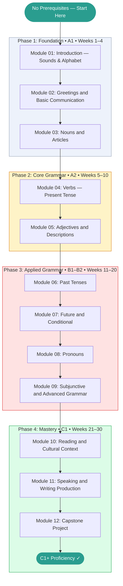

# French Language Learning — Learning Roadmap

> This roadmap is your study plan. Work through the phases in order.
> Each phase builds directly on the previous one.
> Mark your current position with **← You Are Here** and update it as you progress.

---

## Prerequisites Map

No prior French knowledge is required. This topic starts from absolute zero.

```
No prerequisites — begin at Module 01
```

If you have existing French knowledge, take the Module 01 test. Score ≥ 85% → consider starting at Module 04 or 05.

---

## Learning Path Visualization



---

## Phase Breakdown

### Phase 1: Foundation (A1)

**Goal:** Understand how French sounds, build pronunciation habits, learn the first vocabulary and greetings, and understand grammatical gender in nouns and articles. Leave Phase 1 able to introduce yourself, count, and read simple French aloud.

| Module | Name | Est. Hours | Key Skill Gained |
|--------|------|-----------|-----------------|
| 01 | Introduction: Sounds, Alphabet, and First Words | 15h | Pronunciation system; alphabet; first words; numbers 1–20 |
| 02 | Greetings and Basic Communication | 15h | Greetings; introductions; numbers 1–100; days/months; polite phrases |
| 03 | Nouns and Articles | 15h | Grammatical gender; definite/indefinite/partitive articles; plurals |

**Phase 1 Exit Criteria:**

- [ ] Can introduce yourself, ask for someone's name, and respond in French
- [ ] Can count to 100, give a date, and tell simple time expressions
- [ ] Scores ≥ 70% on Module 01, 02, and 03 tests
- [ ] Can read a simple French sentence aloud with correct pronunciation
- [ ] Understands and can apply grammatical gender to nouns with articles

**Milestone unlocked:** Foundation Built

---

### Phase 2: Core Grammar (A2)

**Goal:** Build a working sentence-forming ability in the present tense. Master être, avoir, and the most common verbs. Describe people and things with adjectives. Leave Phase 2 able to hold a basic conversation in the present tense.

| Module | Name | Est. Hours | Key Skill Gained |
|--------|------|-----------|-----------------|
| 04 | Verbs: Present Tense | 20h | être/avoir; regular -ER/-IR/-RE conjugation; 15 key irregular verbs |
| 05 | Adjectives and Descriptions | 15h | Adjective agreement; placement (BANGS); comparatives/superlatives |

**Phase 2 Exit Criteria:**

- [ ] Can conjugate all regular -ER, -IR, -RE verbs in the present tense
- [ ] Can use être, avoir, aller, faire, pouvoir, vouloir, savoir correctly
- [ ] Can describe people, places, and objects using adjectives with correct agreement
- [ ] Scores ≥ 70% on Module 04 and 05 tests

**Milestone unlocked:** A2 Reached

---

### Phase 3: Applied Grammar (B1–B2)

**Goal:** Expand into the past, future, and conditional. Master the pronoun system. Learn the subjunctive and advanced connectors. Leave Phase 3 able to discuss past events, future plans, hypothetical situations, and complex ideas with grammatical accuracy.

| Module | Name | Est. Hours | Key Skill Gained |
|--------|------|-----------|-----------------|
| 06 | Past Tenses: Passé Composé and Imparfait | 25h | Compound past vs. descriptive past; past participle agreement; auxiliary choice |
| 07 | Future and Conditional | 20h | Futur proche; futur simple; conditionnel; si-clauses |
| 08 | Pronouns | 20h | COD/COI/reflexive; relative pronouns; pronoun stacking |
| 09 | Subjunctive and Advanced Grammar | 25h | Subjonctif formation and triggers; passive voice; discourse connectors |

**Phase 3 Exit Criteria:**

- [ ] Can narrate a past event correctly using passé composé and imparfait
- [ ] Can discuss future plans and conditional scenarios using futur simple and conditionnel
- [ ] Can use COD and COI pronouns correctly in all tenses
- [ ] Can recognize and use the subjunctive with common trigger expressions
- [ ] Scores ≥ 75% on Modules 06–09

**Milestone unlocked:** B1–B2 Reached

---

### Phase 4: Mastery (C1+)

**Goal:** Develop authentic reading strategies, master formal writing, build speaking fluency, and synthesize all prior knowledge into a substantial production project. Leave Phase 4 able to read and write in French at a professional level.

| Module | Name | Est. Hours | Key Skill Gained |
|--------|------|-----------|-----------------|
| 10 | Reading and Cultural Context | 25h | Authentic text strategies; false friends; register analysis |
| 11 | Speaking and Writing Production | 25h | Essay structure; formal letter format; oral fluency strategies |
| 12 | Capstone Project | 30h | 5–7 min presentation + 400-word formal essay at C1 level |

**Phase 4 Exit Criteria:**

- [ ] Can read a Le Monde editorial or literary excerpt with ≥ 80% comprehension
- [ ] Can write a structured 400-word essay with correct grammar, varied vocabulary, and appropriate register
- [ ] Can deliver a 5–7 minute presentation in French on a chosen topic
- [ ] Scores ≥ 80% on Modules 10–11
- [ ] Capstone project submitted and assessed

**Milestone unlocked:** C1 Capstone, Topic Complete

---

## Time Estimates Summary

| Phase | Weeks | Est. Hours | Cumulative |
|-------|-------|-----------|------------|
| Phase 1: Foundation | 1–4 | 45h | 45h |
| Phase 2: Core Grammar | 5–10 | 35h | 80h |
| Phase 3: Applied Grammar | 11–20 | 90h | 170h |
| Phase 4: Mastery | 21–30 | 80h | 250h |
| **Total (active curriculum)** | **30** | **250h** | |

> [!NOTE]
> These estimates cover active study of this curriculum. CEFR estimates for reaching C1 total
> approximately 700 hours — the difference should be filled with supplementary listening
> (radio, podcasts, films), independent reading, and conversation practice. The curriculum
> provides structure; immersion provides volume.

---

## Milestone Definitions

| Milestone | Earned When | Point Threshold |
|-----------|------------|----------------|
| First Words | Module 01 complete | Any score |
| Foundation Built | Phase 1 complete, all tests ≥ 70% | 80 pts |
| A2 Reached | Phase 2 complete, all tests ≥ 70% | 150 pts |
| B1–B2 Reached | Phase 3 complete, all tests ≥ 75% | 320 pts |
| Topic Complete | All 12 modules finished | 500 pts |
| C1 Capstone | Capstone project assessed | 600 pts |
| DELF Ready | Modules 06–10 avg ≥ 85% | — |

---

## Alternative Paths

### Fast Track (Prior French Experience)

If you studied French in school and have retained some vocabulary and basic grammar:

```
Take Module 01 test → Score ≥ 85%? → Start at Module 04
Take Module 04 test → Score ≥ 85%? → Start at Module 06
```

Be honest: proceeding too fast creates grammatical fossilization — errors that become habitual and very hard to fix later.

### Deep Dive Path (Maximum Accuracy)

For learners who prioritize grammatical accuracy and formal register:

- After each module: copy key rules into [CHEATSHEET.md](./CHEATSHEET.md) in your own words
- After Phase 2: begin reading simple authentic texts (Le Petit Prince, graded readers)
- After Phase 3: Listen to daily RFI Journal en français facile — a 10-minute news bulletin at B1 level

### Immersion-Enhanced Path (Learn by Exposure)

For learners who can supplement with immersion:

```
Phase 1 → Start watching French films with French subtitles (not English)
Phase 2 → Add a French podcast 3x/week (e.g., Coffee Break French)
Phase 3 → Begin reading one article per day in French (Le Monde, RFI)
Phase 4 → Find a conversation partner or tutored speaking practice
```

---

## You Are Here

> **Current Phase:** _Not started_
>
> **Current Module:** _None — begin at [Module 01](./modules/01_introduction/README.md)_
>
> **Last Completed Module:** _None_
>
> **Next Action:** Open Module 01 and read the Overview section.
>
> _Update this section each time you advance to a new module or phase._
