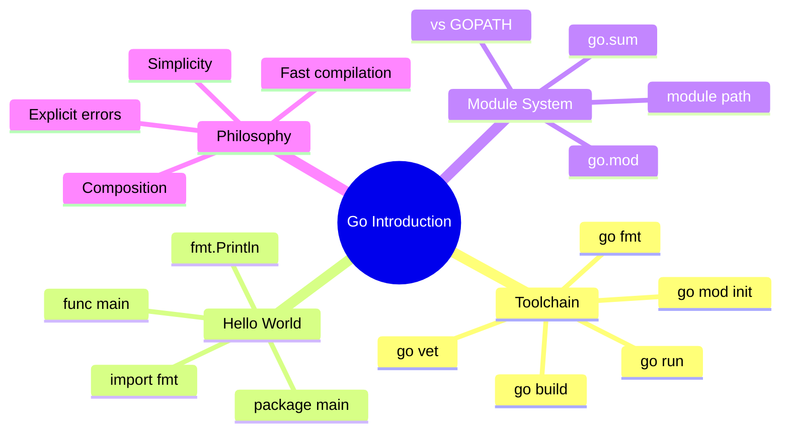

# Notes — Module 0: Introduction

> These are your personal study notes. Write freely and honestly.
> Incomplete notes are fine — they show where your understanding still needs work.
> Return to this file to add insights as they develop over time.

**Module:** [[modules/go-0-introduction]]
**Topic:** [[go]]
**Date started:** ___________
**Status:** Not started

---

## Concept Map

_Sketch how the concepts in this module relate to each other. Fill in the Mermaid diagram._



_Alternative: draw this on paper, photo it, and link the image here._

---

## Study Tips for This Module

Before diving in, a few things that help with the Go introduction specifically:

1. **Type every code example by hand.** The muscle memory of `package main`, `import "fmt"`, `func main()` matters. Don't copy-paste.
2. **Run `go fmt` immediately.** After writing code, run `go fmt ./...` and look at what it changes. This builds the habit early.
3. **Try intentional errors.** Delete the `import "fmt"` line and see what the compiler says. Add an unused variable. Put the `{` on a new line. The compiler errors are clear and educational.
4. **Initialize a real module.** Don't just run individual files — create a directory, run `go mod init`, and work inside that module from the start.

---

## Key Insights

_The "aha moments" — the things that, once understood, made the rest clear._
_Be specific: "I finally understood X because Y" is more useful than "X makes sense"._

1. _Add insights as you discover them_
2. _Add insights as you discover them_
3. _Add insights as you discover them_

---

## My Understanding

_Explain the core concepts in your own words, as if teaching them to someone else._
_If you can't explain it simply, you don't understand it well enough yet._

### package main and func main()

_Your explanation here:_

_What I'm still unsure about:_ ___________

### The go.mod module system

_Your explanation here:_

_What I'm still unsure about:_ ___________

### go run vs go build

_Your explanation here:_

_What I'm still unsure about:_ ___________

### Why unused imports are compile errors

_Your explanation here:_

---

## Connections to Other Topics

_How does this module connect to things you already know?_

| This module's concept | Connects to | How |
|----------------------|-------------|-----|
| `package main` | [[python]] `if __name__ == "__main__":` | Both define the program entry point |
| `go mod init` | npm's `package.json`, pip's `requirements.txt` | Both are dependency declaration files |
| `go fmt` | Python's `black`, JS's `prettier` | Opinionated auto-formatters that remove style debates |
| Compiled binary | [[docker-containers]] | Go binaries are easy to containerize — just copy the binary |

---

## Questions That Arose

_Log questions as they appear. Don't stop to answer them now — just capture them._
_Then move the serious ones to [QUESTIONS.md](./QUESTIONS.md)._

- [ ] _Add questions here as they occur_

---

## Code Snippets Worth Remembering

_Patterns, idioms, or examples that captured something important._

### The minimal Go program

```go
package main

import "fmt"

func main() {
	fmt.Println("Hello, World!")
}
```

_Why I'm saving this:_ The irreducible minimum — everything Go needs to be a runnable program.

---

### Initializing a new module

```bash
mkdir myproject && cd myproject
go mod init github.com/yourname/myproject
```

_Why I'm saving this:_ This is always the first thing you do in a new Go project.

---

### Checking the error pattern

```go
result, err := someFunction()
if err != nil {
    return fmt.Errorf("someFunction failed: %w", err)
}
```

_Why I'm saving this:_ This pattern appears in nearly every Go program. Worth internalizing from day one.

---

## What Tripped Me Up

_Mistakes I made, misconceptions I had, things that confused me more than they should have._
_Being honest here helps you later._

- _Add stumbling blocks here as they occur_

---

## Summary in My Own Words

_Write a 3–5 sentence summary of this entire module without looking at any notes._
_If you can't do this, you need more study time._

_Write your summary here after completing the module:_

---

_Last updated: ____________
