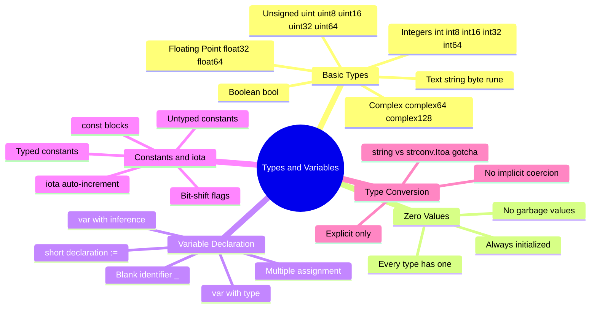

# Notes — Module 1: Types and Variables

> These are your personal study notes. Write freely and honestly.
> Incomplete notes are fine — they show where your understanding still needs work.
> Return to this file to add insights as they develop over time.

**Module:** [[go/1. Types and Variables]]
**Topic:** [[go]]
**Date started:** _YYYY-MM-DD_
**Status:** Not started

---

## Concept Map

_Sketch how the concepts in this module relate to each other. Fill in the Mermaid diagram._



_Alternative: draw this on paper, photo it, and link the image here._

---

## Key Insights

_The "aha moments" — the things that, once understood, made the rest clear._
_Be specific: "I finally understood X because Y" is more useful than "X makes sense"._

1. **Zero values are intentional:** _Add your insight once it clicks — e.g., "I realized that zero values mean I can write `var count int` and immediately do `count++` without a separate setup line."_
2. **`:=` is only for locals:** _Add your insight — e.g., "The `:` signals declaration; without it, `=` is just assignment of an existing variable."_
3. _Add insights as you discover them_

---

## My Understanding

_Explain the core concepts in your own words, as if teaching them to someone else._
_If you can't explain it simply, you don't understand it well enough yet._

### Basic Types

_Your explanation here — e.g., "Go has integer types of fixed sizes (int8 through int64) plus platform-dependent int/uint. float64 is what you usually want for decimals. string is UTF-8. byte = uint8, rune = int32 for Unicode. bool is true/false only."_

_What I'm still unsure about:_ _e.g., "When exactly should I use int32 vs int?"_

---

### Zero Values

_Your explanation here — e.g., "Every variable you declare gets initialized automatically. int → 0, float64 → 0.0, string → empty, bool → false, pointer → nil. You never get garbage."_

_What I'm still unsure about:_ _e.g., "Does this also apply to struct fields?"_

---

### Variable Declaration

_Your explanation here — e.g., "Three forms: `var x int = 1` (explicit), `var x = 1` (inferred), `x := 1` (shorthand, functions only). `:=` must declare at least one new variable."_

_What I'm still unsure about:_ _e.g., "When should I prefer var over := in a function?"_

---

### Constants and iota

_Your explanation here — e.g., "Constants are compile-time values. In a const block, `iota` starts at 0 and increments by 1 for each line. You can use it with expressions like `1 << iota` to make bit flags."_

_What I'm still unsure about:_ _e.g., "Can iota be used outside a const block?"_

---

### Type Conversion

_Your explanation here — e.g., "Go never converts types for you — you must write `float64(myInt)` explicitly. The big gotcha: `string(65)` gives `'A'`, not `'65'`. Use `strconv.Itoa(65)` to get the string `'65'`."_

_What I'm still unsure about:_ _e.g., "What exactly happens to precision when converting float64 to int?"_

---

## Connections to Other Topics

_How does this module connect to things you already know?_

| This module's concept | Connects to | How |
|----------------------|-------------|-----|
| Static types (int, float64, string) | [[python/1. Variables and Types]] | Python attaches types to values; Go attaches types to variables. Same idea, opposite direction. |
| Zero values (nil for pointers) | [[go/4. Pointers]] | A nil pointer's zero value means "points to nothing" — dereferencing it panics. |
| iota bit flags (ReadPerm, WritePerm) | [[go/5. Structs and Methods]] | Struct fields often use typed constants for status or mode values. |
| Explicit type conversion | [[go/7. Interfaces]] | Interface satisfaction depends on exact types; conversion matters when implementing interfaces. |

---

## Questions That Arose

_Log questions as they appear. Don't stop to answer them now — just capture them._
_Then move the serious ones to [QUESTIONS.md](./QUESTIONS.md)._

- [ ] _e.g., "Why does `int` size depend on the platform? What does that mean for cross-platform code?"_ → add to QUESTIONS.md
- [ ] _e.g., "Can I do arithmetic between int and float64 directly?"_ → test in the playground
- [ ] _e.g., "What happens to iota if I skip a line in a const block?"_ → might be answered in the module

---

## Code Snippets Worth Remembering

_Patterns, idioms, or examples that captured something important._

### The three declaration forms side-by-side

```go
// At package level — must use var
var packageVar int = 10

func example() {
    // Inside function — all three forms work
    var a int = 10   // explicit type
    var b = 10       // inferred type
    c := 10          // short declaration

    _ = a + b + c    // suppress "unused variable" for this demo
}
```

_Why I'm saving this:_ Seeing all three forms in one place makes it easy to compare. The rule: `var` at package level, `:=` for most locals.

---

### The strconv.Itoa vs string(n) pattern

```go
import (
    "fmt"
    "strconv"
)

n := 65
fmt.Println(string(n))       // "A"    — Unicode code point 65
fmt.Println(strconv.Itoa(n)) // "65"   — decimal string representation
fmt.Sprintf("%d", n)         // "65"   — alternative using fmt
```

_Why I'm saving this:_ This is the single most common type-conversion gotcha in Go. Muscle memory on this one saves debugging time.

---

### iota bit-shift pattern

```go
const (
    ReadPerm  = 1 << iota // 1
    WritePerm             // 2
    ExecPerm              // 4
)

// Combine flags with |, test with &
perms := ReadPerm | WritePerm
hasRead := perms&ReadPerm != 0  // true
```

_Why I'm saving this:_ The bit-shift iota pattern appears in real Go codebases constantly — HTTP methods, file modes, feature flags, log levels.

---

## What Tripped Me Up

_Mistakes I made, misconceptions I had, things that confused me more than they should have._
_Being honest here helps you later._

- _e.g.,_ **Using `:=` at package level** — I initially thought `:=` works everywhere like in Python, but it only works inside functions. It clicked when I remembered `:` means "new declaration," which only makes sense in a local scope.
- _e.g.,_ **`string(int)` confusion** — I expected `string(65)` to give `"65"`. It gives `"A"`. The rule: `string()` on an integer treats it as a Unicode code point. Use `strconv.Itoa()` for numbers.
- _Fill in your own stumbling blocks as you work through the material._

---

## Summary in My Own Words

_Write a 3–5 sentence summary of this entire module without looking at any notes._
_If you can't do this, you need more study time._

_Your summary here — write it after completing the module._

---

_Last updated: YYYY-MM-DD_
