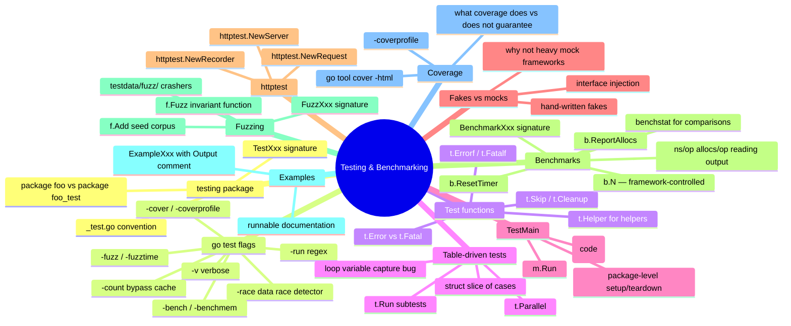

# Notes — Module 11: Testing and Benchmarking

> These are your personal study notes. Write freely and honestly.
> Incomplete notes are fine — they show where your understanding still needs work.
> Return to this file to add insights as they develop over time.

**Module:** [[go/11. Testing and Benchmarking]]
**Topic:** [[go]]
**Date started:** YYYY-MM-DD
**Status:** In progress

---

## Concept Map

_Sketch how the concepts in this module relate to each other. Fill in the Mermaid diagram._



_Alternative: draw this on paper, photo it, and link the image here._

---

## Key Insights

_The "aha moments" — the things that, once understood, made the rest clear._
_Be specific: "I finally understood X because Y" is more useful than "X makes sense"._

1. **t.Helper() and failure location:** I finally understood that without `t.Helper()`, every failure from a helper function points to the helper's source line — useless when the helper is called from 10 different tests. `t.Helper()` redirects the failure message to the caller. This is one of those details that seems minor until you spend 20 minutes debugging which test failed.
2. **b.N is not yours to set:** The benchmark framework runs the loop until results are stable — you never choose N. Your only job is to put exactly one unit of work inside the loop. Setting N yourself would give meaningless results.
3. _Add insights as you discover them_

---

## My Understanding

_Explain the core concepts in your own words, as if teaching them to someone else._
_If you can't explain it simply, you don't understand it well enough yet._

### t.Error vs t.Fatal

_Your explanation here_

_What I'm still unsure about:_ (e.g., what happens if t.Fatal is called in a goroutine spawned by the test, not from the test itself)

### Table-driven tests

_Your explanation here_

_What I'm still unsure about:_ (e.g., when should I use a named struct type vs an anonymous struct for the test cases table)

### Benchmarks and b.N

_Your explanation here_

_What I'm still unsure about:_ (e.g., what does the -8 suffix mean in benchmark output like BenchmarkXxx-8)

### Fuzzing

_Your explanation here_

_What I'm still unsure about:_ (e.g., how does the fuzzer know which mutations are "interesting" vs redundant)

### Interfaces and fakes

_Your explanation here_

_What I'm still unsure about:_ (e.g., at what point does a fake become complex enough that you should use a library instead)

---

## Connections to Other Topics

_How does this module connect to things you already know?_

| This module's concept | Connects to | How |
|----------------------|-------------|-----|
| Interface-based fakes | [[go/6. Methods and Interfaces]] | Fakes are just types that implement the required interface; Go's structural typing means you can define a narrow test-only interface that the real type satisfies without any changes to production code |
| Checking errors in tests | [[go/8. Error Handling]] | `errors.Is` and `errors.As` are how you verify that a function returned a specific error type, not just any error; wrapping errors with `%w` enables this in tests |
| Coverage and profiling | [[go/16. Performance and Profiling]] | Coverage profiles and pprof profiles use the same `-coverprofile` / `-cpuprofile` flags; profiling during benchmarks is covered in Module 16 |

---

## Questions That Arose

_Log questions as they appear. Don't stop to answer them now — just capture them._
_Then move the serious ones to [QUESTIONS.md](./QUESTIONS.md)._

- [ ] Does `t.Parallel()` inside a `t.Run` subtest make the subtest parallel with siblings, or parallel with top-level tests? → added to QUESTIONS.md as Q001
- [ ] What happens when a fuzz test crashes — does the crasher file contain the exact input, or a mutation of it? → might be answered in go.dev/security/fuzz
- [ ] Is there a way to run only the fuzz seed corpus without running the full test suite? → `go test -run FuzzXxx` should do it

---

## Code Snippets Worth Remembering

_Patterns, idioms, or examples that captured something important._

### The canonical table-driven test skeleton

```go
func TestXxx(t *testing.T) {
    tests := []struct {
        name    string
        input   TypeA
        want    TypeB
        wantErr bool
    }{
        {"case name", input, want, false},
    }
    for _, tt := range tests {
        t.Run(tt.name, func(t *testing.T) {
            got, err := Xxx(tt.input)
            if (err != nil) != tt.wantErr {
                t.Fatalf("error = %v; wantErr %v", err, tt.wantErr)
            }
            if got != tt.want {
                t.Errorf("got %v; want %v", got, tt.want)
            }
        })
    }
}
```

_Why I'm saving this:_ This skeleton covers 80% of all tests I'll ever write. The `wantErr bool` pattern for error checking, `t.Fatalf` on error mismatch, and `t.Errorf` on value mismatch — all in one place.

---

### The t.Helper pattern for test helpers

```go
func assertNoError(t *testing.T, err error) {
    t.Helper() // must be first line
    if err != nil {
        t.Fatalf("unexpected error: %v", err)
    }
}
```

_Why I'm saving this:_ `t.Helper()` as the first line of every helper function. Easy to forget, high cost when forgotten.

---

### Benchmark skeleton with reset

```go
func BenchmarkXxx(b *testing.B) {
    setup := doExpensiveSetup()
    b.ResetTimer()
    for i := 0; i < b.N; i++ {
        _ = functionUnderTest(setup)
    }
}
```

_Why I'm saving this:_ The `b.ResetTimer()` after setup is the thing I'll forget most often.

---

### Fuzz test skeleton

```go
func FuzzXxx(f *testing.F) {
    f.Add("seed1")   // add representative seed inputs
    f.Add("seed2")
    f.Fuzz(func(t *testing.T, input string) {
        result, err := Xxx(input)
        if err != nil {
            return // invalid input — the function correctly rejected it
        }
        // assert invariant about result
        _ = result
    })
}
```

_Why I'm saving this:_ The key point: return early if err != nil, then assert the invariant on successful results.

---

## What Tripped Me Up

_Mistakes I made, misconceptions I had, things that confused me more than they should have._
_Being honest here helps you later._

- **t.Fatal in a loop** — I initially used `t.Fatalf` inside a range over test cases without `t.Run`, which stopped at the first failure. Switching to `t.Run` + `t.Errorf` gives you all failures at once.
- **Benchmark timer** — I initially started the measurement before setup was complete. The `b.ResetTimer()` call must come after all setup, not before it.

---

## Summary in My Own Words

_Write a 3–5 sentence summary of this entire module without looking at any notes._
_If you can't do this, you need more study time._

_Write your summary here after completing the module._

---

_Last updated: YYYY-MM-DD_
