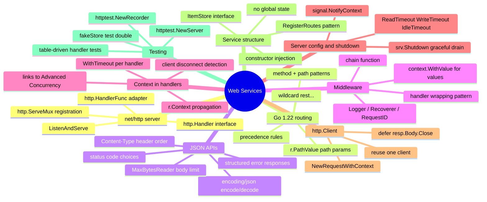

# Notes — Module 13: Web Services and APIs

> These are your personal study notes. Write freely and honestly.
> Incomplete notes are fine — they show where your understanding still needs work.
> Return to this file to add insights as they develop over time.

**Module:** [[go/13. Web Services and APIs]]
**Topic:** [[go]]
**Date started:** YYYY-MM-DD
**Status:** In progress

---

## Concept Map

_Sketch how the concepts in this module relate to each other. Fill in the Mermaid diagram._



_Alternative: draw this on paper, photo it, and link the image here._

---

## Key Insights

_The "aha moments" — the things that, once understood, made the rest clear._
_Be specific: "I finally understood X because Y" is more useful than "X makes sense"._

1. **Middleware is just a function from Handler to Handler:** Once I realised that `func(http.Handler) http.Handler` is all a middleware is, I could write any middleware I wanted. The pattern is always the same: return a new HandlerFunc that calls next.ServeHTTP inside it.
2. **Headers must be set before any write:** I initially assumed I could set Content-Type at the end of a handler as cleanup. It doesn't work — as soon as you write bytes to the ResponseWriter, the HTTP headers are flushed. Set them first.
3. _Add insights as you discover them_

---

## My Understanding

_Explain the core concepts in your own words, as if teaching them to someone else._
_If you can't explain it simply, you don't understand it well enough yet._

### net/http and ServeMux

_Your explanation here_

_What I'm still unsure about:_ (e.g., exactly when does Go's mux decide that one pattern is more specific than another?)

### Go 1.22 routing patterns

_Your explanation here_

_What I'm still unsure about:_ (e.g., what happens when both a method-qualified and a method-unqualified pattern match the same path?)

### JSON encoding/decoding in handlers

_Your explanation here_

_What I'm still unsure about:_ (e.g., what does DisallowUnknownFields do when the JSON has extra nested objects?)

### Middleware chaining

_Your explanation here_

_What I'm still unsure about:_ (e.g., how do I capture the response status code in a logging middleware without a custom ResponseWriter wrapper?)

### Graceful shutdown

_Your explanation here_

_What I'm still unsure about:_ (e.g., what happens to WebSocket connections during Shutdown — are they forcibly closed?)

---

## Connections to Other Topics

_How does this module connect to things you already know?_

| This module's concept | Connects to | How |
|----------------------|-------------|-----|
| JSON error responses | [[go/8. Error Handling]] | `errors.As` unwrapping `*http.MaxBytesError` is the same pattern used for custom error types |
| `r.Context()` propagation | [[go/12. Advanced Concurrency Patterns]] | The context cancellation model is identical; requests are just another source of cancellable contexts |
| `httptest` table-driven tests | [[go/11. Testing and Benchmarking]] | `httptest.NewRecorder` replaces a real ResponseWriter but `t.Run` and the table pattern are unchanged |
| `ItemStore` interface injection | [[go/6. Methods and Interfaces]] | Dependency injection via interface is the same structural typing pattern; no `implements` keyword needed |

---

## Questions That Arose

_Log questions as they appear. Don't stop to answer them now — just capture them._
_Then move the serious ones to [QUESTIONS.md](./QUESTIONS.md)._

- [ ] Does the Go 1.22 mux match trailing slash vs no trailing slash differently? → added to QUESTIONS.md as Q001
- [ ] Is there a performance difference between `json.NewEncoder(w).Encode(v)` and `json.Marshal` + `w.Write`? → might be answered by benchmarking
- [ ] What is the correct way to capture the response status code in logging middleware? → needs a custom ResponseWriter wrapper study

---

## Code Snippets Worth Remembering

_Patterns, idioms, or examples that captured something important._

### The writeJSON / writeError helpers

```go
func writeJSON(w http.ResponseWriter, status int, v any) {
    w.Header().Set("Content-Type", "application/json")
    w.WriteHeader(status)
    json.NewEncoder(w).Encode(v)
}

func writeError(w http.ResponseWriter, status int, msg string) {
    writeJSON(w, status, map[string]string{"error": msg})
}
```

_Why I'm saving this:_ These two helpers appear in virtually every Go JSON API. Setting Content-Type before WriteHeader is the key ordering constraint.

---

### Graceful shutdown skeleton

```go
ctx, stop := signal.NotifyContext(context.Background(), syscall.SIGINT, syscall.SIGTERM)
defer stop()

go func() {
    if err := srv.ListenAndServe(); err != nil && err != http.ErrServerClosed {
        log.Fatalf("server: %v", err)
    }
}()

<-ctx.Done()
shutdownCtx, cancel := context.WithTimeout(context.Background(), 30*time.Second)
defer cancel()
srv.Shutdown(shutdownCtx)
```

_Why I'm saving this:_ Every production Go HTTP service needs this pattern. The key insight is that `http.ErrServerClosed` is the expected return after Shutdown — it is not an error.

---

### Middleware wrapping pattern

```go
func MyMiddleware(next http.Handler) http.Handler {
    return http.HandlerFunc(func(w http.ResponseWriter, r *http.Request) {
        // before
        next.ServeHTTP(w, r)
        // after
    })
}
```

_Why I'm saving this:_ The shape is always the same. Fill in before/after with whatever the middleware needs to do.

---

### http.Client with context

```go
req, _ := http.NewRequestWithContext(ctx, http.MethodGet, url, nil)
resp, err := client.Do(req)
if err != nil {
    return err
}
defer resp.Body.Close()
```

_Why I'm saving this:_ The two rules are always: use `NewRequestWithContext` (not `NewRequest`) and always `defer resp.Body.Close()`.

---

## What Tripped Me Up

_Mistakes I made, misconceptions I had, things that confused me more than they should have._
_Being honest here helps you later._

- **Headers after WriteHeader** — I initially thought you could set headers anywhere in a handler. The HTTP spec and Go's implementation both flush headers on the first write. Set `Content-Type` first, always.
- **Not returning after writeError** — Writing an error response and forgetting `return` causes the handler to continue running and attempt a second write. The compiler doesn't catch this — it's a logic error.

---

## Summary in My Own Words

_Write a 3–5 sentence summary of this entire module without looking at any notes._
_If you can't do this, you need more study time._

_Write your summary here after completing the module._

---

_Last updated: YYYY-MM-DD_
