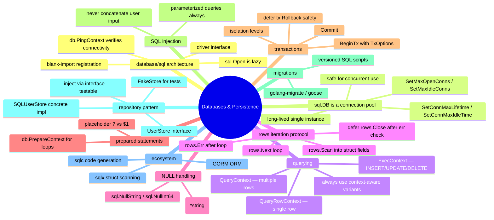

# Notes — Module 14: Databases and Persistence

> These are your personal study notes. Write freely and honestly.
> Incomplete notes are fine — they show where your understanding still needs work.
> Return to this file to add insights as they develop over time.

**Module:** [[go/14. Databases and Persistence]]
**Topic:** [[go]]
**Date started:** YYYY-MM-DD
**Status:** In progress

---

## Concept Map

_Sketch how the concepts in this module relate to each other. Fill in the Mermaid diagram._



_Alternative: draw this on paper, photo it, and link the image here._

---

## Key Insights

_The "aha moments" — the things that, once understood, made the rest clear._
_Be specific: "I finally understood X because Y" is more useful than "X makes sense"._

1. **`sql.DB` is a pool, not a connection:** _I finally understood this when I realized that `db.QueryContext` and `db.ExecContext` called from different goroutines simultaneously each get their own connection from the pool — there's no serialization. This is why it's safe for concurrent use and why you must NOT create a new `sql.DB` per request._
2. **`defer tx.Rollback()` after Commit is a no-op:** _The safety idiom clicked when I realized: after `tx.Commit()` succeeds, calling `tx.Rollback()` does nothing — the database ignores it. So the defer is free to always be there. It only fires on the "something went wrong" paths._
3. _Add insights as you discover them_

---

## My Understanding

_Explain the core concepts in your own words, as if teaching them to someone else._
_If you can't explain it simply, you don't understand it well enough yet._

### The database/sql driver model

_Your explanation here_

_What I'm still unsure about:_ (e.g., what exactly happens inside `sql.Register` — is there a global map?)

### sql.DB as a connection pool

_Your explanation here_

_What I'm still unsure about:_ (e.g., when does the pool actually create a new connection vs. reuse an idle one?)

### The rows iteration protocol

_Your explanation here_

_What I'm still unsure about:_ (e.g., what exactly does `rows.Close()` release — just the row cursor, or the connection back to the pool?)

### Transactions

_Your explanation here_

_What I'm still unsure about:_ (e.g., what does `LevelSerializable` actually prevent that `LevelReadCommitted` does not?)

### The repository pattern

_Your explanation here_

---

## Connections to Other Topics

_How does this module connect to things you already know?_

| This module's concept | Connects to | How |
|----------------------|-------------|-----|
| Repository interface (`UserStore`) | [[go/6. Methods and Interfaces]] | The interface is defined with methods; `SQLUserStore` satisfies it structurally — same mechanism as any Go interface |
| Error wrapping (`fmt.Errorf("get user: %w", err)`) | [[go/8. Error Handling]] | Every DB call wraps errors with context; callers use `errors.Is(err, ErrNotFound)` to check sentinel errors through the chain |
| Passing `r.Context()` to DB calls | [[go/13. Web Services and APIs]] | The HTTP request context carries the deadline/cancellation signal; passing it to `QueryContext` propagates cancellation to the database query |
| Connection pool concurrency | [[go/9. Concurrency]] | Multiple goroutines sharing one `sql.DB` is safe because the pool serializes connection checkout; understanding goroutines helps reason about what happens under load |

---

## Questions That Arose

_Log questions as they appear. Don't stop to answer them now — just capture them._
_Then move the serious ones to [QUESTIONS.md](./QUESTIONS.md)._

- [ ] What happens to a transaction if the context is cancelled while a query inside the transaction is running? → added to QUESTIONS.md as Q001
- [ ] Does `defer rows.Close()` return the underlying connection to the pool, or just close the cursor? → added to QUESTIONS.md as Q002
- [ ] In PostgreSQL, does `LastInsertId()` work? (I remember reading it doesn't — you use `RETURNING id` instead.) → needs verification

---

## Code Snippets Worth Remembering

_Patterns, idioms, or examples that captured something important._

### The full rows iteration protocol

```go
rows, err := db.QueryContext(ctx, `SELECT id, name FROM users`)
if err != nil {
    return nil, fmt.Errorf("query: %w", err)
}
defer rows.Close()

var users []User
for rows.Next() {
    var u User
    if err := rows.Scan(&u.ID, &u.Name); err != nil {
        return nil, fmt.Errorf("scan: %w", err)
    }
    users = append(users, u)
}
if err := rows.Err(); err != nil {
    return nil, fmt.Errorf("rows: %w", err)
}
return users, nil
```

_Why I'm saving this:_ Four steps — check initial err, defer Close, scan in loop, check rows.Err after. Skipping any one of them causes subtle bugs.

---

### The transaction safety pattern

```go
tx, err := db.BeginTx(ctx, nil)
if err != nil {
    return fmt.Errorf("begin: %w", err)
}
defer tx.Rollback() // no-op after Commit; safety net for all other paths

// ... do work with tx.ExecContext / tx.QueryContext ...

return tx.Commit()
```

_Why I'm saving this:_ `defer tx.Rollback()` placed immediately after BeginTx is the canonical Go transaction pattern. Rollback after Commit is a no-op — you never need to check if you already committed.

---

### Parameterized query (SQL injection prevention)

```go
// NEVER:
query := "SELECT * FROM users WHERE name = '" + name + "'"

// ALWAYS:
rows, err := db.QueryContext(ctx, `SELECT * FROM users WHERE name = ?`, name)
```

_Why I'm saving this:_ The wrong version is visually tempting (shorter, looks like standard string formatting). The habit of always using `?` placeholders must be automatic.

---

### Checking sql.ErrNoRows

```go
err := db.QueryRowContext(ctx, `SELECT id FROM users WHERE email = ?`, email).Scan(&id)
if errors.Is(err, sql.ErrNoRows) {
    // user doesn't exist — not an error in the program sense, just "not found"
    return 0, ErrNotFound
}
if err != nil {
    return 0, fmt.Errorf("get by email: %w", err)
}
```

_Why I'm saving this:_ `sql.ErrNoRows` is a normal condition (no matching row), not a bug. Must be checked before the generic error check — otherwise you'd return a "not found" as an internal error.

---

## What Tripped Me Up

_Mistakes I made, misconceptions I had, things that confused me more than they should have._

- **`sql.Open` succeeds even when the DB is unreachable** — I initially thought a successful `sql.Open` meant the connection was established. It doesn't. `PingContext` is the actual connectivity check.
- **Forgetting `rows.Err()` after the loop** — I initially thought the loop body's error check was sufficient. But if the query fails mid-iteration (e.g., network drop), `rows.Next()` silently returns `false` and I'd return a partial result.
- **NULL scanning panic** — I initially scanned a nullable `TEXT` column into a `string` field. It compiles fine but panics at runtime when the value is actually NULL. The fix is `*string` or `sql.NullString`.

---

## Summary in My Own Words

_Write a 3–5 sentence summary of this entire module without looking at any notes._
_If you can't do this, you need more study time._

_Write your summary here after completing the module._

---

_Last updated: YYYY-MM-DD_
