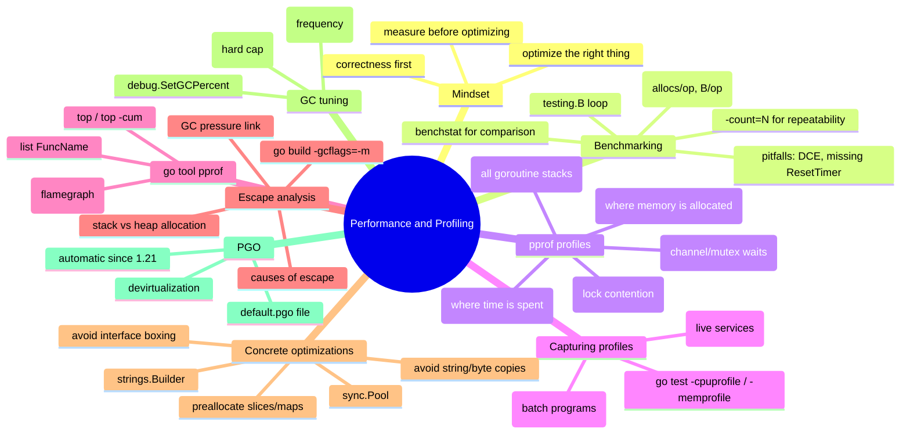

# Notes — Module 16: Performance and Profiling

> These are your personal study notes. Write freely and honestly.
> Incomplete notes are fine — they show where your understanding still needs work.
> Return to this file to add insights as they develop over time.

**Module:** [[go/16. Performance and Profiling]]
**Topic:** [[go]]
**Date started:** YYYY-MM-DD
**Status:** In progress

---

## Concept Map

_Sketch how the concepts in this module relate to each other. Fill in the Mermaid diagram._



_Alternative: draw this on paper, photo it, and link the image here._

---

## Key Insights

_The "aha moments" — the things that, once understood, made the rest clear._
_Be specific: "I finally understood X because Y" is more useful than "X makes sense"._

1. **Profile first, always:** _I finally understood that the profiler almost always contradicts my intuition about what's slow. The heat map analogy clicked — you can only cool a room if you know which room is hot._
2. **Allocations are not free:** _The connection between heap allocations and GC work became concrete when I saw `runtime.mallocgc` near the top of a CPU profile. Every allocation is a future GC job._
3. _Add insights as you discover them_

---

## My Understanding

_Explain the core concepts in your own words, as if teaching them to someone else._
_If you can't explain it simply, you don't understand it well enough yet._

### The Performance Mindset

_Your explanation here_

_What I'm still unsure about:_ (e.g., how to know when I've optimized "enough")

### Benchmarking and benchstat

_Your explanation here_

_What I'm still unsure about:_ (e.g., how many `-count` repetitions are needed for statistical significance)

### pprof profiles

_Your explanation here_

_What I'm still unsure about:_ (e.g., the difference between `flat` and `cum` time in `top` output)

### Escape Analysis

_Your explanation here_

_What I'm still unsure about:_ (e.g., when interface boxing specifically triggers an escape)

### GC Tuning

_Your explanation here_

_What I'm still unsure about:_ (e.g., how GOGC and GOMEMLIMIT interact when both are set)

---

## Connections to Other Topics

_How does this module connect to things you already know?_

| This module's concept | Connects to | How |
|----------------------|-------------|-----|
| Heap allocations and GC pressure | [[memory-management]] | Go's tricolor GC is the reason allocation count matters; every heap object is scanned by the GC |
| Benchmarking with testing.B | [[go/11. Testing and Benchmarking]] | The profiling tools in this module are extensions of the benchmark infrastructure from Module 11 |
| sync.Pool | [[go/9. Concurrency]] | Pool is a sync primitive; understanding that it is goroutine-safe but not a persistent cache requires concurrency knowledge |
| GOGC / GOMEMLIMIT | [[go/17. Runtime Internals and the Memory Model]] | GC tuning only makes sense once you understand how the GC works internally |
| Preallocating slices | [[go/4. Composite Types]] | make([]T, 0, n) pre-allocates the backing array; understanding append's growth strategy explains why this matters |

---

## Questions That Arose

_Log questions as they appear. Don't stop to answer them now — just capture them._
_Then move the serious ones to [QUESTIONS.md](./QUESTIONS.md)._

- [ ] Does `sync.Pool` guarantee that the object I Put in is the same one I Get back? → added to QUESTIONS.md as Q001
- [ ] How does the compiler decide the inlining budget? Is there a way to check it per function? → might be in `go build -gcflags=-m -m` output
- [ ] Can I use `net/http/pprof` with a custom HTTP mux (like `chi` or `gorilla/mux`)? → likely yes, need to confirm

---

## Code Snippets Worth Remembering

_Patterns, idioms, or examples that captured something important._

### Benchmark with DCE protection and ResetTimer

```go
var sink any // package-level sink prevents dead-code elimination

func BenchmarkX(b *testing.B) {
    input := setupExpensiveInput()
    b.ResetTimer() // exclude setup from measurement
    var result []byte
    for range b.N {
        result = processInput(input)
    }
    sink = result // prevent DCE
}
```

_Why I'm saving this:_ The two-line pattern (sink + ResetTimer) appears in every correct production benchmark. Missing either one makes the benchmark untrustworthy.

---

### Capture and read a heap profile in one shot

```bash
go test -bench=BenchmarkX -memprofile=mem.out ./...
go tool pprof -http=:8080 mem.out
```

_Why I'm saving this:_ The `-http` flag opens the browser UI directly — no interactive shell needed. Faster for a quick look.

---

### strings.Builder with Grow

```go
var sb strings.Builder
sb.Grow(estimatedBytes) // single allocation for the final string
for _, s := range parts {
    sb.WriteString(s)
}
return sb.String()
```

_Why I'm saving this:_ `Grow` reduces `strings.Builder` to exactly one allocation (the final buffer). Without it, `Builder` still amortizes but may do 2–3 internal reallocations.

---

### GOMEMLIMIT + GOGC for containerized services

```bash
# In a Kubernetes pod spec or Dockerfile CMD:
GOMAXPROCS=4 GOGC=200 GOMEMLIMIT=450MiB ./myservice
```

_Why I'm saving this:_ Higher GOGC reduces GC CPU cost; GOMEMLIMIT guards against OOM in a container with a 512Mi limit. This is the production-recommended pairing.

---

## What Tripped Me Up

_Mistakes I made, misconceptions I had, things that confused me more than they should have._
_Being honest here helps you later._

- **Dead-code elimination in benchmarks** — I initially thought assigning to `_` was enough to prevent DCE. It is not — `_` is a complete discard. You need a package-level sink variable.
- **flat vs cum in pprof top** — I initially read `cum` as "the function is slow." It actually means "this function and everything it calls." A function with high cum but low flat is a caller of slow code, not slow itself.

---

## Summary in My Own Words

_Write a 3–5 sentence summary of this entire module without looking at any notes._
_If you can't do this, you need more study time._

_Write your summary here after completing the module._

---

_Last updated: YYYY-MM-DD_
