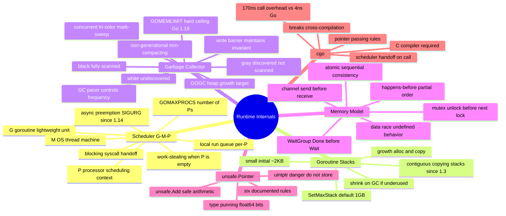

# Notes — Module 17: Runtime Internals and the Memory Model

> These are your personal study notes. Write freely and honestly.
> Incomplete notes are fine — they show where your understanding still needs work.
> Return to this file to add insights as they develop over time.

**Module:** [[go/17. Runtime Internals and the Memory Model]]
**Topic:** [[go]]
**Date started:** YYYY-MM-DD
**Status:** In progress

---

## Concept Map

_Sketch how the concepts in this module relate to each other. Fill in the Mermaid diagram._



_Alternative: draw this on paper, photo it, and link the image here._

---

## Key Insights

_The "aha moments" — the things that, once understood, made the rest clear._
_Be specific: "I finally understood X because Y" is more useful than "X makes sense"._

1. **P is the key resource, not M:** I finally understood that `GOMAXPROCS` controls P's (scheduling contexts), not M's (OS threads). M's can be created in unlimited numbers when blocked in syscalls or cgo — they just can't run Go code without a P. So CPU-bound parallelism is bounded by P count, but I/O concurrency is not.
2. **The write barrier exists because the GC runs concurrently:** Without a write barrier, the GC's concurrent mark phase could miss a pointer that was created by the mutator after the GC swept that region. The write barrier is the mechanism that "tells the GC" about new pointers.
3. _Add insights as you discover them_

---

## My Understanding

_Explain the core concepts in your own words, as if teaching them to someone else._
_If you can't explain it simply, you don't understand it well enough yet._

### The G-M-P Scheduler

_Your explanation here_

_What I'm still unsure about:_ (e.g., exactly when work-stealing triggers — is it every scheduling tick, or only when the local queue is empty?)

### Goroutine Stack Growth

_Your explanation here_

_What I'm still unsure about:_ (e.g., how the runtime updates all the pointers in copied stack frames — what does "remapping" actually involve?)

### The GC and Write Barriers

_Your explanation here_

_What I'm still unsure about:_ (e.g., what exactly is the "hybrid write barrier" vs the older Dijkstra write barrier?)

### The Go Memory Model

_Your explanation here_

_What I'm still unsure about:_ (e.g., for buffered channels, how does the "k-th receive happens-before (k+C)-th send" rule apply in practice?)

### unsafe.Pointer

_Your explanation here_

_What I'm still unsure about:_ (e.g., when exactly is `uintptr` safe to use — only in single-expression contexts?)

### cgo

_Your explanation here_

_What I'm still unsure about:_ (e.g., how exactly does the Go runtime know to hand off the P when a cgo call starts?)

---

## Connections to Other Topics

_How does this module connect to things you already know?_

| This module's concept | Connects to | How |
|----------------------|-------------|-----|
| G-M-P scheduler, GOMAXPROCS | [[go/9. Concurrency]] | Module 9 teaches goroutines as a programmer; module 17 explains how the runtime schedules them |
| Tri-color GC, GOGC/GOMEMLIMIT | [[go/16. Performance and Profiling]] | pprof heap profiles show symptoms; module 17 explains the underlying mechanism |
| Memory model: channel/mutex happens-before | [[go/12. Advanced Concurrency Patterns]] | The race detector finds violations at runtime; the memory model lets you reason about them statically |
| cgo build implications | [[go/18. Build, Tooling, and Deployment]] | cgo disables cross-compilation and requires a C compiler; module 18 covers those build topics |
| GC design | [[memory-management]] | The shared concept compares Go's GC to Python, Rust, C, and JS memory management |
| Goroutines vs OS threads | [[concurrency]] | The shared concept compares Go's M:N scheduler to threads, async/await, and actor models |

---

## Questions That Arose

_Log questions as they appear. Don't stop to answer them now — just capture them._
_Then move the serious ones to [QUESTIONS.md](./QUESTIONS.md)._

- [ ] Does work-stealing happen before or after checking the global run queue? → added to QUESTIONS.md as Q001
- [ ] What exactly happens to a goroutine's finalizer when the GC sweeps it? → might be in runtime.SetFinalizer docs
- [ ] Can GOMEMLIMIT cause OOM if the live heap alone exceeds the limit? → worth testing experimentally

---

## Code Snippets Worth Remembering

_Patterns, idioms, or examples that captured something important._

### Querying GOMAXPROCS without changing it

```go
import "runtime"

procs := runtime.GOMAXPROCS(0) // 0 = query; any other value sets
```

_Why I'm saving this:_ Passing 0 is the idiom for querying the current value. Easy to forget and accidentally call `GOMAXPROCS(1)`.

---

### The canonical unsafe string-to-bytes (Go 1.20+)

```go
import "unsafe"

func stringToBytes(s string) []byte {
    if len(s) == 0 {
        return nil
    }
    return unsafe.Slice(unsafe.StringData(s), len(s))
}
// MUST NOT modify the returned slice — string data is immutable.
```

_Why I'm saving this:_ The right way to do zero-copy string→bytes using the official Go 1.20 functions, not the deprecated reflect.StringHeader approach.

---

### Checking GC stats at a point in time

```go
import "runtime"

var ms runtime.MemStats
runtime.ReadMemStats(&ms)
// ms.NumGC, ms.HeapAlloc, ms.PauseNs[(ms.NumGC+255)%256]
```

_Why I'm saving this:_ Useful for quick observability of GC behavior in benchmarks or diagnostic endpoints.

---

## What Tripped Me Up

_Mistakes I made, misconceptions I had, things that confused me more than they should have._
_Being honest here helps you later._

- **Confusing M and P counts** — I initially thought `GOMAXPROCS` controlled the number of OS threads, but it controls P's (scheduling contexts). OS threads (M's) are created automatically when blocked in syscalls and can exceed `GOMAXPROCS`.
- **Thinking `go f()` synchronizes** — I initially assumed the goroutine starts immediately and the next line can rely on its output. It doesn't. `go` is fire-and-forget with no synchronization guarantee.

---

## Summary in My Own Words

_Write a 3–5 sentence summary of this entire module without looking at any notes._
_If you can't do this, you need more study time._

_Write your summary here after completing the module._

---

_Last updated: YYYY-MM-DD_
