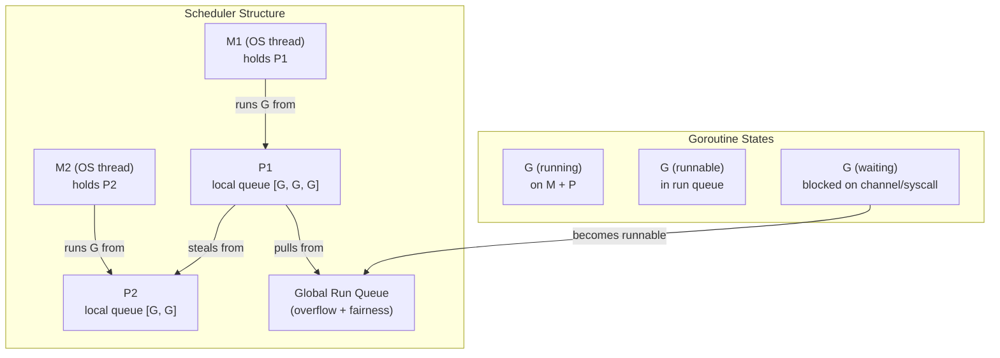
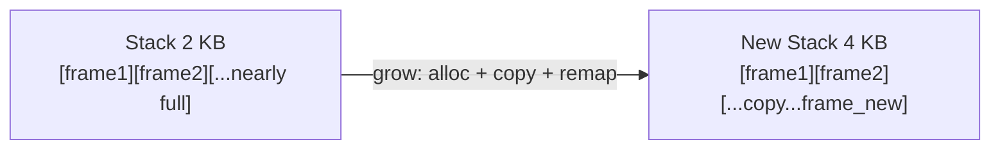
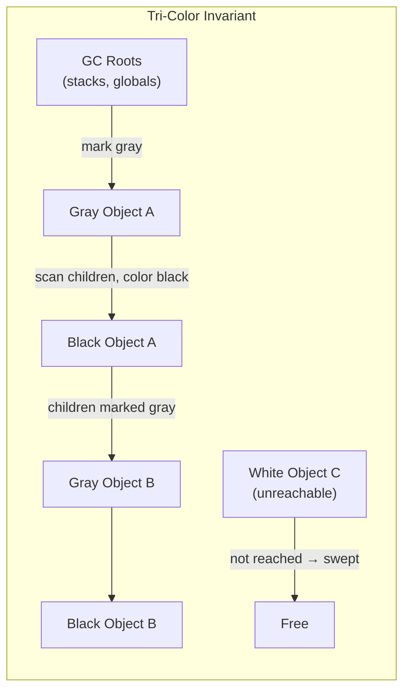
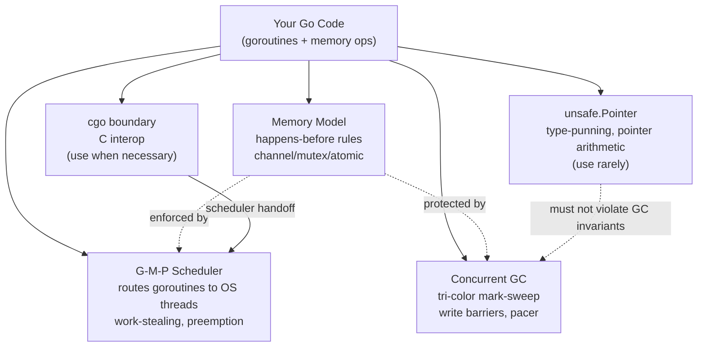

# Module 17: Runtime Internals and the Memory Model

[← Module 16: Performance and Profiling](../16.%20Performance%20and%20Profiling/) | [Topic Home](../README.md) | [Module 18: Build, Tooling, and Deployment →](../18.%20Build%2C%20Tooling%2C%20and%20Deployment/)

---


---

## Table of Contents

- [Overview](#overview)
- [Learning Goals](#learning-goals)
- [Prerequisites](#prerequisites)
- [Why This Matters](#why-this-matters)
- [Historical Context](#historical-context)
- [Core Concepts](#core-concepts)
  - [The Goroutine Scheduler — G-M-P Model](#the-goroutine-scheduler--g-m-p-model)
  - [Goroutine Stacks](#goroutine-stacks)
  - [The Garbage Collector](#the-garbage-collector)
  - [The Go Memory Model](#the-go-memory-model)
  - [unsafe.Pointer](#unsafepointer)
  - [cgo — Calling C from Go](#cgo--calling-c-from-go)
  - [How the Concepts Fit Together](#how-the-concepts-fit-together)
- [Common Mistakes](#common-mistakes)
- [Mental Models](#mental-models)
- [Practical Examples](#practical-examples)
- [Related Concepts](#related-concepts)
- [Exercises](#exercises)
- [Test](#test)
- [Further Reading](#further-reading)
- [Learning Journal](#learning-journal)

---

## Overview

This module covers **Go's runtime internals**: how the goroutine scheduler allocates work across OS threads, how goroutine stacks grow and shrink, how the concurrent garbage collector reclaims memory, what the Go Memory Model formally guarantees about visibility between goroutines, and when — rarely — low-level tools like `unsafe.Pointer` and `cgo` are justified.

By the end of this module, you will understand what happens beneath the surface of every Go program. You will be able to reason about scheduler behavior and `GOMAXPROCS`, diagnose GC pressure and tune `GOGC`/`GOMEMLIMIT`, identify data races at the memory-model level (not just via the race detector), and understand the real costs that `cgo` imposes. This is the expert layer that separates programmers who know the language from engineers who understand the platform.

**Difficulty:** Expert &nbsp;|&nbsp; **Estimated time:** 6–8 hours

---

## Learning Goals

By completing this module, you will be able to:

1. Describe the G-M-P scheduler model — what goroutines, machines, and processors are, how the run queues work, and what work-stealing achieves — _given a concurrent program, predict how the scheduler distributes goroutines across OS threads_
2. Explain goroutine stack growth: initial size (~2 KB), copying mechanism, and why this makes goroutines cheap — _explain why spawning 100 000 goroutines is practical in Go but not with OS threads_
3. Describe the tri-color concurrent mark-and-sweep GC: what the three colors mean, how write barriers maintain invariants, what the GC pacer does, and how `GOGC`/`GOMEMLIMIT` tune behavior — _given a latency or memory budget, choose the right GC knobs_
4. Apply the Go Memory Model to real code: identify happens-before relationships established by channels, mutexes, atomics, `sync.WaitGroup`, and `init`, and determine whether a program contains a data race — _read a snippet and state definitively whether it is correctly synchronized_
5. Use `unsafe.Pointer` according to its six documented rules, understand what operations are legal, and recognize when it is (very rarely) appropriate — _audit a codebase and flag unsafe.Pointer usage that violates the documented rules_
6. Explain cgo's call overhead, scheduler interaction, and build implications, and name the tradeoffs involved in depending on C libraries — _decide whether a given use case justifies the cgo boundary cost_

---

## Prerequisites

### Required Modules

- [[go/9. Concurrency]] — you need to understand: goroutines, channels (buffered/unbuffered), `sync.Mutex`, `sync.WaitGroup`, and `sync/atomic`; this module explains *why* those primitives have the semantics they do
- [[go/12. Advanced Concurrency Patterns]] — you need to understand: the race detector, `context`, pipelines, and atomic operations; module 17 adds the formal memory-model underpinning
- [[go/16. Performance and Profiling]] — you need to understand: `pprof`, escape analysis, GC tuning with `GOGC`, heap profiling; module 17 explains the GC internals behind those observations

### Required Concepts

- **Goroutines and channels** — understanding goroutine creation and channel semantics is prerequisite; the scheduler section explains the runtime mechanism beneath them
- **Concurrent mark-and-sweep at a high level** — the shared concept file [[memory-management]] explains mark-and-sweep generally; this module covers Go's specific tri-color concurrent implementation
- **Data races and synchronization** — the shared concept file [[concurrency]] covers race conditions generally; this module covers Go's formal model for what "correctly synchronized" means

> [!TIP]
> This module rewards re-reading. The scheduler and memory model sections have subtleties that only become clear after working through the exercises and returning to the theory. Budget at least two passes.

---

## Why This Matters

At 2+ years of professional Go, you have almost certainly hit situations you couldn't fully explain: a goroutine-heavy program that did not scale linearly with cores; a concurrent program that worked in tests but produced wrong results in production; GC pauses appearing at unexpected moments; a colleague who added `cgo` and broke cross-compilation. This module gives you the vocabulary and mental models to understand these situations — and, crucially, to communicate about them precisely.

Concretely, mastery of this module enables you to:

- **Debug scheduler-induced performance cliffs** — understand why `GOMAXPROCS(1)` can sometimes be faster, why a program with 10 000 goroutines might be slower than one with 100, and how preemption affects latency-sensitive code
- **Tune GC for production workloads** — set `GOGC` and `GOMEMLIMIT` with understanding, not cargo-culting; know when a GC pause is coming and why, tying directly to profiling from [[go/16. Performance and Profiling]]
- **Audit code for data races at the model level** — the race detector finds races at runtime; the Go Memory Model lets you reason about correctness statically, without running the code
- **Make an informed decision about cgo** — weigh the call overhead, build complexity, and loss of cross-compilation against the benefit before adding a C dependency; connect to build tooling decisions in [[go/18. Build, Tooling, and Deployment]]

Without this module, Go runtime behavior feels like magic. With it, it is predictable engineering.

---

## Historical Context

Go's runtime was designed from the start for the workloads Google faced: servers handling hundreds of thousands of concurrent connections. The original scheduler (pre-Go 1.1) was simpler — a global run queue with a single mutex that became a bottleneck. The **G-M-P scheduler** was introduced in **Go 1.1 (2013)** by Dmitry Vyukov, adding per-P local run queues and work-stealing to eliminate the global lock bottleneck.

Goroutine stacks started at 4 KB (split-stack design, pre-1.3) but the split-stack approach had performance problems with "hot splits" — a stack frame near a boundary caused repeated expensive splits. Go 1.3 (2014) replaced split stacks with **contiguous/copying stacks**: the initial size shrank to 2 KB, and growth copies the entire stack to a larger allocation, eliminating hot splits.

The GC has improved more dramatically than any other runtime component. Early Go GCs were stop-the-world for 100 ms to seconds on large heaps. **Go 1.5 (2015)** introduced the concurrent tri-color mark-and-sweep GC that is the foundation of today's design, reducing pauses to single milliseconds. Subsequent releases refined the write barrier, the GC pacer (Go 1.8), and added `GOMEMLIMIT` (Go 1.19) for memory-constrained deployments.

**Asynchronous preemption** was added in **Go 1.14 (2020)** via signals (SIGURG on Unix), solving the case where a tight CPU loop could starve the scheduler — previously a goroutine executing a tight loop with no function calls could never be preempted.

The **Go Memory Model** was formally revised in **Go 1.19 (2022)** to align with the DRF-SC (data-race-free sequential consistency) model used by C++11, Java, and Rust, making the model more precise and adding explicit `sync/atomic` guarantees.

---

## Core Concepts

### The Goroutine Scheduler — G-M-P Model

The Go scheduler is a **user-space, cooperative-with-preemption M:N scheduler** — it multiplexes M goroutines onto N OS threads. The key entities are:

- **G (goroutine)** — a lightweight unit of execution: a function, its stack, and its register state. Cheap to create (~2 KB initial stack).
- **M (machine)** — an OS thread. There is always a 1:1 relationship between an M and an OS thread. `GOMAXPROCS` is not about M's — M's can exceed `GOMAXPROCS` (e.g., when blocked in a syscall).
- **P (processor)** — a scheduling context. Exactly `GOMAXPROCS` P's exist. A P holds a **local run queue** (a ring buffer of runnable G's, capacity 256). An M must hold a P to run Go code.



**Work-stealing:** When P1's local queue is empty, it steals half of P2's local queue. This balances load without a global lock on the common path. The global run queue is also checked periodically (every 61 scheduling ticks) to prevent starvation.

**Blocking syscalls:** When an M executing Go code makes a blocking OS syscall, the Go runtime **hands off** the P to another (idle or newly created) M before blocking. This is critical — without handoff, a blocking syscall would prevent that P's entire local queue from running. When the syscall returns, the original M tries to reacquire a P; if none is available, the G is placed on the global queue and the M parks.

**Asynchronous preemption (Go 1.14+):** A goroutine executing a tight CPU loop (no function calls, no cooperative yield points) is preempted via SIGURG. The signal handler in the runtime injects a call to `runtime.asyncPreempt`, which yields the goroutine back to the scheduler. This prevents a goroutine from monopolizing a P indefinitely.

```go
// GOMAXPROCS controls the number of P's (default = number of logical CPUs)
import "runtime"

func main() {
    // Query current value
    procs := runtime.GOMAXPROCS(0) // 0 = query only, no change
    fmt.Printf("P count: %d\n", procs)

    // Force single-threaded execution (occasionally useful for profiling)
    runtime.GOMAXPROCS(1)

    // Yield the current goroutine (rarely needed; signals intent to scheduler)
    runtime.Gosched()
}
```

> [!NOTE]
> `GOMAXPROCS` defaults to `runtime.NumCPU()` since Go 1.5. Setting it higher than the logical CPU count is legal but rarely helpful for CPU-bound work. For I/O-bound workloads blocked in syscalls, more M's are created automatically — `GOMAXPROCS` does not cap M creation.

> [!WARNING]
> **Implementation-defined:** The scheduler's exact algorithm — when work-stealing triggers, how many goroutines are stolen, preemption timing — is implementation-specific and can change between Go versions. Rely on the *observable guarantees* (goroutines are eventually scheduled, blocking syscalls release their P), not on timing or ordering.

---

### Goroutine Stacks

Each goroutine starts with a **small stack, approximately 2–8 KB** (the exact initial size is implementation-defined and has changed over Go releases; 2 KB was the value from Go 1.4 through recent versions). This is why spawning 100 000 goroutines is practical: 100 000 × 2 KB = 200 MB, small compared to 100 000 OS threads which would typically require 1–8 GB (OS threads default to 1–8 MB stacks).

**Stack growth — contiguous/copying stacks (since Go 1.3):**

When a goroutine's stack is nearly full, the runtime allocates a **new, larger stack** (typically 2× the current size), copies all stack frames to the new allocation, and updates all pointers within those frames. The goroutine then continues on the new stack. The old stack is freed.



Why this matters for performance:

- Stack growth requires pausing the goroutine briefly and copying — this is cheap but non-zero cost. Deep recursion on small objects triggers more copies.
- Pointers into a goroutine's stack can move during a copy. The runtime tracks and updates all such pointers (in stack frames and registers). This is why you cannot hold a pointer into another goroutine's stack across a potential growth point — `unsafe.Pointer` rules address this.
- The GC also has a **stack shrink** pass during collection: if a goroutine's stack is less than 1/4 utilized after a GC cycle, it may be shrunk.

```go
// Demonstrates stack growth implicitly — deep recursion grows the stack
// (No explicit API; observe with: go build -gcflags="-m" to see escape analysis)
func deepRecurse(n int) int {
    if n == 0 {
        return 0
    }
    // Each call frame is small; Go handles growth automatically
    return n + deepRecurse(n-1)
}
```

> [!NOTE]
> The `runtime/debug` package's `SetMaxStack` function sets a maximum stack size per goroutine (default 1 GB on 64-bit systems). Exceeding this limit panics with "stack overflow". This catches genuinely unbounded recursion.

---

### The Garbage Collector

Go uses a **concurrent, non-generational, non-compacting tri-color mark-and-sweep garbage collector**. "Concurrent" means the GC runs mostly in parallel with the mutator (your program). "Non-generational" means there is no young/old generation split — the entire heap is scanned on every cycle. "Non-compacting" means objects are not moved during collection (contrast with Java's HotSpot). These design choices trade some throughput for simpler pointer semantics (pointers always remain valid) and low pause times.

**Tri-color mark phase:**

Objects are conceptually colored:
- **White** — not yet visited; eligible for collection at sweep
- **Gray** — discovered (reachable from roots) but children not yet scanned
- **Black** — fully scanned; all children have been discovered



The **tri-color invariant**: a black object must never point directly to a white object. If this invariant were violated, the GC could collect a reachable object. **Write barriers** maintain the invariant: when the mutator writes a pointer, the write barrier ensures the target is shaded appropriately (gray). The current Go GC uses a **hybrid write barrier** (introduced in Go 1.17) that handles both stack-to-heap and heap-to-heap pointer writes.

**Stop-the-world phases** are now minimal:
1. **STW 1** — GC start: enable write barriers, scan goroutine stacks (brief, ~100 µs on typical workloads)
2. **Concurrent mark** — runs concurrently; most of the work
3. **STW 2** — mark termination: finalize, disable write barriers (brief)
4. **Concurrent sweep** — runs concurrently alongside the mutator

**The GC pacer** controls when the next GC cycle starts. It aims to complete a collection cycle before live heap doubles (the `GOGC` target). The pacer also recruits mutator goroutines to assist with marking when the GC falls behind — these are "mark assist" pauses your code may experience.

**Tuning knobs:**

```go
import (
    "runtime"
    "runtime/debug"
)

func main() {
    // GOGC: target percentage for heap growth before next GC.
    // Default 100 means GC when live heap doubles.
    // Higher = less frequent GC, more memory usage; Lower = more frequent GC, less memory.
    // GOGC=off disables GC entirely (dangerous but useful for batch jobs).
    debug.SetGCPercent(200) // allow heap to grow to 3× live before GC

    // GOMEMLIMIT (Go 1.19+): hard memory limit; GC becomes aggressive as
    // the process approaches this limit. Use when running in a container
    // with a fixed memory ceiling.
    debug.SetMemoryLimit(512 << 20) // 512 MiB limit

    // Manually trigger a GC cycle (rarely needed; useful in tests or benchmarks)
    runtime.GC()
}
```

> [!WARNING]
> **GOGC and GOMEMLIMIT interact.** If `GOMEMLIMIT` is set and the process approaches it, the GC runs more aggressively regardless of `GOGC`. A common production pattern: set `GOGC=off` (or very high) to reduce GC frequency, and set `GOMEMLIMIT` as a safety ceiling. This was popularized by the "ballast object" trick before `GOMEMLIMIT` existed — now `GOMEMLIMIT` is the correct tool.

> [!NOTE]
> Go's GC is **not generational** — a deliberate design choice that keeps the implementation simpler and avoids generational pause stalls. The tradeoff: long-lived objects are rescanned on every cycle. For workloads with huge, stable heaps, this can cause higher GC CPU overhead than a generational collector would. See [[go/16. Performance and Profiling]] for how to measure this with `pprof`.

---

### The Go Memory Model

The **Go Memory Model** specifies the conditions under which a read of a memory location can be guaranteed to observe a particular write. This is not merely an academic concern — programs that violate the memory model produce undefined behavior: they may produce wrong results non-deterministically, and the compiler and hardware are permitted to reorder operations in ways that make the race worse than it appears.

**The fundamental rule:** If there is no happens-before relationship between a write and a read of the same variable, the behavior is undefined — this is a **data race**, and Go's race detector (`-race` flag) is designed to find them.

**Happens-before** is a partial order on events. Event A *happens before* event B if:
- A and B are in the same goroutine, and A appears before B in program order
- OR there is a synchronization operation that connects them across goroutines

**What establishes happens-before across goroutines:**

| Operation | Guarantee |
|-----------|-----------|
| Channel send | A send on a channel happens before the corresponding receive completes |
| Channel close | A close happens before a receive of the zero value from a closed channel |
| Buffered channel | The k-th receive from a buffered channel of capacity C happens before the (k+C)-th send completes |
| `sync.Mutex` | `Unlock` happens before a subsequent `Lock` |
| `sync.RWMutex` | `RUnlock` / `Unlock` happens before subsequent `Lock` / `RLock` |
| `sync.WaitGroup` | `Done` happens before `Wait` returns |
| `sync/atomic` | Atomic operations have sequentially consistent ordering with each other (as of Go 1.19) |
| Package `init` | All `init` functions in a package complete before `main.main` |
| `go` statement | The `go` statement itself does NOT guarantee the goroutine has started; for ordering, use a channel or WaitGroup |

```go
package main

import (
    "fmt"
    "sync"
)

// CORRECT: WaitGroup establishes happens-before between the goroutine
// writing msg and the main goroutine reading it.
func correctExample() {
    var wg sync.WaitGroup
    msg := ""
    wg.Add(1)
    go func() {
        msg = "hello"  // write
        wg.Done()      // happens-before wg.Wait() returns
    }()
    wg.Wait()           // wg.Done() happened before here
    fmt.Println(msg)    // safe: "hello" is guaranteed visible
}

// WRONG: data race — no happens-before between write and read of msg.
// The race detector will flag this.
func racyExample() {
    msg := ""
    go func() {
        msg = "hello"  // write — races with the read below
    }()
    fmt.Println(msg)   // read — may see "", "hello", or corrupt memory
}

// WRONG and subtle: the go statement does NOT synchronize.
// There is no guarantee the goroutine has written 'ready' before
// the outer function reads it — even if time.Sleep is added.
func alsoRacy() {
    ready := false
    go func() { ready = true }()
    for !ready { // data race on 'ready'
        // busy-wait — undefined behavior
    }
}
```

**Precisely what a data race is:** Two goroutines access the same memory location concurrently, at least one access is a write, and there is no happens-before ordering between them. Racy programs are **undefined behavior** in Go's model — not just "might give wrong answer" but "the compiler and runtime are permitted to do anything". In practice, the Go compiler does not currently exploit data races as aggressively as C compilers do, but this is not guaranteed to remain true.

```go
// sync/atomic example: establishes happens-before
import "sync/atomic"

var flag atomic.Int32 // zero value is ready to use (Go 1.19+)

// Store in goroutine A happens-before Load in goroutine B
// *only if* the Load observes the stored value.
// atomic ops are sequentially consistent: any Load that sees a Store
// was ordered after that Store.
func atomicHappensBefore() {
    flag.Store(1)       // goroutine A
    // ...
    if flag.Load() == 1 { // goroutine B — if this sees 1, the Store HB this Load
        // safe to read data written before the Store
    }
}
```

> [!WARNING]
> **"It works in practice" is not correctness.** Programs with data races on modern hardware may appear to work because x86's strong memory model (TSO) provides more guarantees than the Go Memory Model requires. The same code may fail on ARM (weaker memory model) or with a different Go compiler or runtime version. Always eliminate races; never rely on hardware-specific behavior.

---

### unsafe.Pointer

The `unsafe` package provides an escape hatch from Go's type system and memory model. It is called `unsafe` for a reason: using it incorrectly causes crashes, data corruption, or interaction with the GC that can silently corrupt the heap.

**The six documented rules for `unsafe.Pointer`** (from the `unsafe` package docs and the Go specification):

1. **`unsafe.Pointer` of any type → `unsafe.Pointer`** — valid; any pointer can be converted to `unsafe.Pointer`
2. **`unsafe.Pointer` → pointer of any type** — valid; the conversion is the mechanism for type-punning
3. **`unsafe.Pointer` → `uintptr`** — produces an integer address; **valid only as part of a larger expression that converts it back to a pointer immediately** (see rule 4)
4. **`uintptr` → `unsafe.Pointer`** — only valid if the `uintptr` was derived from `unsafe.Pointer` in the same expression; storing a `uintptr` in a variable and converting it later is invalid because the GC may have moved the object (stack copy or future compacting GC)
5. **`syscall.Pointer` arithmetic** — the `unsafe.Add` function (Go 1.17+) performs pointer arithmetic safely within these rules
6. **Converting between `unsafe.Pointer` and `reflect.SliceHeader`/`reflect.StringHeader`** — deprecated since Go 1.20 in favor of `unsafe.Slice` and `unsafe.String`

```go
import (
    "fmt"
    "unsafe"
)

// VALID: type-punning float64 bits to uint64 using the documented pattern.
// This is what math.Float64bits does internally.
func float64Bits(f float64) uint64 {
    // Rule 1 then Rule 2: *float64 → unsafe.Pointer → *uint64
    return *(*uint64)(unsafe.Pointer(&f))
}

// INVALID (and subtly dangerous): storing a uintptr across a potential GC point.
// The stack copy or a future compacting GC could invalidate the address.
func badPointerArithmetic(s []byte) byte {
    p := uintptr(unsafe.Pointer(&s[0])) // ok so far
    // ... any function call here may trigger GC or stack copy ...
    return *(*byte)(unsafe.Pointer(p + 1)) // WRONG: p may be stale
}

// VALID: pointer arithmetic using unsafe.Add (Go 1.17+)
func goodPointerArithmetic(s []byte) byte {
    p := unsafe.Pointer(&s[0])
    return *(*byte)(unsafe.Add(p, 1)) // single expression; GC-safe
}

// When is unsafe.Pointer justified?
// 1. Implementing packages like encoding/binary or reflect that must handle
//    arbitrary memory layouts
// 2. Zero-copy string ↔ []byte conversion in hot paths (with careful lifetime control)
// 3. Interacting with C structs via cgo
// In all other cases: do not use it.
```

> [!WARNING]
> A future version of Go may introduce a compacting GC. Programs that store `uintptr` values and later convert them back to pointers (violating Rule 4) will break silently — the address the `uintptr` holds will be invalid. Do not write code that would break under a compacting GC, even if today's GC is non-compacting.

---

### cgo — Calling C from Go

`cgo` is the mechanism for calling C code from Go (and, less commonly, Go from C). It works by embedding C code in special comments before the `import "C"` line:

```go
package main

/*
#include <stdlib.h>
#include <string.h>

// A trivial C function for illustration
int add(int a, int b) { return a + b; }
*/
import "C"
import "fmt"

func main() {
    // Calling a C function: types are in the C namespace
    result := C.add(3, 4)
    fmt.Println(int(result)) // 7

    // Allocating C memory (bypasses Go GC — must be freed manually)
    ptr := C.malloc(C.size_t(100))
    defer C.free(ptr)
}
```

**Real costs of cgo — know these before using it:**

| Cost | Details |
|------|---------|
| **Call overhead** | Each cgo call crosses the Go↔C boundary: saves Go register state, switches stack to a system stack (C functions need a larger, fixed-size stack), calls C, restores Go state. A cgo call costs ~170 ns (vs ~4 ns for a pure Go call) as of recent benchmarks — roughly 40× more expensive. |
| **Scheduler interaction** | From the scheduler's perspective, a cgo call is like a blocking syscall: the P is handed off immediately. Every cgo call may cause an M to block, reducing available Ps for Go goroutines. Long-running C code will starve the Go scheduler. |
| **Memory model boundary** | C code does not obey Go's memory model. C callbacks into Go must not keep Go pointers after the callback returns (cgo pointer-passing rules). |
| **Build complexity** | cgo requires a C compiler on the build machine, disables cross-compilation by default, significantly increases build times, and complicates static linking. See [[go/18. Build, Tooling, and Deployment]]. |
| **Race detector** | The race detector does not instrument C code. Data races in C are invisible to `-race`. |

```go
// Safer cgo pattern: pass only primitive types across the boundary.
// Never pass a Go pointer that contains a Go pointer (nested pointers).
// C.CString allocates C memory; always free it.

/*
#include <string.h>
int strlen_c(const char *s) { return (int)strlen(s); }
*/
import "C"
import "unsafe"

func goStringLen(s string) int {
    cs := C.CString(s)         // allocates C memory — must free
    defer C.free(unsafe.Pointer(cs))
    return int(C.strlen_c(cs))
}
```

**When is cgo justified?**
- Wrapping a large, battle-tested C library with no Go equivalent (e.g., libsqlite3, OpenSSL for hardware acceleration, BLAS/LAPACK for numerical work)
- Accessing OS APIs that have no `syscall`/`golang.org/x/sys` wrapper
- Embedding a scripting engine (Lua, etc.)

**When is cgo NOT justified?**
- Performance-sensitive hot paths (the overhead is real)
- Any situation where a pure-Go alternative exists
- Programs that must be cross-compiled easily

---

### How the Concepts Fit Together



The scheduler, GC, and memory model are not independent — they interact. The GC uses stop-the-world phases to scan goroutine stacks; the scheduler must cooperate to bring goroutines to safe points. Write barriers exist because the GC runs concurrently with mutator goroutines. The memory model's guarantees hold because synchronization primitives (mutex unlock, channel send) include the necessary hardware memory barriers. `unsafe.Pointer` and `cgo` step outside these interlocking guarantees, which is why they require careful attention.

---

## Common Mistakes

> [!WARNING]
> **Mistake 1: Storing a `uintptr` and converting it back later**
>
> Converting `unsafe.Pointer` to `uintptr` and storing the result in a variable — then later converting it back — is invalid. The garbage collector (or a future compacting GC) may have moved the object the `uintptr` was pointing to.
>
> **Wrong:**
> ```go
> p := uintptr(unsafe.Pointer(&x))
> doSomething() // potential GC point or stack copy
> q := (*int)(unsafe.Pointer(p)) // p may be stale — WRONG
> ```
>
> **Right:**
> ```go
> // Keep the whole computation in one expression, or use unsafe.Add
> q := (*int)(unsafe.Add(unsafe.Pointer(&x), offset))
> ```
>
> **Why this matters:** Non-obvious crashes or memory corruption that are hard to reproduce.

> [!WARNING]
> **Mistake 2: Assuming the `go` statement synchronizes**
>
> Writing `go f()` does NOT guarantee that `f` has started, let alone completed, before the next statement. Reading shared state immediately after a `go` statement is a data race.
>
> **Wrong:**
> ```go
> result := 0
> go func() { result = compute() }()
> fmt.Println(result) // data race: result may be 0 or partially written
> ```
>
> **Right:** Use a channel or `sync.WaitGroup` to establish happens-before:
> ```go
> ch := make(chan int, 1)
> go func() { ch <- compute() }()
> fmt.Println(<-ch) // channel receive establishes happens-before
> ```

> [!WARNING]
> **Mistake 3: Using cgo in hot paths**
>
> A cgo call costs ~40× more than a Go function call and causes scheduler handoff. A tight loop calling a C function thousands of times per second will perform worse than a pure Go equivalent.
>
> **Wrong approach:** Wrapping a C math function called millions of times in a benchmark loop.
> **Right approach:** Batch the work on the C side, or find a pure Go implementation.

**Other pitfalls:**

- **Misunderstanding `GOMAXPROCS` scope** — `GOMAXPROCS` controls parallelism of Go code but C code running via cgo bypasses it; cgo threads are OS threads not controlled by Go's P count
- **Trusting "it works on my machine" for racy code** — x86 TSO makes many races invisible locally; ARM (used in CI or production containers) has a weaker model and may expose them
- **Using `debug.SetGCPercent(-1)` to disable GC forever in a server** — memory grows unboundedly; if you want to reduce GC frequency, set a higher `GOGC` value or use `GOMEMLIMIT`

---

## Mental Models

### Mental Model 1: P as a CPU License

A P is a license to execute Go code. To run Go code, an M needs a P. There are exactly `GOMAXPROCS` P's — so at most that many goroutines can be executing Go code simultaneously. When a goroutine blocks (syscall, channel, mutex), it gives up its P so others can run.

Think of P's as keys to a set of execution lanes on a highway. Only `GOMAXPROCS` cars (goroutines) can be driving at once; blocked cars pull over and give their key to a waiting car.

This model breaks down when reasoning about cgo: C code does not need a P, so cgo calls can run concurrently beyond the GOMAXPROCS limit.

### Mental Model 2: The Tri-Color Invariant as a Contract

The tri-color invariant (no black object points to a white object) is a contract between the GC and the write barrier. The GC says "I will not collect anything reachable from a black object." The write barrier says "whenever you create a new pointer from a black object to a potentially-white object, I'll shade the target gray."

Think of it as the GC sweeping a room for garbage. Black objects are in the "done" pile. The write barrier is a rule that says "if you move an item from the done pile to point at something not yet checked, call me so I can add it to the check list." Without the write barrier, the GC could sweep an object that was made reachable after the GC passed it.

### Mental Model 3: Happens-Before as a Causal Chain

Happens-before is causality in program execution. If A happens-before B, then B can "see" everything A did. Synchronization primitives are the causal links — a mutex unlock is the cause, the subsequent lock is the effect that sees all writes before the unlock.

A data race occurs when two events that write/read the same location have no causal link — neither caused the other, so neither can be certain of what the other did. Think of two people updating the same document simultaneously without knowing each other's changes.

> [!NOTE]
> Model 1 (P as license) is best for reasoning about scheduling and GOMAXPROCS. Model 2 (invariant as contract) helps when understanding why write barriers exist and what they protect. Model 3 (causality chain) is the most important for writing correct concurrent code — apply it every time you ask "is this safe to share between goroutines?"

---

## Practical Examples

### Example 1: Observing Scheduler Behavior with GOMAXPROCS _(Basic)_

**Scenario:** Understand how `GOMAXPROCS` affects parallel execution of CPU-bound goroutines.

**Goal:** Show that CPU-bound goroutines scale with GOMAXPROCS but not beyond the number of CPUs.

```go
package main

import (
    "fmt"
    "runtime"
    "sync"
    "time"
)

// cpuWork does a fixed amount of CPU computation.
func cpuWork(n int) int {
    sum := 0
    for i := 0; i < n; i++ {
        sum += i
    }
    return sum
}

func runWithProcs(procs, goroutines int) time.Duration {
    runtime.GOMAXPROCS(procs)
    var wg sync.WaitGroup
    start := time.Now()
    for i := 0; i < goroutines; i++ {
        wg.Add(1)
        go func() {
            defer wg.Done()
            cpuWork(10_000_000) // ~10M iterations per goroutine
        }()
    }
    wg.Wait()
    return time.Since(start)
}

func main() {
    ncpu := runtime.NumCPU()
    goroutines := ncpu * 2 // more goroutines than CPUs

    // With 1 P: all goroutines serialized
    d1 := runWithProcs(1, goroutines)
    // With all CPUs: work distributed across cores
    dN := runWithProcs(ncpu, goroutines)

    fmt.Printf("GOMAXPROCS=1:   %v\n", d1)
    fmt.Printf("GOMAXPROCS=%d:  %v\n", ncpu, dN)
    fmt.Printf("Speedup: %.2fx\n", float64(d1)/float64(dN))
    // Expected: speedup close to ncpu for CPU-bound work
}
```

**What to notice:** Speedup should be close to `ncpu` for pure CPU-bound work. Diminishing returns appear at higher goroutine counts due to scheduling overhead and cache contention.

---

### Example 2: Observing GC with runtime.ReadMemStats _(Intermediate)_

**Scenario:** Observe GC behavior — number of collections, pause durations — and understand how `GOGC` affects it.

```go
package main

import (
    "fmt"
    "runtime"
    "runtime/debug"
)

// allocWork creates and abandons garbage, forcing GC activity.
func allocWork(n int) {
    for i := 0; i < n; i++ {
        // Create a heap-allocated slice on each iteration; it becomes
        // garbage when the loop variable goes out of scope.
        _ = make([]byte, 4096) // 4 KB per iteration → lots of garbage
    }
}

func printGCStats(label string) {
    var ms runtime.MemStats
    runtime.ReadMemStats(&ms)
    fmt.Printf("[%s] GC cycles: %d, last pause: %v, HeapAlloc: %d KB\n",
        label,
        ms.NumGC,
        ms.PauseNs[(ms.NumGC+255)%256], // last pause in nanoseconds
        ms.HeapAlloc/1024,
    )
}

func main() {
    // Default GOGC (100): GC when live heap doubles
    printGCStats("before")
    allocWork(50_000)
    printGCStats("after GOGC=100")

    // Higher GOGC: GC less often, heap grows more
    debug.SetGCPercent(400)
    allocWork(50_000)
    printGCStats("after GOGC=400")

    // Force GC and check
    runtime.GC()
    printGCStats("after forced GC")
}
```

**What to notice:** Higher `GOGC` means fewer GC cycles and higher `HeapAlloc` at collection time. The number of pauses drops but each is associated with a larger live heap. This is the throughput/memory tradeoff.

---

### Example 3: Happens-Before Reasoning — Channel vs. Bare Variable _(Applied)_

**Scenario:** Demonstrate the difference between a correctly synchronized program and a racy one, and explain which memory-model rule applies.

```go
package main

import (
    "fmt"
    "sync"
)

// safeTransfer: channel send happens-before channel receive.
// The write to data is ordered before the read.
func safeTransfer() {
    ch := make(chan struct{}) // unbuffered
    data := 0

    go func() {
        data = 42         // write
        ch <- struct{}{} // send happens-before receive
    }()

    <-ch               // receive: data=42 is now guaranteed visible
    fmt.Println(data)  // safe: prints 42
}

// safeWithMutex: unlock happens-before lock.
func safeWithMutex() {
    var mu sync.Mutex
    data := 0

    go func() {
        mu.Lock()
        data = 42
        mu.Unlock() // unlock happens-before the next Lock() below
    }()

    mu.Lock()
    val := data // safe: the goroutine's unlock happened before this lock
    mu.Unlock()
    fmt.Println(val)
}

// racyTransfer: NO happens-before between write and read.
// Run with: go run -race to confirm.
func racyTransfer() {
    data := 0
    ready := false

    go func() {
        data = 42
        ready = true // racy write to ready
    }()

    for !ready { // racy read of ready
        // busy-wait: no synchronization, no happens-before
    }
    fmt.Println(data) // also racy: may see 0 even if ready==true
}

func main() {
    safeTransfer()
    safeWithMutex()
    // Do NOT call racyTransfer() in production — it's listed for illustration only
}
```

**What to notice:** `safeTransfer` and `safeWithMutex` both establish happens-before through recognized Go memory model operations. `racyTransfer` has two separate races: on `ready` and on `data`. Even if `ready` becomes true, the memory model does not guarantee that `data=42` is visible — the compiler is free to reorder the writes within the goroutine.

---

### Example 4: unsafe.Pointer — Zero-Copy String to Bytes _(Edge Case)_

**Scenario:** A hot path needs to treat a `string` as a `[]byte` without allocation. This is a well-known safe pattern, used (with care) in the standard library and high-performance packages.

```go
package main

import (
    "fmt"
    "unsafe"
)

// stringToBytes converts a string to []byte without allocation.
// IMPORTANT: The returned slice MUST NOT be modified — strings are immutable.
// The slice's backing array is the string's backing array; modifying it
// causes undefined behavior (may panic if the string is in read-only memory).
//
// This pattern is valid under unsafe.Pointer rule 1 (any pointer → unsafe.Pointer)
// and rule 2 (unsafe.Pointer → any pointer type). It relies on the fact that
// string and []byte have the same memory layout for their data pointer.
//
// Use only in performance-critical paths where profiling has proven allocation
// is the bottleneck. In all other cases, use []byte(s) — the compiler often
// optimizes it away anyway.
func stringToBytes(s string) []byte {
    // unsafe.StringData (Go 1.20+) gives a pointer to the string's backing array
    // without needing to know the internal layout.
    if len(s) == 0 {
        return nil
    }
    return unsafe.Slice(unsafe.StringData(s), len(s))
}

func main() {
    s := "hello, world"
    b := stringToBytes(s)

    fmt.Printf("string: %q\n", s)
    fmt.Printf("bytes:  %v\n", b[:5])
    // b[0] = 'X' would be WRONG — may panic or silently corrupt memory
}
```

**Why this is important:** This example shows the right way to use `unsafe.Pointer` (`unsafe.StringData` + `unsafe.Slice`, Go 1.17+/1.20+) versus the old pattern involving `reflect.StringHeader` (deprecated). The old pattern required knowing internal struct layouts, which could change across Go versions.

---

## Related Concepts

Within this topic:

- [[go/9. Concurrency]] — goroutines, channels, and sync primitives are the mechanisms; this module explains the memory model guarantees that make them safe
- [[go/12. Advanced Concurrency Patterns]] — atomics, the race detector, and context; module 17 provides the formal memory-model basis for why atomics establish happens-before
- [[go/16. Performance and Profiling]] — pprof heap profiles, GC tuning, escape analysis; module 17 explains the GC internals behind those profiles
- [[go/18. Build, Tooling, and Deployment]] — cgo's impact on cross-compilation, static linking, and CI/CD; this module explains *why* cgo causes those build complications

In shared concepts:

- [[memory-management]] — Go's concurrent mark-and-sweep GC compared to Python's reference counting, Rust's ownership, and manual C management
- [[concurrency]] — Go's G-M-P scheduler and goroutines compared to OS threads, async/await, and the actor model

---

## Exercises

Practice problems are in [EXERCISES.md](./EXERCISES.md).

**Preview — Exercise 1:**

> **G-M-P Vocabulary** _(Easy)_
>
> Without running any code, explain in your own words what a G, M, and P are and why P's are the key resource — not M's — for Go goroutine parallelism.
>
> [See full problem and solution →](./EXERCISES.md#exercise-1-g-m-p-vocabulary--easy--1-pt)

The exercises range from vocabulary recall to a multi-step data-race analysis. Complete at least the Easy and Medium exercises before taking the test.

---

## Test

When you feel ready, take the self-assessment: [TEST.md](./TEST.md)

**Test overview:**
- Section 1: Recall (5 questions, 1 pt each)
- Section 2: Conceptual Understanding (3 questions, 2 pts each)
- Section 3: Applied / Practical (2 questions, 3 pts each)
- Section 4: Scenario / Debugging (1 question, 3 pts)
- Section 5: Discussion (1 question, 2 pts)
- Section 6: Bonus Challenge (1 question, 5 pts bonus)

**Passing:** ≥ 70% of non-bonus points (≥ 15/22). Aim for ≥ 80% (≥ 18/22).

---

## Further Reading

These are verified resources specifically relevant to this module:

1. **[The Go Memory Model](https://go.dev/ref/mem)** — The authoritative specification; the 2022 revision clearly defines happens-before, data races, and the guarantees of each synchronization primitive. Required reading for anyone writing concurrent Go.
2. **[Getting to Go: The Journey of Go's Garbage Collector](https://go.dev/blog/ismmkeynote)** — Go Blog post by Rick Hudson (2018); covers the history from stop-the-world to the concurrent tricolor GC, explains the pacer, and gives context for GC design decisions.
3. **[runtime package documentation](https://pkg.go.dev/runtime)** — Reference for `GOMAXPROCS`, `Gosched`, `ReadMemStats`, `GC`, `SetFinalizer`, and the full runtime API.
4. **[Scheduling In Go — Parts I, II, III](https://www.ardanlabs.com/blog/2018/08/scheduling-in-go-part1.html)** — William Kennedy / Ardan Labs series; the most thorough explanation of the G-M-P model, work-stealing, and blocking syscall handoff outside the Go source code.
5. **[unsafe package documentation](https://pkg.go.dev/unsafe)** — The official docs for `unsafe.Pointer` rules; `unsafe.Add`, `unsafe.Slice`, `unsafe.StringData`; the canonical reference for what is and is not permitted.
6. **[cgo documentation](https://pkg.go.dev/cmd/cgo)** and **[C? Go? Cgo!](https://go.dev/blog/cgo)** — The cgo command reference and the Go Blog introduction; covers passing types across the boundary, memory ownership, and the pointer-passing rules.

For a complete resource list, see the topic-level [RESOURCES.md](../RESOURCES.md).

---

## Learning Journal

_Record your experience studying this module. Be specific — vague entries are useless later._
_Newest entries at the top._

---

### YYYY-MM-DD — Started Module 17

**What I covered today:**
- Read the Overview and Why This Matters sections
- Worked through Core Concepts up to (concept name here)

**What clicked:**
- _Something that made sense_

**What's still unclear:**
- _Something that's still fuzzy — add to QUESTIONS.md_

**Questions logged:**
- See [QUESTIONS.md](./QUESTIONS.md) Q001

**Test score:** _Not taken yet_

---

_Add new entries above this line._
