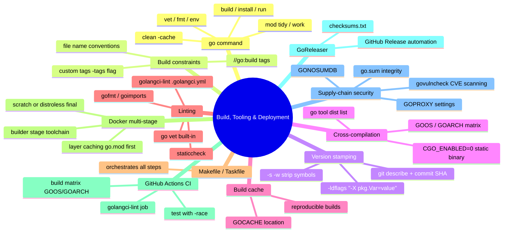

# Notes — Module 18: Build, Tooling, and Deployment

> These are your personal study notes. Write freely and honestly.
> Incomplete notes are fine — they show where your understanding still needs work.
> Return to this file to add insights as they develop over time.

**Module:** [[go/18. Build, Tooling, and Deployment]]
**Topic:** [[go]]
**Date started:** YYYY-MM-DD
**Status:** In progress

---

## Concept Map

_Sketch how the concepts in this module relate to each other. Fill in the Mermaid diagram._



_Alternative: draw this on paper, photo it, and link the image here._

---

## Key Insights

_The "aha moments" — the things that, once understood, made the rest clear._
_Be specific: "I finally understood X because Y" is more useful than "X makes sense"._

1. **CGO_ENABLED=0 is not optional for scratch:** _I finally understood that a "Linux binary" built with CGO enabled is not necessarily self-contained — it may dynamically link against glibc, which doesn't exist in a scratch image. The distinction between a linked Go binary and a static Go binary clicked when I ran `ldd` on both._
2. **-ldflags -X requires the full import path:** _I wasted 30 minutes wondering why my version wasn't stamped. The package path must be the full module path, not just the local package name. There is no compile error — the wrong path silently produces no effect._
3. _Add insights as you discover them_

---

## My Understanding

_Explain the core concepts in your own words, as if teaching them to someone else._
_If you can't explain it simply, you don't understand it well enough yet._

### The go Command Toolchain

_Your explanation here_

_What I'm still unsure about:_ (e.g., the difference between `go build` and `go install`, and exactly where `go install` puts the binary)

### Build Constraints

_Your explanation here_

_What I'm still unsure about:_ (e.g., whether file name conventions and `//go:build` directives can conflict, and which takes precedence)

### Cross-Compilation and CGO_ENABLED=0

_Your explanation here_

_What I'm still unsure about:_ (e.g., which parts of the standard library actually use cgo on Linux by default — is it just `net` and `os/user`?)

### Multi-Stage Docker Builds

_Your explanation here_

_What I'm still unsure about:_ (e.g., when to choose `scratch` vs `distroless` — what does distroless actually provide that scratch doesn't?)

### Supply-Chain Security

_Your explanation here_

_What I'm still unsure about:_ (e.g., exactly what `govulncheck` checks vs a simple `go list -m all` version audit)

---

## Connections to Other Topics

_How does this module connect to things you already know?_

| This module's concept | Connects to | How |
|----------------------|-------------|-----|
| CGO_ENABLED=0 and static binaries | [[go/17. Runtime Internals and the Memory Model]] | Disabling cgo removes the dynamic link to glibc; understanding what cgo does (bridge to C libraries) explains why disabling it makes the binary self-contained |
| `go.sum` and GOPROXY | [[go/7. Packages and Modules]] | The module system's cryptographic integrity layer; `go.sum` is produced by `go mod tidy` and verified on every download |
| `go test -race` in CI | [[go/11. Testing and Benchmarking]] | The race detector is a compile-time flag; understanding what it instruments (memory access logging) helps interpret its output in CI |
| Build cache and incremental compilation | [[go/16. Performance and Profiling]] | The build cache stores SSA-compiled package objects; cache invalidation mirrors recompilation boundaries |

---

## Questions That Arose

_Log questions as they appear. Don't stop to answer them now — just capture them._
_Then move the serious ones to [QUESTIONS.md](./QUESTIONS.md)._

- [ ] What is the difference between `go build ./...` and `go build .`? Does `./...` build all binaries in the module? → added to QUESTIONS.md as Q001
- [ ] When GoReleaser runs, does it rebuild from source, or can it use cached artifacts? → might be answered in GoReleaser docs
- [ ] Does `govulncheck` scan only direct dependencies or the full transitive graph? → added to QUESTIONS.md as Q002

---

## Code Snippets Worth Remembering

_Patterns, idioms, or examples that captured something important._

### Version-stamping build command

```bash
go build \
  -ldflags "-s -w \
            -X 'github.com/acme/myapp/internal/version.Version=$(git describe --tags --always)' \
            -X 'github.com/acme/myapp/internal/version.Commit=$(git rev-parse --short HEAD)' \
            -X 'github.com/acme/myapp/internal/version.BuildDate=$(date -u +%Y-%m-%dT%H:%M:%SZ)'" \
  -o bin/myapp .
```

_Why I'm saving this:_ This is the canonical build-time version stamping pattern. The `-s -w` flags reduce binary size; the three `-X` flags inject version info. Works in Makefiles and CI without modification.

---

### Dockerfile layer ordering for module cache

```dockerfile
# FAST: cache go mod download separately from source
COPY go.mod go.sum ./
RUN go mod download
COPY . .
RUN CGO_ENABLED=0 go build -o /app/server .
```

_Why I'm saving this:_ Layer ordering is the most impactful Dockerfile optimization for Go. `go mod download` is slow; source changes are frequent. Separating them means most rebuilds skip the module download entirely.

---

### Static binary verification

```bash
CGO_ENABLED=0 GOOS=linux go build -o myapp .
ldd myapp
# Expected: "not a dynamic executable"
# If you see glibc entries, CGO is still active somehow
```

_Why I'm saving this:_ Always verify with `ldd` before assuming a binary is static. CGO can be pulled in transitively through indirect dependencies.

---

## What Tripped Me Up

_Mistakes I made, misconceptions I had, things that confused me more than they should have._
_Being honest here helps you later._

- **The -X flag path** — I initially tried `-X version.Version=v1.0.0` (short path), but it silently did nothing. It requires the full module-qualified import path. No warning, no error — just the default value.
- **CGO_ENABLED in multi-module workspaces** — When using `go work`, `CGO_ENABLED=0` must be set for each module being built, not just at the workspace level. Setting it as an environment variable covers all modules in the workspace.

---

## Summary in My Own Words

_Write a 3–5 sentence summary of this entire module without looking at any notes._
_If you can't do this, you need more study time._

_Write your summary here after completing the module._

---

_Last updated: YYYY-MM-DD_
