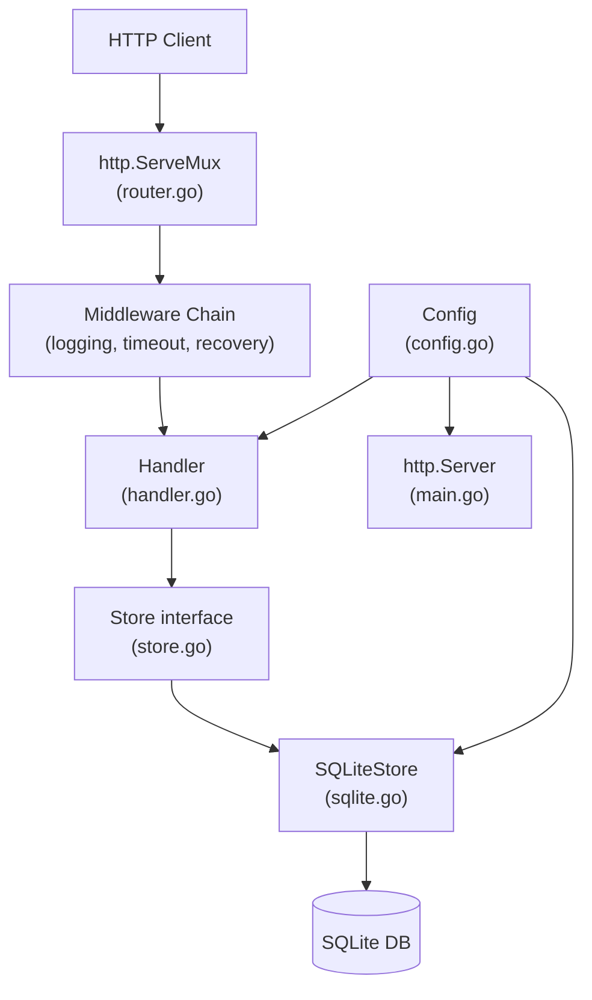

# Notes — Module 19: Capstone Project

> These are your personal build notes and decisions journal.
> Write freely and honestly. There is no correct format — use whatever helps you think.
> Return to this file after each milestone to record what you learned and decided.

**Module:** [[go/19. Capstone Project]]
**Topic:** [[go]]
**Date started:** YYYY-MM-DD
**Status:** In progress
**Brief chosen:** URL shortener / Task API / Webhook runner / Metrics collector (circle one)

---

## Build Log

_One entry per significant work session. Be specific about what you did and what you learned._
_Vague entries ("worked on the store") are useless. Specific entries ("fixed a data race in IncrementHits by using UPDATE ... RETURNING instead of SELECT then UPDATE") are valuable._

---

### YYYY-MM-DD — Session 1

**Milestone:** M0 / M1 / M2 / ...
**What I did:**
- ...

**What surprised me:**
- ...

**Decisions made:**
- Chose [SQLite / Postgres] because...
- Chose [distroless / alpine] as the final Docker base image because...

**What I'll tackle next:**
- ...

---

_Add new session entries here, newest at the top._

---

## Architecture Decisions Journal

_Record significant design decisions here. For each decision: what you chose, what the alternatives were, and why you chose what you did. This becomes the material for your project README's "design decisions" section._

### Decision 1: Storage Backend

**Date:** YYYY-MM-DD
**What I chose:** SQLite / Postgres
**Alternatives I considered:** ...
**Why I chose this:**
**What I'd change if this were a production system:**

---

### Decision 2: Short Code Generation Strategy

**Date:** YYYY-MM-DD
**What I chose:** (random N characters from alphanumeric alphabet / hash-based / sequential counter / ...)
**Alternatives I considered:** ...
**Why I chose this:**
**Collision handling:**

---

### Decision 3: Error Handling Architecture

**Date:** YYYY-MM-DD
**What I chose:**
**Alternatives I considered:**
**Why I chose this:**

---

_Add more decisions as you make them._

---

## Concept Map

_How the major components of your service relate to each other._



_This is a starting point — update it as your architecture evolves._

---

## Key Insights

_The "aha moments" — discoveries that changed how you think about something._

1. **Interfaces enable testing without real dependencies:** _Fill in when you experience this_
2. **context.Context is a river, not a bucket:** _Fill in when cancellation propagation clicks_
3. _Add insights as you discover them_

---

## My Understanding of Key Concepts (After Building)

_After completing each milestone, explain the concept in your own words based on what you built._

### Store Interface (after M1/M2)

_Your explanation here — how does defining the interface first, before the implementation, change the design process?_

_What I'm still unsure about:_ ...

### Context Propagation (after M3/M4)

_Your explanation here — trace one request from `r.Context()` through middleware into the store._

_What I'm still unsure about:_ ...

### Graceful Shutdown (after M6)

_Your explanation here — what exactly happens between "SIGINT received" and "process exits 0"?_

_What I'm still unsure about:_ ...

---

## Connections to Earlier Modules

_How did each earlier module show up in your project? Be specific._

| Module | How I used it in the capstone |
|--------|-------------------------------|
| [[go/6. Methods and Interfaces]] | |
| [[go/8. Error Handling]] | |
| [[go/9. Concurrency]] | |
| [[go/11. Testing and Benchmarking]] | |
| [[go/12. Advanced Concurrency Patterns]] | |
| [[go/13. Web Services and APIs]] | |
| [[go/14. Databases and Persistence]] | |
| [[go/18. Build, Tooling, and Deployment]] | |
| _add any others you used_ | |

---

## Questions That Arose

_Log questions as they appear. Don't stop to answer them now — just capture them._
_Then move the important ones to [QUESTIONS.md](./QUESTIONS.md)._

- [ ] ... → added to QUESTIONS.md as Q001
- [ ] ...

---

## Code Patterns Worth Remembering

_Snippets or patterns from your own code that captured something important._

### The pattern I'm most proud of

```go
// YOUR CODE HERE
```

_Why I'm saving this:_

---

### The pattern I wish I had learned earlier

```go
// YOUR CODE HERE
```

_Why I'm saving this:_

---

## What Tripped Me Up

_Mistakes I made, misconceptions I had, bugs that cost me more time than they should have._

- **The hardest bug:** _describe it here_
- **The design decision I'd change:** _describe it here_
- **The thing that seemed obvious but wasn't:** _describe it here_

---

## Retrospective (complete after project is done)

_Write this section only after you have finished the project and graded TEST.md._

**What I built:**

**Time spent (approximate):**

**What I am proud of:**

**What I am not satisfied with:**

**The most important thing I learned:**

**How my understanding of Go changed:**

---

_Last updated: YYYY-MM-DD_
