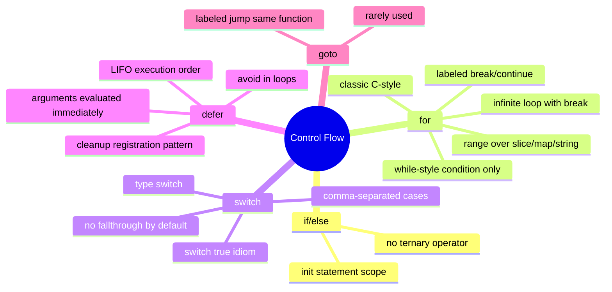

# Notes — Module 2: Control Flow

> These are your personal study notes. Write freely and honestly.
> Incomplete notes are fine — they show where your understanding still needs work.
> Return to this file to add insights as they develop over time.

**Module:** [[go/2. Control Flow]]
**Topic:** [[go]]
**Date started:** YYYY-MM-DD
**Status:** In progress

---

## Concept Map

_Sketch how the concepts in this module relate to each other. Fill in the Mermaid diagram._



_Alternative: draw this on paper, photo it, and link the image here._

---

## Key Insights

_The "aha moments" — the things that, once understood, made the rest clear._
_Be specific: "I finally understood X because Y" is more useful than "X makes sense"._

1. **One loop, four forms:** _I finally understood that `for` without a condition or init/post is not a bug or shorthand — it's the canonical infinite loop. There's nothing missing._
2. **defer registers, not delays:** _Defer doesn't just "run later" — it captures arguments NOW and runs the call at function return. The distinction between "evaluate now, call later" clicked when I looked at the i=42 example._
3. _Add insights as you discover them_

---

## My Understanding

_Explain the core concepts in your own words, as if teaching them to someone else._
_If you can't explain it simply, you don't understand it well enough yet._

### if / else

_Your explanation here_

_What I'm still unsure about:_ (e.g., exactly when the init statement variable goes out of scope)

### for — the only loop

_Your explanation here_

_What I'm still unsure about:_ (e.g., what happens if you range over a nil slice)

### switch

_Your explanation here_

_What I'm still unsure about:_ (e.g., whether fallthrough checks the next case's condition)

### defer

_Your explanation here_

_What I'm still unsure about:_ (e.g., how defer interacts with panic/recover)

---

## Connections to Other Topics

_How does this module connect to things you already know?_

| This module's concept | Connects to | How |
|----------------------|-------------|-----|
| if with init statement | [[go/1. Types and Variables]] | The `:=` short declaration in init statement declares a new variable with inferred type |
| for range over string | Unicode / utf8 | Range gives runes (Unicode code points), not bytes; understanding UTF-8 encoding explains the non-sequential byte indices |
| defer for cleanup | [[go/3. Functions]] | Deferred closures can capture and modify named return values — requires understanding function return mechanics |

---

## Questions That Arose

_Log questions as they appear. Don't stop to answer them now — just capture them._
_Then move the serious ones to [QUESTIONS.md](./QUESTIONS.md)._

- [ ] Does `fallthrough` check the next case's condition, or does it skip the check entirely? → added to QUESTIONS.md as Q001
- [ ] What happens if you `defer` inside an `init()` function? → might be answered in a later module
- [ ] Can you range over a channel? → might be answered in the concurrency module

---

## Code Snippets Worth Remembering

_Patterns, idioms, or examples that captured something important._

### The idiomatic if-with-error pattern

```go
if v, err := strconv.Atoi(s); err == nil {
    fmt.Println(v)
} else {
    fmt.Println("error:", err)
}
```

_Why I'm saving this:_ This is everywhere in Go. The init statement keeps `v` and `err` scoped to the if block — clean, no pollution of the outer scope.

---

### defer-immediately-after-open

```go
f, err := os.Open(path)
if err != nil {
    return err
}
defer f.Close()
```

_Why I'm saving this:_ The canonical acquire-then-defer pattern. Note the error check happens BEFORE the defer — you never defer on a nil file handle.

---

### switch-true as if/else chain

```go
switch {
case score >= 90:
    grade = "A"
case score >= 80:
    grade = "B"
default:
    grade = "C"
}
```

_Why I'm saving this:_ More readable than a chain of if/else if when there are 3+ range conditions. Cases are checked in order; first match wins.

---

## What Tripped Me Up

_Mistakes I made, misconceptions I had, things that confused me more than they should have._
_Being honest here helps you later._

- **Switch fallthrough** — I initially thought Go's switch worked like C's (automatic fall-through), but it actually requires an explicit `fallthrough` keyword. The safe default is no fall-through.
- **defer in a loop** — I initially thought `defer f.Close()` inside a loop would run at the end of each iteration, but it actually runs when the enclosing function returns. The fix is to extract the loop body into a helper function.

---

## Summary in My Own Words

_Write a 3–5 sentence summary of this entire module without looking at any notes._
_If you can't do this, you need more study time._

_Write your summary here after completing the module._

---

_Last updated: YYYY-MM-DD_
