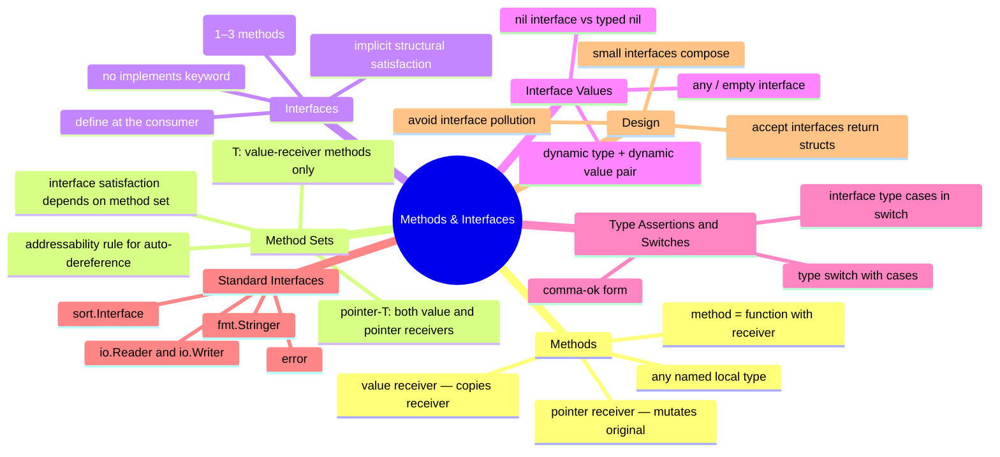

# Notes — Module 6: Methods and Interfaces

> These are your personal study notes. Write freely and honestly.
> Incomplete notes are fine — they show where your understanding still needs work.
> Return to this file to add insights as they develop over time.

**Module:** [[go/6. Methods and Interfaces]]
**Topic:** [[go]]
**Date started:** YYYY-MM-DD
**Status:** In progress

---

## Concept Map

_Sketch how the concepts in this module relate to each other. Fill in the Mermaid diagram._



_Alternative: draw this on paper, photo it, and link the image here._

---

## Key Insights

_The "aha moments" — the things that, once understood, made the rest clear._
_Be specific: "I finally understood X because Y" is more useful than "X makes sense"._

1. **Method set asymmetry:** _I finally understood that `*T` gets both value- and pointer-receiver methods, but `T` only gets value-receiver methods, because the compiler can always dereference a pointer but cannot always take the address of an interface's stored value (it might be a copy)._
2. **Typed nil is not nil interface:** _The typed-nil bug clicked when I understood that an interface is a two-word struct: `(type, value)`. A nil concrete pointer stored in an interface sets the type word but zeros the value word — the interface is still "not nil" because the type word is set._
3. _Add insights as you discover them_

---

## My Understanding

_Explain the core concepts in your own words, as if teaching them to someone else._
_If you can't explain it simply, you don't understand it well enough yet._

### Methods and Receivers

_Your explanation here_

_What I'm still unsure about:_ (e.g., can you define methods on a type alias? on a type from another package?)

### Value vs Pointer Receivers

_Your explanation here_

_What I'm still unsure about:_ (e.g., when exactly does the compiler auto-take the address for a method call?)

### Interface Satisfaction and Method Sets

_Your explanation here_

_What I'm still unsure about:_ (e.g., the exact rule for when T satisfies an interface vs *T)

### Interface Values — The (type, value) Pair

_Your explanation here_

_What I'm still unsure about:_ (e.g., what happens to the interface value when the concrete type goes out of scope?)

### The Typed-Nil Bug

_Your explanation here_

_What I'm still unsure about:_ (e.g., are there other situations where this pattern causes a bug beyond error returns?)

---

## Connections to Other Topics

_How does this module connect to things you already know?_

| This module's concept | Connects to | How |
|----------------------|-------------|-----|
| Pointer receiver | [[go/5. Pointers]] | A pointer receiver is just a pointer parameter — same rules about mutability and indirection apply |
| Interface values as (type, value) | [[go/15. Reflection and Metaprogramming]] | reflect.TypeOf and reflect.ValueOf operate on this same (type, value) pair — interfaces are the entry point to reflection |
| error interface | [[go/8. Error Handling]] | error is just `interface{ Error() string }` — all of module 8 builds on this module's interface mechanics |
| sort.Interface | [[go/4. Composite Types]] | sort.Interface operates on slices — understanding slice indexing and swapping is prerequisite to implementing Len/Less/Swap |

---

## Questions That Arose

_Log questions as they appear. Don't stop to answer them now — just capture them._
_Then move the serious ones to [QUESTIONS.md](./QUESTIONS.md)._

- [ ] Can you define a method on a pointer to an interface? (I think not — but why?) → added to QUESTIONS.md as Q001
- [ ] If a struct embeds a type that has methods, do those methods count toward satisfying an interface? → needs testing
- [ ] What does the compiler do with the method table (itab) at runtime? → might be answered in module 17

---

## Code Snippets Worth Remembering

_Patterns, idioms, or examples that captured something important._

### Compile-time interface satisfaction check

```go
var _ io.Writer = (*MyWriter)(nil)
// If *MyWriter doesn't implement io.Writer, this line causes a compile error.
// Use this as documentation that MyWriter is intended to satisfy io.Writer.
```

_Why I'm saving this:_ This pattern gives you a named compile-time assertion. It's idiomatic in library code to document intended interface satisfaction and catch regressions early.

---

### Pointer receiver prevents value type from satisfying interface

```go
type Doer interface{ Do() }

type T struct{}
func (t *T) Do() {}   // pointer receiver

var d Doer = T{}   // compile error: T does not implement Doer
var d Doer = &T{}  // OK: *T implements Doer
```

_Why I'm saving this:_ This is the most common "does not implement" error. Solution is always to use `&T{}` or ensure the receiver type is consistent.

---

### The correct nil-returning error pattern

```go
func mayFail(ok bool) error {
    if !ok {
        return &MyError{"something failed"}
    }
    return nil   // NOT: var err *MyError; return err
}
```

_Why I'm saving this:_ The bug version (declaring a typed nil and returning it) looks correct but breaks `if err != nil`. Always return `nil` directly when there is no error.

---

### Consumer-side interface definition

```go
// In the consumer package:
type Saver interface {
    Save(key, value string) error
}

// The producer package (e.g., storage) never mentions Saver.
// FileStore satisfies Saver implicitly by having the Save method.
```

_Why I'm saving this:_ This is the canonical "define interfaces where you use them" pattern. It decouples packages without requiring the producer to import the consumer.

---

## What Tripped Me Up

_Mistakes I made, misconceptions I had, things that confused me more than they should have._
_Being honest here helps you later._

- **Value receiver vs pointer receiver in interface context** — I initially thought the compiler's auto-addressing for direct method calls also applied when storing into an interface. It doesn't. For interfaces, the method set rules are strict.
- **The typed-nil bug** — I initially assumed that a nil pointer of any kind returned as an error would make `err == nil` true. It doesn't. The interface wraps the pointer and carries its type.

---

## Summary in My Own Words

_Write a 3–5 sentence summary of this entire module without looking at any notes._
_If you can't do this, you need more study time._

_Write your summary here after completing the module._

---

_Last updated: YYYY-MM-DD_
