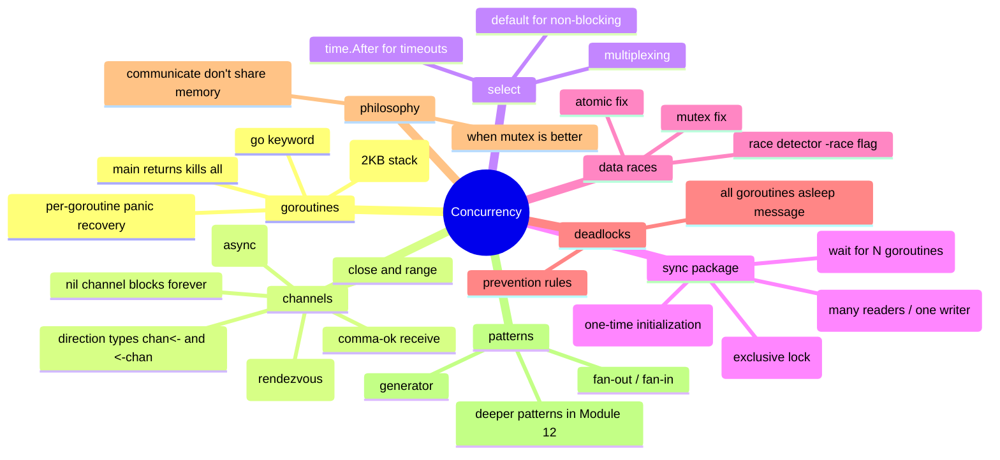

# Notes — Module 9: Concurrency

> These are your personal study notes. Write freely and honestly.
> Incomplete notes are fine — they show where your understanding still needs work.
> Return to this file to add insights as they develop over time.

**Module:** [[go/9. Concurrency]]
**Topic:** [[go]]
**Date started:** YYYY-MM-DD
**Status:** In progress

---

## Concept Map

_Sketch how the concepts in this module relate to each other. Fill in the Mermaid diagram._



_Alternative: draw this on paper, photo it, and link the image here._

---

## Key Insights

_The "aha moments" — the things that, once understood, made the rest clear._
_Be specific: "I finally understood X because Y" is more useful than "X makes sense"._

1. **Goroutines are not threads:** I finally understood that goroutines are managed by the Go runtime, not the OS. A single OS thread can run thousands of goroutines. The scheduler (details in Module 17) is what makes goroutines cheap.
2. **Unbuffered channels are rendezvous points:** Not just "slow channels" — they guarantee that the send and receive happen at the same moment. The sender and receiver must both be ready. This is actually stronger synchronization than a buffered channel.
3. _Add insights as you discover them_

---

## My Understanding

_Explain the core concepts in your own words, as if teaching them to someone else._
_If you can't explain it simply, you don't understand it well enough yet._

### Goroutines

_Your explanation here_

_What I'm still unsure about:_ (e.g., exactly when the Go scheduler preempts a goroutine — see Module 17)

### Channels (unbuffered vs buffered)

_Your explanation here_

_What I'm still unsure about:_ (e.g., what happens if I range over a channel that nobody ever closes)

### select

_Your explanation here_

_What I'm still unsure about:_ (e.g., if two cases are ready simultaneously, is the selection truly random or biased by implementation?)

### sync.WaitGroup

_Your explanation here_

_What I'm still unsure about:_ (e.g., whether I can reuse a WaitGroup after Wait returns)

### Data races and the race detector

_Your explanation here_

_What I'm still unsure about:_ (e.g., what "happens before" means formally in the Go memory model — see Module 17)

---

## Connections to Other Topics

_How does this module connect to things you already know?_

| This module's concept | Connects to | How |
|----------------------|-------------|-----|
| Channels as CSP primitives | [[concurrency]] | Go's channel model is an implementation of Hoare's CSP; the shared-concept page has a broader comparison |
| WaitGroup + channel for result collection | [[go/8. Error Handling]] | Goroutines need to propagate errors back to the caller; the `(result, error)` channel pair is the standard idiom |
| Goroutine scheduler internals | [[go/17. Runtime Internals and the Memory Model]] | The M:N scheduler, GOMAXPROCS, and the Go memory model explain exactly what goroutines guarantee |

---

## Questions That Arose

_Log questions as they appear. Don't stop to answer them now — just capture them._
_Then move the serious ones to [QUESTIONS.md](./QUESTIONS.md)._

- [ ] What exactly does the runtime do when it detects "all goroutines are asleep"? → added to QUESTIONS.md as Q001
- [ ] Can I range over a nil channel? → might be answered by experimenting (nil channel blocks forever, so range would hang)
- [ ] Does `sync.Once.Do` work correctly if the initialization function itself spawns goroutines?

---

## Code Snippets Worth Remembering

_Patterns, idioms, or examples that captured something important._

### WaitGroup + defer Done

```go
var wg sync.WaitGroup
wg.Add(1)
go func() {
    defer wg.Done() // always via defer — runs even on panic
    doWork()
}()
wg.Wait()
```

_Why I'm saving this:_ The canonical goroutine launch pattern. `wg.Add` before launch, `wg.Done` via defer inside.

---

### Mutex protecting a struct field

```go
type SafeMap struct {
    mu sync.Mutex
    m  map[string]int
}

func (s *SafeMap) Set(k string, v int) {
    s.mu.Lock()
    defer s.mu.Unlock()
    s.m[k] = v
}
```

_Why I'm saving this:_ The standard mutex-in-struct pattern. Always use defer for Unlock so early returns don't leave the mutex locked.

---

### select with timeout

```go
select {
case result := <-resultCh:
    return result, nil
case <-time.After(500 * time.Millisecond):
    return "", errors.New("timed out")
}
```

_Why I'm saving this:_ The canonical timeout pattern. `time.After` returns a channel that fires after the duration — clean and idiomatic.

---

### Buffered channel in fire-and-forget timeout pattern

```go
resultCh := make(chan string, 1) // buffered — goroutine won't leak if we time out
go func() {
    resultCh <- slowWork() // can send even if caller already timed out
}()
```

_Why I'm saving this:_ Without the buffer, a goroutine that finishes after the timeout would block on the send and leak. The buffer of 1 lets the goroutine complete cleanly.

---

## What Tripped Me Up

_Mistakes I made, misconceptions I had, things that confused me more than they should have._

- **Loop variable capture** — I initially thought each goroutine would capture its own copy of the loop variable. They all share the same variable. Passing `i` as an argument (or using Go 1.22) is the fix.
- **WaitGroup.Add inside the goroutine** — I put `wg.Add(1)` as the first line of the goroutine body. This is a race — `wg.Wait()` could return before the goroutine runs. Add must be in the parent.

---

## Summary in My Own Words

_Write a 3–5 sentence summary of this entire module without looking at any notes._
_If you can't do this, you need more study time._

_Write your summary here after completing the module._

---

_Last updated: YYYY-MM-DD_
