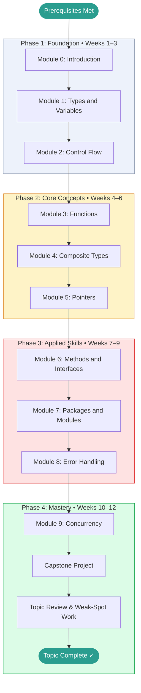

# Go — Learning Roadmap

> This roadmap is your study plan. Work through the phases in order.
> Each phase builds directly on the previous one.
> Mark your current position with **← You Are Here** and update it as you progress.

---

## Prerequisites Map

Confirm you have working knowledge of these before entering Phase 1:

```
[[python]] or any other language  ──┐
                                     ├──► Go  (start here)
basic terminal / command-line    ────┘
```

If you have never written a program in any language, spend time with a beginner Python or JavaScript course first. All programming fundamentals (variables, loops, functions) carry over directly and you will learn Go much faster with that foundation.

---

## Learning Path Visualization



---

## Phase Breakdown

### Phase 1: Foundation

**Goal:** Get the Go toolchain installed, understand the language's philosophy, learn the type system and control flow. Leave Phase 1 able to write small Go programs from scratch.

| Module | Name | Est. Hours | Key Skill Gained |
|--------|------|-----------|-----------------|
| 0 | Introduction | 2–3 hrs | Working environment; hello world; go toolchain |
| 1 | Types and Variables | 3–4 hrs | Declaring variables; understanding zero values and iota |
| 2 | Control Flow | 3–4 hrs | for (all forms), if/else, switch, defer |

**Phase 1 Exit Criteria:**

- [ ] Go is installed; `go version` prints a Go 1.18+ version
- [ ] Can write, format, and run a Go program from the command line
- [ ] Can declare variables using `var`, `:=`, and `const`
- [ ] Understands zero values and can explain why they matter
- [ ] Can write loops using all three forms of Go's `for`
- [ ] Scored ≥ 70% on Module 0, 1, and 2 tests
- [ ] Completed at least one Beginner-level project from PROJECTS.md

**Milestone unlocked:** Foundation Built

---

### Phase 2: Core Concepts

**Goal:** Master Go's core building blocks — functions, composite data types, and pointer semantics. Leave Phase 2 able to write non-trivial programs that handle real data.

| Module | Name | Est. Hours | Key Skill Gained |
|--------|------|-----------|-----------------|
| 3 | Functions | 4–5 hrs | Multiple returns; closures; first-class functions |
| 4 | Composite Types | 5–6 hrs | Slices, maps, structs — the backbone of Go programs |
| 5 | Pointers | 3–4 hrs | Pointer syntax; value vs pointer semantics; when each matters |

**Phase 2 Exit Criteria:**

- [ ] Can write functions that return multiple values including errors
- [ ] Can use slices and maps idiomatically (append, make, delete, range)
- [ ] Understands the difference between passing by value and by pointer
- [ ] Can define structs and use them to model domain data
- [ ] Scored ≥ 75% on all Phase 2 module tests
- [ ] Completed at least one Intermediate-level project from PROJECTS.md

**Milestone unlocked:** Core Mastery

---

### Phase 3: Applied Skills

**Goal:** Learn how idiomatic Go programs are structured — interfaces, package organization, and the error handling discipline that makes Go codebases maintainable. Leave Phase 3 able to build well-structured Go programs others can read.

| Module | Name | Est. Hours | Key Skill Gained |
|--------|------|-----------|-----------------|
| 6 | Methods and Interfaces | 5–6 hrs | Interface design; structural typing; type assertions |
| 7 | Packages and Modules | 3–4 hrs | Code organization; go.mod; visibility rules |
| 8 | Error Handling | 4–5 hrs | error interface; wrapping; custom errors; panic/recover |

**Phase 3 Exit Criteria:**

- [ ] Can define interfaces and write code that satisfies them implicitly
- [ ] Can organize a multi-file, multi-package Go program correctly
- [ ] Handles errors with `fmt.Errorf` / `%w`, `errors.Is`, `errors.As`
- [ ] Never ignores an error return value silently
- [ ] Scored ≥ 80% on all Phase 3 module tests
- [ ] GLOSSARY.md covers all terms encountered through Module 8

**Milestone unlocked:** Applied Practitioner

---

### Phase 4: Mastery

**Goal:** Learn Go's concurrency primitives, build a substantial project, and synthesize everything into genuine proficiency.

| Activity | Est. Hours | Description |
|----------|-----------|-------------|
| Module 9: Concurrency | 6–8 hrs | Goroutines, channels, select, sync.Mutex, sync.WaitGroup |
| Capstone Project | 10–20 hrs | A non-trivial Go program using concepts from multiple modules |
| Topic Review | 3–5 hrs | Revisit modules where test scores were below 80% |
| Final Self-Assessment | 1–2 hrs | Retake weakest module tests; verify overall ≥ 80% |

**Phase 4 Exit Criteria:**

- [ ] Can write concurrent programs with goroutines and channels
- [ ] Understands when goroutines are appropriate vs. sequential code
- [ ] Can use `select` for multi-channel coordination
- [ ] Capstone project complete and documented in PROJECTS.md
- [ ] Overall topic score ≥ 80%
- [ ] CHEATSHEET.md is complete and serves as a genuine reference

**Milestone unlocked:** Topic Mastery

---

## Time Estimates Summary

| Phase | Weeks | Est. Hours | Cumulative |
|-------|-------|-----------|------------|
| Phase 1: Foundation | 1–3 | 8–11 hrs | ~10 hrs |
| Phase 2: Core Concepts | 4–6 | 12–15 hrs | ~25 hrs |
| Phase 3: Applied Skills | 7–9 | 12–15 hrs | ~40 hrs |
| Phase 4: Mastery | 10–12 | 20–35 hrs | ~65 hrs |
| **Total** | **12** | **~52–76 hrs** | |

> [!NOTE]
> These estimates assume roughly **5–7 focused hours per week**.
> If you're studying part-time, the calendar weeks will stretch accordingly.
> Consistency matters more than pace — even 1 hour per day compounds quickly.

---

## What Go Enables

After completing this topic, the following doors open:

```
Go Mastery
│
├── [[docker-containers]] — Read and write Dockerfiles; understand Docker internals
├── [[networking]] — Build production HTTP servers, TCP services, gRPC APIs
├── [[algorithms]] — Implement data structures cleanly in a typed language
├── [[rust]] — Natural next language if you want lower-level systems programming
└── Cloud Native — Contribute to or extend Kubernetes, Terraform, Prometheus
```

---

## Milestone Definitions

| Milestone | Earned When | Point Threshold |
|-----------|------------|----------------|
| First Step | Module 0 complete | Any score |
| Foundation Built | Phase 1 complete, all tests ≥ 70% | ~45 pts |
| Core Mastery | Phase 2 complete, all tests ≥ 75% | ~95 pts |
| Applied Practitioner | Phase 3 complete, all tests ≥ 80% | ~145 pts |
| Topic Mastery | Phase 4 complete, capstone done, overall ≥ 80% | ~175 pts |

---

## Alternative Paths

### Fast Track (If You Have Prior Experience)

If you already know another statically typed language well (Java, C#, C++, Rust):

```
Skim Module 0 → Skim Module 1 → Start seriously at Module 3
```

Take the Module 0 test first. If you score ≥ 85%, the fast track is appropriate.

### Deep Dive Path (Maximum Understanding)

For maximum depth, add these supplementary activities between phases:

- **After Phase 1:** Read *The Go Programming Language* (Donovan & Kernighan), Chapters 1–3
- **After Phase 2:** Work through the exercises in Chapters 4–6 of the same book
- **After Phase 3:** Read Effective Go (go.dev/doc/effective_go) end to end

### Project-First Path (Learn by Building)

If you learn best by doing rather than reading:

```
Module 0 → Beginner Project → Module 1 → Beginner Project → Module 2 → ...
```

Alternate one module of theory with one hands-on project at each step. The tight feedback loop accelerates retention.

---

## You Are Here

> **Current Phase:** _Not started_
>
> **Current Module:** _None — begin at [Module 0](./0.%20Introduction/README.md)_
>
> **Last Completed Module:** _None_
>
> **Next Action:** Open Module 0 and read the Overview section.
>
> _Update this section each time you advance to a new module or phase._
