# Go — Learning Roadmap

> This roadmap is your study plan. Work through the phases in order.
> Each phase builds directly on the previous one.
> Mark your current position with **← You Are Here** and update it as you progress.

This topic spans the **full arc from zero to expert** — from installing Go and writing your
first program (Module 0) all the way to runtime internals, performance work, and shipping a
real production service (the Capstone, Module 19). The goal is genuine professional
competence: the level of someone who has worked with Go in a company for a couple of years.

---

## Prerequisites Map

Confirm you have working knowledge of these before entering Phase 1:

```
Python or any other language  ──┐
                                     ├──► Go  (start here)
basic terminal / command-line    ────┘
```

If you have never written a program in any language, spend time with a beginner Python or JavaScript course first. All programming fundamentals (variables, loops, functions) carry over directly and you will learn Go much faster with that foundation.

---

## Learning Path Visualization

```mermaid
flowchart TD
    A([Prerequisites Met]) --> B

    subgraph P1["Phase 1: Foundation  •  Weeks 1–3"]
        B[Module 0: Introduction]
        B --> C[Module 1: Types and Variables]
        C --> D[Module 2: Control Flow]
    end

    subgraph P2["Phase 2: Core Concepts  •  Weeks 4–6"]
        E[Module 3: Functions]
        E --> F[Module 4: Composite Types]
        F --> G[Module 5: Pointers]
    end

    subgraph P3["Phase 3: Applied Skills  •  Weeks 7–10"]
        H[Module 6: Methods and Interfaces]
        H --> I[Module 7: Packages and Modules]
        I --> J[Module 8: Error Handling]
        J --> K[Module 9: Concurrency]
    end

    subgraph P4["Phase 4: Modern, Tested Go  •  Weeks 11–13"]
        L[Module 10: Generics]
        L --> M[Module 11: Testing and Benchmarking]
    end

    subgraph P5["Phase 5: Production Go  •  Weeks 14–18"]
        N[Module 12: Advanced Concurrency Patterns]
        N --> O[Module 13: Web Services and APIs]
        O --> P[Module 14: Databases and Persistence]
        P --> Q[Module 15: Reflection and Metaprogramming]
    end

    subgraph P6["Phase 6: Expert  •  Weeks 19–23"]
        R[Module 16: Performance and Profiling]
        R --> S[Module 17: Runtime Internals and the Memory Model]
        S --> T[Module 18: Build, Tooling, and Deployment]
    end

    subgraph P7["Phase 7: Capstone  •  Weeks 24+"]
        U[Module 19: Capstone Project]
        U --> V([Topic Complete ✓])
    end

    D --> E
    G --> H
    K --> L
    M --> N
    Q --> R
    T --> U

    style A fill:#2a9d8f,color:#fff,stroke:none
    style V fill:#2a9d8f,color:#fff,stroke:none
    style P1 fill:#edf2fb,stroke:#8d99ae
    style P2 fill:#fef3c7,stroke:#d97706
    style P3 fill:#fee2e2,stroke:#dc2626
    style P4 fill:#e0e7ff,stroke:#4f46e5
    style P5 fill:#fae8ff,stroke:#a21caf
    style P6 fill:#dcfce7,stroke:#16a34a
    style P7 fill:#cffafe,stroke:#0891b2
```



---

## Phase Breakdown

### Phase 1: Foundation

**Goal:** Get the Go toolchain installed, understand the language's philosophy, learn the type system and control flow. Leave Phase 1 able to write small Go programs from scratch.

| Module | Name | Est. Hours | Key Skill Gained |
|--------|------|-----------|-----------------|
| 0 | Introduction | 2–3 hrs | Working environment; install; hello world; go toolchain |
| 1 | Types and Variables | 3–4 hrs | Declaring variables; understanding zero values and iota |
| 2 | Control Flow | 3–4 hrs | for (all forms), if/else, switch, defer |

**Phase 1 Exit Criteria:**

- [ ] Go is installed; `go version` prints a Go 1.18+ version
- [ ] Can write, format, and run a Go program from the command line
- [ ] Can declare variables using `var`, `:=`, and `const`
- [ ] Understands zero values and can explain why they matter
- [ ] Can write loops using all three forms of Go's `for`
- [ ] Scored ≥ 70% on Module 0, 1, and 2 tests
- [ ] Completed at least one Beginner-level project from PROJECTS.md

**Milestone unlocked:** Foundation Built

---

### Phase 2: Core Concepts

**Goal:** Master Go's core building blocks — functions, composite data types, and pointer semantics. Leave Phase 2 able to write non-trivial programs that handle real data.

| Module | Name | Est. Hours | Key Skill Gained |
|--------|------|-----------|-----------------|
| 3 | Functions | 4–5 hrs | Multiple returns; closures; first-class functions |
| 4 | Composite Types | 5–6 hrs | Slices, maps, structs — the backbone of Go programs |
| 5 | Pointers | 3–4 hrs | Pointer syntax; value vs pointer semantics; when each matters |

**Phase 2 Exit Criteria:**

- [ ] Can write functions that return multiple values including errors
- [ ] Can use slices and maps idiomatically (append, make, delete, range)
- [ ] Understands the difference between passing by value and by pointer
- [ ] Can define structs and use them to model domain data
- [ ] Scored ≥ 75% on all Phase 2 module tests
- [ ] Completed at least one Intermediate-level project from PROJECTS.md

**Milestone unlocked:** Core Mastery

---

### Phase 3: Applied Skills

**Goal:** Learn how idiomatic Go programs are structured — interfaces, package organization, the error-handling discipline that makes Go codebases maintainable, and Go's signature concurrency model. Leave Phase 3 able to build well-structured, concurrent Go programs others can read.

| Module | Name | Est. Hours | Key Skill Gained |
|--------|------|-----------|-----------------|
| 6 | Methods and Interfaces | 5–6 hrs | Interface design; structural typing; type assertions |
| 7 | Packages and Modules | 3–4 hrs | Code organization; go.mod; visibility rules |
| 8 | Error Handling | 4–5 hrs | error interface; wrapping; custom errors; panic/recover |
| 9 | Concurrency | 6–8 hrs | Goroutines, channels, select, sync.Mutex, sync.WaitGroup |

**Phase 3 Exit Criteria:**

- [ ] Can define interfaces and write code that satisfies them implicitly
- [ ] Can organize a multi-file, multi-package Go program correctly
- [ ] Handles errors with `fmt.Errorf` / `%w`, `errors.Is`, `errors.As`
- [ ] Never ignores an error return value silently
- [ ] Can write concurrent programs with goroutines and channels
- [ ] Scored ≥ 80% on all Phase 3 module tests
- [ ] GLOSSARY.md covers all terms encountered through Module 9

**Milestone unlocked:** Applied Practitioner

---

### Phase 4: Modern, Tested Go

**Goal:** Add the two skills that separate hobby code from professional code: writing reusable generic code, and proving your code works with a real test suite.

| Module | Name | Est. Hours | Key Skill Gained |
|--------|------|-----------|-----------------|
| 10 | Generics | 5–6 hrs | Type parameters, constraints, generic data structures |
| 11 | Testing and Benchmarking | 6–8 hrs | Table-driven tests, benchmarks, fuzzing, coverage, `httptest` |

**Phase 4 Exit Criteria:**

- [ ] Can write generic functions and types, and explain when generics help vs. hurt
- [ ] Writes table-driven tests as a default habit
- [ ] Can write and read a benchmark and a fuzz test
- [ ] Uses `go test -race` and `-cover` routinely
- [ ] Scored ≥ 80% on Module 10 and 11 tests

**Milestone unlocked:** Professional Foundations

---

### Phase 5: Production Go

**Goal:** Build the things companies actually pay Go developers to build — concurrent systems, HTTP/JSON services, and database-backed applications — and understand the reflection machinery that powers Go's libraries.

| Module | Name | Est. Hours | Key Skill Gained |
|--------|------|-----------|-----------------|
| 12 | Advanced Concurrency Patterns | 7–9 hrs | context, pipelines, worker pools, atomics, race detection |
| 13 | Web Services and APIs | 7–9 hrs | net/http, routing, middleware, JSON APIs, graceful shutdown |
| 14 | Databases and Persistence | 6–8 hrs | database/sql, transactions, migrations, the repository pattern |
| 15 | Reflection and Metaprogramming | 5–6 hrs | reflect, struct tags, encoding internals, go generate |

**Phase 5 Exit Criteria:**

- [ ] Can use `context.Context` for cancellation and deadlines throughout a program
- [ ] Can build a real HTTP JSON API with middleware and graceful shutdown
- [ ] Can persist and query data safely with transactions and prepared statements
- [ ] Understands how `encoding/json` uses reflection and struct tags
- [ ] Completed at least one Advanced-level project from PROJECTS.md
- [ ] Scored ≥ 80% on all Phase 5 module tests

**Milestone unlocked:** Production Engineer

---

### Phase 6: Expert

**Goal:** Develop the judgment of someone who has run Go in production for years — the ability to profile and optimize, to reason about the runtime and memory model, and to build, harden, and ship binaries reliably.

| Module | Name | Est. Hours | Key Skill Gained |
|--------|------|-----------|-----------------|
| 16 | Performance and Profiling | 7–9 hrs | pprof, escape analysis, allocations, GC tuning, optimization |
| 17 | Runtime Internals and the Memory Model | 7–9 hrs | Scheduler, GC, the Go memory model, unsafe, cgo |
| 18 | Build, Tooling, and Deployment | 6–8 hrs | Build modes, cross-compilation, linters, CI/CD, containers, releases |

**Phase 6 Exit Criteria:**

- [ ] Can capture and read CPU and memory profiles with pprof
- [ ] Can explain escape analysis and remove an avoidable heap allocation
- [ ] Can explain the goroutine scheduler (G-M-P) and the garbage collector in depth
- [ ] Can state what the Go memory model does and does not guarantee
- [ ] Can cross-compile, lint, containerize, and release a Go binary through CI
- [ ] Scored ≥ 85% on all Phase 6 module tests

**Milestone unlocked:** Go Expert

---

### Phase 7: Capstone

**Goal:** Prove it. Build a real, production-ready Go service end to end, synthesizing everything from the previous 19 modules.

| Activity | Est. Hours | Description |
|----------|-----------|-------------|
| Module 19: Capstone Project | 25–50 hrs | Build and ship a real service (e.g. a URL shortener, task API, or job runner) with tests, persistence, concurrency, observability, and a release pipeline |
| Topic Review | 3–5 hrs | Revisit any modules where test scores were below 85% |
| Final Self-Assessment | 1–2 hrs | Retake weakest module tests; verify overall ≥ 85% |

The capstone module gives you a project brief, milestones, and a **Help / Getting Unstuck** section with staged hints — but it intentionally does **not** hand you a finished solution. You drive the build; the help is only there to unblock you so you can keep moving on your own.

**Phase 7 Exit Criteria:**

- [ ] Capstone project is complete, tested, and documented
- [ ] The project uses concepts from at least 8 different modules
- [ ] The service builds into a single binary and runs in a container
- [ ] Capstone documented in PROJECTS.md with a design write-up
- [ ] Overall topic score ≥ 85%

**Milestone unlocked:** Topic Mastery

---

## Time Estimates Summary

| Phase | Weeks | Est. Hours | Cumulative |
|-------|-------|-----------|------------|
| Phase 1: Foundation | 1–3 | 8–11 hrs | ~10 hrs |
| Phase 2: Core Concepts | 4–6 | 12–15 hrs | ~25 hrs |
| Phase 3: Applied Skills | 7–10 | 18–23 hrs | ~48 hrs |
| Phase 4: Modern, Tested Go | 11–13 | 11–14 hrs | ~61 hrs |
| Phase 5: Production Go | 14–18 | 25–32 hrs | ~92 hrs |
| Phase 6: Expert | 19–23 | 20–26 hrs | ~115 hrs |
| Phase 7: Capstone | 24+ | 29–57 hrs | ~160 hrs |
| **Total** | **24+** | **~123–178 hrs** | |

> [!NOTE]
> These estimates assume roughly **5–7 focused hours per week**.
> If you're studying part-time, the calendar weeks will stretch accordingly.
> Reaching the *expert* tiers (Phases 6–7) realistically also requires real project work
> beyond the modules — the hours above cover the material, not the years of judgment that
> professional experience adds. The capstone is where that judgment starts to form.

---

## What Go Enables

After completing this topic, the following doors open:

```
Go Mastery
│
├── [[docker-containers]] — Read and write Dockerfiles; understand Docker internals
├── [[networking]] — Build production HTTP servers, TCP services, gRPC APIs
├── [[algorithms]] — Implement data structures cleanly in a typed language
├── [[rust]] — Natural next language if you want lower-level systems programming
└── Cloud Native — Contribute to or extend Kubernetes, Terraform, Prometheus
```

---

## Milestone Definitions

| Milestone | Earned When | Point Threshold |
|-----------|------------|----------------|
| First Step | Module 0 complete | Any score |
| Foundation Built | Phase 1 complete, all tests ≥ 70% | ~45 pts |
| Core Mastery | Phase 2 complete, all tests ≥ 75% | ~95 pts |
| Applied Practitioner | Phase 3 complete, all tests ≥ 80% | ~175 pts |
| Professional Foundations | Phase 4 complete, all tests ≥ 80% | ~225 pts |
| Production Engineer | Phase 5 complete, all tests ≥ 80% | ~325 pts |
| Go Expert | Phase 6 complete, all tests ≥ 85% | ~415 pts |
| Topic Mastery | Capstone shipped, overall ≥ 85% | ~470 pts |

---

## Alternative Paths

### Fast Track (If You Have Prior Experience)

If you already know another statically typed language well (Java, C#, C++, Rust):

```
Skim Module 0 → Skim Module 1 → Start seriously at Module 3
```

Take the Module 0 test first. If you score ≥ 85%, the fast track is appropriate.
Even on the fast track, do **not** skip Phases 4–7 — generics, testing, the runtime, and the
capstone are where intermediate Go developers become expert ones.

### Deep Dive Path (Maximum Understanding)

For maximum depth, add these supplementary activities between phases:

- **After Phase 1:** Read *The Go Programming Language* (Donovan & Kernighan), Chapters 1–3
- **After Phase 2:** Work through the exercises in Chapters 4–6 of the same book
- **After Phase 3:** Read Effective Go (go.dev/doc/effective_go) end to end
- **After Phase 5:** Read the `net/http` and `database/sql` package source for the standard library patterns
- **After Phase 6:** Read the Go memory model (go.dev/ref/mem) and the runtime scheduler design docs

### Project-First Path (Learn by Building)

If you learn best by doing rather than reading:

```
Module 0 → Beginner Project → Module 1 → Beginner Project → Module 2 → ...
```

Alternate one module of theory with one hands-on project at each step. The tight feedback loop accelerates retention. By Phase 5 you should be building continuously, not just at the end.

---

## You Are Here

> **Current Phase:** _Not started_
>
> **Current Module:** _None — begin at [Module 0](./0.%20Introduction/README.md)_
>
> **Last Completed Module:** _None_
>
> **Next Action:** Open Module 0 and read the Overview section.
>
> _Update this section each time you advance to a new module or phase._
