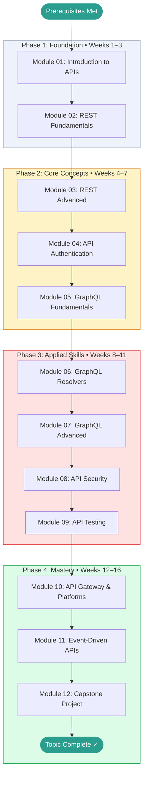

# GraphQL and REST API Design — Learning Roadmap

> This roadmap is your study plan. Work through the phases in order.
> Each phase builds directly on the previous one.
> Mark your current position with **← You Are Here** and update it as you progress.

---

## Prerequisites Map

Confirm you have working knowledge of these before entering Phase 1:

```
Basic HTTP knowledge  ──┐
                         ├──► GraphQL and REST API Design  (start here)
Some programming exp  ──┘
```

If either prerequisite is missing, complete it first and return here.
See [[networks]] for HTTP fundamentals if needed.

---

## Learning Path Visualization



---

## Phase Breakdown

### Phase 1: Foundation

**Goal:** Understand what APIs are, how HTTP works at the level needed for API design,
and see REST and GraphQL side by side at a high level. Leave Phase 1 able to make a
simple API call and explain what's happening at each step.

| Module | Name | Est. Hours | Key Skill Gained |
|--------|------|-----------|-----------------|
| 01 | Introduction to APIs | 4 h | HTTP anatomy, REST constraints overview, first API call |
| 02 | REST Fundamentals | 5 h | Resource modeling, URI design, HTTP method semantics, status codes |

**Phase 1 Exit Criteria:**

- [ ] Can explain Fielding's 6 REST constraints from memory
- [ ] Can design a basic resource URI hierarchy for a simple domain
- [ ] Can make API calls using `curl` and Python `requests`
- [ ] Scored ≥ 70% on Module 01 and Module 02 tests
- [ ] Completed at least one Beginner-level project from PROJECTS.md
- [ ] GLOSSARY.md has at least 10 entries

**Milestone unlocked:** Foundation Built

---

### Phase 2: Core Concepts

**Goal:** Develop fluency with REST best practices and start building with GraphQL.
Leave Phase 2 able to build a complete REST API with authentication and document it
with OpenAPI, and write GraphQL queries and mutations against a schema.

| Module | Name | Est. Hours | Key Skill Gained |
|--------|------|-----------|-----------------|
| 03 | REST Advanced | 6 h | Versioning, pagination, filtering, HATEOAS, OpenAPI spec |
| 04 | API Authentication | 6 h | OAuth2 flows, JWT, API keys |
| 05 | GraphQL Fundamentals | 6 h | SDL, queries, mutations, fragments, introspection |

**Phase 2 Exit Criteria:**

- [ ] Can write a complete OpenAPI 3.x specification for a REST API
- [ ] Can implement and explain the OAuth2 authorization code flow
- [ ] Can write GraphQL queries and mutations using variables and fragments
- [ ] Scored ≥ 75% on all Phase 2 module tests
- [ ] Completed at least one Intermediate-level project from PROJECTS.md

**Milestone unlocked:** REST Practitioner

---

### Phase 3: Applied Skills

**Goal:** Go deep on GraphQL internals, API security, and testing. Leave Phase 3 able
to build a production-quality API that handles the N+1 problem, implements proper
security controls, and has a meaningful test suite.

| Module | Name | Est. Hours | Key Skill Gained |
|--------|------|-----------|-----------------|
| 06 | GraphQL Resolvers | 6 h | Resolver execution, DataLoader, batch loading |
| 07 | GraphQL Advanced | 7 h | Subscriptions, federation, persisted queries |
| 08 | API Security | 6 h | CORS, rate limiting, injection prevention |
| 09 | API Testing | 6 h | Contract tests, integration tests, performance tests |

**Phase 3 Exit Criteria:**

- [ ] Implemented the DataLoader pattern to solve the N+1 problem in a GraphQL API
- [ ] Can write a contract test with Pact for a REST API
- [ ] Can configure CORS correctly and explain why the same-origin policy exists
- [ ] Scored ≥ 80% on all Phase 3 module tests
- [ ] QUESTIONS.md open questions are mostly resolved (status 🟢)

**Milestone unlocked:** GraphQL Ready

---

### Phase 4: Mastery

**Goal:** Synthesize everything. Learn the infrastructure layer (gateways, event-driven
patterns), then build a non-trivial API platform as your capstone.

| Activity | Est. Hours | Description |
|----------|-----------|-------------|
| Module 10: API Gateway | 6 h | Kong, AWS API Gateway, gateway patterns |
| Module 11: Event-Driven APIs | 5 h | Webhooks, SSE, WebSockets, delivery guarantees |
| Module 12: Capstone Project | 15 h | Build a full REST + GraphQL API with auth, rate limiting, tests |
| Topic Review | 4 h | Revisit modules where test scores were below 80% |

**Phase 4 Exit Criteria:**

- [ ] Capstone project complete: REST API + GraphQL API, OpenAPI docs, OAuth2 auth, tests
- [ ] Overall topic score ≥ 80% (see Test Scores in topic README)
- [ ] CHEATSHEET.md is complete and genuinely useful as a reference
- [ ] GLOSSARY.md has definitions for every term encountered throughout the topic
- [ ] At least one teaching artifact exists (blog post, write-up, or recorded explanation)

**Milestone unlocked:** API Architect

---

## Time Estimates Summary

| Phase | Weeks | Est. Hours | Cumulative |
|-------|-------|-----------|------------|
| Phase 1: Foundation | 1–3 | 9 h | 9 hrs |
| Phase 2: Core Concepts | 4–7 | 18 h | 27 hrs |
| Phase 3: Applied Skills | 8–11 | 25 h | 52 hrs |
| Phase 4: Mastery | 12–16 | 30 h | 82 hrs |
| **Total** | **16** | **~82 hrs** | |

> [!NOTE]
> These estimates assume roughly **5–7 focused hours per week**.
> If you're studying part-time, the calendar weeks will stretch accordingly.
> Adjust the schedule to fit your life — consistency matters more than pace.

---

## Milestone Definitions

| Milestone | Earned When | Point Threshold |
|-----------|------------|----------------|
| First Step | Module 01 complete | Any score |
| Foundation Built | Phase 1 complete, all tests ≥ 70% | 50 pts |
| REST Practitioner | Phase 2 complete, all tests ≥ 75% | 150 pts |
| GraphQL Ready | Phase 3 complete, all tests ≥ 80% | 280 pts |
| API Architect | Phase 4 complete, capstone done, overall ≥ 80% | 380 pts |

---

## Alternative Paths

### Fast Track (If You Have REST Experience)

If you already have solid REST experience and want to focus on GraphQL:

```
Skim Module 01 → Take Module 02 test (if ≥ 85%, skip to Module 03) →
Skim Modules 03–04 → Start deeply at Module 05
```

Take Module 01 and 02 tests first. If you score ≥ 85%, skip to Module 03.

### Deep Dive Path (Maximum Understanding)

For maximum depth, add these supplementary activities between phases:

- **After Phase 1:** Read Roy Fielding's dissertation (Ch. 5 covers REST) — [Verify URL at UCI]
- **After Phase 2:** Read the GraphQL specification at graphql.org/learn
- **After Phase 3:** Study the Apollo Federation documentation in depth

### Project-First Path (Learn by Building)

If you learn best by doing rather than reading:

```
Module 01 → Build a tiny REST API → Module 02 → Add proper resource design →
Module 03 → Add versioning and pagination → ...
```

Alternate one module of theory with one hands-on project at each step.

---

## You Are Here

> **Current Phase:** _Not started_
>
> **Current Module:** _None — begin at [Module 01](./modules/01_introduction/README.md)_
>
> **Last Completed Module:** _None_
>
> **Next Action:** Open Module 01 and read the Overview section.
>
> _Update this section each time you advance to a new module or phase._
