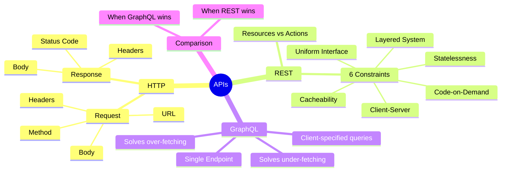

# Notes — Module 01: Introduction to APIs

> These are your personal study notes. Write freely and honestly.
> Incomplete notes are fine — they show where your understanding still needs work.
> Return to this file to add insights as they develop over time.

**Module:** [[modules/01_introduction]]
**Topic:** [[graphql-rest]]
**Date started:** _fill in_
**Status:** In progress

---

## Concept Map

_Sketch how the concepts in this module relate to each other. Fill in the Mermaid diagram._



_Alternative: draw this on paper, photo it, and link the image here._

---

## Key Insights

_The "aha moments" — the things that, once understood, made the rest clear._
_Be specific: "I finally understood X because Y" is more useful than "X makes sense"._

1. **REST is an architectural style, not a protocol:** I finally understood this means there's no REST library to install — it's a set of design constraints you follow (or don't). An API is "RESTful" to the degree it satisfies those constraints.
2. _Add insights as you discover them_

---

## My Understanding

_Explain the core concepts in your own words, as if teaching them to someone else._
_If you can't explain it simply, you don't understand it well enough yet._

### What an API Is

_Your explanation here_

_What I'm still unsure about:_ _fill in_

### Fielding's Six REST Constraints

_Your explanation here_

_What I'm still unsure about:_ _fill in_

### Why GraphQL Exists

_Your explanation here_

---

## Connections to Other Topics

_How does this module connect to things you already know?_

| This module's concept | Connects to | How |
|----------------------|-------------|-----|
| HTTP requests | [[networks]] | HTTP runs on TCP/IP; network latency affects every API call |
| REST statelessness | [[systems-architecture]] | Statelessness is what makes horizontal scaling easy |
| GraphQL query language | [[graphql-rest/modules/05_graphql-fundamentals]] | This module gives the "why"; module 05 gives the "how" |

---

## Questions That Arose

_Log questions as they appear. Don't stop to answer them now — just capture them._
_Then move the serious ones to [QUESTIONS.md](./QUESTIONS.md)._

- [ ] _Write your first question here → added to QUESTIONS.md as Q001_
- [ ] _Write another question_

---

## Code Snippets Worth Remembering

### curl with verbose output

```bash
# The -v flag shows request headers, response headers, and the status line
# Essential for debugging API calls
curl -v https://jsonplaceholder.typicode.com/posts/1
```

_Why I'm saving this:_ The verbose flag is the fastest way to see exactly what's going over the wire.

---

### Correct error handling in Python requests

```python
import requests

response = requests.get("https://api.example.com/resource/1")

if response.status_code == 200:
    data = response.json()
elif response.status_code == 404:
    # Not found — handle gracefully
    data = None
else:
    # Unexpected error — raise it so it doesn't silently fail
    response.raise_for_status()
```

_Why I'm saving this:_ The pattern of explicitly handling 200 and 404 separately, then raising for everything else, avoids silently swallowing errors.

---

## What Tripped Me Up

_Mistakes I made, misconceptions I had, things that confused me more than they should have._
_Being honest here helps you later._

- **REST vs RESTful** — I initially thought REST was a specific standard, but it actually works like: the constraints define RESTful architecture, and an API is more or less RESTful depending on how many constraints it satisfies.

---

## Summary in My Own Words

_Write a 3–5 sentence summary of this entire module without looking at any notes._
_If you can't do this, you need more study time._

_Write here after finishing the module_

---

_Last updated: 2026-06-09_
