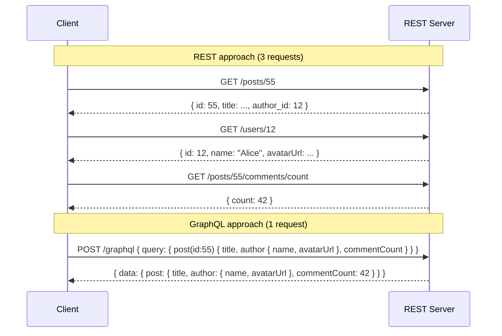

# Module 01: Introduction to APIs

[← Topic Home](../../README.md) | [Next → Module 02: REST Fundamentals](../02_rest-fundamentals/README.md)

---


---

## Table of Contents

1. [Overview](#overview)
2. [Prerequisites](#prerequisites)
3. [Objectives](#objectives)
4. [Theory](#theory)
   - [What Is an API?](#what-is-an-api)
   - [HTTP Fundamentals Review](#http-fundamentals-review)
   - [REST: Representational State Transfer](#rest-representational-state-transfer)
   - [A First REST API Call](#a-first-rest-api-call)
   - [REST vs. GraphQL: First Look](#rest-vs-graphql-first-look)
   - [The API Paradigm Landscape](#the-api-paradigm-landscape)
5. [Key Concepts](#key-concepts)
6. [Examples](#examples)
7. [Common Pitfalls](#common-pitfalls)
8. [Cross-Links](#cross-links)
9. [Summary](#summary)

---

## Overview

This module establishes the foundation for everything that follows in this topic. You will
learn what an API is at a conceptual level, review HTTP as the transport layer that REST and
GraphQL run on, understand Fielding's six REST constraints and what they mean in practice,
and make your first real API calls.

By the time you finish this module, you will have a working mental model of the client-server
relationship, understand why REST was a revolution when it appeared in 2000, and see — at a
high level — what problem GraphQL was invented to solve. Every subsequent module builds on this
foundation.

**Difficulty:** Beginner | **Estimated time:** 4 hours

---

## Prerequisites

### Required Modules

- None — this is the first module.

### Required Concepts

- **Basic command-line comfort** — you need to be able to open a terminal and run commands. If `curl --version` works, you're ready.
- **Some programming experience** — examples use Python and shell. You do not need to be proficient in either, but you should be able to read code.
- **A vague idea of what "the web" is** — you know that websites live on servers, browsers request pages from them, and something called HTTP is involved.

> [!TIP]
> If any of these prerequisites feel shaky, spend 15–30 minutes reviewing them before continuing.
> For command-line basics, the [[networks]] topic covers what you need.

---

## Objectives

By the end of this module, you will be able to:

1. Define what an API is and explain the client-server contract metaphor
2. Describe the anatomy of an HTTP request and response (method, URL, headers, status code, body)
3. List Fielding's six REST constraints and give a one-sentence explanation of each
4. Make a real API call using `curl` and interpret the response
5. Make a real API call using Python's `requests` library and process the JSON response
6. Explain the over-fetching and under-fetching problems that motivated GraphQL's creation
7. Draw a simple diagram showing the difference between a REST multi-request pattern and a GraphQL single-query pattern

---

## Theory

### What Is an API?

An **API** — Application Programming Interface — is a formal contract between two pieces of software.
One side (the **server** or **provider**) declares: "Here is what I can do, here is how to ask me to
do it, and here is what I will give you back." The other side (the **client** or **consumer**) makes
requests according to those rules and receives responses.

The word "interface" is the key concept. In the same way that a USB port is a physical interface — you
know exactly what shape of plug to use, and you know the plug will carry a certain kind of signal —
an API is a software interface. You know the shape of the request to send, and you know the shape of
the response you'll get back.

This contract-based thinking is powerful for several reasons:

- **Independence:** The client doesn't need to know *how* the server implements its logic. Stripe could
  rewrite their entire billing engine overnight, and as long as the API contract is unchanged, every
  client application that uses the Stripe API continues to work.
- **Composability:** APIs allow software to be composed. GitHub's API is consumed by thousands of tools —
  CI pipelines, project management integrations, code review apps — none of which share a line of code.
- **Encapsulation:** The API surface is the "public interface" of a service. The server's internal data
  model, its database schema, its choice of programming language — all of that is private. Only the API
  is public.

The most common form of API in modern web development is the **HTTP API**: a server that accepts HTTP
requests over the network and returns HTTP responses. Both REST and GraphQL are conventions for designing
HTTP APIs. To understand either, you must first understand HTTP.

---

### HTTP Fundamentals Review

HTTP (HyperText Transfer Protocol) is the language that web clients and servers use to communicate.
Every API call is an HTTP conversation: the client sends a **request**, and the server sends back a
**response**. Understanding the anatomy of each is essential for everything in this topic.

#### The HTTP Request

An HTTP request has four parts:

```
METHOD /path/to/resource HTTP/1.1          ← Request line: method + URL + protocol version
Host: api.example.com                       ← Headers: metadata about the request
Content-Type: application/json             ← (more headers)
Authorization: Bearer eyJhbGciOiJSUzI1...  ← (auth header)
                                            ← Blank line separates headers from body
{                                           ← Body (optional; used with POST, PUT, PATCH)
  "name": "Alice",
  "email": "alice@example.com"
}
```

Breaking this down:

- **Method** — declares the *intent* of the request. `GET` means "give me a resource." `POST` means
  "create something." `PUT` means "replace this." `DELETE` means "remove this." The full reference
  is in Module 02 and in the [[graphql-rest#http-methods-reference]] cheat sheet.
- **URL** — identifies the *resource* being operated on. `/users` is the collection of all users.
  `/users/42` is the specific user with ID 42.
- **Headers** — key-value metadata. `Content-Type` tells the server what format the body is in.
  `Authorization` carries credentials. `Accept` tells the server what format the client wants back.
- **Body** — the payload. Only present for methods that send data (`POST`, `PUT`, `PATCH`).

#### The HTTP Response

An HTTP response also has four parts:

```
HTTP/1.1 201 Created                        ← Status line: protocol + status code + reason
Content-Type: application/json             ← Response headers
Location: /users/42                         ← Location of the newly created resource
Date: Mon, 09 Jun 2026 10:30:00 GMT         ← (more headers)
                                            ← Blank line
{                                           ← Response body
  "id": 42,
  "name": "Alice",
  "email": "alice@example.com",
  "created_at": "2026-06-09T10:30:00Z"
}
```

Breaking this down:

- **Status code** — a three-digit number that tells the client whether the request succeeded and why.
  `200` = OK. `201` = Created. `400` = your request was bad. `401` = not authenticated. `404` = not
  found. `500` = server crashed. Module 02 covers the full taxonomy.
- **Response headers** — metadata about the response. `Content-Type` tells the client what format
  the body is in. `Location` points to a newly created resource.
- **Response body** — the data. For REST APIs, this is almost always JSON.

The power of HTTP is that it is *uniform* — every HTTP client (a browser, `curl`, a Python script,
a mobile app) uses the same request/response pattern to communicate with any HTTP server. This
universality is one reason REST became dominant.

---

### REST: Representational State Transfer

REST is not a protocol, a framework, or a library. It is an **architectural style** — a set of
constraints on how networked systems should be designed. Roy Fielding described it in Chapter 5 of
his 2000 doctoral dissertation at UC Irvine.

Fielding observed that the web itself — the World Wide Web — was extraordinarily scalable and
evolvable. Millions of servers, billions of clients, hyperlinks between everything, and yet it
worked. Why? Because the web's architecture satisfied certain properties. REST is his attempt to
name and formalise those properties so they could be applied to application APIs, not just hypertext
documents.

The six constraints Fielding defined are:

#### 1. Client-Server Separation

The client and server are separate concerns. The client handles the user interface and user experience.
The server handles data storage, business logic, and persistence. They communicate only through a
well-defined interface. This separation allows each to evolve independently — you can redesign a
mobile app without touching the server, or migrate a database without touching the client.

#### 2. Statelessness

Each request from a client to the server must contain **all information necessary** to understand
and fulfill that request. The server does not store any session state about the client between
requests. There is no "you are logged in as Alice" memory on the server. If Alice needs to make an
authenticated request, her request must carry her credentials (e.g., a JWT token) every single time.

Statelessness makes servers dramatically easier to scale horizontally: any server instance in a
cluster can handle any request because no request depends on previous state stored on a specific
server.

#### 3. Cacheability

Responses must label themselves as either cacheable or non-cacheable. If a response is cacheable,
a client (or an intermediary like a CDN or load balancer) can reuse that response for subsequent
identical requests. This reduces load on servers and improves client-side performance. HTTP's `Cache-Control`,
`ETag`, and `Last-Modified` headers implement caching for REST APIs.

#### 4. Uniform Interface

This is the most important constraint, and the one most violated by APIs that call themselves REST
but aren't really. A uniform interface means:

- Resources are identified by URIs (e.g., `/users/42`)
- Resources are manipulated through their representations (the client sends a JSON document that
  represents a user; it doesn't call a function directly)
- Messages are self-descriptive (every request and response contains enough information to understand it)
- Hypermedia as the engine of application state (HATEOAS) — responses include links to valid next actions

The practical version of "uniform interface" that most APIs implement is: consistent resource naming,
consistent use of HTTP methods, and consistent response formats.

#### 5. Layered System

A client doesn't need to know whether it's talking directly to the origin server or to an
intermediary (a load balancer, a CDN, an API gateway, a security proxy). Intermediaries are invisible
to the client. This enables extremely flexible architectures — you can insert a CDN, a rate limiter,
or an authentication layer between the client and the server without the client knowing or caring.

#### 6. Code-on-Demand (Optional)

Servers can extend client functionality by sending executable code (like JavaScript) that the client
runs. This is the only optional constraint. Web browsers implement it when they download and execute
JavaScript, but most REST APIs don't use it.

---

### A First REST API Call

Let's make a real API call. We'll use the public `jsonplaceholder.typicode.com` API, which provides
fake REST data for testing.

#### Using curl

```bash
# Fetch a single post from JSONPlaceholder
# -v shows verbose output including headers; remove it for cleaner output
curl -v https://jsonplaceholder.typicode.com/posts/1
```

What you'll see in the response:

```
# The request curl sends:
> GET /posts/1 HTTP/2                   ← GET method, /posts/1 path
> Host: jsonplaceholder.typicode.com    ← Host header (required in HTTP/1.1+)
> Accept: */*                           ← Client accepts any content type

# The server's response:
< HTTP/2 200                            ← 200 OK — request succeeded
< content-type: application/json; charset=utf-8   ← Response body is JSON

{                                        ← Response body
  "userId": 1,
  "id": 1,
  "title": "sunt aut facere repellat...",
  "body": "quia et suscipit..."
}
```

Now try creating a resource (JSONPlaceholder doesn't actually save it, but it simulates the response):

```bash
# POST to create a new post
curl -X POST https://jsonplaceholder.typicode.com/posts \
  -H "Content-Type: application/json" \
  -d '{
    "title": "My First Post",
    "body": "This is the content of my post.",
    "userId": 1
  }'
```

Expected response (HTTP 201 Created):

```json
{
  "title": "My First Post",
  "body": "This is the content of my post.",
  "userId": 1,
  "id": 101
}
```

The server assigns an ID (`101`) and returns the created resource. The `201 Created` status code
tells the client "a new resource was created."

#### Using Python requests

The Python `requests` library makes HTTP calls readable and clean:

```python
import requests
import json

# --- GET: Fetch a single post ---
response = requests.get("https://jsonplaceholder.typicode.com/posts/1")

# Always check the status code before trusting the body
print(f"Status: {response.status_code}")    # 200
print(f"Content-Type: {response.headers['content-type']}")

post = response.json()    # Parse the JSON body
print(f"Post title: {post['title']}")
print(f"Post ID: {post['id']}")

# --- POST: Create a new post ---
new_post_data = {
    "title": "My First Post",
    "body": "This is the body of my post.",
    "userId": 1
}

# requests automatically sets Content-Type: application/json when you use json=
response = requests.post(
    "https://jsonplaceholder.typicode.com/posts",
    json=new_post_data    # Serializes dict to JSON, sets Content-Type header
)

print(f"\nCreate post status: {response.status_code}")  # 201
created_post = response.json()
print(f"Assigned ID: {created_post['id']}")              # 101

# --- Handling errors properly ---
response = requests.get("https://jsonplaceholder.typicode.com/posts/99999")
if response.status_code == 404:
    print("Post not found")
elif response.status_code == 200:
    print(response.json())
else:
    print(f"Unexpected status: {response.status_code}")
```

> [!TIP]
> The `response.raise_for_status()` method raises an exception for 4xx and 5xx responses,
> making error handling more concise in production code.

---

### REST vs. GraphQL: First Look

REST has served the web well for two decades. So why did GraphQL get invented?

The core problem that motivated GraphQL's creation at Facebook in 2012 was the **data-fetching
mismatch** between what REST APIs return and what different clients actually need.

#### Over-Fetching

A REST endpoint returns a fixed data shape. If `GET /users/42` returns a user's full profile:

```json
{
  "id": 42,
  "name": "Alice",
  "email": "alice@example.com",
  "bio": "Engineer at...",
  "avatar_url": "https://...",
  "follower_count": 1204,
  "following_count": 89,
  "created_at": "2019-03-15T08:00:00Z",
  "location": "Berlin",
  "website": "https://alice.dev",
  "twitter": "@alice"
}
```

But a mobile app's "mention a friend" feature only needs `id`, `name`, and `avatar_url`. It
receives 10 fields, uses 3, and discards the rest. This is **over-fetching** — receiving more
data than needed. On slow mobile connections, every unnecessary byte matters.

#### Under-Fetching

The opposite problem: a single REST request doesn't return all the data a view needs. Consider
a social feed that shows: post title, post author name, author avatar, and number of comments.
With REST, you might need:

```
GET /posts/55                → gets the post (includes author_id: 12)
GET /users/12                → gets the author's name and avatar
GET /posts/55/comments/count → gets the comment count
```

That's three separate HTTP round trips to render one feed item. **Under-fetching** means the
client has to make multiple requests to assemble one view. This is called the "N+1 requests
problem" in REST.

#### The GraphQL Approach

GraphQL gives the client a single endpoint (`POST /graphql`) and lets the client specify exactly
what data it needs in the request body:

```graphql
# The client asks for exactly what it needs — nothing more, nothing less
query FeedItem {
  post(id: 55) {
    title
    author {
      name
      avatarUrl
    }
    commentCount
  }
}
```

The server resolves this in a single request and returns exactly:

```json
{
  "data": {
    "post": {
      "title": "GraphQL at Facebook",
      "author": {
        "name": "Alice",
        "avatarUrl": "https://cdn.example.com/alice.jpg"
      },
      "commentCount": 42
    }
  }
}
```

The client gets exactly what it asked for. One round trip.



*REST requires 3 round trips to assemble one view; GraphQL requires 1.*

#### When REST Wins

GraphQL is not always better. REST is often the right choice when:
- The API is public and consumed by many different, unpredictable clients
- The data model is simple with few relationships
- Caching is critical (REST responses can be cached by URL; GraphQL POST requests typically cannot)
- The team is smaller and the overhead of GraphQL's type system and resolver infrastructure isn't justified

This topic covers both deeply. Module 05 begins GraphQL in earnest.

---

### The API Paradigm Landscape

REST and GraphQL are not the only API paradigms. For completeness:

| Paradigm | Transport | Data Format | Best For |
|----------|-----------|-------------|----------|
| REST | HTTP | JSON (usually) | General-purpose APIs, public APIs, CRUD |
| GraphQL | HTTP | JSON | Complex, nested data; multiple client types |
| gRPC | HTTP/2 | Protocol Buffers (binary) | High-performance microservice-to-microservice communication; streaming |
| WebSockets | TCP | Any (often JSON) | Real-time bidirectional communication (chat, live dashboards) |
| SOAP | HTTP | XML | Legacy enterprise systems; still used in banking, insurance |

This topic focuses on REST and GraphQL. gRPC is covered in [[systems-architecture]].
WebSockets are introduced in [[graphql-rest/modules/11_event-driven-apis]].

---

## Key Concepts

**API (Application Programming Interface):** A formal contract between a provider and a consumer.
The provider declares what it offers and how to ask for it; the consumer makes requests accordingly.
The key property is that the consumer doesn't need to know the provider's internals.

**HTTP Method:** The verb in an HTTP request that declares the intent of the operation.
`GET` reads, `POST` creates, `PUT` replaces, `PATCH` partially updates, `DELETE` removes.
See [[shared/glossary#http-verb]].

**HTTP Status Code:** A three-digit number in an HTTP response that communicates the outcome.
`2xx` = success, `3xx` = redirect, `4xx` = client error, `5xx` = server error.

**REST (Representational State Transfer):** An architectural style for APIs defined by Roy
Fielding in his 2000 dissertation. An API that satisfies Fielding's six constraints (client-server,
statelessness, cacheability, uniform interface, layered system, code-on-demand) is RESTful.
See [[graphql-rest#glossary]].

**GraphQL:** A query language for APIs and a runtime for executing those queries, created at
Facebook in 2012 and open-sourced in 2015. A GraphQL API exposes a single endpoint and lets
clients specify exactly the data they need in a query, eliminating over-fetching and under-fetching.

**Over-Fetching:** Receiving more data from an API than the client needs. A common problem with
REST when a single endpoint returns a fixed data shape regardless of which client is calling.

**Under-Fetching:** Needing multiple API requests to assemble the data for a single view.
Also called the N+1 requests problem in REST.

**JSON (JavaScript Object Notation):** The data format used by almost all modern REST and GraphQL
APIs. A lightweight text format for key-value data that is human-readable and widely supported.

---

## Examples

### Example 1: Making a GET Request and Handling a 404 (Basic)

**Scenario:** You're building a user lookup feature. You need to fetch a user by ID, but the ID
might not exist.

**Goal:** Demonstrate correct 404 handling and JSON parsing.

```python
import requests

def get_user(user_id: int) -> dict | None:
    """
    Fetch a user by ID from the JSONPlaceholder API.
    Returns the user dict if found, or None if not found (404).
    Raises an exception for unexpected errors.
    """
    url = f"https://jsonplaceholder.typicode.com/users/{user_id}"
    response = requests.get(url)

    if response.status_code == 200:
        return response.json()          # Parse JSON body to Python dict
    elif response.status_code == 404:
        return None                     # Not found — not an error, just absent
    else:
        # Anything else (500, 429, etc.) is unexpected — raise it
        response.raise_for_status()

# Usage
user = get_user(1)
if user:
    print(f"Found: {user['name']} ({user['email']})")
else:
    print("User not found")

missing = get_user(99999)   # JSONPlaceholder returns 404 for this
print(missing)              # None
```

**Output:**
```
Found: Leanne Graham (Sincere@april.biz)
None
```

**What to notice:** The function explicitly handles 200 and 404 differently because they have
different meanings — success vs. resource-does-not-exist. The function does not silently return
`None` for all non-200 responses, because a 500 should be visible as an error, not swallowed.

---

### Example 2: Creating a Resource and Using the Location Header (Intermediate)

**Scenario:** After creating a new resource, a well-designed REST API returns a `Location`
header pointing to the newly created resource's URL.

**Goal:** Demonstrate POST + 201 + Location header pattern.

```python
import requests

def create_post(title: str, body: str, user_id: int) -> dict:
    """
    Create a new post via the REST API.
    Returns the created post including its server-assigned ID.
    """
    response = requests.post(
        "https://jsonplaceholder.typicode.com/posts",
        json={                          # json= serializes dict and sets Content-Type header
            "title": title,
            "body": body,
            "userId": user_id
        }
    )

    # A successful POST should return 201 Created
    assert response.status_code == 201, f"Expected 201, got {response.status_code}"

    created_post = response.json()

    # A well-designed API includes Location header pointing to the new resource
    # (JSONPlaceholder doesn't implement this, but real APIs should)
    location = response.headers.get("Location")
    if location:
        print(f"New resource available at: {location}")

    return created_post

new_post = create_post(
    title="Understanding REST",
    body="REST is an architectural style defined by Roy Fielding in 2000...",
    user_id=1
)
print(f"Created post ID: {new_post['id']}")
print(f"Title: {new_post['title']}")
```

**Output:**
```
Created post ID: 101
Title: Understanding REST
```

**What to notice:** Using `json=` instead of `data=` with a manually-serialized string is the
idiomatic way to send JSON in Python. The `requests` library sets `Content-Type: application/json`
automatically.

---

### Example 3: Side-by-Side REST vs. GraphQL Data Fetching (Applied)

**Scenario:** Demonstrate the under-fetching problem by fetching a post + its user + the user's
other posts using REST (three requests) vs. what a GraphQL query would look like.

**Goal:** Make the over/under-fetching tradeoffs concrete.

```python
import requests

# --- REST approach: 3 requests to build one composite view ---

def get_post_with_author_rest(post_id: int) -> dict:
    """
    Build a composite view of a post with author info.
    Requires 3 separate HTTP requests.
    """
    # Request 1: get the post
    post = requests.get(
        f"https://jsonplaceholder.typicode.com/posts/{post_id}"
    ).json()

    # Request 2: get the author (using the post's userId field)
    author = requests.get(
        f"https://jsonplaceholder.typicode.com/users/{post['userId']}"
    ).json()

    # Request 3: get all of the author's posts
    author_posts = requests.get(
        f"https://jsonplaceholder.typicode.com/posts?userId={post['userId']}"
    ).json()

    # Assemble the composite view client-side
    return {
        "post_title": post["title"],
        "author_name": author["name"],            # from request 2
        "author_email": author["email"],          # from request 2
        "author_post_count": len(author_posts)    # from request 3
    }

result = get_post_with_author_rest(post_id=1)
print(f"Post: {result['post_title'][:40]}...")
print(f"Author: {result['author_name']} ({result['author_email']})")
print(f"Author has written {result['author_post_count']} posts")
```

```
# --- The equivalent GraphQL query (conceptual — no server to run against here) ---
# In a GraphQL API that supports these relationships, this would be ONE request:
```

```graphql
query PostWithAuthor($postId: ID!) {
  post(id: $postId) {
    title
    author {
      name
      email
      posts {
        id
        title
      }
    }
  }
}
```

**What to notice:** The REST version requires the client to know about the relationship between
posts and users, make three requests in sequence (each depends on the previous), and assemble
the view client-side. The GraphQL version declares what the client needs and lets the server
handle the joins. For 100 posts with 100 authors, the REST pattern needs 201 requests.

---

## Common Pitfalls

### Pitfall 1: Treating REST as "Just CRUD over HTTP"

**Mistake:** Designing an API where every endpoint is a database operation disguised as an HTTP
call. Typically shows up as:
- Verb-based URLs (`/getUser`, `/createOrder`, `/deleteProduct`)
- POST for everything because "it has a body"
- Ignoring HTTP status code semantics (returning `200 OK` with `{ "error": "not found" }` in the body)

**Wrong:**
```python
# POST /api?action=getUser&id=42
# POST /api?action=createOrder
# POST /api?action=deleteProduct&id=99
```

**Right:**
```python
# GET    /users/42           ← reads don't have side effects; GET is correct
# POST   /orders             ← creates new resource; POST returns 201
# DELETE /products/99        ← deletes resource; DELETE returns 204 or 404
```

**Why this mistake is made:** Many developers learn web development by building forms that POST
to server-side handlers. The HTTP verb becomes an afterthought — the handler function name is
the real "action." REST requires flipping this mental model: the URL identifies *what*, and the
HTTP method identifies *the operation on it*.

---

### Pitfall 2: Returning HTTP 200 for All Responses Including Errors

**Mistake:** Returning `200 OK` even when an operation fails, putting error information only in
the response body.

**Wrong:**
```python
# A 200 OK response that actually represents an error
# HTTP/1.1 200 OK
{
  "success": false,
  "error": "User not found",
  "code": "USER_NOT_FOUND"
}
```

**Right:**
```python
# Use HTTP status codes for their intended purpose
# HTTP/1.1 404 Not Found
{
  "error": "not_found",
  "message": "User with ID 42 does not exist"
}
```

**Why this mistake is made:** Historically, some APIs returned 200 for everything because HTTP
error handling was difficult in certain frameworks, or because clients interpreted non-200 as
"request failed" rather than "request succeeded with an error response." The result is that
clients must parse every response body to detect errors, and standard HTTP tooling (caches,
load balancers, monitoring) can't work correctly.

> [!WARNING]
> GraphQL is a notable exception: GraphQL returns HTTP 200 even when queries have errors, with
> error details in the `errors` array. This is intentional in GraphQL's design. Module 05
> explains why.

---

### Pitfall 3: Not Thinking About Versioning Until It's Too Late

**Mistake:** Shipping an API without any version indicator, then making breaking changes and
discovering that existing clients break.

**Wrong:**
```bash
# Unversioned API — breaking changes affect all clients immediately
GET https://api.example.com/users/42
```

**Right:**
```bash
# Versioned API — v1 continues to work while v2 introduces breaking changes
GET https://api.example.com/v1/users/42
GET https://api.example.com/v2/users/42
```

**Why this mistake is made:** Versioning feels premature when building the first version of an
API. It adds URL boilerplate and you "aren't planning to change it." In practice, every API
changes. Without versioning, the first breaking change requires either breaking existing clients
or never shipping improvements. Module 03 covers versioning strategies in depth.

---

## Cross-Links

- [[networks]] — HTTP runs on TCP/IP; understanding the network layer helps debug API issues that look like application bugs. DNS resolution, TLS handshakes, and TCP connections are all relevant.
- [[django-fastapi-flask]] — FastAPI and Flask are the most common Python frameworks for building REST APIs; FastAPI's automatic OpenAPI generation makes the ideas from Module 03 (REST Advanced) immediately practical.
- [[systems-architecture]] — REST and GraphQL are architectural patterns at the application layer; systems-architecture covers how APIs fit into larger distributed system designs including microservices, event sourcing, and CQRS.
- [[graphql-rest/modules/02_rest-fundamentals]] — the next module; builds directly on the HTTP fundamentals and REST concepts introduced here.
- [[graphql-rest/modules/05_graphql-fundamentals]] — where GraphQL goes from first-look to hands-on schema and query writing.

---

## Summary

- An **API** is a formal contract between a provider and a consumer. The consumer calls the API
  without knowing the provider's internal implementation — only the interface.
- **HTTP** is the transport layer for REST and GraphQL. Every API call is an HTTP request
  (method + URL + headers + optional body) and an HTTP response (status code + headers + body).
- **REST** is an architectural style defined by Roy Fielding in 2000. An API is RESTful if it
  satisfies six constraints: client-server, statelessness, cacheability, uniform interface,
  layered system, and (optionally) code-on-demand.
- The **uniform interface** constraint is the most important: use URIs to identify resources,
  use HTTP methods to express operations, make messages self-descriptive.
- **GraphQL** was created at Facebook in 2012 to solve the **over-fetching** and **under-fetching**
  problems of REST: REST returns fixed data shapes, forcing clients to either discard excess data
  or make multiple requests to assemble a view.
- **Over-fetching** is receiving more data than needed. **Under-fetching** is having to make
  multiple requests to assemble one view (the N+1 requests problem).
- GraphQL gives clients a single endpoint where they specify exactly what data they need in a
  query; the server returns precisely that data in one response.
- Neither REST nor GraphQL is universally better. REST is simpler for simple CRUD, better for
  caching, and more familiar for public APIs. GraphQL shines when multiple clients need different
  data shapes from complex, interconnected data models.
- Common beginner mistakes: treating REST as verb-based RPC, returning 200 for all responses
  including errors, and not versioning the API until it's too late.
