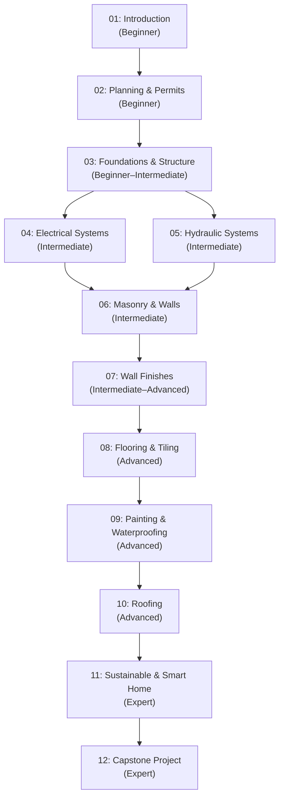
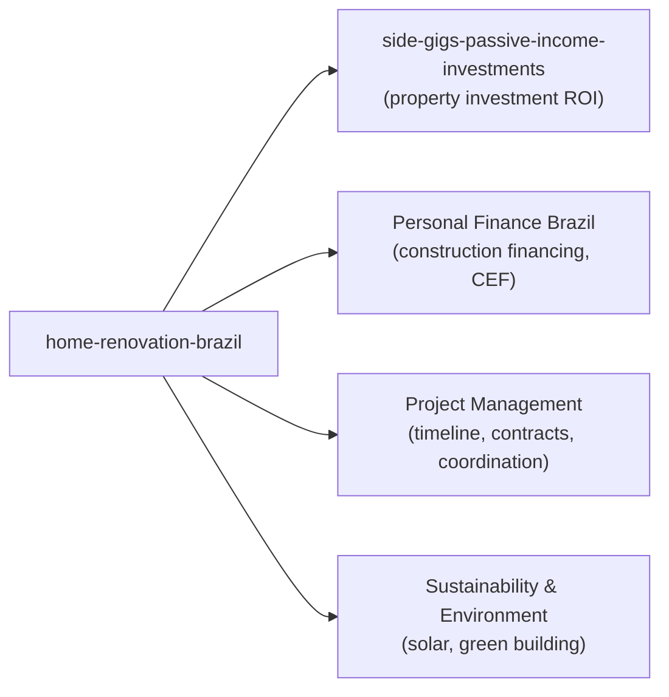

# Roadmap: Home Renovation, Building and Maintenance — Focused on Brazil

> This file maps how the topic fits into broader learning paths and how the modules
> connect to each other. Use it to plan your study sequence and identify what to
> tackle next based on your goals.

---

## Learning Paths

### Path A: The Informed Homeowner (Modules 01–02 + 06–09)

For someone who wants to supervise contractors intelligently, understand quotes, and
execute basic DIY tasks without needing expert depth in structural or systems work.

*Recommended path for: homeowners, renters doing improvements, new landlords.*

---

### Path B: The Complete Renovator (All 12 Modules in Sequence)

Full zero-to-expert path. Each module builds on the previous. Best for someone who
wants to manage or execute complete renovations professionally.

*Recommended path for: aspiring construction professionals, serious DIY renovators,
real estate investors who want deep renovation knowledge.*

---

### Path C: Emergency Repairs (Modules 04–05 + 09)

For someone dealing with an urgent problem — a leaking roof, electrical fault, or
plumbing failure — who needs targeted knowledge fast.

- **Electrical emergency:** Module 04 (Electrical Systems)
- **Plumbing leak:** Module 05 (Hydraulic Systems)
- **Water infiltration:** Module 09 (Painting & Waterproofing)

> [!WARNING]
> Emergency repairs on electrical and structural systems in Brazil must be done by or
> supervised by licensed professionals (CREA/CAU registered). Module 04 teaches you to
> understand the problem and interact intelligently with a professional — not to replace one.

---

## How This Topic Fits Into Broader Learning

*Note: Topics in quotes without links are planned but not yet created in leaps.*

---

## Module Dependencies

| Module | Depends On | Unlocks |
|--------|-----------|---------|
| 01 Introduction | — | All other modules |
| 02 Planning & Permits | 01 | 03, 04, 05 |
| 03 Foundations & Structure | 01, 02 | 06 |
| 04 Electrical Systems | 01, 02 | 06, 11 |
| 05 Hydraulic Systems | 01, 02 | 06, 11 |
| 06 Masonry & Walls | 03, 04, 05 | 07 |
| 07 Wall Finishes | 06 | 08, 09 |
| 08 Flooring & Tiling | 07 | 09, 12 |
| 09 Painting & Waterproofing | 07, 08 | 10, 12 |
| 10 Roofing | 09 | 11, 12 |
| 11 Sustainable & Smart Home | 04, 10 | 12 |
| 12 Capstone Project | All previous | — |

---

## Estimated Time by Module

| Module | Estimated Hours | Difficulty |
|--------|----------------|------------|
| 01 Introduction | 5–7 h | Beginner |
| 02 Planning & Permits | 6–8 h | Beginner |
| 03 Foundations & Structure | 7–9 h | Beginner–Intermediate |
| 04 Electrical Systems | 9–12 h | Intermediate |
| 05 Hydraulic Systems | 8–10 h | Intermediate |
| 06 Masonry & Walls | 9–12 h | Intermediate |
| 07 Wall Finishes | 8–10 h | Intermediate–Advanced |
| 08 Flooring & Tiling | 7–9 h | Advanced |
| 09 Painting & Waterproofing | 8–10 h | Advanced |
| 10 Roofing | 7–9 h | Advanced |
| 11 Sustainable & Smart Home | 8–10 h | Expert |
| 12 Capstone Project | 12–16 h | Expert |
| **Total** | **94–122 h** | |
