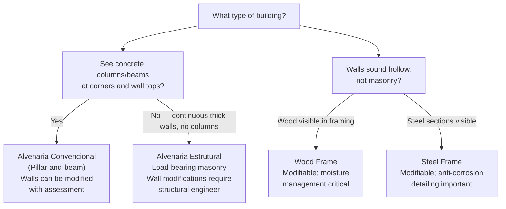

# Module 01: Introduction to Construction in Brazil

[← Topic Home](../../README.md) | [Next → Module 02](../02_planning-and-permits/)

---


> An introduction to Brazilian residential construction — building types, key norms, essential tools, site safety, and how to read a basic floor plan.

---

## Table of Contents

1. [Overview](#overview)
2. [Prerequisites](#prerequisites)
3. [Objectives](#objectives)
4. [Theory](#theory)
   - [Safety First: PPE and Site Safety](#safety-first-ppe-and-site-safety)
   - [Understanding Brazilian Construction: Building Types](#understanding-brazilian-construction-building-types)
   - [Key Brazilian Norms and Standards](#key-brazilian-norms-and-standards)
   - [Essential Tools for Renovation Work](#essential-tools-for-renovation-work)
   - [Reading Basic Architectural Plans](#reading-basic-architectural-plans)
5. [Key Concepts](#key-concepts)
6. [Examples](#examples)
7. [Common Pitfalls](#common-pitfalls)
8. [Cross-Links](#cross-links)
9. [Summary](#summary)

---

## Overview

Every renovation project in Brazil, no matter how simple, takes place within a specific physical, regulatory, and cultural context. Before picking up a trowel or wire stripper, a renovator must understand what kind of building they are working with, what rules apply, what safety precautions are non-negotiable, and how to interpret the documents — plans, norms, and permits — that describe and govern the work.

This module establishes the foundational mental model for everything that follows. You will learn the major types of residential construction found in Brazil, understand why safety equipment is not optional, get oriented in the landscape of ABNT NBR norms (without needing to memorize them), acquire a practical toolkit vocabulary, and learn to read a basic *planta baixa* (floor plan). These are the building blocks on which every subsequent module depends.

Brazil's construction culture has a distinctive feature rarely found in wealthier countries: the *auto-construção* tradition, where millions of families build and renovate their own homes incrementally over years or decades, often without professional involvement. This tradition creates a huge practical knowledge base at the community level, but it also creates risks — from structural failures to electrical fires — when that knowledge is incomplete or incorrect. This topic is designed to give you the complete, correct foundation.

**Difficulty:** Beginner | **Estimated time:** 5–7 hours

---

## Prerequisites

### Required Modules

- None — this is the first module. Start here.

### Required Concepts

- **Basic arithmetic** — You will encounter simple multiplication and percentage calculations for material quantities. No advanced math required.
- **Portuguese literacy** — Technical terms are introduced in Portuguese with explanations. No prior knowledge of construction vocabulary is assumed.

> [!TIP]
> If any early sections feel obvious (you already know what a spirit level is, or you understand
> masonry vs. wood frame), skim those sections and spend more time on the parts that are new
> to you. The module is designed for true beginners, but more experienced readers can use it
> to fill gaps rather than read every word.

---

## Objectives

By the end of this module, you will be able to:

1. Identify the four main types of residential construction used in Brazil (alvenaria convencional, alvenaria estrutural, steel frame, wood frame) and describe the key difference between them
2. List the minimum PPE (Equipamentos de Proteção Individual) required for common renovation tasks and explain why each item is necessary
3. Name at least five ABNT NBR norms relevant to residential construction and state what each covers
4. Identify the essential tools needed for masonry, measurement, and safety, and explain the selection criteria for each
5. Read a basic *planta baixa* (architectural floor plan): interpret scale, dimensions, symbols for doors, windows, walls, and services
6. Explain the concept of *auto-construção* in the Brazilian context and articulate the boundary between safe DIY and work requiring professional supervision

---

## Theory

### Safety First: PPE and Site Safety

Construction sites — even small residential renovation sites — are among the most hazardous working environments that exist. In Brazil, the *Norma Regulamentadora* NR-18 governs construction site safety for commercial work, and while homeowners are not legally bound by all NR-18 requirements, the physical hazards it addresses do not care about legal status. Every renovator must treat personal safety as non-negotiable from the first day on site.

#### Minimum PPE for Residential Renovation

The table below shows the minimum equipment required before starting any renovation task. "Required" means the task must not begin without it.

| Task | Safety Glasses | Dust Mask (PFF2) | Gloves | Hearing Protection | Safety Boots |
|------|---------------|------------------|--------|-------------------|--------------|
| Mixing mortar | Required | Required | Required | — | Recommended |
| Cutting tiles (angle grinder) | Required | Required | Required | Required | Required |
| Drilling concrete | Required | Required | — | Required | Recommended |
| Painting | Recommended | Recommended | Required | — | — |
| Electrical work (isolated voltage) | Required | — | Insulated Required | — | Recommended |
| Demolishing walls | Required | Required | Required | Required | Required |

> [!WARNING]
> The single most common cause of permanent injury in DIY renovation is eye damage from
> flying debris during cutting and grinding operations. Safety glasses (or a full face shield
> for heavy grinding) must be worn before the tool is turned on — not after you've already
> started cutting. This is not optional.

#### Chemical Hazards in Brazilian Construction

Several common Brazilian renovation materials require specific safety precautions:

- **Cement and lime (*cimento* and *cal*):** Highly alkaline. Contact with wet cement or lime causes chemical burns that develop slowly — you may not feel the burn for minutes or hours. Always wear gloves when mixing mortar. Wash hands immediately after contact with wet cement. Knee pads and waterproof knee protection are required for kneeling in wet mortar.
- **Solvent-based products (esmalte sintético, primers, impermeabilizantes):** Many contain VOCs (volatile organic compounds) that cause dizziness, headaches, and long-term health effects. Work outdoors or in well-ventilated spaces. Use a respirator with organic vapor cartridges — a dust mask alone does not protect against solvent vapors.
- **Asbestos (*amianto*):** Older Brazilian construction (pre-2000s) frequently used asbestos in fiber cement roof tiles (*telha de fibrocimento com amianto*), floor tiles (*vinílicos com amianto*), and pipe insulation. Before demolishing or cutting any material from a building older than approximately 2005, assess for asbestos. Brazil banned asbestos in 2023 after decades of partial restrictions. If in doubt, test before you cut.
- **Lead paint:** Brazilian homes built or painted before the 1990s may contain lead-based paint. Sanding or dry-scraping old paint in older buildings can create hazardous lead dust. Use wet methods (dampen the surface before scraping) and a P100 respirator.

#### Working at Height

Renovation work above 2 meters height requires fall protection. For homeowners, the practical requirement is:
- A properly rated ladder (*escada*) with non-slip feet, positioned at the correct angle (approximately 75°, or 1 m out per 4 m height)
- Never lean out to the side from a ladder — move the ladder instead
- A scaffold (*andaime*) for extended work at height — rental scaffolds are widely available from Brazilian construction rental companies (*locadoras de equipamentos*)

#### Electrical Safety Fundamentals

Before starting any work near electrical systems:
1. Turn off the relevant circuit at the *quadro de luz* (electrical panel) — switch the specific *disjuntor* (circuit breaker) to off
2. Test with a *detector de tensão sem contato* (non-contact voltage tester) before touching any wire — available at hardware stores for R$ 20–50
3. Never assume a circuit is off because a switch is off — always test with the detector
4. Never work on electrical systems alone — have someone present who can call for help

---

### Understanding Brazilian Construction: Building Types

Brazilian residential construction falls into four main systems, each with different structural logic, renovation implications, and regional prevalence. Understanding which system a building uses determines what you can safely modify and how.

#### System 1: Alvenaria Convencional (Pillar-and-Beam with Masonry Infill)

The most common system in urban Brazil, especially in the Southeast and South. A reinforced concrete frame (*estrutura de concreto armado*) carries all structural loads — vertical loads go through concrete *pilares* (columns) and horizontal loads through concrete *vigas* (beams). The *paredes de vedação* (infill walls), typically built from ceramic or concrete blocks, are non-structural: they divide space but carry no loads.

This is renovation-friendly: *paredes de vedação* can be removed or modified (with professional assessment) without structural consequences. The key challenge is identifying exactly where the concrete frame members are, because you cannot cut through a *pilar* or *viga* without serious structural risk.

**Visual identification:** Look at the wall-ceiling junction — a continuous concrete beam flush with or slightly projecting from the wall indicates a *viga de concreto*. Concrete columns (*pilares*) are usually visible at room corners or as slight projections from wall surfaces. Knocking on different parts of a wall will reveal a hollow sound (ceramic block) vs. a solid sound (concrete column).

#### System 2: Alvenaria Estrutural (Structural Masonry)

Common in lower-cost housing, MCMV units, and older construction throughout Brazil. Here the masonry walls *are* the structure — there is no concrete frame. Loads are distributed through the wall system, and openings (for doors and windows) require concrete lintels (*vergas*) and sub-lintels (*contravergas*) to transfer loads around the opening.

This system severely limits renovation: you cannot remove or significantly enlarge openings in a structural masonry wall without a structural engineer's assessment and intervention. Unauthorized modifications to *alvenaria estrutural* have caused building collapses in Brazil.

**Visual identification:** In *alvenaria estrutural*, walls are typically thicker (14 cm or 19 cm nominal blocks) and run continuously through the building without columns. There are no protruding columns at corners. Structural drawings (if available) will confirm.

#### System 3: Wood Frame

More common in the South of Brazil (Rio Grande do Sul, Santa Catarina, Paraná), influenced by German and Italian immigrant construction traditions, and increasingly used nationally as a faster, lighter alternative to masonry. A structural frame of dimensional lumber carries loads; external cladding provides weather protection and the frame is typically filled with insulation.

Wood frame is highly amenable to renovation — walls are easily modified by cutting through the cladding and relocating frame members. However, it requires different tools and techniques than masonry work, and fire safety detailing must be maintained when modifying walls.

**Visual identification:** Walls are thinner than masonry walls (typically 10–15 cm total thickness with cladding) and produce a hollow sound when knocked. Visible timber framing at exposed sections, around window and door openings.

#### System 4: Steel Frame

Growing in use across Brazil, particularly for commercial construction and premium residential. Similar principle to wood frame but using cold-formed galvanized steel sections (*perfis de aço galvanizado*) instead of timber. Faster to erect than masonry; highly dimensionally consistent. The same renovation principles as wood frame apply, with the addition that steel frame typically integrates more easily with modern mechanical, electrical, and plumbing (MEP) systems.

#### Comparison Table

| Feature | Alvenaria Conv. | Alvenaria Estrutural | Wood Frame | Steel Frame |
|---------|----------------|---------------------|------------|-------------|
| Structural system | Concrete frame | Load-bearing walls | Timber frame | Steel frame |
| Wall thickness (typical) | 9–14 cm | 14–19 cm | 10–15 cm | 10–15 cm |
| Can modify walls? | Yes (with assessment) | Very limited | Yes | Yes |
| Regional prevalence | SE, S, CO Brazil | Nationwide | S Brazil; growing | Nationwide (growing) |
| Thermal performance | Moderate | Moderate | Good with insulation | Good with insulation |
| Construction speed | Moderate | Moderate | Fast | Fastest |
| DIY renovation difficulty | Moderate | High | Moderate | Moderate |
| Main renovation risk | Cutting structural frame | Modifying structural walls | Moisture damage to wood | Corrosion if improperly sealed |



*Diagram: Decision tree for identifying the structural system of a Brazilian residential building.*

---

### Key Brazilian Norms and Standards

Brazil's construction industry is regulated by a layered system of standards. Understanding which norm applies to which work is essential — both for your own knowledge and for communicating with contractors and municipal authorities.

#### ABNT — Associação Brasileira de Normas Técnicas

ABNT is the national standards body, founded in 1940. It publishes *NBR* (Norma Brasileira) standards for every aspect of construction. ABNT norms are consensus-based technical documents developed by committees of industry experts. They are not laws themselves, but they become binding when referenced in legislation, contracts, or professional liability documents (ARTs/RRTs).

For a renovator, the most important norms are:

| Norm | Title | What It Covers | Why You Need to Know It |
|------|-------|----------------|------------------------|
| **NBR 5410:2004** | Instalações elétricas de baixa tensão | All residential electrical work | Defines circuit types, conductor sizing, protection devices, grounding requirements |
| **NBR 5626:2020** | Sistemas prediais de água fria e água quente | Water supply systems | Pipe sizing, materials, pressure requirements, connections |
| **NBR 8160:1999** | Sistemas prediais de esgoto sanitário | Drainage and sewage | Drain pipe sizing, slopes, venting requirements |
| **NBR 6118:2014** | Projeto de estruturas de concreto | Concrete structural design | Cover requirements, mix design — relevant when repairing or adding structural concrete |
| **NBR 7190:1997** | Projeto de estruturas de madeira | Wood structures | Relevant for wood frame buildings and roof structures |
| **NBR 15575:2013** | Edificações habitacionais — Desempenho | Residential building performance | Thermal comfort, acoustic performance, waterproofing, durability — the benchmark for "good construction" in Brazil |
| **NBR 9050:2020** | Acessibilidade a edificações | Accessibility | Required for renovations that change doorways, ramps, or bathrooms in accessible units |

> [!IMPORTANT]
> ABNT norms must be purchased from ABNT. They are intellectual property and are not freely
> available online (though older versions sometimes circulate). For a homeowner, you do not
> need to read the norms in full — understanding the requirements at a practical level, as
> taught in each module of this topic, is sufficient. Professionals (engineers, electricians,
> plumbers) are responsible for norm compliance in their domain.

#### The Código de Obras

Every Brazilian municipality has a *Código de Obras* — a local building code that governs when permits are required, what setbacks apply, maximum building heights, use of land, and other matters. The *prefeitura* (city hall) enforces it. Requirements vary significantly between municipalities.

**Key principle:** Any intervention that changes the external envelope of a building (adding a room, changing a roof, creating new openings in exterior walls) almost certainly requires a permit. Internal renovations that do not change the building's area, external appearance, or structural elements often do not, but this varies — always check with your local prefeitura before starting.

#### CREA and CAU

- **CREA** (Conselho Regional de Engenharia e Agronomia) — Professional council for engineers and technicians. Engineers who sign construction projects register their responsibility via an **ART** (Anotação de Responsabilidade Técnica).
- **CAU** (Conselho de Arquitetura e Urbanismo) — Professional council for architects. Architects sign projects via an **RRT** (Registro de Responsabilidade Técnica).

For work that requires a building permit, a signed ART or RRT from a licensed professional is mandatory. This is also protective for the homeowner — it means a qualified professional has reviewed and takes legal responsibility for the technical decisions.

---

### Essential Tools for Renovation Work

Good tools do not compensate for lack of skill, but inadequate or wrong tools make skilled work impossible. The following tools form the core toolkit for residential renovation in Brazil.

#### Measurement and Layout Tools

These tools establish the precision that makes all subsequent work correct. In masonry and tiling, a surface that is not level or plumb will propagate errors through every finish layer applied on top of it.

| Tool | Portuguese Name | Why It Matters |
|------|----------------|----------------|
| Tape measure (5 m minimum) | Trena | All measurement tasks; buy one with both mm and cm marks |
| Spirit level (0.6 m and 1.2 m) | Nível de bolha | Checking that surfaces and fixtures are horizontally level and vertically plumb |
| Laser level | Nível a laser | Projects a continuous level reference line around a room; invaluable for tile work and drop ceilings |
| Steel square | Esquadro de aço | Checking 90° angles at wall junctions and corners |
| Chalk line | Linha de giz / barbante | Snapping straight reference lines on floors, walls, and ceilings before tile work |
| Plumb bob | Prumo | Traditional tool for checking vertical alignment of walls and columns |

#### Masonry and Plaster Tools

| Tool | Portuguese Name | Use |
|------|----------------|-----|
| Brick trowel (200 mm) | Colher de pedreiro | Applying and spreading mortar for block laying and wall coatings |
| Notched trowel (10 mm square notch) | Desempenadeira dentada | Applying tile adhesive in ridged pattern for tile setting |
| Sponge float | Desempenadeira de esponja | Final smoothing of reboco plaster before it fully sets |
| Straight-edge rule (2 m aluminium) | Régua de alumínio 2 m | Screeding mortar level; checking flatness |
| Rubber mallet (500 g) | Marreta de borracha | Tapping tiles into adhesive without cracking them |
| Mixing paddle + drill | Hélice misturadora + furadeira | Mixing mortar, paint, and adhesives to uniform consistency |

#### Cutting Tools

| Tool | Portuguese Name | When to Buy vs. Rent |
|------|----------------|---------------------|
| Angle grinder (115 mm) + diamond disc | Esmerilhadeira + disco diamantado | Buy — used constantly for tile cuts, pipe cuts, and opening chases in masonry |
| Manual tile cutter | Cortador de piso manual | Buy if doing significant tiling; cheap models adequate for standard cerâmica |
| Rotary hammer (SDS) | Martelete rompedor SDS | Rent for occasional use; buy if renovating frequently |
| Jigsaw | Serra tico-tico | Buy — versatile for wood, plasterboard, thin panels |

#### Selecting Quality: Budget vs. False Economy

In Brazil, the major tool brands available at retail hardware stores (*lojas de ferragens*, Leroy Merlin, Telhanorte, C&C) fall into three tiers:

1. **Professional grade** (Makita, DeWalt, Bosch Blue Line, Metabo): Durable, precise, expensive. Justified for frequent or commercial use.
2. **Mid-range** (Bosch Green Line, Vonder): Adequate for homeowner use. Good value.
3. **Budget** (generic *ferragem* brands, unnamed imports): Tempting price, but false economy — cheap angle grinders are a safety risk (guard failures, disc fractures at speed) and cheap tile cutters produce inconsistent cuts that waste expensive tile.

> [!TIP]
> For a first renovation toolkit, invest in mid-range quality for safety-critical power tools
> (angle grinder, rotary hammer, drill) and budget is acceptable for hand tools (trowels,
> scrapers, paint rollers). A quality angle grinder is the single most used power tool in
> Brazilian residential renovation.

---

### Reading Basic Architectural Plans

Every Brazilian renovation project, at some stage, involves working with a *planta baixa* (floor plan) — a horizontal cross-section of the building viewed from above. Learning to read a floor plan correctly prevents expensive errors: doorways cut in the wrong wall, outlets placed behind future furniture, or walls demolished that turn out to be structural.

#### Plan Scale

Brazilian architectural plans use metric scales. Common scales for residential plans:

| Scale | 1 cm on plan = | Typical Use |
|-------|---------------|-------------|
| 1:50 | 50 cm in reality | Detailed room drawings |
| 1:100 | 100 cm (1 m) in reality | Full house floor plans |
| 1:200 | 200 cm (2 m) in reality | Site plans, small buildings |

To read a dimension from a plan without a printed scale bar: find a dimension printed on the drawing (e.g., "3.50" means 3.50 m), measure that dimension on paper with a ruler, then divide the real dimension by the paper measurement to find the scale. Example: 3.50 m printed dimension = 3.5 cm on paper → scale is 1:100.

#### Common Symbols in Brazilian Plans

```text
Wall types:
  ████████  Solid wall (masonry or concrete)
  □□□□□□□□  Masonry wall with distinct blocks shown
  - - - - -  Thin wall / partition (typically gypsum board)

Doors:
  ┌─────┐    Door opening shown as gap in wall
    ╲    |    Door swing arc shows direction of opening
  └─────┘    (quarter-circle arc = 90° swing)

Windows:
  ┬──────┬   Window opening with three parallel lines
  ├──────┤   showing the window frame within the wall

Stairs:
  ↑ UP        Arrow pointing in direction of ascent
  ───────     Stair treads shown as parallel lines

Services symbols:
  ⊕           Water outlet (torneira, saída d'água)
  ☒           Electrical outlet (tomada)
  ⊙           Light point (ponto de luz)
  S           Switch (interruptor)
```

#### Practical Example: Reading a Room Dimension

The floor plan below (described in text since we cannot embed images) shows a bedroom labeled "DORMITÓRIO 02" with dimensions:

```text
Internal dimensions printed on plan: 3.00 × 2.70 m

This means:
  - The room is 3.00 m long × 2.70 m wide
  - Floor area = 3.00 × 2.70 = 8.10 m²
  - For flooring: need at least 8.10 m² of tile + 10% waste = 8.91 m² → buy 9.0 m²

A window symbol appears on the 3.00 m wall. Its width dimension is shown as 1.20 m.
The door symbol appears on the 2.70 m wall. Door width: 0.80 m.

For paint calculation:
  Wall perimeter = 2 × (3.00 + 2.70) = 11.40 m
  Ceiling height (assume 2.70 m standard): 
  Wall area = 11.40 × 2.70 = 30.78 m²
  Subtract window: 1.20 × 1.20 = 1.44 m²
  Subtract door: 2.10 × 0.80 = 1.68 m²
  Net paintable area = 30.78 - 1.44 - 1.68 = 27.66 m²
```

#### The *Memorial Descritivo*

Professional renovation projects include not just floor plans but a *memorial descritivo* — a narrative document that describes all materials, finishes, and specifications for each room. It specifies things the floor plan cannot show: paint brand and color code, tile model number, mortar type, fixture model. Learning to write and read a *memorial descritivo* is essential for supervising contractors — it is the document you hand them and by which you verify their work.

---

## Key Concepts

**Auto-construção** — The Brazilian tradition of self-managed, owner-built construction, typically done incrementally over years. Accounts for approximately 50–60% of residential construction in Brazil by unit count. Creates significant risks when undertaken without basic technical knowledge; this is why this topic exists.

**ABNT NBR norm** — A technical standard published by Brazil's national standards body. Not a law itself but becomes binding when referenced in professional responsibility documents, permits, or contracts. The relevant norms for residential renovation are NBR 5410 (electrical), NBR 5626 (water supply), NBR 8160 (drainage), NBR 6118 (concrete), and NBR 15575 (performance).

**Pilar e viga** — Pillar (column) and beam system; the reinforced concrete structural frame used in *alvenaria convencional* construction. The *pilar* is a vertical element; the *viga* is horizontal. Together they form the load-carrying skeleton.

**Parede de vedação** — Non-load-bearing infill wall in a pillar-and-beam building. Can typically be modified or removed (with professional assessment) without structural consequence. See also: *parede estrutural* (structural wall, in *alvenaria estrutural* buildings).

**Planta baixa** — Floor plan; horizontal cross-section of a building drawn to scale, viewed from above. The primary document for understanding spatial layout and for planning renovation work.

**ART/RRT** — *Anotação de Responsabilidade Técnica* (engineer) / *Registro de Responsabilidade Técnica* (architect). The legal document that links a licensed professional to a specific project and creates their professional liability. Required for permitted work.

**EPI (Equipamento de Proteção Individual)** — Personal protective equipment. Legally required for workers on commercial sites (NR-18); practically required for any renovation work to prevent injury.

**Fck** — Characteristic compressive strength of concrete, expressed in MPa. NBR 6118 requires a minimum fck of 25 MPa for structural concrete in residential construction (C25). Non-structural concrete (*concreto simples*) is often mixed at C15 or C20. Important when evaluating existing concrete or specifying new concrete work.

---

## Examples

### Example 1: Identifying Your Building's Construction System

**Scenario:** You have just purchased a two-story house in a São Paulo suburb, built approximately 1995, and want to open a larger passageway between the kitchen and living room by removing part of a wall. Before touching anything, you need to know if the wall is structural.

**Step-by-step assessment:**

1. **Visual inspection of the wall-ceiling junction:** Stand where the wall meets the ceiling and look carefully. Does a concrete beam (slightly different texture or color than the surrounding plaster) run across the top of the wall? If yes, this is a *viga* — the building has a concrete frame (*alvenaria convencional*). The wall below is likely a *parede de vedação* — but you need step 2 to confirm.

2. **Knock test:** Knock on the wall at several points. Hollow (*oco*) sound suggests ceramic block — infill wall. Solid, dense sound suggests solid concrete — likely a structural element (column or beam).

3. **Look for corners:** Does the wall terminate at a visible concrete column? Columns are often slightly different in texture from the block wall they are adjacent to, and may be slightly proud of the wall surface.

4. **Check thickness:** A wall that is 9 cm thick (the face dimension of a standard half-block) is almost certainly an infill partition. A wall 14 cm or thicker may be structural masonry.

5. **Consult a professional:** Even if your assessment suggests non-structural, always have a structural engineer or experienced *mestre de obras* confirm before cutting any wall opening. The cost of one professional consultation (typically R$ 200–500 for a site visit) is far less than the cost of a structural failure.

**What to notice:** In the Brazilian *alvenaria convencional* system, about 80% of interior walls in houses built after 1970 are infill partitions. But the other 20% — and any wall on the building perimeter — may be structurally involved. Never assume without checking.

---

### Example 2: Calculating the PPE Investment for a Bathroom Renovation

**Scenario:** You are about to execute a bathroom renovation yourself: demolishing the existing tile, re-waterproofing, and re-tiling. What PPE do you need and what will it cost?

**PPE list and approximate retail costs in Brazil (2024 reference prices — verify before purchasing):**

| Item | Specification | Approx. Cost (R$) | Notes |
|------|--------------|-------------------|-------|
| Safety glasses (anti-impact) | ANSI Z87.1 rated, clear lens | 15–40 | Buy two — they get scratched |
| Dust mask PFF2 | INMETRO certified, PFF2 equivalent | 5–10 each, buy 10 | One per work session; replace when breathing resistance increases |
| Latex/nitrile gloves | Thick work grade | 20–30 per box | Essential for mortar contact |
| Hearing protection (ear plugs or muffs) | ≥27 dB NRR rated | 5–30 | Earmuffs are more comfortable for long sessions |
| Knee pads | Foam or gel; strapped | 30–80 | Essential for tile work — hours on a hard floor |
| Safety boots | Steel toe, anti-slip sole | 80–200 | If not already owned |
| **Total PPE investment** | | **~R$ 200–400** | One-time investment reusable across many projects |

**What to notice:** The total PPE investment for a bathroom renovation is a tiny fraction of total project cost. There is no financial justification for skipping it — and the potential cost of a preventable eye injury or hearing damage is far higher.

---

### Example 3: Reading a Planta Baixa for Material Quantities

**Scenario:** You receive a floor plan for a 3-bedroom apartment you are renovating. The plan shows the kitchen as 3.50 m × 2.80 m with one 0.90 m door and two windows each 0.60 m wide × 1.10 m tall. The ceiling height is 2.60 m. Calculate the floor tile quantity and the wall paint quantity needed for the kitchen.

**Step 1 — Floor tile quantity:**

```text
Floor area = 3.50 × 2.80 = 9.80 m²
Tile waste factor = 10% (straight layout, simple room)
Tiles needed = 9.80 × 1.10 = 10.78 m²
→ Buy 11.0 m² of floor tile (round up to nearest 0.5 m² or nearest box quantity)
```

**Step 2 — Wall paint area:**

```text
Perimeter = 2 × (3.50 + 2.80) = 12.60 m
Wall area (gross) = 12.60 × 2.60 = 32.76 m²
Subtract door: 0.90 × 2.10 = 1.89 m²
Subtract windows: 2 × (0.60 × 1.10) = 1.32 m²
Net wall area = 32.76 - 1.89 - 1.32 = 29.55 m²
Add ceiling: 3.50 × 2.80 = 9.80 m²
Total paintable area = 29.55 + 9.80 = 39.35 m²

For 2-coat PVA latex at 11 m²/litre/coat:
  Paint needed = 39.35 ÷ 11 × 2 = 7.15 litres → buy 8 litres (or 1 × 3.6 L + 1 × 5.4 L bucket)
```

**What to notice:** Always round material quantities up to the nearest available purchase size, never down. Running out of a specific tile batch mid-project is a serious problem in Brazil because batches (*lotes*) vary in shade — tiles from a different production run may not match exactly.

---

## Common Pitfalls

**Pitfall 1: Starting without a proper plan — "comprar antes de medir"**

The single most expensive mistake in Brazilian renovation is purchasing materials before accurately measuring the space and planning the layout. Tiles, paint, and mortar purchased in excess can often be returned (check the retailer's policy), but materials already cut or mixed cannot.

Correct approach: measure twice, draw the layout on paper or in a simple sketch, calculate quantities including waste factor, then purchase.

---

**Pitfall 2: Ignoring the permit requirement — "ninguém vai saber"**

Many Brazilian homeowners skip permits on the assumption that minor work will not be noticed. The risks are real:

- If you try to sell the property, the buyer's bank (for mortgage financing) may require a *habite-se* that reflects actual construction — work done without permits may cause the property to fail inspection
- Insurance may be invalidated for damages caused by unpermitted work
- Municipal inspectors do conduct random inspections; fines (*multas*) apply
- If unpermitted work involves structural changes and a problem arises, the homeowner bears full liability

---

**Pitfall 3: Incorrect material quantity estimation**

A common error is calculating material quantities without waste factors, or underestimating the number of coats required for paints and sealers.

Example of the error:

```text
WRONG: "My floor is 9.80 m², so I'll buy 9.80 m² of tile."
→ This leaves no room for cuts, broken tiles, or the cuts needed at doorways and walls.
→ Result: running short mid-project; needing a new tile batch that may not match.

CORRECT: 9.80 m² × 1.10 (10% waste) = 10.78 m² → buy 11.0 m² minimum.
For a diagonal layout or many corners: use 15% waste factor.
```

---

**Pitfall 4: Assuming electrical is "off" because the switch is off**

Switches in Brazilian wiring interrupt only the *phase* conductor, not the neutral. Even with a switch in the off position, the neutral and the phase may both be present at the fixture or socket. Always test with a non-contact voltage detector before touching any wire. This is particularly important in older buildings where wiring may not meet current NBR 5410 standards.

---

**Pitfall 5: Misidentifying asbestos-containing materials before demolition**

Older Brazilian buildings (particularly those with *telhas de fibrocimento* — fiber cement roof tiles) may contain chrysotile asbestos. Cutting or sanding asbestos-containing material without protection releases carcinogenic fibers. Brazilian construction from the pre-2000s should be assumed to potentially contain asbestos until tested. If you are uncertain about any sheet or panel material you intend to cut, have it tested by a laboratory before proceeding.

---

## Cross-Links

- [[home-renovation-brazil#glossary]] — Full glossary of Brazilian construction terms introduced in this module
- [[home-renovation-brazil/modules/02_planning-and-permits]] — Next module: project planning, budget estimation, permits, and professional engagement
- [[home-renovation-brazil/modules/03_foundations-and-structure]] — Deeper treatment of structural systems and safe modification strategies
- [[home-renovation-brazil/modules/04_electrical-systems]] — Complete electrical systems module, building on the safety foundation established here
- [[side-gigs-passive-income-investments]] — Property investment context: when renovation creates economic value, how to evaluate renovation ROI

---

## Summary

- Brazil's dominant residential construction system is *alvenaria convencional* (pillar-and-beam with masonry infill), where concrete columns and beams carry structural loads and ceramic block walls are non-structural (*paredes de vedação*). Always identify the structural system before modifying any wall.
- *Alvenaria estrutural* (structural masonry), used extensively in lower-cost and MCMV housing, has load-bearing walls that cannot be modified without professional structural assessment.
- PPE is non-negotiable: safety glasses, PFF2 dust mask, work gloves, and hearing protection are required for common renovation tasks. Chemical burns from cement and lime, eye injuries from grinding debris, and hearing damage from power tools are all preventable.
- ABNT NBR norms are the technical backbone of Brazilian construction. NBR 5410 (electrical), NBR 5626 (water supply), NBR 8160 (drainage), NBR 6118 (concrete), and NBR 15575 (performance) are the most relevant for residential renovation.
- Building permits (*alvarás*) are required for work that changes the building envelope, area, or structural elements. Unpermitted structural work creates legal, financial, and safety risks.
- A basic toolkit — tape measure, spirit level, chalk line, trowel, angle grinder with diamond disc, rotary hammer — is sufficient for most renovation tasks. Invest in quality safety-critical power tools; budget hand tools are acceptable.
- Floor plans (*plantas baixas*) use standard metric scales (1:50, 1:100). Learn to read wall symbols, door swing arcs, window symbols, and service point symbols. Always calculate material quantities from accurate measurements, including a 10–15% waste factor for tiles.
- The *auto-construção* tradition in Brazil means many homeowners build and renovate without professional supervision. This is viable for non-structural, non-systemic work, but electrical, structural, and hydraulic systems require either professional execution or at minimum professional review.
