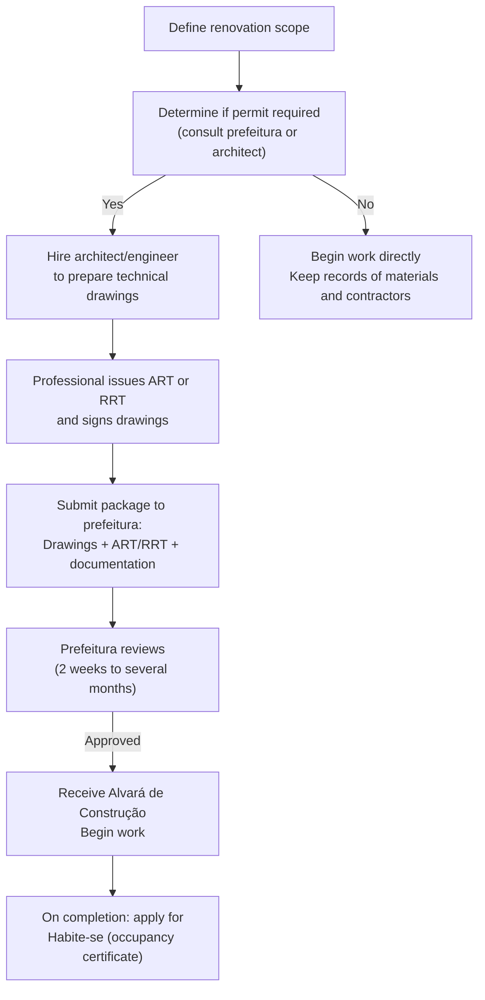

# Module 02: Planning, Permits, and Professionals

[← Module 01](../01_introduction/) | [Topic Home](../../README.md) | [Next → Module 03](../03_foundations-and-structure/)

---


> How to scope, budget, and permit a renovation project in Brazil — including how to hire professionals, interpret ART/RRT documents, and navigate the prefeitura.

---

## Table of Contents

1. [Overview](#overview)
2. [Prerequisites](#prerequisites)
3. [Objectives](#objectives)
4. [Theory](#theory)
5. [Key Concepts](#key-concepts)
6. [Examples](#examples)
7. [Common Pitfalls](#common-pitfalls)
8. [Cross-Links](#cross-links)
9. [Summary](#summary)

---

## Overview

Before any physical work begins, a renovation project must be planned: scope defined, budget estimated, professional services engaged where required, and permits obtained if the work demands them. In Brazil, this planning stage is where most renovation failures are seeded — inadequate scope leads to cost overruns; missing permits create legal problems at resale; vague contractor agreements lead to disputes.

This module walks through the complete planning process for a Brazilian residential renovation project — from initial scope definition and preliminary budget estimation, through understanding when and how to obtain an *alvará de construção* (building permit) from the *prefeitura*, to hiring and briefing contractors and professionals.

**Difficulty:** Beginner | **Estimated time:** 6–8 hours

---

## Prerequisites

- [[home-renovation-brazil/modules/01_introduction]] — Building types, construction systems, basic vocabulary

---

## Objectives

By the end of this module, you will be able to:

1. Define a renovation scope clearly enough to get meaningful quotes from contractors
2. Create a preliminary budget estimate using SINAPI reference prices and a contingency factor
3. Identify which renovation work requires a building permit in Brazil and how to apply at the prefeitura
4. Explain the purpose of ART and RRT documents, and verify their authenticity
5. Write a basic *caderno de encargos* (scope of work document) for a contractor
6. Evaluate contractor quotes for completeness and identify missing items

---

## Theory

### Project Scoping: Defining the Work

A renovation scope has three components: *what will be done*, *what materials will be used*, and *what quality standard is expected*. Vague scopes ("renovate the kitchen") always lead to disputes; precise scopes ("replace floor tiles with 60×60 cm porcelanato, apply two-coat waterproofing to wet areas, replace all electrical outlets with NBR 14136 standard") produce comparable quotes and clear acceptance criteria.

**The Memorial Descritivo**

A *memorial descritivo* is a room-by-room description of all finishes and materials. It is the standard way to specify a Brazilian renovation and forms the basis for contractor briefing. A minimal memorial descritivo specifies for each room:
- Floor finish (material, format, tile class)
- Wall finish (paint/tile up to what height, preparation required)
- Ceiling finish (paint, gesso, suspended ceiling)
- Electrical modifications (new outlets, light points, circuit changes)
- Hydraulic modifications (new points, fixture changes)
- Special items (waterproofing areas, new openings, etc.)

### Budget Estimation

Brazilian construction cost estimation uses three main reference systems:

1. **SINAPI** (Sistema Nacional de Pesquisa de Custos e Índices da Construção Civil) — Published monthly by Caixa Econômica Federal and IBGE. Contains unit prices for labor and materials by state. Free to download. The standard for public works and CEF-financed projects; useful as a benchmark for private renovation.

2. **TCPO** (Tabela de Composições de Preços para Orçamentos) — Published by PINI. More detailed than SINAPI; contains task compositions (how much labor and materials per unit of work). Paid subscription, but widely used by engineers and contractors.

3. **Market research** — Getting 3+ quotes from local contractors and suppliers. Essential for items that vary significantly by region (labor) or by current market conditions (materials).

**Budget Structure**

A renovation budget has five cost categories:

| Category | Typical Proportion | Notes |
|----------|-------------------|-------|
| Materials (*materiais*) | 40–60% | Tiles, paint, mortar, fixtures, pipe, wire |
| Labor (*mão de obra*) | 30–50% | Pedreiro, electrician, plumber, painter |
| Professional fees (*honorários*) | 5–15% | Architect/engineer fees, ART/RRT costs |
| Permits and fees (*taxas*) | 1–5% | Alvará, CREA/CAU registration fees |
| Contingency (*contingência*) | 15% minimum | Unexpected discoveries, price changes |

> [!IMPORTANT]
> Always include a minimum 15% contingency in a renovation budget. Brazilian construction
> consistently produces surprises — hidden water damage, electrical non-compliance requiring
> re-work, subsurface conditions different from expectations. A budget with no contingency
> is a budget that will be exceeded.

### Permits: When and How

**When a permit is required:**

- Any new construction (adding area to the building)
- Enclosing an open space (converting a varanda to a room)
- Changing the building's external envelope (new windows in exterior walls, new roof pitch)
- Structural modifications (removing or adding load-bearing elements)
- Change of use (converting residential to commercial)
- Some municipalities also require permits for major internal renovation — check your local *Código de Obras*

**When a permit is typically NOT required:**
- Internal finishing work (tiling, painting, gypsum work) with no structural changes
- Like-for-like replacement of fixtures (replacing toilet with toilet, window with window in same opening)
- Non-structural internal wall removal in pillar-and-beam buildings (rules vary by municipality)

**The Permit Process:**



*Brazilian building permit process for residential renovation.*

### Hiring Professionals

**Types of professionals in Brazilian construction:**

| Professional | Registration | When Required | Approximate Cost |
|-------------|-------------|---------------|-----------------|
| Architect | CAU (RRT) | Design/planning, permits, spatial modifications | R$ 50–150/m² for project |
| Civil engineer | CREA (ART) | Structural work, foundations, concrete | R$ 800–3000+ per project |
| Electrical engineer | CREA (ART) | Electrical system design for large installations | R$ 500–2000 per project |
| Mestre de obras | — | Site supervision, quality control | R$ 3000–6000/month |
| Pedreiro | — | Masonry, general construction | R$ 200–400/day (varies by region and skill) |
| Eletricista | — | Electrical installation | R$ 150–300/day |
| Encanador | — | Hydraulic installation | R$ 150–300/day |
| Azulejista | — | Tile installation | R$ 150–300/day |
| Pintor | — | Painting | R$ 100–250/day |

**Verifying an ART/RRT:**
1. Ask for the ART/RRT registration number
2. Verify on the CREA website (confea.org.br) or CAU website (caubr.gov.br) using the number
3. Confirm the professional's name, registration number, and the specific project described match
4. An unverifiable or mismatched ART is a significant red flag

**The Contractor Brief (Caderno de Encargos):**

A *caderno de encargos* formalizes what you expect from a contractor. Even a simple one-page document prevents most disputes. Minimum contents:
- Complete scope of work (from the *memorial descritivo*)
- Materials to be used (brand, model, or minimum specification)
- Quality standards (which ABNT norms apply)
- Timeline with milestones and payment schedule
- Penalty clauses for delay
- Warranty terms

---

## Key Concepts

**Memorial descritivo** — Room-by-room written specification of all finishes and materials in a renovation project. The primary tool for contractor briefing and quality verification.

**SINAPI** — Federal government construction cost index; free reference for material and labor prices by Brazilian state. Used for public works; useful benchmark for private renovation.

**Alvará de construção** — Building permit issued by the *prefeitura*. Required for work that changes the building's area, envelope, or structure. Without it, work may need to be demolished; property may not receive *habite-se*.

**Habite-se** — Occupancy certificate issued by the *prefeitura* upon completion of permitted work, confirming the building complies with the approved plans and building code. Required for property registration and mortgage financing.

**Contingência** — Budget contingency. Minimum 15% of total construction cost. Covers unexpected discoveries, price changes, and scope changes that almost always occur in real renovation projects.

**Caderno de encargos** — Scope-of-work document given to a contractor. Defines materials, quality standards, timeline, payment terms, and warranty obligations.

---

## Examples

### Example: Budget for a Bathroom Renovation

**Scope:** Replace floor and wall tiles, replace toilet and vanity, re-waterproof floor, replace electrical outlets (2 units), paint ceiling.

**Room:** 1.80 m × 2.20 m bathroom.

```text
MATERIALS
  Floor tiles (30×30 cm cerâmica): 4.0 m² × R$ 45/m² =      R$   180
  Wall tiles (30×45 cm): 18.5 m² × R$ 38/m² =               R$   703
  Tile adhesive (AC-II) 5 bags × R$ 28 =                     R$   140
  Rejunte flexível 2 kg × R$ 18/kg =                         R$    36
  Impermeabilizante liquid 2L × R$ 45/L =                    R$    90
  Toilet + cistern (standard) =                               R$   450
  Vanity + basin (standard) =                                 R$   380
  NBR 14136 outlets (2 units) + covers =                      R$    60
  Ceiling paint + primer =                                    R$    80
  TOTAL MATERIALS                                             R$ 2,119

LABOR (with social charges, by day)
  Azulejista: 3 days × R$ 250/day =                          R$   750
  Pedreiro (waterproofing, demolition): 1 day =               R$   230
  Eletricista (outlet replacement): 0.5 day =                 R$   130
  Encanador (fixtures): 1 day =                               R$   230
  Pintor (ceiling): 0.5 day =                                 R$   110
  TOTAL LABOR                                                 R$ 1,450

PROFESSIONAL FEES & PERMITS
  (internal renovation, no permit required)               R$     0

SUBTOTAL                                                  R$ 3,569
CONTINGENCY (15%)                                         R$   535
TOTAL BUDGET                                              R$ 4,104
```

**What to notice:** Labor accounts for 41% of the total budget — typical for a relatively labor-intensive tiling job. The contingency adds R$ 535, which is realistic — it's common to discover that the existing waterproofing needs additional repair once tiles are removed.

---

## Common Pitfalls

**Pitfall 1: Getting only one quote**

In Brazil, renovation prices vary enormously between contractors. Getting only one quote means you have no way to know if it's fair. Always get at least three quotes for any work over R$ 1,000. Quotes that are dramatically lower than others are usually missing items (no waterproofing, no priming, discount materials) — ask what's not included.

**Pitfall 2: Paying the full amount upfront**

A standard payment schedule for Brazilian renovation is: 30% upfront (materials deposit), 40% at project midpoint (major work completed), 30% on final acceptance. Never pay 100% upfront to a contractor you don't know — it removes their incentive to complete. Always tie final payment to acceptance of the finished work.

**Pitfall 3: No written contract**

Verbal agreements are legally binding in Brazil but extremely difficult to enforce. Even a simple WhatsApp message exchange confirming scope, price, timeline, and materials is better than nothing. A formal written contract with signatures is better still. Without documentation, disputes almost always favor the contractor, not the client.

---

## Cross-Links

- [[home-renovation-brazil/modules/01_introduction]] — Construction types and structural identification (prerequisite)
- [[home-renovation-brazil/modules/03_foundations-and-structure]] — When structural work requires professional oversight (next module)
- [[home-renovation-brazil/modules/04_electrical-systems]] — NBR 5410 compliance and when permits are required for electrical work
- [[side-gigs-passive-income-investments]] — Renovation ROI analysis and investment decision-making

---

## Summary

- Every renovation project needs three things defined upfront: scope, budget, and professional requirements. The *memorial descritivo* is the standard Brazilian tool for scope definition.
- A renovation budget has five components: materials, labor, professional fees, permits, and contingency. Always include at least 15% contingency.
- Building permits are required for any work that changes the building's area, envelope, or structure. Internal finishing work (no structural changes) typically does not require a permit, but rules vary by municipality — always check.
- The *habite-se* is the occupancy certificate issued by the prefeitura after permitted work is completed. Without it, property registration, insurance, and mortgage financing can be affected.
- Verify ART/RRT credentials on the CREA/CAU websites before engaging any professional. An unverifiable ART is a serious red flag.
- Always get at least three contractor quotes. A payment schedule of 30/40/30% protects both parties. Always have a written scope — even a WhatsApp exchange is legally useful.
- SINAPI is the free government reference for construction unit prices; use it to sanity-check contractor quotes.
