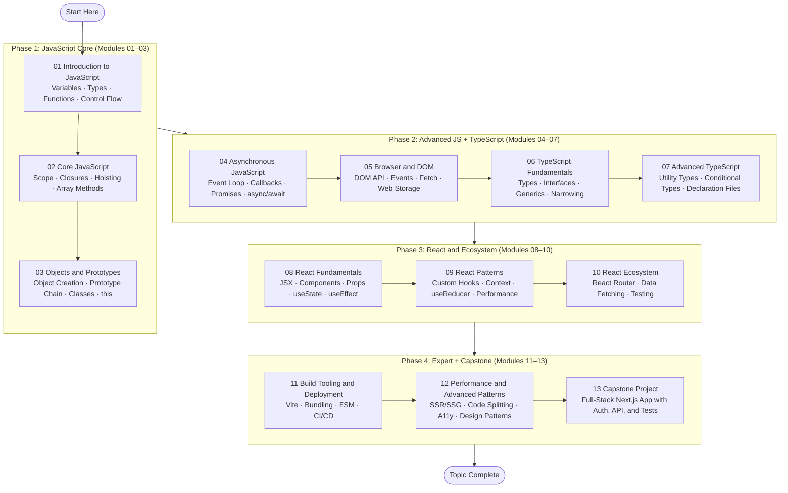

# Roadmap: JavaScript, TypeScript and React

> A visual guide to the four phases of this curriculum — from JavaScript beginner to full-stack expert.

## Learning Path Overview

_Phases are sequential; modules within each phase must be completed in order._

---

## Phase Descriptions

### Phase 1: JavaScript Core (Modules 01–03)

These three modules establish the JavaScript mental model. You learn what JavaScript is, how it runs in browsers and Node.js, and the core language building blocks: variables, types, functions, control flow, scope, closures, the prototype chain, and ES2015 classes. After Phase 1, you can write standalone JavaScript programs.

**Exit criteria:** You can write a function that processes data from an array, uses closures correctly, understands how `this` binds in different contexts, and can explain the prototype chain.

### Phase 2: Advanced JS + TypeScript (Modules 04–07)

Phase 2 covers two tracks: the advanced JavaScript runtime model (asynchronous code and the browser/DOM environment) and the TypeScript type system. After Phase 2, you understand how JavaScript's single-threaded event loop handles async work, how to interact with the DOM and browser APIs, and how to write fully typed TypeScript code including generics and utility types.

**Exit criteria:** You can write a fetch-based API client in TypeScript that handles errors properly, uses async/await idiomatically, and is fully typed with interfaces and generics.

### Phase 3: React and Ecosystem (Modules 08–10)

Phase 3 is the React curriculum. It begins with the fundamentals — JSX, components, props, and the core hooks — then advances to patterns (custom hooks, context, performance optimization), and finally covers the tools every React project uses: routing, data fetching, and testing. After Phase 3, you can build a complete multi-page React SPA.

**Exit criteria:** You can build a multi-page TypeScript React application with client-side routing, API data fetching with loading/error states, shared state via Context, and component tests written with React Testing Library.

### Phase 4: Expert + Capstone (Modules 11–13)

Phase 4 covers the production engineering skills that separate intermediate React developers from senior engineers: the build toolchain, server-side rendering, performance profiling, accessibility, and advanced design patterns. Module 13 is the Capstone Project — a full-stack Next.js application that synthesises everything from all prior modules.

**Exit criteria (Capstone):** A deployed Next.js TypeScript application with authentication, at least two API routes, database integration, meaningful test coverage, and a README that explains architectural decisions.

---

## Time Estimates by Phase

| Phase | Modules | Estimated Hours |
|-------|---------|-----------------|
| Phase 1: JavaScript Core | 01–03 | 25–35 hours |
| Phase 2: Advanced JS + TypeScript | 04–07 | 35–45 hours |
| Phase 3: React and Ecosystem | 08–10 | 30–40 hours |
| Phase 4: Expert + Capstone | 11–13 | 30–50 hours |
| **Total** | 01–13 | **120–170 hours** |

---

## Alternative Entry Points

If you have prior experience, you may enter the curriculum at a later phase:

| Prior Background | Suggested Entry Point |
|-----------------|----------------------|
| JavaScript beginner, no TS, no React | Module 01 (start here) |
| Comfortable with JS, no TS, no React | Module 04 (review 01–03 via Key Concepts only) |
| Knows JS well, no TS | Module 06 (TypeScript Fundamentals) |
| Knows JS + TS, no React | Module 08 (React Fundamentals) |
| Knows JS + TS + React basics | Module 09 (React Patterns) |

> [!WARNING]
> Skipping modules means skipping exercises and tests. Even if the theory is familiar,
> consider doing the exercises — they often reveal gaps that reading alone does not expose.
