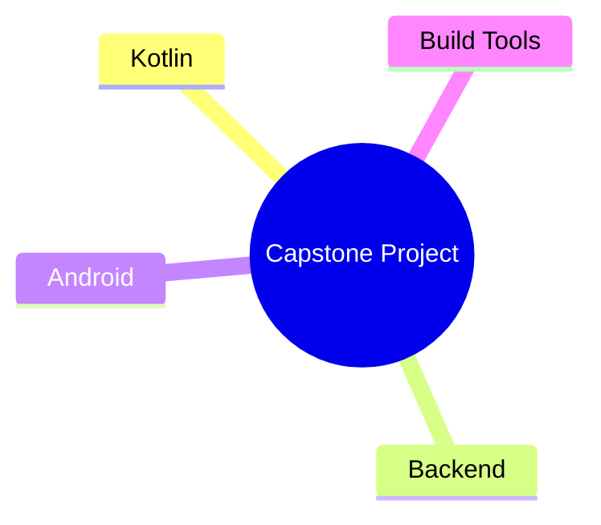

# Notes: Module 12 — Capstone Project

> These are personal study notes for Module 12. Append insights, examples, confusions, and review summaries without deleting previous notes.

## Concept Map

_This diagram is unverified; update it as the module becomes clearer._

## Key Insights

- _Add insights here as you study._

## My Understanding

_Write the core ideas in your own words._

## Questions That Arose

- _Add module-specific questions in `QUESTIONS.md`._

## AI Summary Log

<!-- AI agents may append summaries below. Do not edit learner notes above. -->
