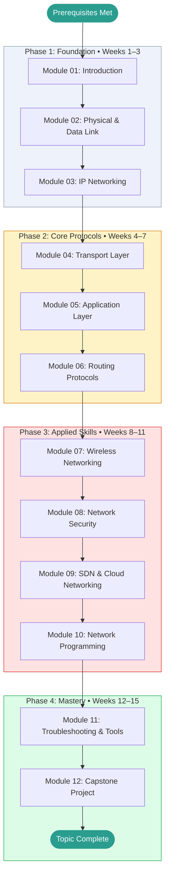

# Computer Networks — Learning Roadmap

> This roadmap is your study plan. Work through the phases in order.
> Each phase builds directly on the previous one.
> Mark your current position with **← You Are Here** and update it as you progress.

---

## Prerequisites Map

Confirm you have working knowledge of these before entering Phase 1:

```
Basic computer literacy  ──┐
                            ├──► Computer Networks  (start here)
Command-line basics      ──┘
```

If either prerequisite is missing, spend a day on basic tutorials first and return here.

---

## Learning Path Visualization



---

## Phase Breakdown

### Phase 1: Foundation

**Goal:** Understand what a network is, how data moves through layers, and build comfort with IP addressing. Leave Phase 1 able to explain what happens when you type a URL and press Enter.

| Module | Name | Est. Hours | Key Skill Gained |
|--------|------|-----------|-----------------|
| 01 | Introduction | 4 hrs | OSI model, TCP/IP model, encapsulation |
| 02 | Physical & Data Link | 5 hrs | Ethernet, MAC addresses, ARP, VLANs |
| 03 | IP Networking | 6 hrs | Subnetting, CIDR, NAT, DHCP |

**Phase 1 Exit Criteria:**

- [ ] Can explain the OSI layers to someone with no networking background
- [ ] Can subnet a /24 address space into four equal subnets without a calculator
- [ ] Scored ≥ 70% on Module 01, 02, and 03 tests
- [ ] Completed at least one Beginner-level project from PROJECTS.md
- [ ] GLOSSARY.md has at least 10 entries

**Milestone unlocked:** Foundation Built

---

### Phase 2: Core Protocols

**Goal:** Develop genuine fluency with TCP, UDP, DNS, HTTP, and routing concepts. Leave Phase 2 able to trace any network request from application to wire and back.

| Module | Name | Est. Hours | Key Skill Gained |
|--------|------|-----------|-----------------|
| 04 | Transport Layer | 6 hrs | TCP handshake, flow control, congestion control |
| 05 | Application Layer | 6 hrs | DNS resolution, HTTP/2/3, TLS handshake |
| 06 | Routing Protocols | 5 hrs | OSPF, BGP, autonomous systems |

**Phase 2 Exit Criteria:**

- [ ] Can describe the TCP 3-way handshake and explain what each step achieves
- [ ] Can trace a full DNS + HTTP + TLS exchange step by step
- [ ] Scored ≥ 75% on all Phase 2 module tests
- [ ] Completed at least one Intermediate-level project from PROJECTS.md

**Milestone unlocked:** Core Mastery

---

### Phase 3: Applied Skills

**Goal:** Apply knowledge to realistic, complex scenarios. Combine concepts across modules. Leave Phase 3 able to design and secure a real network.

| Module | Name | Est. Hours | Key Skill Gained |
|--------|------|-----------|-----------------|
| 07 | Wireless Networking | 4 hrs | 802.11 standards, WPA3, CSMA/CA |
| 08 | Network Security | 6 hrs | Firewalls, VPNs, attack mitigation |
| 09 | SDN & Cloud Networking | 5 hrs | AWS VPC, VXLAN, OpenFlow |
| 10 | Network Programming | 7 hrs | Python sockets, TCP/UDP, Scapy |

**Phase 3 Exit Criteria:**

- [ ] Completed a project combining concepts from at least 3 different modules
- [ ] Scored ≥ 80% on all Phase 3 module tests
- [ ] Written a working TCP client/server in Python
- [ ] QUESTIONS.md open questions are mostly resolved (status: 🟢)

**Milestone unlocked:** Applied Practitioner

---

### Phase 4: Mastery

**Goal:** Synthesize everything. Build something substantial. Demonstrate expert-level diagnostic ability.

| Activity | Est. Hours | Description |
|----------|-----------|-------------|
| Module 11: Tools | 5 hrs | Systematic troubleshooting with real tools |
| Capstone Project | 10–15 hrs | Multi-tier network design and documentation |
| Topic Review | 3 hrs | Revisit modules where test scores were below 80% |
| Final Self-Assessment | 1 hr | Verify overall understanding |

**Phase 4 Exit Criteria:**

- [ ] Capstone project complete and documented in PROJECTS.md
- [ ] Overall topic score ≥ 80%
- [ ] CHEATSHEET.md is complete and genuinely useful as a reference
- [ ] GLOSSARY.md has definitions for every term encountered throughout the topic

**Milestone unlocked:** Topic Mastery

---

## Time Estimates Summary

| Phase | Weeks | Est. Hours | Cumulative |
|-------|-------|-----------|------------|
| Phase 1: Foundation | 1–3 | 15 hrs | 15 hrs |
| Phase 2: Core Protocols | 4–7 | 17 hrs | 32 hrs |
| Phase 3: Applied Skills | 8–11 | 22 hrs | 54 hrs |
| Phase 4: Mastery | 12–15 | 19 hrs | 73 hrs |
| **Total** | **15** | **~73 hrs** | |

> [!NOTE]
> These estimates assume roughly **5 focused hours per week**.
> If you're studying part-time, the calendar weeks will stretch accordingly.
> Consistency matters more than pace — 30 minutes daily beats 5 hours on Sunday.

---

## Milestone Definitions

| Milestone | Earned When | Point Threshold |
|-----------|------------|----------------|
| First Step | Module 01 complete | Any score |
| Foundation Built | Phase 1 complete, all tests ≥ 70% | 60 pts |
| Core Mastery | Phase 2 complete, all tests ≥ 75% | 120 pts |
| Applied Practitioner | Phase 3 complete, all tests ≥ 80% | 220 pts |
| Topic Mastery | Phase 4 complete, capstone done, overall ≥ 80% | 350 pts |
| Packet Wrangler | Diagnosed a real problem with Wireshark/tcpdump | — |
| Socket Coder | Wrote a working TCP server from scratch | — |

---

## Alternative Paths

### Fast Track (If You Have Prior Experience)

If you already have solid experience with TCP/IP basics and IP addressing:

```
Skim Module 01 → Take Module 01 test → If ≥ 85%, start at Module 04 → Continue normally
```

### Deep Dive Path (Maximum Understanding)

For maximum depth, add these supplementary activities between phases:

- **After Phase 1:** Read "Computer Networks" by Tanenbaum & Wetherall, Chapters 1–3
- **After Phase 2:** Work through Beej's Guide to Network Programming (free online)
- **After Phase 3:** Read the original RFC papers listed in RESOURCES.md

### Project-First Path (Learn by Building)

If you learn best by doing rather than reading:

```
Module 01 → Beginner Project → Module 02 → Beginner Project → ...
```

Alternate one module of theory with one hands-on project at each step.

---

## You Are Here

> **Current Phase:** _Not started_
>
> **Current Module:** _None — begin at [Module 01](./modules/01_introduction/README.md)_
>
> **Last Completed Module:** _None_
>
> **Next Action:** Open Module 01 and read the Overview section.
>
> _Update this section each time you advance to a new module or phase._
