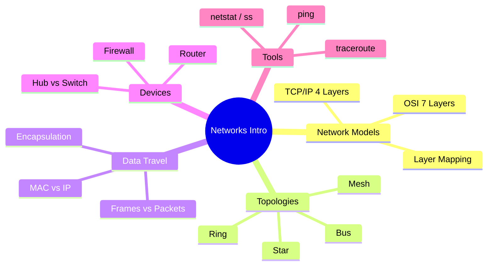

# Notes — Module 01: Introduction to Computer Networks

> These are your personal study notes. Write freely and honestly.
> Incomplete notes are fine — they show where your understanding still needs work.
> Return to this file to add insights as they develop over time.

**Module:** [[networks/modules/01_introduction]]
**Topic:** [[networks]]
**Date started:** _To be filled in_
**Status:** Not started

---

## Concept Map

_Sketch how the concepts in this module relate to each other. Fill in the Mermaid diagram._



_Alternative: draw this on paper, photo it, and link the image here._

---

## Key Insights

_The "aha moments" — the things that, once understood, made the rest clear._
_Be specific: "I finally understood X because Y" is more useful than "X makes sense"._

1. **Encapsulation analogy:** _To be filled in_
2. **Why MAC addresses are local:** _To be filled in_
3. _Add insights as you discover them_

---

## My Understanding

_Explain the core concepts in your own words, as if teaching them to someone else._
_If you can't explain it simply, you don't understand it well enough yet._

### The OSI Model

_Your explanation here_

_What I'm still unsure about:_ _To be filled in_

### Encapsulation

_Your explanation here_

_What I'm still unsure about:_ _To be filled in_

### The difference between a switch and a router

_Your explanation here_

---

## Connections to Other Topics

_How does this module connect to things you already know?_

| This module's concept | Connects to | How |
|----------------------|-------------|-----|
| Layered abstraction | [[systems-architecture]] | Same principle of separation of concerns applies to software architecture |
| Protocol design | [[pentesting-security]] | Attacks exploit specific protocol weaknesses at specific layers |
| Network devices | [[devops-platform-engineering]] | Cloud VPCs, security groups, and load balancers map to OSI layers |

---

## Questions That Arose

_Log questions as they appear. Don't stop to answer them now — just capture them._
_Then move the serious ones to [QUESTIONS.md](./QUESTIONS.md)._

- [ ] _Question 1_ → add to QUESTIONS.md
- [ ] _Question 2_ → needs more study
- [ ] _Question 3_ → might be answered later in the module

---

## Code Snippets Worth Remembering

### Reading the traceroute output

```bash
# traceroute output shows: hop number, IP address of the router, RTT x3
# *** means no ICMP response (firewall blocking) — not necessarily an outage
traceroute google.com
#  1  192.168.1.1      1.2 ms  1.1 ms  1.2 ms   (home router)
#  2  10.0.0.1         8.5 ms  8.3 ms  8.6 ms   (ISP hop)
#  3  * * *                                      (blocked ICMP)
#  4  142.250.80.46   12.3 ms  12.1 ms  12.4 ms (destination)
```

_Why I'm saving this: the `***` behavior trips people up — it doesn't mean the route is broken._

---

### Checking what's listening on a port

```bash
# Find what process is listening on port 80
ss -tulnp | grep :80

# Or check all TCP listeners
ss -tlnp
```

_Why I'm saving this: useful for debugging "something is already using port 80" errors._

---

## What Tripped Me Up

_Mistakes I made, misconceptions I had, things that confused me more than they should have._
_Being honest here helps you later._

- **Expecting OSI layers to map directly to software layers:** _To be filled in_
- **Thinking MAC addresses are globally routable:** _To be filled in_

---

## Summary in My Own Words

_Write a 3–5 sentence summary of this entire module without looking at any notes._
_If you can't do this, you need more study time._

_To be filled in after completing the module._

---

_Last updated: _To be filled in__
